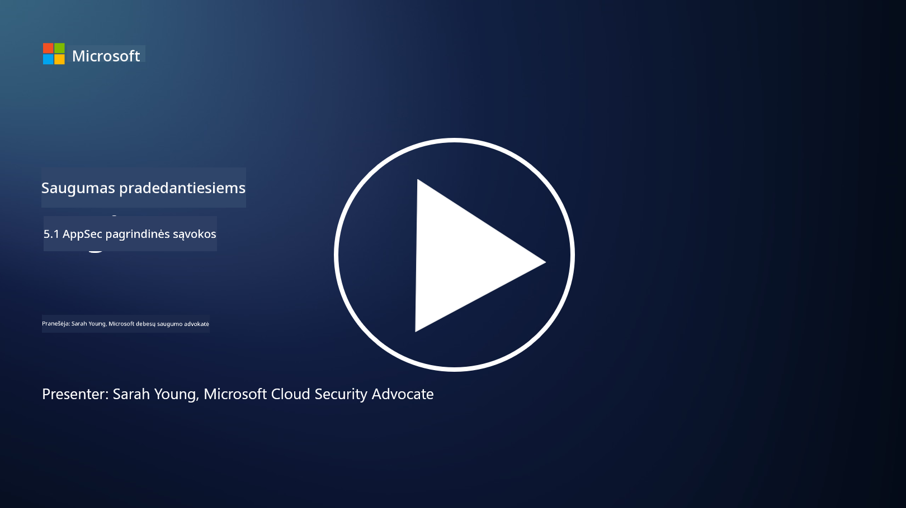

<!--
CO_OP_TRANSLATOR_METADATA:
{
  "original_hash": "e4b56bb23078d3ffb7ad407d280b0c36",
  "translation_date": "2025-09-03T17:28:43+00:00",
  "source_file": "5.1 AppSec key concepts.md",
  "language_code": "lt"
}
-->
# Pagrindinės AppSec sąvokos

Programų saugumas yra atskira saugumo specializacija. Šioje kurso dalyje gilinsimės į programų saugumą.

## Įvadas

Šioje pamokoje aptarsime:

- Kas yra programų saugumas?

- Kokios yra pagrindinės programų saugumo sąvokos/principai?

## Kas yra programų saugumas?

Programų saugumas, dažnai trumpinamas kaip "AppSec," reiškia praktikas, skirtas apsaugoti programinę įrangą nuo saugumo grėsmių, pažeidžiamumų ir atakų. Tai apima procesus, technikas ir įrankius, naudojamus identifikuoti, sumažinti ir užkirsti kelią saugumo rizikoms viso programos kūrimo, diegimo ir palaikymo gyvavimo ciklo metu.

Programų saugumas yra itin svarbus, nes programos dažnai tampa kibernetinių atakų taikiniais. Kenkėjiški veikėjai išnaudoja programinės įrangos pažeidžiamumus ir silpnybes, kad gautų neteisėtą prieigą, pavogtų duomenis, sutrikdytų paslaugas ar vykdytų kitą kenksmingą veiklą. Efektyvus programų saugumas padeda užtikrinti programos ir su ja susijusių duomenų konfidencialumą, vientisumą ir prieinamumą.

## Kokios yra pagrindinės programų saugumo sąvokos/principai?

Pagrindinės sąvokos ir principai, kuriais grindžiamas programų saugumas, apima:

1. **Saugumas pagal dizainą**:

- Saugumas turėtų būti integruotas į programos dizainą ir architektūrą nuo pat pradžių, o ne pridėtas vėliau.

2. **Įvesties validacija**:

- Visos vartotojo įvestys turėtų būti patikrintos, kad atitiktų numatytus formatus ir būtų be kenksmingo kodo ar duomenų.

3. **Išvesties kodavimas**:

- Duomenys, siunčiami klientui, turėtų būti tinkamai užkoduoti, kad būtų išvengta pažeidžiamumų, tokių kaip kryžminio svetainės scenarijaus (XSS) atakos.

4. **Autentifikavimas ir autorizacija**:

- Autentifikuokite vartotojus ir suteikite jiems prieigą prie resursų pagal jų vaidmenis ir leidimus.

5. **Duomenų apsauga**:

- Jautrūs duomenys turėtų būti užšifruoti saugojimo, perdavimo ir apdorojimo metu, kad būtų išvengta neteisėtos prieigos.

6. **Sesijų valdymas**:

- Saugus sesijų valdymas užtikrina vartotojų sesijų apsaugą nuo užgrobimo ir neteisėtos prieigos.

7. **Saugios priklausomybės**:

- Visos programinės įrangos priklausomybės turėtų būti atnaujintos su saugumo pataisomis, kad būtų išvengta pažeidžiamumų.

8. **Klaidų tvarkymas ir registravimas**:

- Įgyvendinkite saugų klaidų tvarkymą, kad nebūtų atskleista jautri informacija, ir užtikrinkite saugią registravimo praktiką.

9. **Saugumo testavimas**:

- Reguliariai testuokite programas dėl pažeidžiamumų, naudodami tokias metodikas kaip įsiskverbimo testavimas, kodo peržiūros ir automatizuoti nuskaitymo įrankiai.

10. **Saugus programinės įrangos kūrimo gyvavimo ciklas (SDLC)**:

- Integruokite saugumo praktikas į kiekvieną programinės įrangos kūrimo gyvavimo ciklo etapą – nuo reikalavimų iki diegimo ir palaikymo.

## Papildoma literatūra

- [SheHacksPurple: Kas yra programų saugumas? - YouTube](https://www.youtube.com/watch?v=eNmccQNzSSY)
- [Kas yra programų saugumas? - Cisco](https://www.cisco.com/c/en/us/solutions/security/application-first-security/what-is-application-security.html#~how-does-it-work)
- [Kas yra programų saugumas? Procesas ir įrankiai programinės įrangos apsaugai | CSO Online](https://www.csoonline.com/article/566471/what-is-application-security-a-process-and-tools-for-securing-software.html)
- [OWASP Cheat Sheet Series | OWASP Foundation](https://owasp.org/www-project-cheat-sheets/)

---

**Atsakomybės apribojimas**:  
Šis dokumentas buvo išverstas naudojant AI vertimo paslaugą [Co-op Translator](https://github.com/Azure/co-op-translator). Nors siekiame tikslumo, prašome atkreipti dėmesį, kad automatiniai vertimai gali turėti klaidų ar netikslumų. Originalus dokumentas jo gimtąja kalba turėtų būti laikomas autoritetingu šaltiniu. Kritinei informacijai rekomenduojama profesionali žmogaus vertimo paslauga. Mes neprisiimame atsakomybės už nesusipratimus ar klaidingus interpretavimus, atsiradusius naudojant šį vertimą.