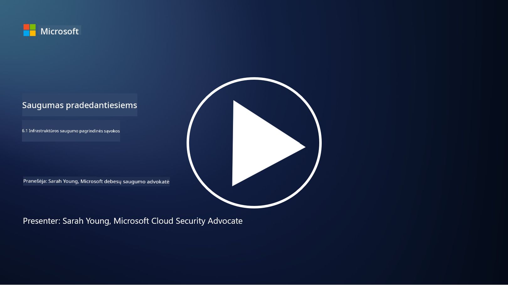

<!--
CO_OP_TRANSLATOR_METADATA:
{
  "original_hash": "882ebf66a648f419bcbf680ed6aefa00",
  "translation_date": "2025-09-03T17:06:15+00:00",
  "source_file": "6.1 Infrastructure security key concepts.md",
  "language_code": "lt"
}
-->
# Pagrindinės infrastruktūros saugumo sąvokos

„Infrastruktūra“ reiškia bet kurios IT aplinkos pagrindinius elementus, įskaitant serverius, debesų paslaugas ir konteinerius – tai apima daugybę skirtingų technologijų. Programos, aptartos ankstesniame skyriuje, veikia infrastruktūroje, todėl ji taip pat gali tapti taikiniu užpuolikams.

Šioje pamokoje aptarsime:

- Kas yra saugumo higiena ir kodėl ji svarbi?

- Kas yra saugumo pozicijos valdymas?

- Kas yra pataisymas ir kodėl jis svarbus?

- Kas yra konteineriai ir kuo jų saugumas skiriasi?

## Kas yra saugumo higiena ir kodėl ji svarbi?

**Saugumo higiena** – tai praktikos ir elgesio rinkinys, kurio laikosi asmenys ir organizacijos, siekdami išlaikyti gerus kibernetinio saugumo įpročius. Ji apima veiksmus, skirtus apsaugoti sistemas, duomenis ir tinklus nuo grėsmių ir pažeidžiamumų. Gera saugumo higiena yra svarbi dėl kelių priežasčių:

- **Atakų prevencija**: Geriausių praktikų laikymasis gali užkirsti kelią dažnoms kibernetinėms atakoms, tokioms kaip sukčiavimas, kenkėjiškų programų infekcijos ir neteisėta prieiga.

- **Duomenų apsauga**: Tinkama saugumo higiena apsaugo jautrius ir konfidencialius duomenis nuo vagystės ar atskleidimo.

- **Pasitikėjimo išlaikymas**: Organizacijos, kurios demonstruoja gerą saugumo higieną, ugdo pasitikėjimą klientų ir partnerių akyse.

- **Atitiktis**: Daugelis reglamentų ir standartų reikalauja, kad organizacijos laikytųsi saugumo higienos praktikų.

- **Rizikos mažinimas**: Nuosekli saugumo higiena sumažina bendrą saugumo incidentų ir pažeidimų riziką.

Saugumo higiena apima tokias praktikas kaip programinės įrangos atnaujinimas, stiprių slaptažodžių ir daugiafaktorinio autentifikavimo naudojimas, reguliarus atsarginių kopijų kūrimas, darbuotojų mokymai ir įtartinos veiklos stebėjimas. Tai yra stipraus kibernetinio saugumo pagrindas.

## Kas yra saugumo pozicijos valdymas?

Saugumo pozicijos valdymas (SPM) – tai organizacijos bendros kibernetinio saugumo pozicijos vertinimo, stebėjimo ir valdymo praktika. Kibernetinio saugumo pozicija reiškia organizacijos bendrą požiūrį ir pasirengimą apsaugoti savo informacinių technologijų (IT) sistemas, tinklus, duomenis ir turtą nuo kibernetinių grėsmių ir atakų. Ji apima strategijas, politiką, praktikas ir technologijas, kurias organizacija naudoja siekdama apsaugoti savo skaitmeninį turtą ir užtikrinti informacijos konfidencialumą, vientisumą ir prieinamumą.

SPM apima sistemų, tinklų, programų ir duomenų saugumo vertinimą ir palaikymą, siekiant užtikrinti, kad jie atitiktų saugumo politiką, geriausias praktikas ir atitikties reikalavimus. SPM siekia suteikti išsamų organizacijos saugumo būklės vaizdą, nustatyti pažeidžiamumus ir silpnybes bei prioritetizuoti jų šalinimo veiksmus.

## Kas yra pataisymas ir kodėl jis svarbus?

**Pataisymas** – tai procesas, kai programinei įrangai, operacinėms sistemoms ir programoms taikomi atnaujinimai, dar vadinami pataisomis ar taisymais. Šie atnaujinimai paprastai sprendžia saugumo pažeidžiamumus, klaidas ir kitas problemas, kurias gali išnaudoti užpuolikai. Aparatinės įrangos įrenginiai taip pat reikalauja pataisymo: tai gali būti jų programinė įranga arba įmontuota operacinė sistema. Aparatinės įrangos pataisymas gali būti daug sudėtingesnis nei programinės įrangos pataisymas.

Pataisymas yra svarbus dėl kelių priežasčių:

- **Saugumas**: Pataisos ištaiso žinomus pažeidžiamumus, kuriuos užpuolikai gali išnaudoti, kad pažeistų sistemas ir pavogtų duomenis.

- **Stabilumas**: Pataisos dažnai apima stabilumo ir našumo patobulinimus, mažinantys gedimų ar sistemos sutrikimų riziką.

- **Atitiktis**: Daugelis reglamentų ir atitikties standartų reikalauja, kad organizacijos laiku taikytų saugumo pataisas.

- **Pasitikėjimo išlaikymas**: Reguliarus pataisymas padeda išlaikyti klientų ir suinteresuotųjų šalių pasitikėjimą, demonstruojant įsipareigojimą saugumui.

- **Rizikos mažinimas**: Pataisymas sumažina atakos paviršių ir sėkmingų kibernetinių atakų tikimybę.

Nepavykus laiku taikyti pataisų, sistemos gali likti pažeidžiamos žinomiems išnaudojimams, didinant saugumo pažeidimų ir duomenų praradimo riziką.

## Kas yra konteineriai ir kuo jų saugumas skiriasi?

Konteineriai – tai lengvi, savarankiški ir vykdomi programinės įrangos paketai, kuriuose yra viskas, ko reikia programai paleisti, įskaitant kodą, vykdymo aplinką, bibliotekas ir sistemos įrankius. Konteineriai suteikia nuoseklią ir izoliuotą aplinką programoms, palengvindami programinės įrangos kūrimą, paketavimą ir diegimą įvairiose aplinkose ir platformose. Populiarios konteinerizacijos technologijos apima „Docker“ ir „Kubernetes“.

Konteinerių saugumas – tai praktikos ir technologijos, naudojamos apsaugoti konteinerius ir juose talpinamas programas nuo įvairių saugumo grėsmių ir pažeidžiamumų. Konteinerių saugumas yra svarbus, nes, nors konteineriai siūlo daug privalumų, susijusių su perkeliamumu ir masteliu, jie taip pat kelia tam tikrus saugumo iššūkius:

1. **Vaizdų saugumas**: Konteinerių vaizdai gali turėti pažeidžiamumų, ir jei šie vaizdai nėra reguliariai atnaujinami ir pataisomi, juos gali išnaudoti užpuolikai. Konteinerių saugumas apima vaizdų nuskaitymą dėl žinomų pažeidžiamumų ir užtikrinimą, kad būtų naudojami tik patikimi vaizdai.

2. **Vykdymo saugumas**: Veikiantys konteineriai turi būti izoliuoti vienas nuo kito ir nuo pagrindinės sistemos, kad būtų išvengta neteisėtos prieigos ir galimų atakų. Vykdymo saugumo mechanizmai apima konteinerių izoliacijos technologijas, tokias kaip vardų erdvės ir cgroups, bei įrankius konteinerių elgsenos stebėjimui ir auditui.

3. **Tinklo saugumas**: Konteineriai bendrauja tarpusavyje ir su išorinėmis sistemomis per tinklus. Tinkamas tinklo segmentavimas ir ugniasienės taisyklės yra būtinos, kad būtų kontroliuojamas srautas tarp konteinerių ir užkirstas kelias neteisėtai prieigai.

4. **Prieigos kontrolė**: Svarbu užtikrinti, kad tik įgalioti vartotojai ir procesai galėtų pasiekti ir modifikuoti konteinerius. Dažnai naudojamos vaidmenimis pagrįstos prieigos kontrolės (RBAC) ir tapatybės valdymo priemonės.

5. **Žurnalų ir stebėjimo valdymas**: Konteinerių saugumas apima žurnalų rinkimą ir analizę bei stebėjimo duomenis, kad būtų galima realiu laiku aptikti ir reaguoti į saugumo incidentus ir anomalijas.

6. **Orkestravimo saugumas**: Naudojant konteinerių orkestravimo platformas, tokias kaip „Kubernetes“, svarbu užtikrinti orkestravimo sluoksnio saugumą. Tai apima „Kubernetes“ API serverio apsaugą, tinkamų RBAC politikų užtikrinimą ir klasterio veiklos auditą.

7. **Slaptų duomenų valdymas**: Tvarkant jautrią informaciją, tokią kaip API raktai ir slaptažodžiai, konteineriuose būtina naudoti saugaus saugojimo ir valdymo sprendimus, kad būtų išvengta jų atskleidimo.

Konteinerių saugumo sprendimai dažnai apima saugumo geriausių praktikų, pažeidžiamumų nuskaitymo įrankių, vykdymo apsaugos mechanizmų, tinklo saugumo konfigūracijų ir konteinerių orkestravimo saugumo funkcijų derinį. Nuolatinis stebėjimas ir automatizavimas yra esminiai konteinerių saugumo komponentai, kad būtų galima greitai aptikti ir reaguoti į grėsmes, kai konteinerizuotos programos vystosi ir plečiasi.

## Papildoma literatūra

- [The importance of security hygiene | Security Magazine](https://www.securitymagazine.com/articles/99510-the-importance-of-security-hygiene)
- [What is CSPM? | Microsoft Security](https://www.microsoft.com/security/business/security-101/what-is-cspm?WT.mc_id=academic-96948-sayoung)
- [What is Cloud Security Posture Management (CSPM)? | HackerOne](https://www.hackerone.com/knowledge-center/what-cloud-security-posture-management)
- [Function of cloud security posture management - Cloud Adoption Framework | Microsoft Learn](https://learn.microsoft.com/azure/cloud-adoption-framework/organize/cloud-security-posture-management?WT.mc_id=academic-96948-sayoung)
- [What Is a CNAPP? | Microsoft Security](https://www.microsoft.com/security/business/security-101/what-is-cnapp)
- [Why Everyone Is Talking About CNAPP (forbes.com)](https://www.forbes.com/sites/forbestechcouncil/2021/12/10/why-everyone-is-talking-about-cnapp/?sh=567275ca1549)
- [Why is patching important to cybersecurity? - CyberSmart](https://cybersmart.co.uk/blog/why-is-patching-important-to-cybersecurity/)
- [What Is Container Security? Complete Guide [2023] (aquasec.com)](https://www.aquasec.com/cloud-native-academy/container-security/container-security/)

---

**Atsakomybės apribojimas**:  
Šis dokumentas buvo išverstas naudojant AI vertimo paslaugą [Co-op Translator](https://github.com/Azure/co-op-translator). Nors siekiame tikslumo, prašome atkreipti dėmesį, kad automatiniai vertimai gali turėti klaidų ar netikslumų. Originalus dokumentas jo gimtąja kalba turėtų būti laikomas autoritetingu šaltiniu. Dėl svarbios informacijos rekomenduojama profesionali žmogaus vertimo paslauga. Mes neprisiimame atsakomybės už nesusipratimus ar klaidingus interpretavimus, atsiradusius naudojant šį vertimą.