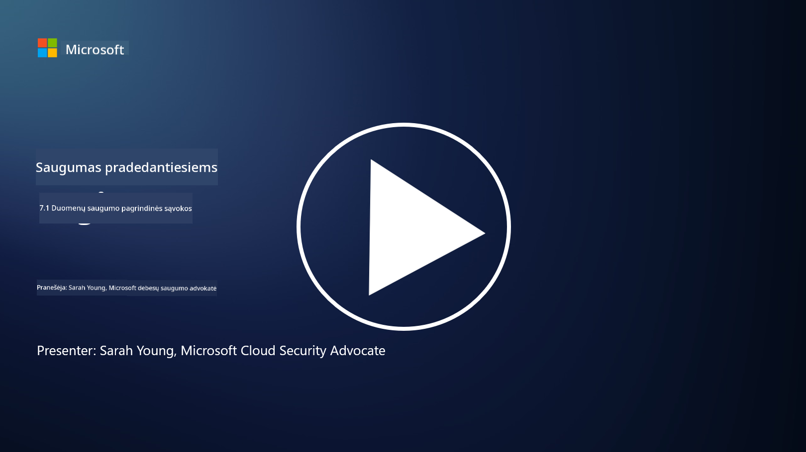

<!--
CO_OP_TRANSLATOR_METADATA:
{
  "original_hash": "9703868f41dcddd5a98dea9ea6fcd94d",
  "translation_date": "2025-09-03T17:19:10+00:00",
  "source_file": "7.1 Data security key concepts.md",
  "language_code": "lt"
}
-->
# Duomenų saugumo pagrindinės sąvokos

Šiame kurse jau kelis kartus užsiminėme apie duomenų saugumą. Dabar panagrinėkime šią temą išsamiau. Šioje pamokoje sužinosite:

- Kas yra duomenų saugumas?

- Kas yra duomenų klasifikavimas?

- Kas yra duomenų gyvavimo ciklo valdymas?

- Kas yra duomenų praradimo prevencija (DLP)?

- Kodėl duomenų saugumas yra svarbus organizacijai?

## Kas yra duomenų saugumas?

**Duomenų saugumas** – tai praktika, skirta apsaugoti skaitmeninius duomenis, tokius kaip duomenų bazės, failai ir jautri informacija, nuo neteisėto prieigos, atskleidimo, pakeitimo ar sunaikinimo. Pagrindinis duomenų saugumo tikslas yra užtikrinti duomenų konfidencialumą, vientisumą ir prieinamumą. Tai apima techninių, administracinių ir fizinių saugumo priemonių derinį, siekiant apsaugoti duomenis nuo įvairių grėsmių ir pažeidžiamumų, įskaitant kibernetines atakas, vidines grėsmes ir duomenų pažeidimus. Duomenų saugumo priemonės gali apimti šifravimą, prieigos kontrolę, autentifikaciją, audito žurnalus ir saugumo politiką.

## Kas yra duomenų klasifikavimas?

**Duomenų klasifikavimas** – tai procesas, kurio metu duomenys skirstomi pagal jų jautrumą, vertę ir svarbą organizacijai. Duomenų klasifikavimo tikslas yra padėti organizacijoms nustatyti ir prioritetizuoti skirtingų duomenų apsaugą ir tvarkymą. Dažniausiai naudojamos duomenų klasifikavimo kategorijos yra „vieši“, „vidiniai“, „konfidencialūs“ ir „riboti“ arba „labai konfidencialūs“. Kai duomenys yra klasifikuoti, organizacijos gali taikyti tinkamas saugumo kontrolės priemones ir prieigos apribojimus, kad užtikrintų jautrių duomenų apsaugą ir laikytųsi teisinių reikalavimų.

## Kas yra duomenų gyvavimo ciklo valdymas?

**Duomenų gyvavimo ciklo valdymas** – tai struktūruotas požiūris į duomenų valdymą per visą jų gyvavimo ciklą – nuo sukūrimo ar įsigijimo iki archyvavimo ar ištrynimo. Duomenų gyvavimo ciklas paprastai apima tokias stadijas kaip sukūrimas, saugojimas, apdorojimas, perdavimas, archyvavimas ir sunaikinimas. Duomenų gyvavimo ciklo valdymas apima politikų ir procedūrų apibrėžimą kiekvienai duomenų gyvavimo ciklo stadijai, įskaitant duomenų saugojimą, prieigos kontrolę, atsargines kopijas ir duomenų valymą. Efektyvus duomenų gyvavimo ciklo valdymas padeda organizacijoms optimizuoti duomenų saugojimą, gerinti duomenų kokybę ir užtikrinti atitiktį duomenų apsaugos reglamentams.

## Kas yra duomenų praradimo prevencija (DLP)?

**Duomenų praradimo prevencija (DLP)** – tai technologijų, politikų ir praktikų rinkinys, skirtas užkirsti kelią neteisėtai prieigai, dalijimuisi ar jautrių ar konfidencialių duomenų nutekėjimui. DLP sprendimai naudoja turinio patikrinimą ir kontekstinę analizę, kad stebėtų ir kontroliuotų duomenis judėjimo metu (pvz., el. paštas, interneto srautas), ramybės būsenoje (pvz., saugomi failai ir duomenų bazės) ir naudojimo metu (pvz., duomenys, kuriuos pasiekia ar tvarko vartotojai). DLP siekia identifikuoti ir blokuoti arba šifruoti jautrius duomenis, kad būtų išvengta duomenų pažeidimų, laikomasi duomenų apsaugos reglamentų ir apsaugota organizacijos reputacija.

## Kodėl duomenų saugumas yra svarbus organizacijai?

Duomenų saugumas yra labai svarbus organizacijoms dėl kelių priežasčių:

- **Jautrios informacijos apsauga**: Organizacijos dažnai saugo jautrius duomenis, tokius kaip klientų įrašai, intelektinė nuosavybė, finansiniai duomenys ir darbuotojų informacija. Duomenų saugumas apsaugo šią jautrią informaciją nuo neteisėtos prieigos ar vagystės.

- **Atitiktis**: Daugelis pramonės šakų ir jurisdikcijų turi griežtus duomenų apsaugos ir privatumo reglamentus. Duomenų saugumas padeda organizacijoms laikytis šių įstatymų, išvengti teisinių baudų ir reputacijos žalos.

- **Duomenų pažeidimų prevencija**: Duomenų pažeidimai gali sukelti finansinius nuostolius, reputacijos žalą ir teisines pasekmes. Efektyvios duomenų saugumo priemonės padeda išvengti duomenų pažeidimų arba sumažinti jų poveikį.

- **Pasitikėjimo išsaugojimas**: Klientai ir suinteresuotosios šalys pasitiki organizacijomis, kurios saugo jų duomenis. Duomenų saugumo pažeidimai mažina pasitikėjimą. Stiprus duomenų saugumas padeda išlaikyti pasitikėjimą ir klientų lojalumą.

- **Konkurencinis pranašumas**: Įsipareigojimas duomenų saugumui gali tapti konkurenciniu pranašumu. Klientai ir partneriai labiau linkę bendradarbiauti su organizacijomis, kurios rimtai žiūri į duomenų saugumą.

- **Operacinis tęstinumas**: Duomenų saugumo priemonės, įskaitant atsargines kopijas ir nelaimių atkūrimo planavimą, padeda užtikrinti kritinių duomenų prieinamumą ir verslo tęstinumą duomenų praradimo ar nelaimių atveju.

- **Apsauga nuo vidinių grėsmių**: Duomenų saugumo priemonės taip pat sprendžia grėsmes iš organizacijos vidaus, įskaitant atsitiktinį duomenų atskleidimą darbuotojų ir tyčinius veiksmus iš vidaus.

Apibendrinant, duomenų saugumas yra būtinas jautrios informacijos apsaugai, teisinių reikalavimų laikymuisi, duomenų pažeidimų prevencijai, pasitikėjimo išsaugojimui ir organizacijos sėkmės bei reputacijos užtikrinimui.

## Papildoma literatūra

- [What Is Data Security? | Microsoft Security](https://www.microsoft.com/en-au/security/business/security-101/what-is-data-security?WT.mc_id=academic-96948-sayoung)
- [Automatically Classify & Protect Documents & Data | Microsoft Purview Information Protection](https://youtu.be/v8LqmzBUaOo)
- [Example data classification policy](https://www.cmu.edu/data/guidelines/data-classification.html)
- [What is Data Security? Data Security Definition and Overview | IBM](https://www.ibm.com/topics/data-security)
- [Data Lifecycle Management: A 2023 Guide for Your Business (cloudwards.net)](https://www.cloudwards.net/data-lifecycle-management/)
- [What is data loss prevention (DLP)? | Microsoft Security](https://www.microsoft.com/security/business/security-101/what-is-data-loss-prevention-dlp?WT.mc_id=academic-96948-sayoung)
- [What is DLP? How data loss prevention software works and why you need it | CSO Online](https://www.csoonline.com/article/569559/what-is-dlp-how-data-loss-prevention-software-works-and-why-you-need-it.html)

---

**Atsakomybės apribojimas**:  
Šis dokumentas buvo išverstas naudojant AI vertimo paslaugą [Co-op Translator](https://github.com/Azure/co-op-translator). Nors siekiame tikslumo, prašome atkreipti dėmesį, kad automatiniai vertimai gali turėti klaidų ar netikslumų. Originalus dokumentas jo gimtąja kalba turėtų būti laikomas autoritetingu šaltiniu. Kritinei informacijai rekomenduojama profesionali žmogaus vertimo paslauga. Mes neprisiimame atsakomybės už nesusipratimus ar klaidingus aiškinimus, atsiradusius dėl šio vertimo naudojimo.