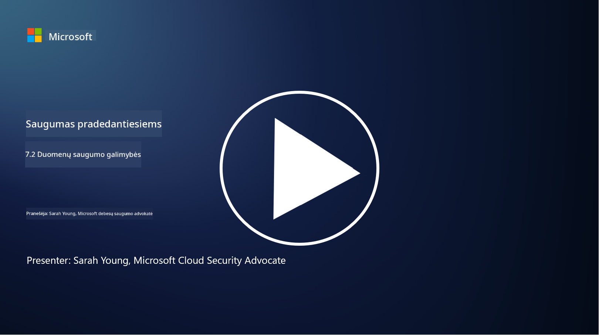

<!--
CO_OP_TRANSLATOR_METADATA:
{
  "original_hash": "50697add9758e54693442d502d2d5f8a",
  "translation_date": "2025-09-03T17:35:30+00:00",
  "source_file": "7.2 Data security capabilities.md",
  "language_code": "lt"
}
-->
# Duomenų saugumo galimybės

Šiame skyriuje aptarsime pagrindinius įrankius ir galimybes, naudojamus duomenų saugumui užtikrinti:

**Įvadas**

Šioje pamokoje aptarsime:

- Kas yra duomenų praradimo prevencijos įrankiai?

- Kas yra vidinių grėsmių valdymo įrankiai?

- Kokie duomenų saugojimo įrankiai yra prieinami?

## Kas yra duomenų praradimo prevencijos įrankiai?

Duomenų praradimo prevencijos (DLP) įrankiai – tai programinės įrangos sprendimai ir technologijos, skirtos užkirsti kelią neteisėtam prieigai, dalijimuisi ar konfidencialių duomenų nutekėjimui organizacijoje. Šie įrankiai naudoja turinio patikrą, politikų vykdymą ir stebėjimą, kad identifikuotų ir apsaugotų jautrius duomenis nuo netinkamo naudojimo ar atskleidimo. Pavyzdžiai: Symantec Data Loss Prevention, McAfee Total Protection for Data Loss Prevention, Microsoft 365 DLP**: Integruojasi su Microsoft 365 programomis, padėdama organizacijoms identifikuoti ir apsaugoti jautrius duomenis el. laiškuose, dokumentuose ir žinutėse.

## Kas yra vidinių grėsmių valdymo įrankiai?

Vidinių grėsmių valdymo įrankiai padeda organizacijoms identifikuoti ir sumažinti riziką, kurią kelia darbuotojai, rangovai ar partneriai, galintys tyčia ar netyčia pažeisti duomenų saugumą. Šie įrankiai stebi vartotojų elgesį, prieigos modelius ir duomenų naudojimą, kad aptiktų įtartiną veiklą ir galimas vidines grėsmes. Pavyzdžiai: Microsoft Insider Risk Management (Microsoft 365 dalis), Forcepoint Insider Threat Data Protection, Varonis Insider Threat Detection.

## Kokie duomenų saugojimo įrankiai yra prieinami?

Duomenų saugojimo įrankiai apima programinę įrangą ir sprendimus, skirtus valdyti duomenų saugojimą ir ištrynimą pagal organizacijos duomenų saugojimo politiką ir teisės aktų reikalavimus. Šie įrankiai padeda automatizuoti duomenų saugojimą tam tikrą laikotarpį ir saugiai juos ištrinti, kai jie nebereikalingi. Pavyzdžiai: Veritas Enterprise Vault, Commvault Complete Data Protection, Microsoft duomenų gyvavimo ciklo valdymas. Šie sprendimai padeda organizacijoms kontroliuoti duomenų saugojimą ir šalinimą, užtikrinti atitiktį duomenų apsaugos reglamentams ir efektyviai valdyti duomenis viso jų gyvavimo ciklo metu.

## Papildoma literatūra

- [Duomenų saugumo pozicijos valdymo vadovas (DSPM) | CSA (cloudsecurityalliance.org)](https://cloudsecurityalliance.org/blog/2023/03/31/the-big-guide-to-data-security-posture-management-dspm/)
- [Duomenų praradimo prevencija per galutinius taškus, programas ir paslaugas | Microsoft Purview](https://youtu.be/hvqq8L_0kgI)
- [18 geriausių duomenų praradimo prevencijos programinės įrangos įrankių 2023 (nemokami + mokami) (comparitech.com)](https://www.comparitech.com/data-privacy-management/data-loss-prevention-tools-software/)
- [Duomenų praradimo prevencija (nist.gov)](https://tsapps.nist.gov/publication/get_pdf.cfm?pub_id=904672)
- [Sužinokite apie vidinių grėsmių valdymą | Microsoft Learn](https://learn.microsoft.com/purview/insider-risk-management?WT.mc_id=academic-96948-sayoung)
- [Duomenų gyvavimo ciklo valdymas | IBM](https://www.ibm.com/topics/data-lifecycle-management)
- [Kas yra duomenų gyvavimo ciklo valdymas (DLM)? | 2023 geriausios praktikos (selecthub.com)](https://www.selecthub.com/big-data-analytics/data-lifecycle-management/)

---

**Atsakomybės apribojimas**:  
Šis dokumentas buvo išverstas naudojant AI vertimo paslaugą [Co-op Translator](https://github.com/Azure/co-op-translator). Nors siekiame tikslumo, prašome atkreipti dėmesį, kad automatiniai vertimai gali turėti klaidų ar netikslumų. Originalus dokumentas jo gimtąja kalba turėtų būti laikomas autoritetingu šaltiniu. Kritinei informacijai rekomenduojama naudoti profesionalų žmogaus vertimą. Mes neprisiimame atsakomybės už nesusipratimus ar klaidingus interpretavimus, atsiradusius dėl šio vertimo naudojimo.