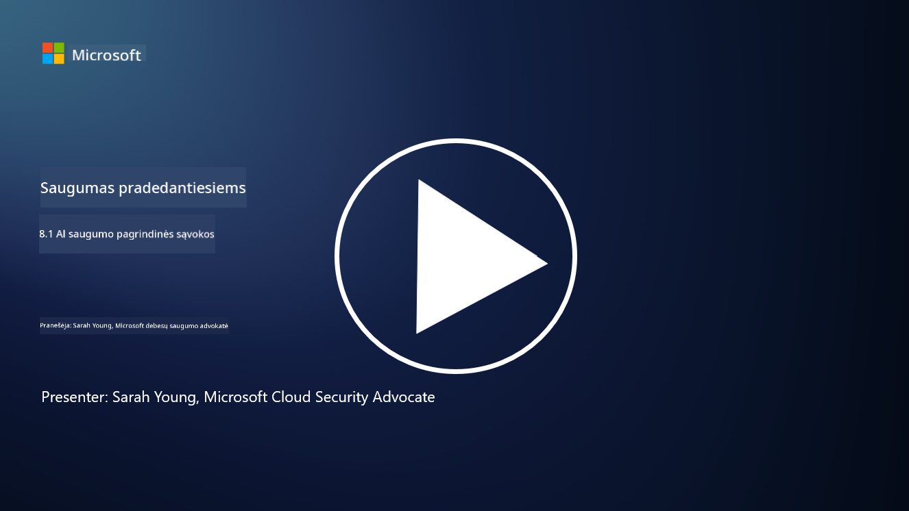

<!--
CO_OP_TRANSLATOR_METADATA:
{
  "original_hash": "66b61d96936cf25d20fcb411d4ce5227",
  "translation_date": "2025-09-03T16:57:41+00:00",
  "source_file": "8.1 AI security key concepts.md",
  "language_code": "lt"
}
-->
# AI saugumo pagrindinės sąvokos

## Kaip AI saugumas skiriasi nuo tradicinio kibernetinio saugumo?

AI sistemų apsauga kelia unikalių iššūkių, palyginti su tradiciniu kibernetiniu saugumu, daugiausia dėl AI mokymosi galimybių ir sprendimų priėmimo procesų pobūdžio. Štai keletas pagrindinių skirtumų:

-   **Duomenų vientisumas**: AI sistemos stipriai priklauso nuo duomenų mokymuisi. [Užtikrinti šių duomenų vientisumą yra itin svarbu, nes užpuolikai gali manipuliuoti duomenimis, siekdami paveikti AI elgseną – tokia taktika vadinama duomenų užnuodijimu.
-   **Modelio saugumas**: Pats AI sprendimų priėmimo modelis gali tapti taikiniu. [Užpuolikai gali bandyti atkurti modelį atvirkštine inžinerija arba išnaudoti jo silpnybes, kad sukeltų neteisingus ar žalingus sprendimus.
-   **Priešiški išpuoliai**: AI sistemos gali būti pažeidžiamos priešiškų išpuolių, kai nedideli, dažnai nepastebimi įvesties duomenų pakeitimai gali priversti AI daryti klaidas ar neteisingas prognozes.
-   **Infrastruktūros saugumas**: Nors tradicinis kibernetinis saugumas taip pat orientuojasi į infrastruktūros apsaugą, AI sistemos gali turėti papildomų sudėtingumo sluoksnių, tokių kaip debesų paslaugos ar specializuota aparatinė įranga, kurioms reikia specifinių saugumo priemonių.
-   **Etiniai aspektai**: AI naudojimas saugumo srityje kelia etinių klausimų, tokių kaip privatumo problemos ir galimas šališkumas sprendimų priėmime, kuriuos būtina įtraukti į saugumo strategiją.

Apskritai, AI sistemų apsauga reikalauja kitokio požiūrio, kuris atsižvelgia į unikalius AI technologijos aspektus, įskaitant duomenų, modelių ir mokymosi proceso apsaugą, kartu sprendžiant etinius AI diegimo klausimus.

AI saugumas ir tradicinis kibernetinis saugumas turi daug panašumų, tačiau jie taip pat skiriasi dėl unikalių dirbtinio intelekto sistemų savybių ir galimybių. Štai kaip jie skiriasi:

- **Grėsmių sudėtingumas**: AI sistemos įneša naujų sudėtingumo sluoksnių į kibernetinį saugumą. Tradicinis kibernetinis saugumas daugiausia susiduria su tokiomis grėsmėmis kaip kenkėjiška programinė įranga, sukčiavimo atakos ir tinklo įsilaužimai. Tačiau AI sistemos gali būti pažeidžiamos tokių atakų kaip priešiški išpuoliai, duomenų užnuodijimas ir modelio vengimas, kurie tiesiogiai taikosi į mašininio mokymosi algoritmus.

- **Atakos paviršius**: AI sistemos dažnai turi didesnį atakos paviršių, palyginti su tradicinėmis sistemomis. Taip yra todėl, kad jos remiasi ne tik programine įranga, bet ir duomenimis bei modeliais. Užpuolikai gali taikytis į mokymo duomenis, manipuliuoti modeliais arba išnaudoti pažeidžiamumus pačiuose algoritmuose.

- **Grėsmių prisitaikymas**: AI sistemos gali prisitaikyti ir mokytis iš savo aplinkos, todėl jos gali būti labiau pažeidžiamos prisitaikančių ir besivystančių grėsmių. Tradicinės kibernetinio saugumo priemonės gali būti nepakankamos apsisaugoti nuo atakų, kurios nuolat keičiasi pagal AI sistemos elgseną.

- **Interpretacija ir paaiškinamumas**: Suprasti, kodėl AI sistema priėmė tam tikrą sprendimą, dažnai yra sudėtingiau nei tradicinėse programinės įrangos sistemose. Šis interpretacijos ir paaiškinamumo trūkumas gali apsunkinti efektyvų AI sistemų atakų aptikimą ir šalinimą.

- **Duomenų privatumo problemos**: AI sistemos dažnai remiasi dideliais duomenų kiekiais, kurie, jei nėra tinkamai tvarkomi, gali kelti privatumo riziką. Tradicinės kibernetinio saugumo priemonės gali nepakankamai spręsti šias AI sistemoms būdingas duomenų privatumo problemas.

- **Reguliacinis atitikimas**: AI saugumo reguliacinė aplinka vis dar vystosi, atsiranda specifiniai reglamentai ir standartai, skirti spręsti unikalius AI sistemų keliamus iššūkius. Tradiciniai kibernetinio saugumo pagrindai gali būti pritaikyti arba išplėsti, kad atitiktų šiuos naujus reglamentus.

- **Etiniai aspektai**: AI saugumas apima ne tik sistemų apsaugą nuo kenkėjiškų atakų, bet ir užtikrinimą, kad AI sistemos būtų naudojamos etiškai ir atsakingai. Tai apima tokius aspektus kaip sąžiningumas, skaidrumas ir atskaitomybė, kurie tradiciniame kibernetiniame saugume gali būti ne tokie ryškūs.

## Kaip AI saugumas yra panašus į tradicinių IT sistemų apsaugą?

AI sistemų apsauga dalijasi keliais pagrindiniais principais su tradiciniu kibernetiniu saugumu:

-   **Apsauga nuo grėsmių**: Tiek AI, tiek tradicinės sistemos turi būti apsaugotos nuo neteisėtos prieigos, duomenų modifikavimo ir sunaikinimo, taip pat nuo kitų bendrų grėsmių.
-   **Pažeidžiamumų valdymas**: Daugelis pažeidžiamumų, kurie veikia tradicines sistemas, pavyzdžiui, programinės įrangos klaidos ar netinkami konfigūravimai, taip pat gali paveikti AI sistemas.
-   **Duomenų saugumas**: Apdorojamų duomenų apsauga yra svarbi abiejose srityse, siekiant išvengti duomenų nutekėjimo ir užtikrinti konfidencialumą.
-   **Tiekimo grandinės saugumas**: Abi sistemų rūšys yra pažeidžiamos tiekimo grandinės atakų, kai pažeistas komponentas gali pakenkti visos sistemos saugumui.

Šie panašumai pabrėžia, kad nors AI sistemos kelia naujų saugumo iššūkių, jos taip pat reikalauja taikyti nusistovėjusias kibernetinio saugumo praktikas, siekiant užtikrinti patikimą apsaugą. Tai yra tradicinio saugumo žinių pritaikymo ir prisitaikymo prie unikalių AI technologijos aspektų derinys.

## Papildoma literatūra

 - [Not with a Bug, But with a Sticker [Book] (oreilly.com)](https://www.oreilly.com/library/view/not-with-a/9781119883982/)
   
 - [Intro to AI Security Part 1: AI Security 101 | by HarrietHacks | Medium](https://medium.com/@harrietfarlow/intro-to-ai-security-part-1-ai-security-101-b8662a9efe5)
   
- [Best practices for AI security risk management | Microsoft Security Blog](https://www.microsoft.com/en-us/security/blog/2021/12/09/best-practices-for-ai-security-risk-management/?WT.mc_id=academic-96948-sayoung)
   
- [OWASP AI Security and Privacy Guide | OWASP Foundation](https://owasp.org/www-project-ai-security-and-privacy-guide/)

---

**Atsakomybės apribojimas**:  
Šis dokumentas buvo išverstas naudojant AI vertimo paslaugą [Co-op Translator](https://github.com/Azure/co-op-translator). Nors siekiame tikslumo, prašome atkreipti dėmesį, kad automatiniai vertimai gali turėti klaidų ar netikslumų. Originalus dokumentas jo gimtąja kalba turėtų būti laikomas autoritetingu šaltiniu. Kritinei informacijai rekomenduojama profesionali žmogaus vertimo paslauga. Mes neprisiimame atsakomybės už nesusipratimus ar klaidingus interpretavimus, atsiradusius naudojant šį vertimą.