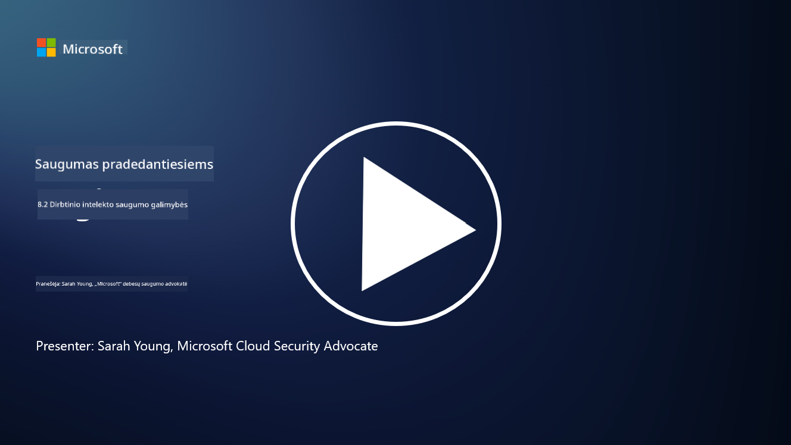

<!--
CO_OP_TRANSLATOR_METADATA:
{
  "original_hash": "b6bb7175672298d1e2f73ba7e0006f95",
  "translation_date": "2025-09-03T17:37:57+00:00",
  "source_file": "8.2 AI security capabilities.md",
  "language_code": "lt"
}
-->
# AI saugumo galimybės

## Kokius įrankius ir galimybes šiuo metu turime AI sistemų saugumui užtikrinti?

Šiuo metu yra keletas įrankių ir galimybių, skirtų AI sistemų saugumui užtikrinti:

-   **Counterfit**: Atvirojo kodo automatizavimo įrankis, skirtas AI sistemų saugumo testavimui. Jis padeda organizacijoms atlikti AI saugumo rizikos vertinimus ir užtikrinti algoritmų patikimumą.
-   **Adversarial Machine Learning Tools**: Šie įrankiai vertina mašininio mokymosi modelių atsparumą prieš priešiškus išpuolius, padėdami nustatyti ir sumažinti pažeidžiamumus.
-   **AI saugumo rinkiniai**: Yra atvirojo kodo rinkiniai, kurie siūlo išteklius AI sistemų saugumui užtikrinti, įskaitant bibliotekas ir sistemas saugumo priemonėms įgyvendinti.
-   **Bendradarbiavimo platformos**: Bendradarbiavimas tarp įmonių ir AI bendruomenių, siekiant sukurti AI specifinius saugumo skenerius ir kitus įrankius AI tiekimo grandinės saugumui užtikrinti.

Šie įrankiai ir galimybės yra augančios srities dalis, skirta stiprinti AI sistemų saugumą prieš įvairias grėsmes. Jie apima mokslinius tyrimus, praktinius įrankius ir pramonės bendradarbiavimą, siekiant spręsti unikalius iššūkius, kuriuos kelia AI technologijos.

## Kas yra AI red teaming? Kaip tai skiriasi nuo tradicinio saugumo red teaming?

AI red teaming skiriasi nuo tradicinio saugumo red teaming keliais pagrindiniais aspektais:

-   **Dėmesys AI sistemoms**: AI red teaming yra orientuotas į unikalius AI sistemų pažeidžiamumus, tokius kaip mašininio mokymosi modeliai ir duomenų srautai, o ne tradicinę IT infrastruktūrą.
-   **AI elgsenos testavimas**: Tai apima testavimą, kaip AI sistemos reaguoja į neįprastus ar netikėtus įvesties duomenis, kas gali atskleisti pažeidžiamumus, kuriuos galėtų išnaudoti užpuolikai.
-   **AI gedimų tyrimas**: AI red teaming tiria tiek piktybinius, tiek nekenksmingus gedimus, atsižvelgiant į platesnį asmenų ir galimų sistemų gedimų spektrą, neapsiribojant vien saugumo pažeidimais.
-   **Prompt Injection ir turinio generavimas**: AI red teaming taip pat apima gedimų, tokių kaip prompt injection, tyrimą, kai užpuolikai manipuliuoja AI sistemomis, kad jos generuotų kenksmingą ar nepagrįstą turinį.
-   **Etinis ir atsakingas AI**: Tai yra atsakingo AI kūrimo dalis, užtikrinanti, kad AI sistemos būtų atsparios bandymams priversti jas veikti nepageidaujamais būdais.

Apskritai, AI red teaming yra išplėstinė praktika, apimanti ne tik saugumo pažeidžiamumų tyrimą, bet ir kitų AI technologijoms būdingų sistemų gedimų testavimą. Tai yra esminė saugesnių AI sistemų kūrimo dalis, padedanti suprasti ir sumažinti naujus rizikos veiksnius, susijusius su AI diegimu.

## Papildoma literatūra

 - [Microsoft AI Red Team kuria saugesnės AI ateitį | Microsoft Security Blog](https://www.microsoft.com/en-us/security/blog/2023/08/07/microsoft-ai-red-team-building-future-of-safer-ai/?WT.mc_id=academic-96948-sayoung)
 - [Microsoft pristato atvirojo automatizavimo sistemą generatyvinių AI sistemų red teaming | Microsoft Security Blog](https://www.microsoft.com/en-us/security/blog/2024/02/22/announcing-microsofts-open-automation-framework-to-red-team-generative-ai-systems/?WT.mc_id=academic-96948-sayoung)
 - [AI saugumo įrankiai: Atvirojo kodo rinkinys | Wiz](https://www.wiz.io/academy/ai-security-tools)

---

**Atsakomybės atsisakymas**:  
Šis dokumentas buvo išverstas naudojant AI vertimo paslaugą [Co-op Translator](https://github.com/Azure/co-op-translator). Nors siekiame tikslumo, prašome atkreipti dėmesį, kad automatiniai vertimai gali turėti klaidų ar netikslumų. Originalus dokumentas jo gimtąja kalba turėtų būti laikomas autoritetingu šaltiniu. Dėl svarbios informacijos rekomenduojama profesionali žmogaus vertimo paslauga. Mes neprisiimame atsakomybės už nesusipratimus ar klaidingus interpretavimus, atsiradusius naudojant šį vertimą.