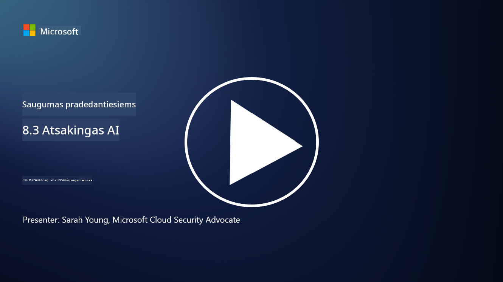

<!--
CO_OP_TRANSLATOR_METADATA:
{
  "original_hash": "5e9775ee91bde7d44577891d5f11c4c5",
  "translation_date": "2025-09-03T17:21:38+00:00",
  "source_file": "8.3 Responsible AI.md",
  "language_code": "lt"
}
-->
# Atsakingas dirbtinis intelektas

## Kas yra atsakingas dirbtinis intelektas ir kaip jis susijęs su AI saugumu?

Atsakingas dirbtinis intelektas reiškia dirbtinio intelekto kūrimą ir naudojimą etiškai, skaidriai ir atsižvelgiant į visuomenės vertybes. Jis apima tokias principus kaip sąžiningumas, atskaitomybė ir patikimumas, užtikrinant, kad DI sistemos būtų sukurtos ir naudojamos siekiant naudos žmonėms, bendruomenėms ir visuomenei.

Ryšys tarp atsakingo DI ir DI saugumo yra svarbus, nes:

- **Etiniai aspektai**: Atsakingas DI apima etinius aspektus, kurie tiesiogiai veikia saugumą, pavyzdžiui, privatumo ir duomenų apsaugą. Užtikrinimas, kad DI sistemos gerbtų vartotojų privatumą ir saugotų asmeninius duomenis, yra pagrindinė atsakingo DI dalis.
- **Patikimumas ir patvarumas**: DI sistemos turi būti atsparios manipuliacijoms ir atakoms, kas yra pagrindinis principas tiek atsakingo DI, tiek DI saugumo. Tai apima apsaugą nuo priešiškų atakų ir užtikrinimą, kad DI sprendimų priėmimo procesai būtų patikimi.
- **Skaidrumas ir paaiškinamumas**: Atsakingo DI dalis yra užtikrinti, kad DI sistemos būtų skaidrios ir jų sprendimai galėtų būti paaiškinti. Tai yra labai svarbu saugumui, nes suinteresuotos šalys turi suprasti, kaip DI sistemos veikia, kad galėtų pasitikėti jų saugumo priemonėmis.
- **Atskaitomybė**: DI sistemos turėtų būti atsakingos už savo veiksmus, o tai reiškia, kad turi būti mechanizmai, leidžiantys atsekti sprendimus ir ištaisyti problemas. Tai atitinka saugumo praktikas, kurios stebi ir audituoja sistemos veiklą, kad būtų išvengta pažeidimų ir į juos reaguojama.

Iš esmės, atsakingas DI ir DI saugumas yra glaudžiai susiję, o atsakingo DI praktikos stiprina DI sistemų saugumą ir atvirkščiai. Atsakingo DI principų įgyvendinimas padeda kurti DI sistemas, kurios yra ne tik etiškai teisingos, bet ir saugesnės nuo galimų grėsmių.

## Kaip užtikrinti, kad mano DI sistema būtų ir saugi, ir etiška?

Užtikrinti, kad jūsų DI sistema būtų ir saugi, ir etiška, reikia taikyti daugiapakopį požiūrį, kuris apima šiuos veiksmus:

- **Laikykitės etinių principų**: Vadovaukitės nustatytomis etikos gairėmis, kurios pabrėžia žmogaus, visuomenės ir aplinkos gerovę; sąžiningumą; privatumo apsaugą; patikimumą; skaidrumą; galimybę ginčyti sprendimus; ir atskaitomybę.

- **Įgyvendinkite patikimas saugumo priemones**: Naudokite proaktyvų saugumo testavimą ir DI pasitikėjimo, rizikos bei saugumo valdymo programas, kad apsisaugotumėte nuo grėsmių ir pažeidžiamumų.

- **Įtraukite įvairius suinteresuotus asmenis**: Įtraukite įvairius dalyvius į DI kūrimo procesą, įskaitant etikos specialistus, socialinius mokslininkus ir paveiktų bendruomenių atstovus, kad būtų atsižvelgta į skirtingas perspektyvas ir vertybes.

- **Užtikrinkite skaidrumą ir paaiškinamumą**: Užtikrinkite, kad DI sprendimų priėmimo procesai būtų skaidrūs ir galėtų būti paaiškinti, taip didinant pasitikėjimą ir lengviau identifikuojant galimus šališkumus ar klaidas.

- **Išlaikykite duomenų privatumą**: Apsaugokite duomenų privatumą ir autentiškumą naudodami šifravimą ir kitas duomenų apsaugos priemones, kad gerbtumėte vartotojų privatumo teises.

- **Suteikite galimybę žmogaus priežiūrai**: Įgyvendinkite mechanizmus, leidžiančius žmogui prižiūrėti DI sprendimus ir užtikrinti sprendimų ginčijamumą bei atskaitomybę.

- **Sekite naujienas apie DI saugumą**: Nuolat atnaujinkite žinias apie naujausius tyrimus ir diskusijas apie DI saugumą, kad suprastumėte besikeičiantį DI saugumo ir etikos kraštovaizdį.

- **Laikykitės teisės aktų**: Užtikrinkite, kad jūsų DI sistema atitiktų visus galiojančius įstatymus ir reglamentus, įskaitant duomenų apsaugos įstatymus, antidiskriminacinius įstatymus ir pramonės specifines gaires.

## Ar galite pateikti pavyzdžių apie saugumo problemas, kurias sukelia neetiškas DI naudojimas?

Štai keletas pavyzdžių apie saugumo problemas, kurios gali kilti dėl neetiško DI naudojimo:

- **Šališkas sprendimų priėmimas**: DI sistemos gali tęsti ir stiprinti esamus šališkumus, jei jos mokomos naudojant šališkus duomenų rinkinius. Pavyzdžiui, jei paieškos sistema mokoma duomenimis, kurie atspindi visuomenės stereotipus, ji gali rodyti šališkus paieškos rezultatus, o tai gali lemti nesąžiningą elgesį ar diskriminaciją.

- **DI teisės sistemose**: DI naudojimas teisinių sprendimų priėmimui gali kelti etinių problemų, ypač jei DI sprendimų priėmimo procesas nėra skaidrus arba yra paveiktas šališkų duomenų. Tai gali lemti neteisingus teisės sprendimus ir pažeisti asmenų teises.

- **DI sistemų manipuliavimas**: DI sistemos gali būti pažeidžiamos priešiškų atakų, kai nedideli duomenų pakeitimai gali sukelti neteisingus rezultatus. Pavyzdžiui, autonominiai automobiliai gali būti suklaidinti neteisingai interpretuoti kelio ženklus, o tai kelia saugumo riziką.

- **DI pagrįsta stebėsena**: DI naudojimas stebėjimo tikslais gali pažeisti privatumą, ypač jei jis naudojamas be tinkamo sutikimo arba būdais, kurie pažeidžia asmens laisves. Tai gali būti ypač problematiška autoritariniuose režimuose, kurie gali naudoti DI stebėti ir slopinti nesutikimą.

Šie pavyzdžiai pabrėžia etinių aspektų svarbą kuriant ir diegiant DI sistemas, kad būtų išvengta saugumo problemų ir apsaugotos asmenų teisės bei privatumas.

## Papildoma literatūra

 - [Microsoft Responsible AI Standard v2 General Requirements](https://query.prod.cms.rt.microsoft.com/cms/api/am/binary/RE5cmFl?culture=en-us&country=us&WT.mc_id=academic-96948-sayoung)
 - [Responsible AI (mit.edu)](https://sloanreview.mit.edu/big-ideas/responsible-ai/)
 - [13 Principles for Using AI Responsibly (hbr.org)](https://hbr.org/2023/06/13-principles-for-using-ai-responsibly)

---

**Atsakomybės apribojimas**:  
Šis dokumentas buvo išverstas naudojant AI vertimo paslaugą [Co-op Translator](https://github.com/Azure/co-op-translator). Nors siekiame tikslumo, prašome atkreipti dėmesį, kad automatiniai vertimai gali turėti klaidų ar netikslumų. Originalus dokumentas jo gimtąja kalba turėtų būti laikomas autoritetingu šaltiniu. Kritinei informacijai rekomenduojama profesionali žmogaus vertimo paslauga. Mes neprisiimame atsakomybės už nesusipratimus ar klaidingus interpretavimus, atsiradusius dėl šio vertimo naudojimo.