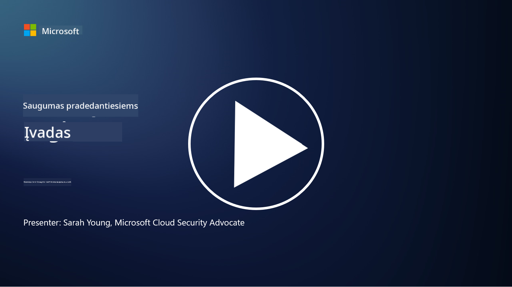

<!--
CO_OP_TRANSLATOR_METADATA:
{
  "original_hash": "79a7e63fa60f649eb3560e1cd7246272",
  "translation_date": "2025-11-18T17:54:27+00:00",
  "source_file": "README.md",
  "language_code": "lt"
}
-->

### 🌐 Daugiakalbė Parama

#### Palaikoma per GitHub Action (Automatizuota ir Visada Atnaujinta)

<!-- CO-OP TRANSLATOR LANGUAGES TABLE START -->
[Arabų](../ar/README.md) | [Bengalų](../bn/README.md) | [Bulgarų](../bg/README.md) | [Birmos (Mianmaras)](../my/README.md) | [Kinų (Supaprastinta)](../zh/README.md) | [Kinų (Tradicinė, Honkongas)](../hk/README.md) | [Kinų (Tradicinė, Makao)](../mo/README.md) | [Kinų (Tradicinė, Taivanas)](../tw/README.md) | [Kroatų](../hr/README.md) | [Čekų](../cs/README.md) | [Danų](../da/README.md) | [Olandų](../nl/README.md) | [Estų](../et/README.md) | [Suomių](../fi/README.md) | [Prancūzų](../fr/README.md) | [Vokiečių](../de/README.md) | [Graikų](../el/README.md) | [Hebrajų](../he/README.md) | [Hindi](../hi/README.md) | [Vengrų](../hu/README.md) | [Indoneziečių](../id/README.md) | [Italų](../it/README.md) | [Japonų](../ja/README.md) | [Korėjiečių](../ko/README.md) | [Lietuvių](./README.md) | [Malajų](../ms/README.md) | [Maratų](../mr/README.md) | [Nepalų](../ne/README.md) | [Nigerijos Pidgin](../pcm/README.md) | [Norvegų](../no/README.md) | [Persų (Farsi)](../fa/README.md) | [Lenkų](../pl/README.md) | [Portugalų (Brazilija)](../br/README.md) | [Portugalų (Portugalija)](../pt/README.md) | [Pandžabų (Gurmukhi)](../pa/README.md) | [Rumunų](../ro/README.md) | [Rusų](../ru/README.md) | [Serbų (Kirilica)](../sr/README.md) | [Slovakų](../sk/README.md) | [Slovėnų](../sl/README.md) | [Ispanų](../es/README.md) | [Svahilių](../sw/README.md) | [Švedų](../sv/README.md) | [Tagalogų (Filipinų)](../tl/README.md) | [Tamilų](../ta/README.md) | [Tajų](../th/README.md) | [Turkų](../tr/README.md) | [Ukrainiečių](../uk/README.md) | [Urdu](../ur/README.md) | [Vietnamiečių](../vi/README.md)
<!-- CO-OP TRANSLATOR LANGUAGES TABLE END -->

**Jei norite pridėti papildomų vertimų, palaikomos kalbos yra išvardytos [čia](https://github.com/Azure/co-op-translator/blob/main/getting_started/supported-languages.md)**

#### Prisijunkite prie Mūsų Bendruomenės 

# 🚀 Kibernetinis Saugumas Pradedantiesiems – mokymo programa

Šiame sparčiai besikeičiančiame dirbtinio intelekto technologijų amžiuje dar svarbiau suprasti, kaip apsaugoti IT sistemas. Šis kursas skirtas išmokyti jus pagrindinių kibernetinio saugumo sąvokų, kad galėtumėte pradėti mokytis saugumo. Jis yra nepriklausomas nuo tiekėjų ir suskirstytas į mažas pamokas, kurių kiekviena turėtų užtrukti apie 30–60 minučių. Kiekviena pamoka turi trumpą testą ir nuorodas į papildomą literatūrą, jei norite giliau pasinerti į temą.

Ką apima šis kursas 📚

- 🔐 Pagrindinės kibernetinio saugumo sąvokos, tokios kaip CIA triada, skirtumai tarp rizikų, grėsmių ir kt.
- 🛡️ Supratimas, kas yra saugumo kontrolė ir kokios jos formos.
- 🌐 Supratimas, kas yra nulinio pasitikėjimo (zero trust) principas ir kodėl jis svarbus šiuolaikiniame kibernetiniame saugume.
- 🔑 Pagrindinių sąvokų ir temų supratimas apie tapatybę, tinklų kūrimą, saugumo operacijas, infrastruktūrą ir duomenų saugumą.
- 🔧 Pavyzdžių apie įrankius, naudojamus saugumo kontrolėms įgyvendinti, pateikimas.

Ko šis kursas neapima 🙅‍♂️

- 🚫 Kaip naudoti konkrečius saugumo įrankius.
- 🚫 Kaip „įsilaužti“ ar vykdyti raudonąją komandą/puolamąjį saugumą.
- 🚫 Mokymosi apie konkrečius atitikties standartus.

Kai baigsite šį kursą, galite pereiti prie kai kurių mūsų „Microsoft Learn“ modulių. Rekomenduojame tęsti mokymąsi su [Microsoft Security, Compliance, and Identity Fundamentals.](https://learn.microsoft.com/training/paths/describe-concepts-of-security-compliance-identity/?WT.mc_id=academic-96948-sayoung) 

Galiausiai galite apsvarstyti galimybę laikyti [SC-900 egzaminą: Microsoft Security, Compliance, and Identity Fundamentals.](https://learn.microsoft.com/credentials/certifications/exams/sc-900/?WT.mc_id=academic-96948-sayoung)

> 💁 Jei turite atsiliepimų ar pasiūlymų dėl šio kurso ir manote, kad kažko trūksta, norėtume išgirsti jūsų nuomonę!

## Modulių Apžvalga 📝 
| **Modulio numeris** | **Modulio pavadinimas**                  | **Mokomos sąvokos**                  | **Mokymosi tikslai**                                                                                          |
|-------------------|-------------------------------------------|--------------------------------------|-----------------------------------------------------------------------------------------------------------------|
| **1.1**           | Pagrindinės saugumo sąvokos               | [CIA triada](https://github.com/microsoft/Security-101/blob/main/1.1%20The%20CIA%20triad%20and%20other%20key%20concepts.md)                        | Sužinokite apie konfidencialumą, prieinamumą ir vientisumą. Taip pat apie autentiškumą, neatsakomybę ir privatumą. |
| **1.2**           | Pagrindinės saugumo sąvokos               | [Dažniausios kibernetinio saugumo grėsmės](https://github.com/microsoft/Security-101/blob/main/1.2%20Common%20cybersecurity%20threats.md)        | Sužinokite apie dažniausias kibernetinio saugumo grėsmes, su kuriomis susiduria asmenys ir organizacijos.         |
| **1.3**           | Pagrindinės saugumo sąvokos               | [Rizikos valdymo supratimas](https://github.com/microsoft/Security-101/blob/main/1.3%20Understanding%20risk%20management.md)       | Sužinokite apie rizikos vertinimą ir supratimą – poveikį/tikimybę ir kontrolės įgyvendinimą.                                                                                                               | |
| **1.4**           | Pagrindinės saugumo sąvokos               | [Saugumo praktikos ir dokumentacija](https://github.com/microsoft/Security-101/blob/main/1.4%20Security%20practices%20and%20documentation.md) | Sužinokite apie skirtumus tarp politikų, procedūrų, standartų ir reglamentų/įstatymų.                         |
| **1.5**           | Pagrindinės saugumo sąvokos               | [Nulinio pasitikėjimo principas](https://github.com/microsoft/Security-101/blob/main/1.5%20Zero%20trust.md)                           | Sužinokite, kas yra nulinio pasitikėjimo principas ir kaip jis veikia architektūrą? Kas yra gynyba gylio principu?                   |
| **1.6**           | Pagrindinės saugumo sąvokos               | [Bendros atsakomybės modelis](https://github.com/microsoft/Security-101/blob/main/1.6%20Shared%20responsibility%20model.md)                           | Kas yra bendros atsakomybės modelis ir kaip jis veikia kibernetinį saugumą?                  |
| **1.7**           | [Modulio pabaigos testas](https://github.com/microsoft/Security-101/blob/main/1.7%20End%20of%20module%20quiz.md)                        |                                      |                                                                                                                 |
| **2.1**           | Tapatybės ir prieigos valdymo pagrindai   | [IAM pagrindinės sąvokos](https://github.com/microsoft/Security-101/blob/main/2.1%20IAM%20key%20concepts.md)                     | Sužinokite apie mažiausio privilegijų principą, pareigų atskyrimą, kaip IAM palaiko nulinio pasitikėjimo principą.               |
| **2.2**           | Tapatybės ir prieigos valdymo pagrindai   | [IAM nulinio pasitikėjimo architektūra](https://github.com/microsoft/Security-101/blob/main/2.2%20IAM%20zero%20trust%20architecture.md)          | Sužinokite, kaip tapatybė tampa nauja IT aplinkų perimetru ir kokias grėsmes ji sumažina.          |
| **2.3**           | Tapatybės ir prieigos valdymo pagrindai   | [IAM galimybės](https://github.com/microsoft/Security-101/blob/main/2.3%20IAM%20capabilities.md)                     | Sužinokite apie IAM galimybes ir kontrolės priemones, skirtas tapatybėms apsaugoti.                                                  |
| **2.4**           | [Modulio pabaigos testas](https://github.com/microsoft/Security-101/blob/main/2.4%20End%20of%20module%20quiz.md)                        |                                      |                                                                                                                 |
| **3.1**           | Tinklo saugumo pagrindai                 | [Tinklo pagrindinės sąvokos](https://github.com/microsoft/Security-101/blob/main/3.1%20Networking%20key%20concepts.md)              | Sužinokite apie tinklo sąvokas (IP adresavimą, prievadų numerius, šifravimą ir kt.)                                 |
| **3.2**           | Tinklo saugumo pagrindai                 | [Tinklo nulinio pasitikėjimo architektūra](https://github.com/microsoft/Security-101/blob/main/3.2%20Networking%20zero%20trust%20architecture.md)   | Sužinokite, kaip tinklas prisideda prie E2E ZT architektūros ir kokias grėsmes jis sumažina.                  |
| **3.3**           | Tinklo saugumo pagrindai                 | [Tinklo saugumo galimybės](https://github.com/microsoft/Security-101/blob/main/3.3%20Network%20security%20capabilities.md)        | Sužinokite apie tinklo saugumo įrankius – ugniasienes, WAF, DDoS apsaugą ir kt.                                    |
| **3.4**           | [Modulio pabaigos testas](https://github.com/microsoft/Security-101/blob/main/3.4%20End%20of%20module%20quiz.md)                        |                                      |                                                                                                                 |
| **4.1**           | Saugumo operacijų pagrindai              | [SecOps pagrindinės sąvokos](https://github.com/microsoft/Security-101/blob/main/4.1%20SecOps%20key%20concepts.md)                  | Sužinokite, kodėl saugumo operacijos yra svarbios ir kaip jos skiriasi nuo įprastų IT operacijų komandų.                  |
| **4.2**           | Saugumo operacijų pagrindai              | [SecOps nulinio pasitikėjimo architektūra](https://github.com/microsoft/Security-101/blob/main/4.2%20SecOps%20zero%20trust%20architecture.md)       | Sužinokite, kaip SecOps prisideda prie E2E ZT architektūros ir kokias grėsmes jis sumažina.                      |
| **4.3**           | Saugumo operacijų pagrindai              | [SecOps galimybės](https://github.com/microsoft/Security-101/blob/main/4.3%20SecOps%20capabilities.md)                  | Sužinokite apie SecOps įrankius – SIEM, XDR ir kt.                                                                    |
| **4.4**           | [Modulio pabaigos testas](https://github.com/microsoft/Security-101/blob/main/4.4%20End%20of%20module%20quiz.md)                        |                                      |                                                                                                                 |
| **5.1**           | Programų saugumo pagrindai               | [AppSec pagrindinės sąvokos](https://github.com/microsoft/Security-101/blob/main/5.1%20AppSec%20key%20concepts.md)                  | Sužinokite apie AppSec sąvokas, tokias kaip saugumas pagal dizainą, įvesties validacija ir kt.                                    |
| **5.2**           | Programų saugumo pagrindai               | [AppSec galimybės](https://github.com/microsoft/Security-101/blob/main/5.2%20AppSec%20key%20capabilities.md)                  | Sužinokite apie AppSec įrankius: saugumo priemones vamzdynuose, kodo skenavimą, slaptažodžių skenavimą ir kt.    |
| **5.3**           | [Modulio pabaigos testas](https://github.com/microsoft/Security-101/blob/main/5.3%20End%20of%20module%20quiz.md)                        |                                      |                                                                                                                 |
| **6.1**           | Infrastruktūros saugumo pagrindai        | [Infrastruktūros saugumo pagrindinės sąvokos](https://github.com/microsoft/Security-101/blob/main/6.1%20Infrastructure%20security%20key%20concepts.md) | Sužinokite apie sistemų stiprinimą, pataisymus, saugumo higieną, konteinerių saugumą.                           |
| **6.2**           | Infrastruktūros saugumo pagrindai        | [Infrastruktūros saugumo galimybės](https://github.com/microsoft/Security-101/blob/main/6.2%20Infrastructure%20security%20capabilities.md) | Sužinokite apie įrankius, kurie gali padėti užtikrinti infrastruktūros saugumą, pvz., CSPM, konteinerių saugumą ir kt. |
| **6.3**           | [Modulio pabaigos testas](https://github.com/microsoft/Security-101/blob/main/6.3%20End%20of%20module%20quiz.md)                        |                                      |                                                                                                                 |
| **7.1**           | Duomenų saugumo pagrindai                | [Duomenų saugumo pagrindinės sąvokos](https://github.com/microsoft/Security-101/blob/main/7.1%20Data%20security%20key%20concepts.md)           | Sužinokite apie duomenų klasifikavimą ir saugojimą bei kodėl tai svarbu organizacijai.                          |
| **7.2**           | Duomenų saugumo pagrindai                | [Duomenų saugumo galimybės](https://github.com/microsoft/Security-101/blob/main/7.2%20Data%20security%20capabilities.md)           | Sužinokite apie duomenų saugumo įrankius – DLP, vidinės rizikos valdymą, duomenų valdymą ir kt.                  |
| **7.3**           | [Modulio pabaigos testas](https://github.com/microsoft/Security-101/blob/main/7.3%20End%20of%20module%20quiz.md)                        |
| **8.1**           | AI saugumo pagrindai                     | [AI saugumo pagrindinės sąvokos](https://github.com/microsoft/Security-101/blob/main/8.1%20AI%20security%20key%20concepts.md)          | Sužinokite apie tradicinio saugumo ir AI saugumo skirtumus bei panašumus.                                       |
| **8.2**           | AI saugumo pagrindai                     | [AI saugumo galimybės](https://github.com/microsoft/Security-101/blob/main/8.2%20AI%20security%20capabilities.md)           | Sužinokite apie AI saugumo įrankius ir kontrolės priemones, kurios gali būti naudojamos AI apsaugai.            |
| **8.3**           | AI saugumo pagrindai                     | [Atsakingas AI](https://github.com/microsoft/Security-101/blob/main/8.3%20Responsible%20AI.md)          | Sužinokite, kas yra atsakingas AI ir apie AI specifines grėsmes, kurias saugumo specialistai turi žinoti.       |
| **8.4**           | [Modulio pabaigos testas](https://github.com/microsoft/Security-101/blob/main/8.4%20End%20of%20module%20quiz.md)     

## 🎒 Kiti kursai 

Mūsų komanda kuria ir kitus kursus! Peržiūrėkite:

<!-- CO-OP TRANSLATOR OTHER COURSES START -->
### Azure / Edge / MCP / Agentai

---
 
### Generatyvaus AI serija

[-9333EA?style=for-the-badge&labelColor=E5E7EB&color=9333EA)](https://github.com/microsoft/Generative-AI-for-beginners-dotnet?WT.mc_id=academic-105485-koreyst)
[-C084FC?style=for-the-badge&labelColor=E5E7EB&color=C084FC)](https://github.com/microsoft/generative-ai-for-beginners-java?WT.mc_id=academic-105485-koreyst)
[-E879F9?style=for-the-badge&labelColor=E5E7EB&color=E879F9)](https://github.com/microsoft/generative-ai-with-javascript?WT.mc_id=academic-105485-koreyst)

---
 
### Pagrindinis mokymasis

---
 
### Copilot serija

<!-- CO-OP TRANSLATOR OTHER COURSES END -->

## Pagalba

Jei susiduriate su sunkumais ar turite klausimų apie AI programų kūrimą, prisijunkite prie kitų mokinių ir patyrusių kūrėjų diskusijose apie MCP. Tai palaikanti bendruomenė, kurioje klausimai yra laukiami, o žinios dalijamos laisvai.

Jei turite produktų atsiliepimų ar susiduriate su klaidomis kurdami, apsilankykite:

---

<!-- CO-OP TRANSLATOR DISCLAIMER START -->
**Atsakomybės apribojimas**:  
Šis dokumentas buvo išverstas naudojant dirbtinio intelekto vertimo paslaugą [Co-op Translator](https://github.com/Azure/co-op-translator). Nors siekiame tikslumo, atkreipkite dėmesį, kad automatiniai vertimai gali turėti klaidų ar netikslumų. Originalus dokumentas jo gimtąja kalba turėtų būti laikomas autoritetingu šaltiniu. Dėl svarbios informacijos rekomenduojama profesionali žmogaus vertimo paslauga. Mes neprisiimame atsakomybės už nesusipratimus ar klaidingus aiškinimus, kylančius dėl šio vertimo naudojimo.
<!-- CO-OP TRANSLATOR DISCLAIMER END -->