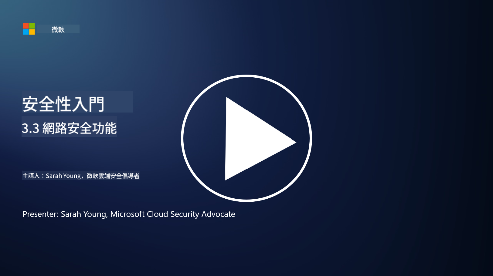

<!--
CO_OP_TRANSLATOR_METADATA:
{
  "original_hash": "c3aba077bb98eebc925dd58d870229ab",
  "translation_date": "2025-09-03T23:31:55+00:00",
  "source_file": "3.3 Network security capabilities.md",
  "language_code": "mo"
}
-->
# 網路安全功能

在本課程中，我們將學習以下可用於保護網路的功能：

 - 傳統防火牆
 - 網頁應用程式防火牆
 - 雲端安全群組
 - CDN
 - 負載平衡器
 - 跳板主機
 - VPN
 - DDoS 防護

## 傳統防火牆

傳統防火牆是一種安全設備，根據預定的安全規則控制和監控進出網路的流量。它們充當受信任的內部網路與不受信任的外部網路之間的屏障，過濾流量以防止未授權的訪問和潛在威脅。

## 網頁應用程式防火牆

網頁應用程式防火牆（WAF）是專門設計用於保護網頁應用程式免受各種攻擊的防火牆，例如 SQL 注入、跨站腳本攻擊以及其他漏洞。它們分析 HTTP 請求和回應，以識別並阻止針對網頁應用程式的惡意流量。

## 雲端安全群組

安全群組是雲端服務提供商提供的一項基本網路安全功能。它們充當虛擬防火牆，控制進出雲端資源（如虛擬機器和實例）的流量。安全群組允許組織定義規則，決定允許和拒絕哪些類型的流量，為雲端部署增加額外的防禦層。

## 內容傳遞網路 (CDN)

內容傳遞網路是一個分布式的伺服器網路，位於不同的地理位置。CDN 通過緩存內容並從距使用者較近的伺服器提供服務，幫助提高網站的性能和可用性。它們還通過將流量分散到多個伺服器位置，提供一定程度的 DDoS 攻擊防護。

## 負載平衡器

負載平衡器將進入的網路流量分配到多個伺服器，以優化資源使用、確保高可用性並改善應用程式性能。它們幫助防止伺服器過載並維持高效的回應時間，增強網路的韌性。

## 跳板主機

跳板主機是高度安全且隔離的伺服器，提供從外部不受信任的網路（例如互聯網）到內部網路的受控訪問。它們作為管理員安全訪問內部系統的入口點。跳板主機通常配置了強大的安全措施，以最大限度地減少攻擊面。

## 虛擬私人網路 (VPN)

VPN 通過加密的隧道連接使用者設備和遠端伺服器，確保在可能不安全的網路（如互聯網）上進行安全和私密的通信。VPN 通常用於提供對內部網路的遠端訪問，使使用者能像在同一網路中一樣訪問資源。

## DDoS 防護工具

DDoS（分布式拒絕服務）防護工具和服務旨在減輕 DDoS 攻擊的影響，這些攻擊會利用多個受感染設備向網路或服務發送大量流量以使其超載。DDoS 防護解決方案識別並過濾惡意流量，確保合法流量仍能到達其預定目的地。

## 延伸閱讀

- [什麼是防火牆？ - Cisco](https://www.cisco.com/c/en/us/products/security/firewalls/what-is-a-firewall.html#~types-of-firewalls)
- [防火牆的實際作用是什麼？(howtogeek.com)](https://www.howtogeek.com/144269/htg-explains-what-firewalls-actually-do/)
- [什麼是防火牆？防火牆的工作原理及類型 (kaspersky.com)](https://www.kaspersky.com/resource-center/definitions/firewall)
- [網路安全群組 - 運作方式 | Microsoft Learn](https://learn.microsoft.com/azure/virtual-network/network-security-group-how-it-works)
- [Azure 內容傳遞網路 (CDN) 簡介 - 教學 | Microsoft Learn](https://learn.microsoft.com/training/modules/intro-to-azure-content-delivery-network/?WT.mc_id=academic-96948-sayoung)
- [什麼是內容傳遞網路 (CDN)？- Azure | Microsoft Learn](https://learn.microsoft.com/azure/cdn/cdn-overview?WT.mc_id=academic-96948-sayoung)
- [什麼是負載平衡？負載平衡器的工作原理 (nginx.com)](https://www.nginx.com/resources/glossary/load-balancing/)
- [跳板主機 vs. VPN · Tailscale](https://tailscale.com/learn/bastion-hosts-vs-vpns/)
- [什麼是 VPN？VPN 的工作原理及類型 (kaspersky.com)](https://www.kaspersky.com/resource-center/definitions/what-is-a-vpn)
- [Azure DDoS 防護簡介 - 教學 | Microsoft Learn](https://learn.microsoft.com/training/modules/introduction-azure-ddos-protection/?WT.mc_id=academic-96948-sayoung)
- [什麼是 DDoS 攻擊？| Microsoft Security](https://www.microsoft.com/security/business/security-101/what-is-a-ddos-attack?WT.mc_id=academic-96948-sayoung)

---

**免責聲明**：  
本文件已使用 AI 翻譯服務 [Co-op Translator](https://github.com/Azure/co-op-translator) 進行翻譯。雖然我們致力於提供準確的翻譯，但請注意，自動翻譯可能包含錯誤或不準確之處。原始文件的母語版本應被視為權威來源。對於關鍵信息，建議使用專業人工翻譯。我們對因使用此翻譯而引起的任何誤解或誤釋不承擔責任。