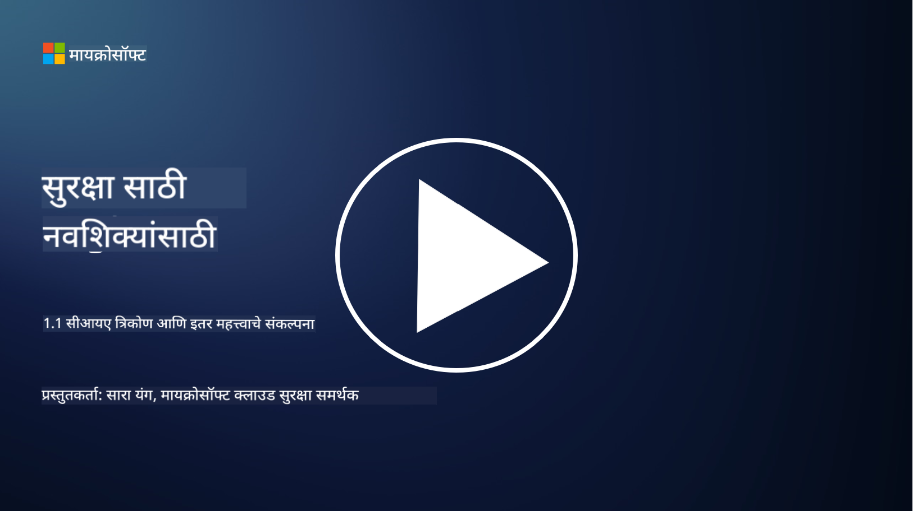
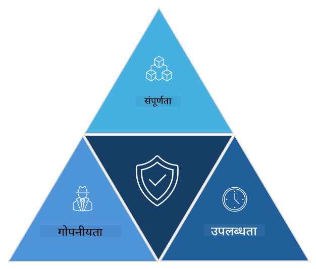

<!--
CO_OP_TRANSLATOR_METADATA:
{
  "original_hash": "16a76f9fa372fb63cffb6d76b855f023",
  "translation_date": "2025-09-04T01:08:56+00:00",
  "source_file": "1.1 The CIA triad and other key concepts.md",
  "language_code": "mr"
}
-->
# CIA त्रिसूत्री आणि इतर महत्त्वाच्या संकल्पना

## परिचय

या धड्यात आपण शिकणार आहोत:

 - सायबरसुरक्षा म्हणजे काय?
   
 - सायबरसुरक्षेतील CIA त्रिसूत्री म्हणजे काय?

 - सायबरसुरक्षेच्या संदर्भात प्रामाणिकता, नाकारता न येणे (nonrepudiation) आणि गोपनीयता म्हणजे काय?

## सायबरसुरक्षा म्हणजे काय?

सायबरसुरक्षा, ज्याला माहिती सुरक्षा असेही म्हणतात, ही संगणक प्रणाली, नेटवर्क, उपकरणे आणि डेटा यांना डिजिटल हल्ले, अनधिकृत प्रवेश, नुकसान किंवा चोरीपासून संरक्षित करण्याची पद्धत आहे. सायबरसुरक्षेचा मुख्य उद्देश डिजिटल मालमत्ता आणि माहितीची गोपनीयता, अखंडता आणि उपलब्धता सुनिश्चित करणे हा आहे. सायबरसुरक्षा व्यावसायिक सुरक्षा नियंत्रण तयार करतात आणि अंमलात आणतात जेणेकरून मालमत्ता, डेटा आणि माहिती संरक्षित राहील. आपले जीवन अधिकाधिक डिजिटल आणि ऑनलाइन होत असताना, सायबरसुरक्षा ही वैयक्तिक व्यक्ती आणि संस्थांसाठी एक महत्त्वाची चिंता बनली आहे.

## सायबरसुरक्षेतील CIA त्रिसूत्री म्हणजे काय?

सायबरसुरक्षेतील त्रिसूत्री म्हणजे एक मॉडेल आहे जे सायबरसुरक्षेच्या कोणत्याही कार्यासाठी किंवा प्रणाली/परिसर डिझाइन करताना विचारात घेतल्या जाणाऱ्या तीन मुख्य बाबींचा समावेश करते:

### गोपनीयता (Confidentiality)

सायबरसुरक्षा म्हटल्यावर सर्वसामान्यपणे लोकांच्या डोळ्यासमोर येणारी ही बाब आहे: गोपनीयता म्हणजे डेटा आणि माहितीला अनधिकृत प्रवेशापासून संरक्षित ठेवण्याची प्रक्रिया, म्हणजेच ज्यांना माहिती पाहण्याची गरज आहे त्यांनाच ती पाहता येईल. मात्र, सर्व डेटा समान नसतो, आणि डेटाचे वर्गीकरण त्यावर होणाऱ्या संभाव्य नुकसानीच्या आधारावर केले जाते आणि त्यानुसार त्याचे संरक्षण केले जाते.

### अखंडता (Integrity)

याचा अर्थ म्हणजे वातावरणातील डेटाची अचूकता आणि विश्वासार्हता संरक्षित करणे आणि अनधिकृत व्यक्तींना डेटा बदलण्याची किंवा संपादित करण्याची परवानगी न देणे. उदाहरणार्थ, एखादा विद्यार्थी DMV मध्ये त्यांच्या ड्रायव्हर रेकॉर्डवरील जन्मतारीख बदलतो, जेणेकरून ती जुनी दाखवली जाईल आणि त्यांना लवकरच परवाना मिळेल, ज्यामुळे ते मद्य खरेदी करू शकतील.

### उपलब्धता (Availability)

ही बाब ऑपरेशनल IT मध्ये महत्त्वाची आहे, पण सायबरसुरक्षेसाठीही ती तितकीच महत्त्वाची आहे. काही विशिष्ट प्रकारचे हल्ले उपलब्धतेला लक्ष्य करतात, ज्यापासून सुरक्षा व्यावसायिकांना संरक्षण करावे लागते (उदा. वितरित सेवा नकार – DDoS – हल्ले).

**सायबरसुरक्षा CIA त्रिसूत्री**

## सायबरसुरक्षेच्या संदर्भात प्रामाणिकता, नाकारता न येणे आणि गोपनीयता म्हणजे काय?

ही काही अतिरिक्त महत्त्वाची संकल्पना आहेत ज्या प्रणाली आणि डेटाच्या सुरक्षितता आणि विश्वासार्हतेशी संबंधित आहेत:

**प्रामाणिकता (Authenticity)** - याचा अर्थ असा आहे की तुम्ही ज्या माहिती, संवाद किंवा घटकाशी संवाद साधत आहात ती खरी आहे आणि ती अनधिकृत पक्षांनी छेडछाड किंवा बदललेली नाही.

**नाकारता न येणे (Nonrepudiation)** - याचा अर्थ असा आहे की एखादी व्यक्ती त्यांचा सहभाग किंवा एखाद्या व्यवहाराची किंवा संवादाची सत्यता नाकारू शकत नाही. यामुळे कोणीही संदेश पाठवला नाही किंवा एखादी कृती केली नाही असे म्हणण्यापासून रोखले जाते, जेव्हा त्याच्या उलट पुरावे असतात.

**गोपनीयता (Privacy)** - याचा अर्थ संवेदनशील आणि वैयक्तिकरित्या ओळखण्यायोग्य माहितीला अनधिकृत प्रवेश, वापर, प्रकटीकरण किंवा छेडछाड यापासून संरक्षित करणे. यामध्ये वैयक्तिक डेटाला कोण प्रवेश करू शकतो आणि ती कशी गोळा, साठवली आणि सामायिक केली जाते यावर नियंत्रण ठेवणे समाविष्ट आहे.

## अतिरिक्त वाचन

[What Is Information Security (InfoSec)? | Microsoft Security](https://www.microsoft.com/security/business/security-101/what-is-information-security-infosec#:~:text=Three%20pillars%20of%20information%20security%3A%20the%20CIA%20triad,as%20guiding%20principles%20for%20implementing%20an%20InfoSec%20plan.)

---

**अस्वीकरण**:  
हा दस्तऐवज AI भाषांतर सेवा [Co-op Translator](https://github.com/Azure/co-op-translator) वापरून भाषांतरित करण्यात आला आहे. आम्ही अचूकतेसाठी प्रयत्नशील असलो तरी, कृपया लक्षात घ्या की स्वयंचलित भाषांतरांमध्ये त्रुटी किंवा अचूकतेचा अभाव असू शकतो. मूळ भाषेतील मूळ दस्तऐवज हा अधिकृत स्रोत मानला जावा. महत्त्वाच्या माहितीसाठी, व्यावसायिक मानवी भाषांतराची शिफारस केली जाते. या भाषांतराचा वापर करून उद्भवणाऱ्या कोणत्याही गैरसमज किंवा चुकीच्या अर्थासाठी आम्ही जबाबदार राहणार नाही.