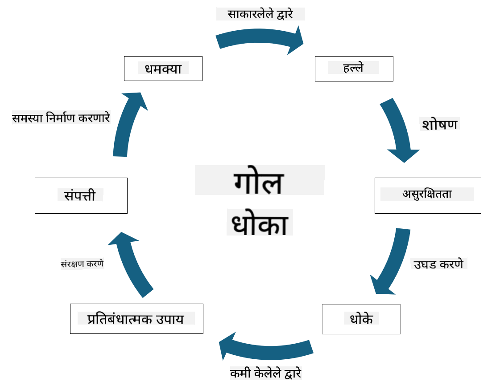

<!--
CO_OP_TRANSLATOR_METADATA:
{
  "original_hash": "fcca304f072cabf206388199e8e2e578",
  "translation_date": "2025-09-04T01:27:19+00:00",
  "source_file": "1.3 Understanding risk management.md",
  "language_code": "mr"
}
-->
# जोखीम व्यवस्थापन समजून घेणे

## परिचय

या धड्यात आपण कव्हर करू:

 - सामान्यतः वापरल्या जाणाऱ्या सुरक्षा संज्ञांची व्याख्या
   
 - सुरक्षा नियंत्रणांचे प्रकार

 - सुरक्षा जोखीमांचे मूल्यांकन

## सामान्यतः वापरल्या जाणाऱ्या सुरक्षा संज्ञांची व्याख्या

सायबर सुरक्षा आणि जोखीम व्यवस्थापन क्षेत्रातील या संज्ञा मूलभूत संकल्पना आहेत. प्रत्येक संज्ञा आणि त्यांचा परस्पर संबंध समजून घेऊया:

1. **धोका एजंट**:

धोका एजंट म्हणजे व्यक्ती, गट, संस्था किंवा स्वयंचलित प्रणाली ज्यामध्ये प्रणाली किंवा नेटवर्कमधील असुरक्षितता शोषून हानी किंवा नुकसान करण्याची क्षमता असते. धोका एजंटमध्ये हॅकर्स, मालवेअर लेखक, नाराज कर्मचारी किंवा माहिती आणि तंत्रज्ञान प्रणालींना धोका निर्माण करणारी कोणतीही संस्था समाविष्ट असते.

2. **धोका**:

धोका म्हणजे अशी संभाव्य घटना किंवा कृती जी प्रणालीतील असुरक्षितता शोषून एखाद्या मालमत्तेला हानी पोहोचवू शकते. हॅकिंग, डेटा चोरी, डिनायल-ऑफ-सर्व्हिस हल्ले यासारख्या कृतींमध्ये धोके समाविष्ट असतात. धोके म्हणजे संस्थेच्या मालमत्तेवर होणाऱ्या संभाव्य हानीचे "काय" असते.

3. **असुरक्षितता**:

असुरक्षितता म्हणजे प्रणालीच्या डिझाइन, अंमलबजावणी किंवा कॉन्फिगरेशनमधील अशा कमकुवतपणा किंवा दोष ज्याचा धोका एजंट प्रणालीच्या सुरक्षेला तडजोड करण्यासाठी फायदा घेऊ शकतो. सॉफ्टवेअर, हार्डवेअर, प्रक्रिया किंवा मानवी वर्तनामध्ये असुरक्षितता असू शकते. यशस्वी हल्ल्यांचा धोका कमी करण्यासाठी असुरक्षितता ओळखणे आणि दूर करणे आवश्यक आहे.

4. **जोखीम**:

जोखीम म्हणजे धोका आणि असुरक्षिततेच्या परस्परसंवादामुळे होणारे संभाव्य नुकसान, हानी किंवा नुकसान. धोका एजंट असुरक्षिततेचा फायदा घेऊन नकारात्मक परिणाम घडवून आणण्याची शक्यता आहे. जोखीम सहसा त्यांच्या संभाव्य परिणाम आणि होण्याच्या शक्यतेच्या दृष्टीने मूल्यांकन केले जाते.

5. **मालमत्ता**:

मालमत्ता म्हणजे कोणतीही मूल्यवान गोष्ट जी संस्था संरक्षित करू इच्छिते. मालमत्तांमध्ये भौतिक वस्तू (जसे की संगणक आणि सर्व्हर), डेटा (ग्राहक माहिती, आर्थिक नोंदी), बौद्धिक संपत्ती (व्यापार रहस्ये, पेटंट्स) आणि मानवी संसाधने (कर्मचार्‍यांचे कौशल्य आणि ज्ञान) समाविष्ट असू शकते. मालमत्तांचे संरक्षण करणे हे सायबर सुरक्षा क्षेत्राचे मुख्य उद्दिष्ट आहे.

6. **उघडपणा**:

उघडपणा म्हणजे संभाव्य धोके समोर येण्याची स्थिती. जेव्हा असुरक्षितता अस्तित्वात असते ज्याचा धोका एजंट फायदा घेऊ शकतो तेव्हा उघडपणा निर्माण होतो. प्रणाली किंवा नेटवर्कमध्ये असुरक्षितता असल्यामुळे संबंधित जोखीम उघडपणा दर्शवते.

7. **नियंत्रण**:

नियंत्रण म्हणजे असुरक्षितता आणि धोके यांच्याशी संबंधित जोखीम कमी करण्यासाठी ठेवलेले उपाय. नियंत्रण तांत्रिक, प्रक्रियात्मक किंवा प्रशासकीय स्वरूपाचे असू शकते. संभाव्य धोके आणि असुरक्षितता रोखण्यासाठी, शोधण्यासाठी किंवा कमी करण्यासाठी ते डिझाइन केलेले आहेत. उदाहरणांमध्ये फायरवॉल, प्रवेश नियंत्रण, एन्क्रिप्शन, सुरक्षा धोरणे आणि कर्मचारी प्रशिक्षण यांचा समावेश आहे.

या संज्ञांमधील संबंधाचा सारांश देण्यासाठी: धोका एजंट असुरक्षिततेचा फायदा घेऊन धोके निर्माण करतो, ज्यामुळे जोखीम निर्माण होऊ शकते ज्यामुळे मूल्यवान मालमत्तेला हानी होऊ शकते. असुरक्षितता अस्तित्वात असल्यावर उघडपणा निर्माण होतो आणि मालमत्तांवर धोके कमी करण्यासाठी नियंत्रण ठेवले जाते. ही चौकट सायबर सुरक्षा जोखीम व्यवस्थापनाचा पाया तयार करते, संस्थांना त्यांच्या माहिती प्रणाली आणि मालमत्तांवरील संभाव्य जोखीम ओळखण्यात, मूल्यांकन करण्यात आणि दूर करण्यात मार्गदर्शन करते.

## सुरक्षा नियंत्रणांचे प्रकार

सुरक्षा नियंत्रण म्हणजे माहिती प्रणाली आणि मालमत्तांना विविध धोके आणि असुरक्षिततेपासून संरक्षित करण्यासाठी अंमलात आणलेले उपाय किंवा संरक्षण. त्यांना त्यांच्या लक्ष आणि उद्देशावर आधारित अनेक श्रेणींमध्ये वर्गीकृत केले जाऊ शकते. सुरक्षा नियंत्रणांचे काही सामान्य प्रकार येथे दिले आहेत:

1. **प्रशासकीय नियंत्रण**:

हे नियंत्रण धोरणे, प्रक्रिया आणि मार्गदर्शक तत्त्वांशी संबंधित आहेत जे संस्थेच्या सुरक्षा पद्धती आणि वापरकर्त्याच्या वर्तनाचे नियमन करतात.

- सुरक्षा धोरणे आणि प्रक्रिया: दस्तऐवजीकरण केलेल्या मार्गदर्शक तत्त्वे जी संस्थेमध्ये सुरक्षा कशी राखली जाते हे परिभाषित करतात.

- सुरक्षा जागरूकता आणि प्रशिक्षण: कर्मचार्‍यांना सुरक्षा सर्वोत्तम पद्धती आणि संभाव्य धोके याबद्दल शिक्षित करण्यासाठी कार्यक्रम.

- घटना प्रतिसाद आणि व्यवस्थापन: सुरक्षा घटनांना प्रतिसाद देण्यासाठी आणि कमी करण्यासाठी योजना.

2. **तांत्रिक नियंत्रण**:

तांत्रिक नियंत्रणामध्ये सुरक्षा उपाय अंमलात आणण्यासाठी आणि प्रणाली आणि डेटा संरक्षित करण्यासाठी तंत्रज्ञानाचा वापर समाविष्ट आहे. तांत्रिक नियंत्रणाचे उदाहरणे:

- प्रवेश नियंत्रण: वापरकर्त्यांच्या भूमिकांनुसार आणि परवानग्यांनुसार संसाधनांवर प्रवेश मर्यादित करणारे उपाय.

- एन्क्रिप्शन: अनधिकृत प्रवेश टाळण्यासाठी डेटा सुरक्षित स्वरूपात रूपांतरित करणे.

- फायरवॉल: नेटवर्क सुरक्षा उपकरणे जी येणारी आणि जाणारी वाहतूक फिल्टर आणि नियंत्रित करतात.

- घुसखोरी शोध आणि प्रतिबंध प्रणाली (IDPS): संशयास्पद क्रियाकलापांसाठी नेटवर्क ट्रॅफिकचे निरीक्षण करणारी साधने.

- अँटीव्हायरस आणि अँटी-मालवेअर सॉफ्टवेअर: दुर्भावनायुक्त सॉफ्टवेअर शोधून काढणारे आणि काढून टाकणारे प्रोग्राम.

- प्रमाणीकरण यंत्रणा: वापरकर्त्यांची ओळख सत्यापित करण्याच्या पद्धती, जसे की पासवर्ड, बायोमेट्रिक्स आणि मल्टी-फॅक्टर प्रमाणीकरण.

- पॅच व्यवस्थापन: ज्ञात असुरक्षितता दूर करण्यासाठी सॉफ्टवेअर नियमितपणे अद्यतनित करणे.

3. **भौतिक नियंत्रण**:

भौतिक नियंत्रण म्हणजे भौतिक मालमत्ता आणि सुविधा संरक्षित करण्याचे उपाय.

- सुरक्षा रक्षक आणि प्रवेश नियंत्रण कर्मचारी: भौतिक परिसरावर प्रवेशाचे निरीक्षण आणि नियंत्रण करणारे कर्मचारी.

- देखरेख कॅमेरे: क्रियाकलापांचे निरीक्षण आणि रेकॉर्ड करण्यासाठी व्हिडिओ मॉनिटरिंग सिस्टम.

- कुलपे आणि भौतिक अडथळे: संवेदनशील क्षेत्रांमध्ये प्रवेश मर्यादित करण्यासाठी भौतिक उपाय.

- पर्यावरणीय नियंत्रण: उपकरणे आणि डेटा केंद्रांवर परिणाम करणारे तापमान, आर्द्रता आणि इतर पर्यावरणीय घटक नियंत्रित करण्याचे उपाय.

4. **ऑपरेशनल नियंत्रण**:

हे नियंत्रण प्रणालींच्या सततच्या सुरक्षेची खात्री देण्यासाठी दैनंदिन ऑपरेशन्स आणि क्रियाकलापांशी संबंधित आहेत.

- बदल व्यवस्थापन: प्रणाली आणि कॉन्फिगरेशनमध्ये बदल ट्रॅक करण्यासाठी आणि मंजूर करण्यासाठी प्रक्रिया.

- बॅकअप आणि आपत्ती पुनर्प्राप्ती: प्रणालीतील अयशस्वी किंवा आपत्तीच्या बाबतीत डेटा बॅकअप आणि पुनर्प्राप्ती योजना.

- लॉगिंग आणि ऑडिटिंग: सुरक्षा आणि अनुपालन उद्देशांसाठी प्रणाली क्रियाकलापांचे निरीक्षण आणि रेकॉर्डिंग.

- सुरक्षित कोडिंग पद्धती: असुरक्षितता कमी करण्यासाठी सॉफ्टवेअर लिहिण्यासाठी मार्गदर्शक तत्त्वे.

5. **कायदेशीर आणि नियामक नियंत्रण**:

हे नियंत्रण संबंधित कायदे, नियम आणि उद्योग मानकांचे पालन सुनिश्चित करतात. संस्थेला कोणत्या मानकांचे पालन करणे आवश्यक आहे हे न्यायक्षेत्र, उद्योग क्षेत्र आणि इतर घटकांवर अवलंबून असते.

- डेटा संरक्षण नियम: GDPR, HIPAA, आणि CCPA सारख्या कायद्यांचे पालन.

- उद्योग-विशिष्ट मानके: पेमेंट कार्ड डेटा सुरक्षा (PCI DSS) सारख्या मानकांचे पालन.

सुरक्षा नियंत्रणांच्या या श्रेणी एकत्र काम करून संस्थांसाठी व्यापक सुरक्षा स्थिती निर्माण करतात, त्यांच्या प्रणाली, डेटा आणि मालमत्तांना विविध प्रकारच्या धोकेपासून संरक्षित करण्यात मदत करतात.

## सुरक्षा जोखीमांचे मूल्यांकन

काही सुरक्षा व्यावसायिकांना वाटते की जोखीम व्यवस्थापन हे जोखीम व्यावसायिकांवर सोडले जाते, परंतु सुरक्षा जोखीम व्यवस्थापन प्रक्रियेचे समजून घेणे कोणत्याही सुरक्षा व्यावसायिकासाठी महत्त्वाचे आहे जेणेकरून सुरक्षा जोखीम संस्थेतील इतर लोक समजून घेऊ शकतील आणि त्यावर कृती करू शकतील अशा भाषेत व्यक्त करता येईल.

संस्था सतत सुरक्षा जोखीमांचे मूल्यांकन करतात आणि व्यवसायाविरुद्ध जोखीमांवर कोणती कृती (किंवा नाही) करायची ते ठरवतात. खाली हे सामान्यतः कसे केले जाते याचे विहंगावलोकन दिले आहे. लक्षात ठेवा की ही प्रक्रिया सहसा संस्थेतील अनेक वेगवेगळ्या टीम्सद्वारे केली जाते, एकाच टीमने जोखीम व्यवस्थापनाची संपूर्ण प्रक्रिया हाताळणे दुर्मिळ आहे.

1. **मालमत्ता आणि धोके ओळखणे**:

संस्था ज्या मालमत्तांचे संरक्षण करू इच्छित आहे त्या ओळखते. यामध्ये डेटा, प्रणाली, हार्डवेअर, सॉफ्टवेअर, बौद्धिक संपत्ती आणि बरेच काही समाविष्ट असू शकते. त्यानंतर, त्या मालमत्तांना लक्ष्य करू शकणारे संभाव्य धोके ओळखले जातात.

2. **असुरक्षितता मूल्यांकन**:

संस्था प्रणाली किंवा प्रक्रियेमध्ये असलेल्या असुरक्षितता किंवा कमकुवतपणा ओळखतात ज्याचा धोके फायदा घेऊ शकतात. या असुरक्षितता सॉफ्टवेअर दोष, चुकीच्या कॉन्फिगरेशन, सुरक्षा नियंत्रणांचा अभाव आणि मानवी त्रुटीमुळे होऊ शकतात.

3. **शक्यता मूल्यांकन**:

संस्था प्रत्येक धोका घडण्याची शक्यता मूल्यांकन करते. यामध्ये ऐतिहासिक डेटा, धोका बुद्धिमत्ता, उद्योग ट्रेंड आणि अंतर्गत घटकांचा विचार करणे समाविष्ट आहे. धोका घडण्याची शक्यता कमी, मध्यम किंवा उच्च म्हणून वर्गीकृत केली जाऊ शकते.

4. **परिणाम मूल्यांकन**:

यानंतर, संस्था प्रत्येक धोका असुरक्षिततेचा फायदा घेतल्यास संभाव्य परिणाम ठरवते. परिणामांमध्ये आर्थिक नुकसान, ऑपरेशनल अडथळे, प्रतिष्ठात्मक नुकसान, कायदेशीर परिणाम आणि बरेच काही समाविष्ट असू शकते. परिणाम कमी, मध्यम किंवा उच्च म्हणून वर्गीकृत केला जाऊ शकतो.

5. **जोखीम गणना**:

शक्यता आणि परिणाम मूल्यांकन एकत्र करून प्रत्येक ओळखलेल्या धोक्यासाठी एकूण जोखीम स्तराची गणना केली जाते. हे सहसा जोखीम मॅट्रिक्स वापरून केले जाते जे शक्यता आणि परिणाम स्तरांना संख्यात्मक मूल्ये किंवा गुणात्मक वर्णनकर्ता नियुक्त करते. परिणामी जोखीम स्तर उच्च प्राधान्य असलेल्या जोखमींवर त्वरित लक्ष केंद्रित करण्यास मदत करतो.

6. **प्राधान्यक्रम आणि निर्णय घेणे**:

संस्था उच्च एकत्रित शक्यता आणि परिणाम मूल्य असलेल्या जोखमींवर लक्ष केंद्रित करून जोखीमांना प्राधान्य देते. यामुळे संसाधने वाटप करणे आणि नियंत्रण अंमलात आणणे अधिक प्रभावी होते. उच्च-जोखीम धोके त्वरित लक्ष देण्याची आवश्यकता असते, तर कमी-जोखीम धोके दीर्घ कालावधीत संबोधित केले जाऊ शकतात.

7. **जोखीम उपचार**:

जोखीम मूल्यांकनाच्या आधारे, संस्था प्रत्येक जोखीम कमी करण्यासाठी किंवा व्यवस्थापित करण्यासाठी काय करायचे ते ठरवते. यामध्ये सुरक्षा नियंत्रण अंमलात आणणे, विमा द्वारे जोखीम हस्तांतरित करणे किंवा व्यवस्थापनीय/खूप महाग असल्यास काही स्तरांचा उर्वरित जोखीम स्वीकारणे समाविष्ट असू शकते.

8. **सतत निरीक्षण आणि पुनरावलोकन**:

जोखीम मूल्यांकन ही एक-वेळ प्रक्रिया नाही. हे नियमितपणे किंवा संस्थेच्या वातावरणात महत्त्वपूर्ण बदल झाल्यावर केले पाहिजे. सतत निरीक्षण सुनिश्चित करते की नवीन धोके, असुरक्षितता किंवा व्यवसायाच्या लँडस्केपमधील बदलांचा विचार केला जातो.

सुरक्षा जोखीम संरचित पद्धतीने मूल्यांकन करून, संस्था संसाधन वाटप, सुरक्षा नियंत्रण आणि एकूण जोखीम व्यवस्थापन धोरणांबद्दल माहितीपूर्ण निर्णय घेऊ शकतात. उद्दिष्ट म्हणजे संस्थेच्या एकूण जोखीम उघडपणा कमी करणे आणि संस्थेच्या व्यवसायाच्या उद्दिष्टांशी सुरक्षा प्रयत्न संरेखित करणे.

---

**अस्वीकरण**:  
हा दस्तऐवज AI भाषांतर सेवा [Co-op Translator](https://github.com/Azure/co-op-translator) चा वापर करून भाषांतरित करण्यात आला आहे. आम्ही अचूकतेसाठी प्रयत्नशील असलो तरी, कृपया लक्षात घ्या की स्वयंचलित भाषांतरांमध्ये त्रुटी किंवा अचूकतेचा अभाव असू शकतो. मूळ भाषेतील मूळ दस्तऐवज हा अधिकृत स्रोत मानला जावा. महत्त्वाच्या माहितीसाठी व्यावसायिक मानवी भाषांतराची शिफारस केली जाते. या भाषांतराचा वापर केल्यामुळे उद्भवणाऱ्या कोणत्याही गैरसमज किंवा चुकीच्या अर्थासाठी आम्ही जबाबदार राहणार नाही.