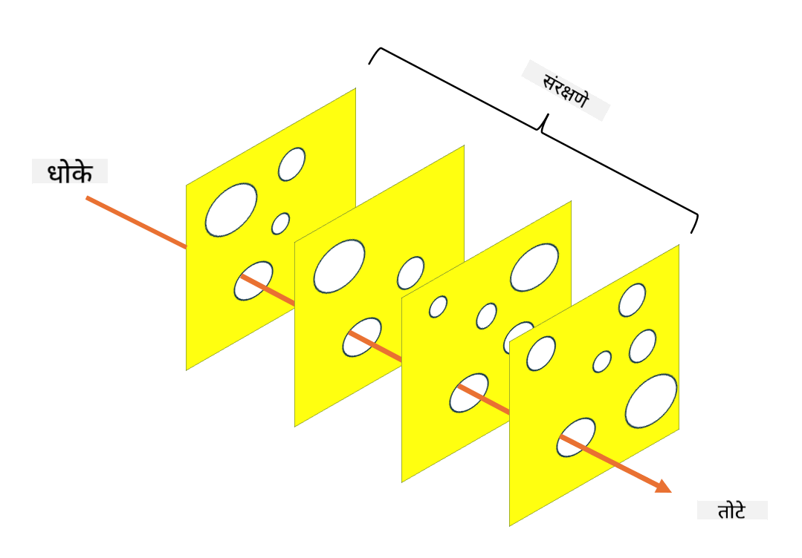

<!--
CO_OP_TRANSLATOR_METADATA:
{
  "original_hash": "75f77f972d2233c584f87c1eb96c983b",
  "translation_date": "2025-09-03T23:45:58+00:00",
  "source_file": "1.5 Zero trust.md",
  "language_code": "mr"
}
-->
# झिरो ट्रस्ट

"झिरो ट्रस्ट" हा सध्या सुरक्षा क्षेत्रात खूप चर्चेत असलेला शब्द आहे. पण याचा अर्थ काय आहे? हा फक्त एक गाजावाजा आहे का? या धड्यात आपण झिरो ट्रस्ट म्हणजे काय हे सविस्तरपणे समजून घेऊ.

## परिचय

 - या धड्यात आपण कव्हर करू:
   
   
 - झिरो ट्रस्ट म्हणजे काय?

   
  

 - झिरो ट्रस्ट पारंपरिक सुरक्षा आर्किटेक्चरपेक्षा कसे वेगळे आहे?

   
   

 - डिफेन्स इन डेप्थ म्हणजे काय?

## झिरो ट्रस्ट

झिरो ट्रस्ट ही एक सायबर सुरक्षा पद्धत आहे जी "विश्वास ठेवा पण पडताळा करा" या पारंपरिक संकल्पनेला आव्हान देते. यामध्ये मानले जाते की संस्थेच्या नेटवर्कच्या आत किंवा बाहेर असलेल्या कोणत्याही घटकावर स्वाभाविकपणे विश्वास ठेवला जाऊ नये. त्याऐवजी, झिरो ट्रस्ट प्रत्येक वापरकर्ता, डिव्हाइस आणि अ‍ॅप्लिकेशनची पडताळणी करण्याचा आग्रह धरते, त्यांचे स्थान काहीही असो. झिरो ट्रस्टचा मुख्य उद्देश "हल्ल्याचा पृष्ठभाग" कमी करणे आणि सुरक्षा उल्लंघनाचा संभाव्य परिणाम कमी करणे आहे.

झिरो ट्रस्ट मॉडेलमध्ये खालील तत्त्वांवर भर दिला जातो:

1. **ओळख पडताळा**: वापरकर्ते आणि डिव्हाइस यांची ओळख आणि अधिकृतता कठोरपणे तपासली जाते, त्यांचे स्थान काहीही असो. लक्षात ठेवा की ओळख ही नेहमी मानवी नसते; ती डिव्हाइस, अ‍ॅप्लिकेशन इत्यादी असू शकते.

2. **किमान विशेषाधिकार**: वापरकर्ते आणि डिव्हाइसला त्यांच्या कामासाठी आवश्यक असलेली किमान प्रवेश पातळी दिली जाते, ज्यामुळे ते धोक्यात आल्यास संभाव्य नुकसान कमी होते.

3. **मायक्रो-सेगमेंटेशन**: नेटवर्क संसाधनांना लहान विभागांमध्ये विभाजित केले जाते जेणेकरून उल्लंघन झाल्यास नेटवर्कमध्ये बाजूने हालचाल मर्यादित करता येईल.

4. **सतत निरीक्षण**: वापरकर्ता आणि डिव्हाइसच्या वर्तनाचे सतत निरीक्षण आणि विश्लेषण केले जाते जेणेकरून अनियमितता आणि संभाव्य धोके ओळखता येतील. आधुनिक निरीक्षण तंत्रांमध्ये मशीन लर्निंग, एआय आणि थ्रेट इंटेलिजन्सचा वापर करून निरीक्षणाला अधिक तपशील आणि संदर्भ दिला जातो.

5. **डेटा एन्क्रिप्शन**: डेटा प्रवासात आणि विश्रांतीच्या स्थितीत एन्क्रिप्ट केला जातो जेणेकरून अनधिकृत प्रवेश टाळता येईल.

6. **कठोर प्रवेश नियंत्रण**: वापरकर्ता भूमिका, डिव्हाइसची स्थिती आणि नेटवर्क स्थान यासारख्या संदर्भांवर आधारित प्रवेश नियंत्रण लागू केले जाते.

मायक्रोसॉफ्ट झिरो ट्रस्टला पाच स्तंभांमध्ये विभागते, ज्यावर आपण पुढील धड्यात चर्चा करू.

## पारंपरिक सुरक्षा आर्किटेक्चरपासून फरक

झिरो ट्रस्ट पारंपरिक सुरक्षा आर्किटेक्चर, जसे की परिमिती-आधारित मॉडेल्स, यापेक्षा अनेक प्रकारे वेगळे आहे:

1. **परिमिती विरुद्ध ओळख-केंद्रित**: पारंपरिक मॉडेल्स नेटवर्कच्या परिमितीचे संरक्षण करण्यावर लक्ष केंद्रित करतात आणि नेटवर्कमध्ये एकदा प्रवेश मिळाल्यावर अंतर्गत वापरकर्ते आणि डिव्हाइसवर विश्वास ठेवतात. झिरो ट्रस्ट, दुसरीकडे, मानते की धोके नेटवर्कच्या आत आणि बाहेरून येऊ शकतात आणि कठोर ओळख-आधारित नियंत्रण लागू करते.

2. **अप्रत्यक्ष विरुद्ध स्पष्ट विश्वास**: पारंपरिक मॉडेल्स नेटवर्कमधील डिव्हाइस आणि वापरकर्त्यांवर अप्रत्यक्षपणे विश्वास ठेवतात जोपर्यंत ते सिद्ध होत नाही. झिरो ट्रस्ट स्पष्टपणे ओळख पडताळते आणि अनियमिततेसाठी सतत निरीक्षण करते.

3. **सपाट विरुद्ध विभागलेले नेटवर्क**: पारंपरिक आर्किटेक्चरमध्ये अनेकदा सपाट नेटवर्क असते जिथे अंतर्गत वापरकर्त्यांना विस्तृत प्रवेश असतो. झिरो ट्रस्ट नेटवर्कला लहान, वेगळ्या झोनमध्ये विभागण्याचा आग्रह धरते जेणेकरून संभाव्य उल्लंघन रोखता येईल.

4. **प्रतिक्रियात्मक विरुद्ध सक्रिय**: पारंपरिक सुरक्षा अनेकदा परिमिती फायरवॉल्स आणि घुसखोरी शोधण्यासारख्या प्रतिक्रियात्मक उपायांवर अवलंबून असते. झिरो ट्रस्ट सक्रिय दृष्टिकोन स्वीकारते, उल्लंघन होण्याची शक्यता गृहीत धरते आणि त्याचा परिणाम कमी करण्याचा प्रयत्न करते.

## डिफेन्स इन डेप्थ

डिफेन्स इन डेप्थ, ज्याला स्तरित सुरक्षा असेही म्हणतात, ही एक सायबर सुरक्षा रणनीती आहे ज्यामध्ये संस्थेच्या मालमत्तांचे संरक्षण करण्यासाठी अनेक स्तरांचे सुरक्षा नियंत्रण आणि उपाय तैनात केले जातात. उद्दिष्ट म्हणजे संरक्षणाचे ओव्हरलॅपिंग स्तर तयार करणे जेणेकरून एक स्तर उल्लंघन झाल्यास इतर स्तर अजूनही संरक्षण प्रदान करू शकतील. प्रत्येक स्तर सुरक्षा क्षेत्राच्या वेगळ्या पैलूंवर लक्ष केंद्रित करतो आणि संस्थेच्या एकूण सुरक्षा स्थितीला मजबूत करतो.

डिफेन्स इन डेप्थमध्ये तांत्रिक, प्रक्रियात्मक आणि भौतिक सुरक्षा उपायांचा समावेश असतो. यामध्ये फायरवॉल्स, घुसखोरी शोध प्रणाली, प्रवेश नियंत्रण, एन्क्रिप्शन, वापरकर्ता प्रशिक्षण, सुरक्षा धोरणे आणि बरेच काही समाविष्ट असते. कल्पना अशी आहे की अनेक अडथळे तयार करणे जे एकत्रितपणे हल्लेखोरांना संस्थेच्या प्रणाली आणि नेटवर्कमध्ये प्रवेश करणे कठीण बनवतात. याला कधीकधी "स्विस चीज" मॉडेल असेही म्हणतात, जे इतर उद्योगांमध्ये (उदा. वाहतूक) अपघात प्रतिबंधासाठी वापरले जाते.

## पुढील वाचन

[झिरो ट्रस्ट म्हणजे काय?](https://learn.microsoft.com/security/zero-trust/zero-trust-overview?WT.mc_id=academic-96948-sayoung)

[झिरो ट्रस्टचा विकास – मायक्रोसॉफ्टचा स्थान पेपर](https://query.prod.cms.rt.microsoft.com/cms/api/am/binary/RWJJdT?WT.mc_id=academic-96948-sayoung)

[झिरो ट्रस्ट आणि बियॉंडकॉर्प Google Cloud | Google Cloud Blog](https://cloud.google.com/blog/topics/developers-practitioners/zero-trust-and-beyondcorp-google-cloud)

---

**अस्वीकरण**:  
हा दस्तऐवज AI भाषांतर सेवा [Co-op Translator](https://github.com/Azure/co-op-translator) चा वापर करून भाषांतरित करण्यात आला आहे. आम्ही अचूकतेसाठी प्रयत्नशील असलो तरी, कृपया लक्षात घ्या की स्वयंचलित भाषांतरांमध्ये त्रुटी किंवा अचूकतेचा अभाव असू शकतो. मूळ भाषेतील मूळ दस्तऐवज हा अधिकृत स्रोत मानला जावा. महत्त्वाच्या माहितीसाठी व्यावसायिक मानवी भाषांतराची शिफारस केली जाते. या भाषांतराचा वापर केल्यामुळे उद्भवणाऱ्या कोणत्याही गैरसमज किंवा चुकीच्या अर्थासाठी आम्ही जबाबदार राहणार नाही.