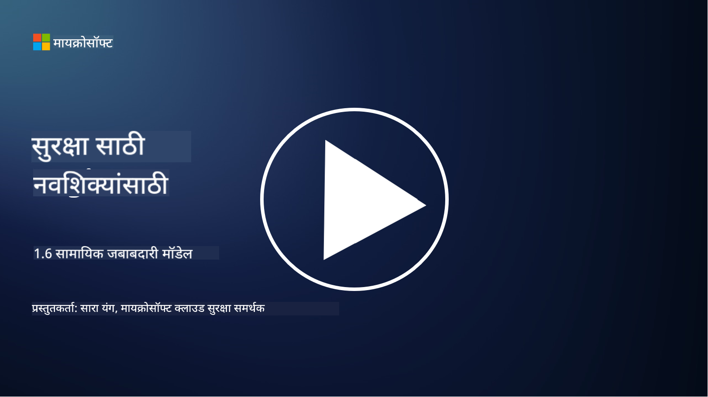

<!--
CO_OP_TRANSLATOR_METADATA:
{
  "original_hash": "a48db640d80c786b928ca178c414f084",
  "translation_date": "2025-09-04T00:24:28+00:00",
  "source_file": "1.6 Shared responsibility model.md",
  "language_code": "mr"
}
-->
# सामायिक जबाबदारी मॉडेल

सामायिक जबाबदारी हा आयटीमधील एक नवीन संकल्पना आहे, जी क्लाउड कंप्युटिंगच्या आगमनामुळे अस्तित्वात आली. सायबर सुरक्षा दृष्टिकोनातून, कोण कोणते सुरक्षा नियंत्रण प्रदान करत आहे हे समजून घेणे महत्त्वाचे आहे, जेणेकरून संरक्षणामध्ये कोणतीही पोकळी राहू नये.

## परिचय

या धड्यात आपण शिकणार आहोत:

 - सायबर सुरक्षेच्या संदर्भात सामायिक जबाबदारी म्हणजे काय?
   
 - IaaS, PaaS आणि SaaS मध्ये सुरक्षा नियंत्रणासाठी सामायिक जबाबदारीत काय फरक आहे?

 - तुमच्या क्लाउड प्लॅटफॉर्मने कोणते सुरक्षा नियंत्रण प्रदान केले आहे हे कुठे शोधता येईल?

 - "विश्वास ठेवा पण पडताळा करा" म्हणजे काय?

## सायबर सुरक्षेच्या संदर्भात सामायिक जबाबदारी म्हणजे काय?

सायबर सुरक्षेमधील सामायिक जबाबदारी म्हणजे क्लाउड सेवा प्रदाता (CSP) आणि त्याच्या ग्राहकांमध्ये सुरक्षा जबाबदाऱ्या वाटून घेणे. क्लाउड कंप्युटिंगच्या वातावरणात, जसे की Infrastructure as a Service (IaaS), Platform as a Service (PaaS), आणि Software as a Service (SaaS), डेटा, अॅप्लिकेशन्स आणि प्रणालींच्या सुरक्षेसाठी CSP आणि ग्राहक दोघांनाही भूमिका बजवावी लागते.

## IaaS, PaaS आणि SaaS मध्ये सुरक्षा नियंत्रणासाठी सामायिक जबाबदारीत काय फरक आहे?

जबाबदाऱ्या कशा वाटल्या जातात हे सामान्यतः वापरल्या जाणाऱ्या क्लाउड सेवांच्या प्रकारावर अवलंबून असते:

 - **IaaS (Infrastructure as a Service)**: CSP मूलभूत पायाभूत सुविधा (सर्व्हर, नेटवर्किंग, स्टोरेज) प्रदान करते, तर ग्राहक त्या पायाभूत सुविधांवर ऑपरेटिंग सिस्टम, अॅप्लिकेशन्स आणि सुरक्षा कॉन्फिगरेशन व्यवस्थापित करण्यासाठी जबाबदार असतो.
   
 - **PaaS (Platform as a Service):** CSP एक प्लॅटफॉर्म प्रदान करते ज्यावर ग्राहक अॅप्लिकेशन्स तयार आणि तैनात करू शकतात. CSP अंतर्गत पायाभूत सुविधा व्यवस्थापित करते, आणि ग्राहक अॅप्लिकेशन विकास आणि डेटा सुरक्षेवर लक्ष केंद्रित करतो.

 - **SaaS (Software as a Service)**: CSP पूर्णपणे कार्यक्षम अॅप्लिकेशन्स इंटरनेटवरून प्रवेश करण्यासाठी प्रदान करते. या प्रकरणात, CSP अॅप्लिकेशनची सुरक्षा आणि पायाभूत सुविधा व्यवस्थापित करते, तर ग्राहक वापरकर्ता प्रवेश आणि डेटा वापर व्यवस्थापित करतो.

सामायिक जबाबदारी समजून घेणे महत्त्वाचे आहे कारण यामुळे CSP कोणते सुरक्षा पैलू कव्हर करते आणि ग्राहक कोणते पैलू हाताळतो हे स्पष्ट होते. यामुळे गैरसमज टाळले जातात आणि सुरक्षा उपाय एकत्रितपणे अंमलात आणले जातात.

## तुमच्या क्लाउड प्लॅटफॉर्मने कोणते सुरक्षा नियंत्रण प्रदान केले आहे हे कुठे शोधता येईल?

तुमच्या क्लाउड प्लॅटफॉर्मने कोणते सुरक्षा नियंत्रण प्रदान केले आहे हे शोधण्यासाठी तुम्हाला क्लाउड सेवा प्रदात्याच्या दस्तऐवज आणि संसाधनांचा संदर्भ घ्यावा लागेल. यामध्ये समाविष्ट आहे:

 - **CSP च्या वेबसाइट आणि दस्तऐवज**: CSP च्या वेबसाइटवर त्यांच्या सेवांचा भाग म्हणून दिल्या जाणाऱ्या सुरक्षा वैशिष्ट्ये आणि नियंत्रणांची माहिती असते. CSP सहसा त्यांच्या सुरक्षा पद्धती, नियंत्रण आणि शिफारसी स्पष्ट करणारे तपशीलवार दस्तऐवज प्रदान करतात. यात श्वेतपत्रे, सुरक्षा मार्गदर्शिका आणि तांत्रिक दस्तऐवज समाविष्ट असू शकतो.
   
 - **सुरक्षा मूल्यांकन आणि ऑडिट्स**: बहुतेक CSP त्यांच्या सुरक्षा नियंत्रणांचे स्वतंत्र सुरक्षा तज्ञ आणि संस्थांकडून मूल्यांकन करून घेतात. या पुनरावलोकनांमुळे CSP च्या सुरक्षा उपायांची गुणवत्ता समजून घेता येते. कधी कधी यामुळे CSP ला सुरक्षा अनुपालन प्रमाणपत्र मिळते (पुढील बुलेट पॉइंट पहा).
   
 - **सुरक्षा अनुपालन प्रमाणपत्रे**: बहुतेक CSP ISO:27001, SOC 2, आणि FedRAMP यांसारखी प्रमाणपत्रे प्राप्त करतात. ही प्रमाणपत्रे प्रदाता विशिष्ट सुरक्षा आणि अनुपालन मानकांचे पालन करत असल्याचे दर्शवतात.

लक्षात ठेवा की तपशीलांची पातळी आणि माहितीची उपलब्धता क्लाउड प्रदात्यांमध्ये वेगवेगळी असू शकते. तुमच्या क्लाउड-आधारित मालमत्तांच्या सुरक्षेबाबत माहितीपूर्ण निर्णय घेण्यासाठी नेहमी क्लाउड सेवा प्रदात्याने दिलेली अधिकृत आणि अद्ययावत संसाधने सल्ला घ्या.

## "विश्वास ठेवा पण पडताळा करा" म्हणजे काय?

CSP, तृतीय-पक्ष सॉफ्टवेअर किंवा इतर आयटी सुरक्षा सेवा वापरण्याच्या संदर्भात, एखादी संस्था सुरुवातीला प्रदात्याच्या सुरक्षा उपायांबद्दलच्या दाव्यांवर विश्वास ठेवू शकते. परंतु, त्यांच्या डेटा आणि प्रणालींची खऱ्या अर्थाने सुरक्षा सुनिश्चित करण्यासाठी, ते सुरक्षा मूल्यांकन, प्रवेश चाचणी आणि बाह्य पक्षाच्या सुरक्षा नियंत्रणांचे पुनरावलोकन करून हे दावे पडताळून पाहतील. सॉफ्टवेअर किंवा सेवा पूर्णपणे त्यांच्या ऑपरेशन्समध्ये समाकलित करण्यापूर्वी हे करणे आवश्यक आहे. सर्व व्यक्ती आणि संस्थांनी त्यांच्या जबाबदारीत नसलेल्या सुरक्षा नियंत्रणांवर विश्वास ठेवावा, पण त्याची पडताळणी करावी.

## संस्थेमधील सामायिक जबाबदारी

लक्षात ठेवा, संस्थेमधील वेगवेगळ्या टीम्ससाठी सुरक्षा नियंत्रणासाठी सामायिक जबाबदारी देखील विचारात घेतली पाहिजे. सुरक्षा टीम क्वचितच सर्व नियंत्रण स्वतः अंमलात आणेल आणि संस्थेला सुरक्षित ठेवण्यासाठी आवश्यक असलेल्या सर्व सुरक्षा नियंत्रणांची अंमलबजावणी करण्यासाठी ऑपरेशन्स टीम्स, डेव्हलपर्स आणि व्यवसायाच्या इतर भागांसोबत सहकार्य करावे लागेल.

## अधिक वाचन
- [Shared responsibility in the cloud - Microsoft Azure | Microsoft Learn](https://learn.microsoft.com/azure/security/fundamentals/shared-responsibility?WT.mc_id=academic-96948-sayoung)
- [What is shared responsibility model? – Definition from TechTarget.com](https://www.techtarget.com/searchcloudcomputing/definition/shared-responsibility-model)
- [The shared responsibility model explained and what it means for cloud security | CSO Online](https://www.csoonline.com/article/570779/the-shared-responsibility-model-explained-and-what-it-means-for-cloud-security.html)
- [Shared Responsibility for Cloud Security: What You Need to Know (cisecurity.org)](https://www.cisecurity.org/insights/blog/shared-responsibility-cloud-security-what-you-need-to-know)

---

**अस्वीकरण**:  
हा दस्तऐवज AI भाषांतर सेवा [Co-op Translator](https://github.com/Azure/co-op-translator) चा वापर करून भाषांतरित करण्यात आला आहे. आम्ही अचूकतेसाठी प्रयत्नशील असलो तरी, कृपया लक्षात घ्या की स्वयंचलित भाषांतरांमध्ये त्रुटी किंवा अचूकतेचा अभाव असू शकतो. मूळ भाषेतील मूळ दस्तऐवज हा अधिकृत स्रोत मानला जावा. महत्त्वाच्या माहितीसाठी व्यावसायिक मानवी भाषांतराची शिफारस केली जाते. या भाषांतराचा वापर केल्यामुळे उद्भवणाऱ्या कोणत्याही गैरसमज किंवा चुकीच्या अर्थासाठी आम्ही जबाबदार राहणार नाही.