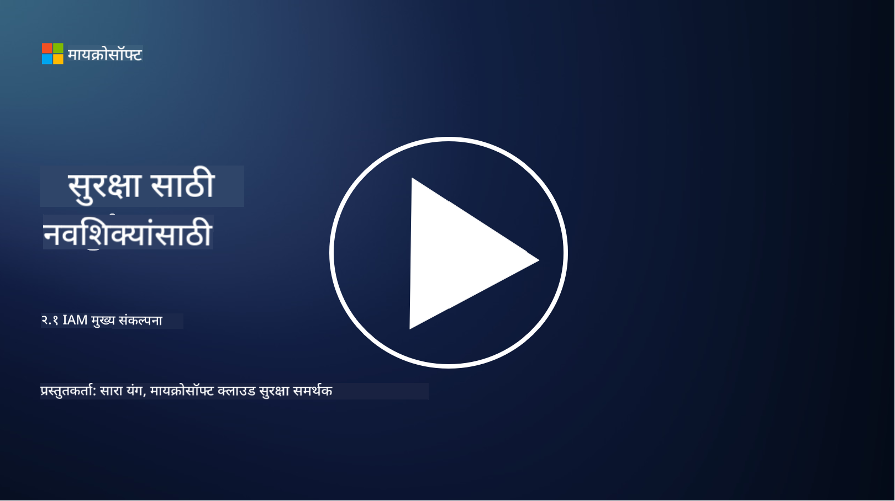

<!--
CO_OP_TRANSLATOR_METADATA:
{
  "original_hash": "2e3864e3d579f0dbb4ac2ec8c5f82acf",
  "translation_date": "2025-09-03T22:38:12+00:00",
  "source_file": "2.1 IAM key concepts.md",
  "language_code": "mr"
}
-->
# IAM मुख्य संकल्पना

तुम्ही कधी संगणक किंवा वेबसाइटमध्ये लॉग इन केले आहे का? नक्कीच केले असेल! याचा अर्थ तुम्ही तुमच्या दैनंदिन जीवनात आधीच ओळख नियंत्रणांचा वापर केला आहे. ओळख आणि प्रवेश व्यवस्थापन (IAM) ही सुरक्षा व्यवस्थेची एक महत्त्वाची स्तंभ आहे, याबद्दल पुढील धड्यांमध्ये अधिक जाणून घेऊ.

**परिचय**

या धड्यात आपण शिकणार आहोत:

- सायबर सुरक्षा संदर्भात ओळख आणि प्रवेश व्यवस्थापन (IAM) म्हणजे काय?

- किमान विशेषाधिकाराचा तत्त्व काय आहे?

- कर्तव्यांचे विभाजन म्हणजे काय?

- प्रमाणीकरण आणि अधिकृतता म्हणजे काय?

## सायबर सुरक्षा संदर्भात ओळख आणि प्रवेश व्यवस्थापन (IAM) म्हणजे काय?

ओळख आणि प्रवेश व्यवस्थापन (IAM) म्हणजे प्रक्रियेचा, तंत्रज्ञानाचा आणि धोरणांचा एक संच आहे, जो सुनिश्चित करतो की योग्य व्यक्तींना संस्थेच्या डिजिटल वातावरणातील संसाधनांवर योग्य प्रवेश आहे. IAM मध्ये डिजिटल ओळखींचे (वापरकर्ते, कर्मचारी, भागीदार) व्यवस्थापन आणि त्यांचा प्रणाली, अनुप्रयोग, डेटा आणि नेटवर्क्सवर प्रवेश समाविष्ट आहे. IAM चे मुख्य उद्दिष्ट सुरक्षा वाढवणे, वापरकर्त्याचा प्रवेश सुलभ करणे आणि संस्थात्मक धोरणे व नियमांचे पालन सुनिश्चित करणे आहे. IAM सोल्यूशन्समध्ये सामान्यतः वापरकर्त्याचे प्रमाणीकरण, अधिकृतता, ओळख पुरवठा, प्रवेश नियंत्रण आणि वापरकर्त्याच्या जीवनचक्र व्यवस्थापनाचा समावेश असतो (खाते वापरात नसल्यास ते हटवण्याची खात्री करणे).

## किमान विशेषाधिकाराचा तत्त्व काय आहे?

किमान विशेषाधिकाराचा तत्त्व हे एक मूलभूत संकल्पना आहे, ज्यामध्ये वापरकर्त्यांना आणि प्रणालींना त्यांच्या विशिष्ट कार्ये किंवा भूमिका पूर्ण करण्यासाठी आवश्यक असलेल्या किमान विशेषाधिकार देण्याची शिफारस केली जाते. हे तत्त्व सुरक्षा उल्लंघन किंवा अंतर्गत धोका झाल्यास होणारे संभाव्य नुकसान मर्यादित करण्यास मदत करते. किमान विशेषाधिकाराचे पालन करून, संस्था हल्ल्याचा पृष्ठभाग कमी करतात आणि अनधिकृत प्रवेश, डेटा उल्लंघन आणि विशेषाधिकारांचा चुकीचा वापर होण्याचा धोका कमी करतात. प्रत्यक्षात, याचा अर्थ असा आहे की वापरकर्त्यांना त्यांच्या नोकरीच्या भूमिकांसाठी आवश्यक असलेल्या विशिष्ट संसाधनांवर आणि कार्यक्षमतेवरच प्रवेश दिला जातो, त्यापेक्षा अधिक नाही. उदाहरणार्थ, जर तुम्हाला फक्त एखाद्या दस्तऐवजाचे वाचन करायचे असेल, तर तुम्हाला त्या दस्तऐवजावर पूर्ण प्रशासकीय विशेषाधिकार देणे अनावश्यक ठरेल.

## कर्तव्यांचे विभाजन म्हणजे काय?

कर्तव्यांचे विभाजन हे एक तत्त्व आहे, ज्याचा उद्देश हितसंबंधांचा संघर्ष टाळणे आणि फसवणूक व त्रुटींचा धोका कमी करणे आहे, ज्यासाठी संस्थेमध्ये महत्त्वाच्या कार्ये आणि जबाबदाऱ्या वेगवेगळ्या व्यक्तींमध्ये वाटल्या जातात. सायबर सुरक्षा संदर्भात, कर्तव्यांचे विभाजन याचा अर्थ असा आहे की कोणत्याही एका व्यक्तीकडे महत्त्वाच्या प्रक्रियेच्या किंवा प्रणालीच्या सर्व पैलूंवर नियंत्रण असू नये. उद्दिष्ट म्हणजे तपासणी आणि संतुलनाची प्रणाली तयार करणे, ज्यामुळे कोणत्याही एका व्यक्तीला प्रक्रियेच्या सेटअप आणि मंजुरीच्या टप्प्यांवर नियंत्रण ठेवण्याची क्षमता मिळू नये. उदाहरणार्थ, आर्थिक प्रणालींमध्ये, याचा अर्थ असा होतो की प्रणालीमध्ये व्यवहार नोंदवणारी व्यक्ती आणि ते व्यवहार मंजूर करणारी व्यक्ती वेगवेगळी असावी. यामुळे अनधिकृत किंवा फसवणूक करणाऱ्या कृतींचा शोध न लागण्याचा धोका कमी होतो.

## प्रमाणीकरण आणि अधिकृतता म्हणजे काय?

प्रमाणीकरण आणि अधिकृतता हे सायबर सुरक्षेतील दोन मूलभूत संकल्पना आहेत, ज्या संगणक प्रणाली आणि डेटाची सुरक्षा व अखंडता सुनिश्चित करण्यासाठी महत्त्वाची भूमिका बजावतात. संसाधनांवर प्रवेश नियंत्रित करण्यासाठी आणि संवेदनशील माहितीचे संरक्षण करण्यासाठी त्यांचा सहसा एकत्रितपणे वापर केला जातो.

**1. प्रमाणीकरण**:  
प्रमाणीकरण म्हणजे संगणक प्रणाली किंवा विशिष्ट संसाधनावर प्रवेश करण्याचा प्रयत्न करणाऱ्या वापरकर्त्याची, प्रणालीची किंवा घटकाची ओळख सत्यापित करण्याची प्रक्रिया. यामुळे दावा केलेली ओळख खरी आणि अचूक असल्याचे सुनिश्चित होते. प्रमाणीकरण पद्धती सामान्यतः खालील घटकांपैकी एक किंवा अधिक वापरतात:

   a. तुम्हाला माहित असलेली गोष्ट: यात पासवर्ड, पिन किंवा अधिकृत वापरकर्त्यानेच माहित असलेली गुप्त माहिती समाविष्ट आहे.  
   b. तुमच्याकडे असलेली गोष्ट: यात स्मार्ट कार्ड, सुरक्षा टोकन किंवा वापरकर्त्याची ओळख पटवण्यासाठी वापरले जाणारे मोबाइल फोन यासारख्या भौतिक टोकन किंवा उपकरणांचा समावेश आहे.  
   c. तुम्ही असलेली गोष्ट: यात बोटांचे ठसे, चेहरा ओळख किंवा रेटिना स्कॅन यासारख्या बायोमेट्रिक घटकांचा समावेश आहे, जे व्यक्तीला अद्वितीय असतात.  

प्रमाणीकरण यंत्रणा वापरकर्त्याने दावा केलेली ओळख सत्य असल्याचे सुनिश्चित करण्यासाठी वापरली जाते, त्यानंतरच प्रणाली किंवा संसाधनावर प्रवेश दिला जातो. यामुळे अनधिकृत प्रवेश रोखण्यास मदत होते आणि फक्त वैध वापरकर्त्यांना प्रणालीमध्ये कृती करण्याची परवानगी मिळते.

**2. अधिकृतता**:  
अधिकृतता म्हणजे प्रमाणीकरण झालेल्या वापरकर्त्यांना किंवा घटकांना विशिष्ट परवानग्या आणि विशेषाधिकार देण्याची किंवा नाकारण्याची प्रक्रिया. यामुळे वापरकर्त्याला प्रणालीमध्ये किंवा विशिष्ट संसाधनांवर कोणत्या कृती करण्याची परवानगी आहे हे ठरवले जाते. अधिकृतता सहसा पूर्वनिर्धारित धोरणे, प्रवेश नियंत्रण नियम आणि वापरकर्त्यांना दिलेल्या भूमिकांवर आधारित असते.

अधिकृतता याचा विचार "प्रमाणीकरण झालेल्या वापरकर्त्याला काय करता येईल?" या प्रश्नाचे उत्तर म्हणून करता येतो. संवेदनशील डेटा आणि संसाधनांचे अनधिकृत प्रवेश किंवा बदलांपासून संरक्षण करण्यासाठी प्रवेश नियंत्रण धोरणे परिभाषित करणे आणि अंमलात आणणे यामध्ये अधिकृतता समाविष्ट आहे.

**सारांश:**

- प्रमाणीकरण वापरकर्त्यांची किंवा घटकांची ओळख स्थापित करते.  
- अधिकृतता प्रमाणीकरण झालेल्या वापरकर्त्यांना कोणत्या कृती आणि संसाधनांवर प्रवेश किंवा बदल करण्याची परवानगी आहे हे ठरवते.

## अधिक वाचन

- [Describe identity concepts - Training | Microsoft Learn](https://learn.microsoft.com/training/modules/describe-identity-principles-concepts/?WT.mc_id=academic-96948-sayoung)  
- [Introduction to identity - Microsoft Entra | Microsoft Learn](https://learn.microsoft.com/azure/active-directory/fundamentals/identity-fundamental-concepts?WT.mc_id=academic-96948-sayoung)  
- [What is Identity Access Management (IAM)? | Microsoft Security](https://www.microsoft.com/security/business/security-101/what-is-identity-access-management-iam?WT.mc_id=academic-96948-sayoung)  
- [What is IAM? Identity and access management explained | CSO Online](https://www.csoonline.com/article/518296/what-is-iam-identity-and-access-management-explained.html)  
- [What is IAM? (auth0.com)](https://auth0.com/blog/what-is-iam/)  
- [Security+: implementing Identity and Access Management (IAM) controls [updated 2021] | Infosec (infosecinstitute.com)](https://resources.infosecinstitute.com/certifications/securityplus/security-implementing-identity-and-access-management-iam-controls/)  
- [least privilege - Glossary | CSRC (nist.gov)](https://csrc.nist.gov/glossary/term/least_privilege)  
- [Security: The Principle of Least Privilege (POLP) - Microsoft Community Hub](https://techcommunity.microsoft.com/t5/azure-sql-blog/security-the-principle-of-least-privilege-polp/ba-p/2067390?WT.mc_id=academic-96948-sayoung)  
- [Principle of least privilege | CERT NZ](https://www.cert.govt.nz/it-specialists/critical-controls/principle-of-least-privilege/)  
- [Why is separation of duties required by NIST 800-171 and CMMC? - (totem.tech)](https://www.totem.tech/cmmc-separation-of-duties/)  

---

**अस्वीकरण**:  
हा दस्तऐवज AI भाषांतर सेवा [Co-op Translator](https://github.com/Azure/co-op-translator) वापरून भाषांतरित करण्यात आला आहे. आम्ही अचूकतेसाठी प्रयत्नशील असलो तरी कृपया लक्षात ठेवा की स्वयंचलित भाषांतरांमध्ये त्रुटी किंवा अचूकतेचा अभाव असू शकतो. मूळ भाषेतील दस्तऐवज हा अधिकृत स्रोत मानावा. महत्त्वाच्या माहितीसाठी व्यावसायिक मानवी भाषांतराची शिफारस केली जाते. या भाषांतराचा वापर करून निर्माण होणाऱ्या कोणत्याही गैरसमज किंवा चुकीच्या अर्थासाठी आम्ही जबाबदार राहणार नाही.