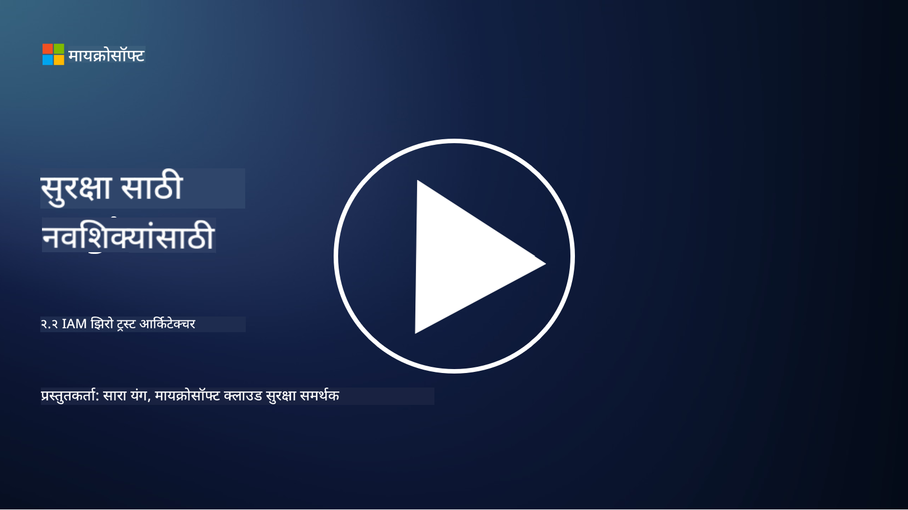

<!--
CO_OP_TRANSLATOR_METADATA:
{
  "original_hash": "4774a978af123f72ebb872199c4c4d4f",
  "translation_date": "2025-09-03T23:39:24+00:00",
  "source_file": "2.2 IAM zero trust architecture.md",
  "language_code": "mr"
}
-->
# IAM शून्य विश्वास आर्किटेक्चर

ओळख ही शून्य विश्वास आर्किटेक्चर लागू करण्यासाठी आणि कोणत्याही आयटी वातावरणासाठी परिघ तयार करण्यासाठी महत्त्वाचा भाग आहे. या विभागात आपण शून्य विश्वास लागू करण्यासाठी ओळख नियंत्रणांचा वापर का महत्त्वाचा आहे हे शोधू.

## परिचय

या धड्यात आपण कव्हर करू:

- आधुनिक आयटी वातावरणात ओळख परिघ म्हणून का वापरावी लागते?

- पारंपरिक आयटी आर्किटेक्चरपेक्षा हे कसे वेगळे आहे?

- शून्य विश्वास आर्किटेक्चर लागू करण्यासाठी ओळख कशी वापरली जाते?

## आधुनिक आयटी वातावरणात ओळख परिघ म्हणून का वापरावी लागते?

आधुनिक आयटी वातावरणात, सायबर धोके रोखण्यासाठी प्राथमिक संरक्षण म्हणून भौतिक परिघ (फायरवॉल्स आणि नेटवर्क सीमांसारखी साधने वापरणे) ही पारंपरिक संकल्पना तंत्रज्ञानाच्या वाढत्या गुंतागुंतीमुळे, दूरस्थ कामाच्या वाढत्या प्रमाणामुळे आणि क्लाउड सेवांच्या स्वीकारामुळे कमी प्रभावी होत आहे. त्याऐवजी, संस्थांनी ओळख नवीन परिघ म्हणून वापरण्याकडे वळवले आहे. याचा अर्थ सुरक्षा ही वापरकर्ते, उपकरणे आणि अनुप्रयोगांची ओळख सत्यापित करणे आणि व्यवस्थापित करणे याभोवती फिरते, त्यांच्या भौतिक स्थानाची पर्वा न करता.

आधुनिक आयटी वातावरणात ओळख परिघ म्हणून वापरणे का महत्त्वाचे आहे याची काही कारणे येथे दिली आहेत:

**दूरस्थ कर्मचारी**: दूरस्थ काम आणि मोबाइल उपकरणे सामान्य होत असल्याने, वापरकर्ते विविध ठिकाणांहून आणि उपकरणांवरून संसाधनांमध्ये प्रवेश करू शकतात. पारंपरिक परिघ दृष्टिकोन काम करत नाही जेव्हा वापरकर्ते भौतिक कार्यालयात मर्यादित नसतात.

**क्लाउड आणि हायब्रिड वातावरण**: संस्थांनी क्लाउड सेवा आणि हायब्रिड वातावरण स्वीकारणे वाढवले आहे. डेटा आणि अनुप्रयोग आता संस्थेच्या परिसरातच स्थित नाहीत, ज्यामुळे पारंपरिक परिघ संरक्षण कमी संबंधित ठरते.

**शून्य विश्वास सुरक्षा**: शून्य विश्वास सुरक्षा ही संकल्पना मानते की नेटवर्कच्या आत किंवा बाहेर असलेल्या कोणत्याही घटकावर आपोआप विश्वास ठेवला जाऊ नये. ओळख ही प्रवेश विनंत्या सत्यापित करण्यासाठी पाया बनते, त्या कुठूनही येत असल्या तरी.

**धोका परिदृश्य**: सायबर धोके विकसित होत आहेत आणि हल्लेखोर पारंपरिक परिघ संरक्षण टाळण्याचे मार्ग शोधत आहेत. फिशिंग, सोशल इंजिनिअरिंग आणि अंतर्गत धोके नेटवर्क परिघांवर हल्ला करण्याऐवजी मानवी कमकुवतपणाचा फायदा घेतात.

**डेटा-केंद्रित दृष्टिकोन**: संवेदनशील डेटा संरक्षित करणे अत्यंत महत्त्वाचे आहे. ओळख केंद्रित करून, संस्थांना कोणत्या डेटामध्ये कोण प्रवेश करतो हे नियंत्रित करता येते, डेटा उल्लंघनाचा धोका कमी होतो.

## पारंपरिक आयटी आर्किटेक्चरपेक्षा हे कसे वेगळे आहे?

पारंपरिक आयटी आर्किटेक्चर मुख्यतः परिघ-आधारित सुरक्षा मॉडेलवर अवलंबून होते, जिथे फायरवॉल्स आणि नेटवर्क सीमांनी धोके बाहेर ठेवण्यात महत्त्वाची भूमिका बजावली. पारंपरिक आणि ओळख-केंद्रित दृष्टिकोनांमधील मुख्य फरक खाली दिले आहेत:

|      पैलू                  |      पारंपरिक आयटी आर्किटेक्चर                                                                  |      ओळख-केंद्रित दृष्टिकोन                                                                             |
|-----------------------------|----------------------------------------------------------------------------------------------------|------------------------------------------------------------------------------------------------------------|
|     लक्ष                   |     परिघावर लक्ष केंद्रित: फायरवॉल्स आणि प्रवेश नियंत्रणासारख्या परिघ संरक्षणांवर अवलंबून.             |     ओळख सत्यापनावर लक्ष केंद्रित: नेटवर्क सीमांपासून वापरकर्ता/उपकरण ओळख सत्यापनाकडे वळवले.     |
|     स्थान                |     स्थानावर अवलंबून: सुरक्षा भौतिक कार्यालयाच्या स्थानांशी आणि नेटवर्क सीमांशी जोडलेली.    |     स्थान स्वातंत्र्य: सुरक्षा विशिष्ट स्थानांशी जोडलेली नाही; कुठूनही प्रवेश.                |
|     विश्वास गृहीत धरणे        |     गृहीत विश्वास: नेटवर्क परिघामध्ये वापरकर्ते/उपकरणांवर विश्वास ठेवला जातो.                 |     शून्य विश्वास दृष्टिकोन: विश्वास कधीही गृहीत धरला जात नाही; ओळख आणि संदर्भावर आधारित प्रवेश सत्यापित केला जातो.       |
|     उपकरण विचार    |     उपकरण विविधता: नेटवर्क परिघामध्ये उपकरणे सुरक्षित असल्याचे गृहीत धरले जाते.                  |     उपकरण जागरूकता: स्थानाची पर्वा न करता उपकरणांचे आरोग्य आणि सुरक्षा स्थिती विचारात घेतली जाते.               |
|     डेटा संरक्षण         |     डेटा संरक्षण: डेटा संरक्षणासाठी नेटवर्क परिघ सुरक्षित करण्यावर लक्ष केंद्रित.                 |     डेटा-केंद्रित संरक्षण: ओळख आणि डेटाच्या संवेदनशीलतेवर आधारित डेटा प्रवेश नियंत्रित करण्यावर लक्ष केंद्रित.    |
|                             |                                                                                                    |                                                                                                            |

## शून्य विश्वास आर्किटेक्चर लागू करण्यासाठी ओळख कशी वापरली जाते?

शून्य विश्वास आर्किटेक्चरमध्ये, मूलभूत तत्त्व म्हणजे नेटवर्क परिघाच्या आत किंवा बाहेर असलेल्या कोणत्याही घटकावर आपोआप विश्वास ठेवू नये. शून्य विश्वास दृष्टिकोन लागू करण्यासाठी ओळख महत्त्वाची भूमिका बजावते, कारण संसाधनांमध्ये प्रवेश करण्याचा प्रयत्न करणाऱ्या घटकांची सतत सत्यापन करण्याची परवानगी देते. आधुनिक ओळख सुरक्षा नियंत्रण प्रत्येक वापरकर्ता, उपकरण, अनुप्रयोग आणि सेवा जे संसाधनांमध्ये प्रवेश करण्याचा प्रयत्न करतात त्यांची ओळख आणि प्रमाणीकरण पूर्णपणे सत्यापित करण्याची आवश्यकता असते. यामध्ये वापरकर्त्याचे नाव/पासवर्ड संयोजन, मल्टी-फॅक्टर ऑथेंटिकेशन (MFA), बायोमेट्रिक्स आणि इतर मजबूत प्रमाणीकरण यंत्रणा यासारख्या पद्धतींनी त्यांची डिजिटल ओळख सत्यापित करणे समाविष्ट आहे.

## पुढील वाचन

- [Securing identity with Zero Trust | Microsoft Learn](https://learn.microsoft.com/security/zero-trust/deploy/identity?WT.mc_id=academic-96948-sayoung)
- [Zero Trust Principles and Guidance for Identity and Access | CSA (cloudsecurityalliance.org)](https://cloudsecurityalliance.org/artifacts/zero-trust-principles-and-guidance-for-iam/)
- [Zero Trust Identity Controls - Essentials Series - Episode 2 - YouTube](https://www.youtube.com/watch?v=fQZQznIKcGM&list=PLXtHYVsvn_b_gtX1-NB62wNervQx1Fhp4&index=13)

---

**अस्वीकरण**:  
हा दस्तऐवज AI भाषांतर सेवा [Co-op Translator](https://github.com/Azure/co-op-translator) चा वापर करून भाषांतरित करण्यात आला आहे. आम्ही अचूकतेसाठी प्रयत्नशील असलो तरी कृपया लक्षात ठेवा की स्वयंचलित भाषांतरे त्रुटी किंवा अचूकतेच्या अभावाने युक्त असू शकतात. मूळ भाषेतील दस्तऐवज हा अधिकृत स्रोत मानला जावा. महत्त्वाच्या माहितीसाठी व्यावसायिक मानवी भाषांतराची शिफारस केली जाते. या भाषांतराचा वापर करून निर्माण होणाऱ्या कोणत्याही गैरसमज किंवा चुकीच्या अर्थासाठी आम्ही जबाबदार राहणार नाही.