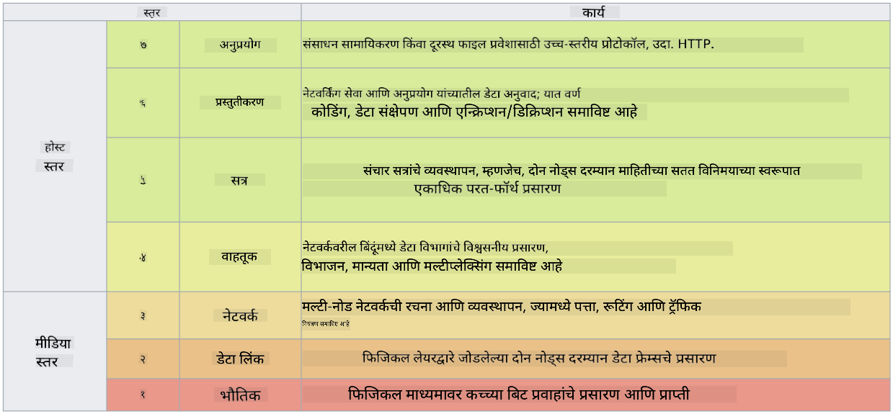

<!--
CO_OP_TRANSLATOR_METADATA:
{
  "original_hash": "252724eceeb183fb9018f88c5e1a3f0c",
  "translation_date": "2025-09-04T01:43:37+00:00",
  "source_file": "3.1 Networking key concepts.md",
  "language_code": "mr"
}
-->
# नेटवर्किंग महत्त्वाचे संकल्पना

जर तुम्ही आयटीमध्ये काही काम केले असेल, तर तुम्हाला नेटवर्किंग संकल्पनांचा परिचय असण्याची शक्यता आहे. आधुनिक वातावरणात ओळख ही प्राथमिक परिमिती नियंत्रण म्हणून वापरली जात असली तरी, याचा अर्थ नेटवर्क नियंत्रण अनावश्यक आहे असे नाही. हा एक मोठा विषय असला तरी, या धड्यात आपण काही महत्त्वाच्या नेटवर्किंग संकल्पना कव्हर करू.

या धड्यात आपण कव्हर करू:

- IP अ‍ॅड्रेसिंग म्हणजे काय?

- OSI मॉडेल म्हणजे काय?

- TCP/UDP म्हणजे काय?

- पोर्ट नंबर म्हणजे काय?

- विश्रांती आणि ट्रान्झिटमध्ये एन्क्रिप्शन म्हणजे काय?

## IP अ‍ॅड्रेसिंग म्हणजे काय?

IP अ‍ॅड्रेसिंग, किंवा इंटरनेट प्रोटोकॉल अ‍ॅड्रेसिंग, हे संगणक नेटवर्कशी जोडलेल्या प्रत्येक उपकरणाला दिलेले संख्यात्मक लेबल आहे जे इंटरनेट प्रोटोकॉलचा वापर करून संवाद साधते. हे नेटवर्कमधील उपकरणांसाठी एक अद्वितीय ओळख म्हणून कार्य करते, ज्यामुळे त्यांना इंटरनेट किंवा इतर परस्पर जोडलेल्या नेटवर्कवर डेटा पाठवणे आणि प्राप्त करणे शक्य होते. IP अ‍ॅड्रेसिंगच्या दोन मुख्य आवृत्त्या आहेत: IPv4 (इंटरनेट प्रोटोकॉल आवृत्ती 4) आणि IPv6 (इंटरनेट प्रोटोकॉल आवृत्ती 6). IP अ‍ॅड्रेस सामान्यतः IPv4 स्वरूपात (उदा., 192.168.1.1) किंवा IPv6 स्वरूपात (उदा., 2001:0db8:85a3:0000:0000:8a2e:0370:7334) दर्शविला जातो.

## OSI मॉडेल म्हणजे काय?

OSI (ओपन सिस्टिम्स इंटरकनेक्शन) मॉडेल हे एक संकल्पनात्मक फ्रेमवर्क आहे जे संप्रेषण प्रणालीच्या कार्यांना सात वेगळ्या स्तरांमध्ये मानकीकृत करते. प्रत्येक स्तर विशिष्ट कार्ये पार पाडतो आणि उपकरणांमधील कार्यक्षम आणि विश्वासार्ह डेटा संप्रेषण सुनिश्चित करण्यासाठी शेजारील स्तरांशी संवाद साधतो. स्तर खालीलप्रमाणे आहेत:

1. फिजिकल लेयर

2. डेटा लिंक लेयर

3. नेटवर्क लेयर

4. ट्रान्सपोर्ट लेयर

5. सेशन लेयर

6. प्रेझेंटेशन लेयर

7. अ‍ॅप्लिकेशन लेयर

OSI मॉडेल नेटवर्किंग प्रोटोकॉल आणि तंत्रज्ञान कसे संवाद साधतात हे समजून घेण्यासाठी एक सामान्य संदर्भ प्रदान करते, विशिष्ट हार्डवेअर किंवा सॉफ्टवेअर अंमलबजावणीच्या बाबतीत.

_ref: https://en.wikipedia.org/wiki/OSI_model_

## TCP/UDP म्हणजे काय?

TCP (ट्रान्समिशन कंट्रोल प्रोटोकॉल) आणि UDP (यूजर डेटाग्राम प्रोटोकॉल) हे संगणक नेटवर्कमध्ये उपकरणांमधील संवाद सुलभ करण्यासाठी वापरले जाणारे दोन मूलभूत ट्रान्सपोर्ट लेयर प्रोटोकॉल आहेत. ते डेटा पॅकेट्समध्ये विभागून पाठवतात आणि प्राप्त झाल्यावर मूळ डेटा पुन्हा एकत्र करतात. तथापि, त्यांचे वैशिष्ट्ये आणि उपयोग प्रकरणांमध्ये फरक आहे.

**TCP (ट्रान्समिशन कंट्रोल प्रोटोकॉल)**:

TCP हा एक कनेक्शन-ओरिएंटेड प्रोटोकॉल आहे जो उपकरणांमधील डेटा विश्वासार्ह आणि क्रमबद्ध वितरण प्रदान करतो. डेटा एक्सचेंज सुरू होण्यापूर्वी TCP पाठवणारा आणि प्राप्त करणारा यांच्यात कनेक्शन स्थापित करतो. TCP सुनिश्चित करते की डेटा पॅकेट्स योग्य क्रमाने पोहोचतात आणि डेटा अखंडता आणि पूर्णता सुनिश्चित करण्यासाठी हरवलेले पॅकेट्स पुन्हा पाठवू शकतो. हे वेब ब्राउझिंग, ईमेल, फाइल ट्रान्सफर (FTP) आणि डेटाबेस संप्रेषण यासारख्या विश्वासार्ह डेटा वितरण आवश्यक असलेल्या अनुप्रयोगांसाठी योग्य बनवते.

**UDP (यूजर डेटाग्राम प्रोटोकॉल)**:

UDP हा एक कनेक्शनलेस प्रोटोकॉल आहे जो जलद डेटा ट्रान्समिशन ऑफर करतो परंतु TCP सारखा विश्वासार्हता प्रदान करत नाही. डेटा पाठवण्यापूर्वी औपचारिक कनेक्शन स्थापित करत नाही आणि हरवलेल्या पॅकेट्ससाठी मान्यता किंवा पुन्हा पाठवण्याचे यंत्रणा समाविष्ट करत नाही. UDP रिअल-टाइम संप्रेषण, स्ट्रीमिंग मीडिया, ऑनलाइन गेमिंग आणि DNS क्वेरी यासारख्या अनुप्रयोगांसाठी योग्य आहे जिथे गती आणि कार्यक्षमता विश्वासार्ह वितरणापेक्षा अधिक महत्त्वाची आहे.

थोडक्यात, TCP विश्वासार्हता आणि क्रमबद्ध वितरणाला प्राधान्य देते, ज्यामुळे डेटा अचूकता आवश्यक असलेल्या अनुप्रयोगांसाठी ते योग्य बनते, तर UDP गती आणि कार्यक्षमतेवर भर देते, ज्यामुळे कमी विलंबाच्या बदल्यात किरकोळ डेटा नुकसान किंवा क्रम बदल स्वीकार्य असलेल्या अनुप्रयोगांसाठी ते योग्य बनते. TCP आणि UDP यामधील निवड संबंधित अनुप्रयोग किंवा सेवेसाठी विशिष्ट आवश्यकता यावर अवलंबून असते.

## पोर्ट नंबर म्हणजे काय?

नेटवर्किंगमध्ये, पोर्ट नंबर हा एक संख्यात्मक ओळखकर्ता आहे जो नेटवर्कमधील एका उपकरणावर चालणाऱ्या वेगवेगळ्या सेवा किंवा अनुप्रयोगांमध्ये फरक करण्यासाठी वापरला जातो. पोर्ट्स येणारा डेटा योग्य अनुप्रयोगाकडे मार्गक्रमित करण्यात मदत करतात. पोर्ट नंबर 16-बिट अनसाइनड पूर्णांक असतात, म्हणजे त्यांची श्रेणी 0 ते 65535 पर्यंत असते. ते तीन श्रेणींमध्ये विभागले जातात:

- वेल-नोन पोर्ट्स (0-1023): HTTP (पोर्ट 80) आणि FTP (पोर्ट 21) यासारख्या मानक सेवांसाठी राखीव.

- रजिस्टरड पोर्ट्स (1024-49151): अशा अनुप्रयोगांसाठी वापरले जातात जे वेल-नोन श्रेणीचा भाग नाहीत परंतु अधिकृतपणे नोंदणीकृत आहेत.

- डायनॅमिक/प्रायव्हेट पोर्ट्स (49152-65535): अनुप्रयोगांद्वारे तात्पुरत्या किंवा खाजगी वापरासाठी उपलब्ध.

## विश्रांती आणि ट्रान्झिटमध्ये एन्क्रिप्शन म्हणजे काय?

एन्क्रिप्शन हा डेटा अनधिकृत प्रवेश किंवा फेरफारपासून संरक्षण करण्यासाठी सुरक्षित स्वरूपात रूपांतरित करण्याचा प्रक्रिया आहे. एन्क्रिप्शन "विश्रांती" (जेव्हा उपकरण किंवा सर्व्हरवर संग्रहित केले जाते) आणि "ट्रान्झिट" (जेव्हा उपकरणांमध्ये किंवा नेटवर्कवर प्रसारित केले जाते) या दोन्ही प्रकारांमध्ये लागू केला जाऊ शकतो.

विश्रांतीतील एन्क्रिप्शन: यामध्ये उपकरणे, सर्व्हर किंवा स्टोरेज सिस्टमवर संग्रहित डेटा एन्क्रिप्ट करणे समाविष्ट आहे. जर हल्लेखोरांना स्टोरेज मीडियावर भौतिक प्रवेश मिळाला तरी, एन्क्रिप्शन कीशिवाय ते डेटा प्रवेश करू शकत नाहीत. उपकरण चोरी, डेटा उल्लंघन किंवा अनधिकृत प्रवेशाच्या बाबतीत संवेदनशील डेटा सुरक्षित ठेवण्यासाठी हे महत्त्वाचे आहे.

ट्रान्झिटमधील एन्क्रिप्शन: यामध्ये उपकरणांमध्ये किंवा नेटवर्कवर डेटा प्रवास करत असताना एन्क्रिप्ट करणे समाविष्ट आहे. यामुळे डेटा प्रसारणादरम्यान ईव्सड्रॉपिंग आणि अनधिकृत हस्तक्षेप टाळता येतो. ट्रान्झिटमधील एन्क्रिप्शनसाठी सामान्य प्रोटोकॉलमध्ये वेब संप्रेषणासाठी HTTPS आणि विविध प्रकारच्या नेटवर्क ट्रॅफिक सुरक्षित करण्यासाठी TLS/SSL समाविष्ट आहे.

## अधिक वाचन
- [IP अ‍ॅड्रेस कसे कार्य करतात? (howtogeek.com)](https://www.howtogeek.com/341307/how-do-ip-addresses-work/)
- [IP अ‍ॅड्रेस समजून घेणे: एक परिचयात्मक मार्गदर्शक (geekflare.com)](https://geekflare.com/understanding-ip-address/)
- [OSI मॉडेल म्हणजे काय? OSI चे 7 स्तर स्पष्ट केले (techtarget.com)](https://www.techtarget.com/searchnetworking/definition/OSI)
- [OSI मॉडेल – नेटवर्किंगचे 7 स्तर सोप्या भाषेत स्पष्ट केले (freecodecamp.org)](https://www.freecodecamp.org/news/osi-model-networking-layers-explained-in-plain-english/)
- [TCP/IP प्रोटोकॉल - IBM दस्तऐवज](https://www.ibm.com/docs/en/aix/7.3?topic=protocol-tcpip-protocols)
- [सामान्य पोर्ट्स चीट शीट: अंतिम पोर्ट्स आणि प्रोटोकॉल यादी (stationx.net)](https://www.stationx.net/common-ports-cheat-sheet/)
- [Azure डेटा एन्क्रिप्शन-विश्रांती - Azure सुरक्षा | Microsoft Learn](https://learn.microsoft.com/azure/security/fundamentals/encryption-atrest?WT.mc_id=academic-96948-sayoung)

---

**अस्वीकरण**:  
हा दस्तऐवज AI भाषांतर सेवा [Co-op Translator](https://github.com/Azure/co-op-translator) चा वापर करून भाषांतरित करण्यात आला आहे. आम्ही अचूकतेसाठी प्रयत्नशील असलो तरी, कृपया लक्षात घ्या की स्वयंचलित भाषांतरांमध्ये त्रुटी किंवा अचूकतेचा अभाव असू शकतो. मूळ भाषेतील दस्तऐवज हा अधिकृत स्रोत मानला जावा. महत्त्वाच्या माहितीसाठी व्यावसायिक मानवी भाषांतराची शिफारस केली जाते. या भाषांतराचा वापर करून उद्भवलेल्या कोणत्याही गैरसमज किंवा चुकीच्या अर्थासाठी आम्ही जबाबदार राहणार नाही.