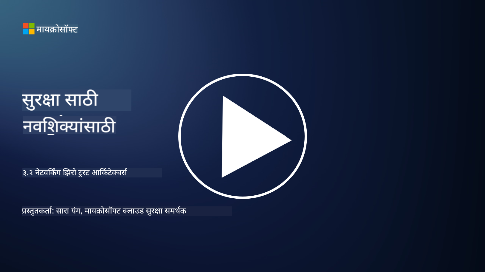

<!--
CO_OP_TRANSLATOR_METADATA:
{
  "original_hash": "680d6e14d9d33fc471c22f44679713f8",
  "translation_date": "2025-09-04T00:36:14+00:00",
  "source_file": "3.2 Networking zero trust architecture.md",
  "language_code": "mr"
}
-->
# नेटवर्किंग झिरो ट्रस्ट आर्किटेक्चर

नेटवर्क झिरो ट्रस्ट नियंत्रणामध्ये महत्त्वाची भूमिका बजावते. या धड्यात आपण याबद्दल अधिक जाणून घेणार आहोत:

- नेटवर्क सेगमेंटेशन म्हणजे काय?  
- नेटवर्क सेगमेंटेशन झिरो ट्रस्ट अंमलबजावणीसाठी कसे मदत करते?  
- एंड-टू-एंड एन्क्रिप्शन म्हणजे काय?  

## नेटवर्क सेगमेंटेशन म्हणजे काय?

नेटवर्क सेगमेंटेशन म्हणजे नेटवर्कला लहान, वेगळ्या विभागांमध्ये किंवा सबनेटवर्कमध्ये विभागण्याची पद्धत. प्रत्येक विभाग इतरांपासून वेगळा असतो आणि विभागांमधील प्रवेश विशिष्ट सुरक्षा धोरणांनुसार नियंत्रित आणि मर्यादित केला जातो. नेटवर्क सेगमेंटेशनचा उपयोग सुरक्षा सुधारण्यासाठी केला जातो, ज्यामुळे संभाव्य उल्लंघनांचा प्रभाव मर्यादित होतो आणि नेटवर्कमध्ये हल्लेखोरांच्या हालचालींना प्रतिबंध होतो.

नेटवर्क सेगमेंटेशन अंमलात आणून, संस्थेला वेगवेगळ्या प्रकारच्या वापरकर्त्यांना, अनुप्रयोगांना आणि डेटाला वेगळे करणारे "झोन" तयार करता येतात. यामुळे हल्ल्याचा पृष्ठभाग कमी होतो आणि सुरक्षा घटनेमुळे होणारे संभाव्य नुकसान कमी होते. नेटवर्क सेगमेंटेशन व्हर्च्युअल LANs (VLANs), फायरवॉल्स आणि प्रवेश नियंत्रण तंत्रज्ञानाद्वारे साध्य करता येते.

## नेटवर्क सेगमेंटेशन झिरो ट्रस्ट अंमलबजावणीसाठी कसे मदत करते?

नेटवर्क सेगमेंटेशन झिरो ट्रस्ट मॉडेलच्या तत्त्वांशी जवळून जुळते. झिरो ट्रस्ट आर्किटेक्चरमध्ये, नेटवर्क सेगमेंटेशन "किमान विशेषाधिकार" तत्त्व अंमलात आणण्यास मदत करते, ज्यामुळे वापरकर्ते आणि उपकरणांना त्यांच्या कार्यांसाठी आवश्यक असलेल्या विशिष्ट संसाधनांपर्यंतच प्रवेश मिळतो. नेटवर्कला लहान झोनमध्ये विभागून, संस्थांना कठोर प्रवेश नियंत्रण अंमलात आणता येते, महत्त्वाच्या संसाधनांना वेगळे करता येते आणि हल्लेखोरांच्या हालचालींना प्रतिबंध करता येतो.

नेटवर्क सेगमेंटेशन ओळख-आधारित प्रवेश नियंत्रण अंमलात आणण्यास देखील मदत करते, जिथे वापरकर्ते आणि उपकरणे विशिष्ट विभागांमध्ये प्रवेश करण्यापूर्वी पूर्णपणे प्रमाणीकरण आणि अधिकृत केली जातात. यामुळे संवेदनशील संसाधनांमध्ये अनधिकृत प्रवेश रोखला जातो आणि तडजोड झालेल्या क्रेडेन्शियल्सचा संभाव्य प्रभाव कमी होतो.

## एंड-टू-एंड एन्क्रिप्शन म्हणजे काय?

एंड-टू-एंड (E2E) एन्क्रिप्शन ही एक सुरक्षा पद्धत आहे जी डेटा पाठवणाऱ्यापासून प्राप्तकर्त्यापर्यंतच्या संपूर्ण प्रवासादरम्यान एन्क्रिप्टेड राहते याची खात्री करते. या प्रक्रियेत, डेटा पाठवणाऱ्याच्या बाजूने एन्क्रिप्ट केला जातो आणि फक्त प्राप्तकर्त्याकडे डेटा डिक्रिप्ट करण्यासाठी आवश्यक असलेली की असते. एन्क्रिप्शन आणि डिक्रिप्शन प्रक्रिया एंडपॉइंट्सवर होते, ज्यामुळे अनधिकृत पक्षांना, सेवा प्रदात्यांसह, डेटा वाचणे अत्यंत कठीण होते.

E2E एन्क्रिप्शन डेटा ट्रान्समिशनसाठी उच्च स्तराची गोपनीयता आणि सुरक्षा प्रदान करते, जरी डेटा विविध मध्यस्थ प्रणाली किंवा नेटवर्कमधून जात असला तरी. संवेदनशील माहिती इंटरसेप्शन आणि अनधिकृत प्रवेशापासून संरक्षित करण्यासाठी हे सुरक्षित मेसेजिंग अॅप्स, ईमेल सेवा आणि इतर कम्युनिकेशन प्लॅटफॉर्ममध्ये सामान्यतः वापरले जाते.

ही एन्क्रिप्शन पद्धत सुनिश्चित करते की हल्लेखोरांनी डेटा ट्रान्सिटमध्ये प्रवेश मिळवला तरी, त्यांना फक्त एन्क्रिप्टेड सामग्री दिसेल जी डिक्रिप्शन कीशिवाय अर्थहीन आहे. एंड-टू-एंड एन्क्रिप्शन वापरकर्त्याच्या गोपनीयतेचे रक्षण करण्यासाठी आणि संवेदनशील माहिती अनधिकृत पक्षांकडून उघड होण्यापासून संरक्षित करण्यासाठी महत्त्वाची भूमिका बजावते.

## SASE म्हणजे काय?

SASE म्हणजे "Secure Access Service Edge," आणि ही एक सायबर सुरक्षा फ्रेमवर्क आणि आर्किटेक्चर आहे जी नेटवर्क सुरक्षा आणि वाइड-एरिया नेटवर्किंग (WAN) क्षमता एका क्लाउड-आधारित सेवेमध्ये एकत्रित करते. SASE रिमोट आणि मोबाइल वापरकर्त्यांसाठी नेटवर्क संसाधने, अनुप्रयोग आणि डेटामध्ये सुरक्षित आणि स्केलेबल प्रवेश प्रदान करण्यासाठी डिझाइन केले आहे, तसेच नेटवर्क व्यवस्थापन सुलभ करते आणि पारंपरिक नेटवर्क आणि सुरक्षा आर्किटेक्चरची गुंतागुंत कमी करते.

SASE ची प्रमुख वैशिष्ट्ये आणि घटक:

1. **क्लाउड-आधारित:** SASE क्लाउड सेवा म्हणून दिले जाते, म्हणजे सुरक्षा आणि नेटवर्किंग कार्ये पारंपरिक ऑन-प्रिमाइसेस हार्डवेअर आणि उपकरणांवर अवलंबून न राहता क्लाउडमधून प्रदान केली जातात.  
   
2. **सुरक्षा आणि नेटवर्किंगचे एकत्रीकरण:** SASE विविध सुरक्षा सेवा जसे की Secure Web Gateways (SWG), Firewall as a Service (FWaaS), Data Loss Prevention (DLP), Zero-Trust Network Access (ZTNA), आणि WAN ऑप्टिमायझेशन वाइड-एरिया नेटवर्किंग क्षमतांसह एकत्रित करते. या एकत्रीकरणामुळे सुरक्षा आणि नेटवर्किंग ऑपरेशन्स सुलभ होतात.  

3. **झिरो ट्रस्ट:** SASE झिरो ट्रस्ट तत्त्वावर कार्य करते, ज्याचा अर्थ कठोर प्रवेश नियंत्रण आणि किमान विशेषाधिकार प्रवेश धोरण अंमलात आणणे. वापरकर्ते आणि उपकरणे डिफॉल्टने विश्वासार्ह नसतात आणि संसाधनांमध्ये प्रवेश करण्यापूर्वी त्यांचे प्रमाणीकरण आणि अधिकृतता आवश्यक असते.  

4. **ओळख-केंद्रित:** SASE वापरकर्ता आणि उपकरण ओळखींवर आधारित प्रवेश नियंत्रणावर लक्ष केंद्रित करते. ओळख आणि संदर्भ-आधारित धोरणे प्रवेश परवानग्या ठरवण्यासाठी वापरली जातात आणि ही धोरणे वापरकर्त्याच्या वर्तन आणि संदर्भावर आधारित गतिशीलपणे बदलतात.  

5. **स्केलेबिलिटी आणि लवचिकता:** SASE मोठ्या संख्येने वापरकर्ते आणि उपकरणे सामावून घेण्यासाठी सहजपणे स्केल करू शकते, ज्यामुळे विविध आणि विकसित होणाऱ्या नेटवर्किंग आणि सुरक्षा गरजा असलेल्या संस्थांसाठी ते उपयुक्त ठरते.  

SASE आधुनिक काळातील रिमोट काम आणि क्लाउड स्वीकारण्याच्या युगात विशेषतः महत्त्वाचे आहे, कारण ते नेटवर्क प्रवेश सुरक्षित आणि व्यवस्थापित करण्यासाठी व्यापक आणि लवचिक दृष्टिकोन प्रदान करते. हे वापरकर्ता-केंद्रित आणि झिरो ट्रस्ट सुरक्षा मॉडेलवर मजबूत लक्ष केंद्रित करताना बदलत्या सुरक्षा आणि नेटवर्किंग गरजांशी जुळवून घेण्यास संस्थांना मदत करते.

## अधिक वाचन

- [What Is Network Segmentation? - Cisco](https://www.cisco.com/c/en/us/products/security/what-is-network-segmentation.html#~benefits)  
- [What Is Micro-Segmentation? - Cisco](https://www.cisco.com/c/en/us/products/security/what-is-microsegmentation.html)  
- [Implementing Network Segmentation and Segregation | Cyber.gov.au](https://www.cyber.gov.au/resources-business-and-government/maintaining-devices-and-systems/system-hardening-and-administration/network-hardening/implementing-network-segmentation-and-segregation)  
- [What Is Network Segmentation and Why It Matters | CompTIA](https://www.comptia.org/blog/security-awareness-training-network-segmentation)  
- [Network Segmentation: Concepts and Practices (cmu.edu)](https://insights.sei.cmu.edu/blog/network-segmentation-concepts-and-practices/)  
- [Secure networks with Zero Trust | Microsoft Learn](https://learn.microsoft.com/security/zero-trust/deploy/networks?WT.mc_id=academic-96948-sayoung)  
- [What is end-to-end encryption? | IBM](https://www.ibm.com/topics/end-to-end-encryption)  
- [What Is End-to-End Encryption, and Why Does It Matter? (howtogeek.com)](https://www.howtogeek.com/711656/what-is-end-to-end-encryption-and-why-does-it-matter/)  
- [Definition of Secure Access Service Edge (SASE) - Gartner Information Technology Glossary](https://www.gartner.com/en/information-technology/glossary/secure-access-service-edge-sase)  
- [What Is Secure Access Service Edge (SASE)? | Microsoft Security](https://www.microsoft.com/security/business/security-101/what-is-sase?WT.mc_id=academic-96948-sayoung)  

---

**अस्वीकरण**:  
हा दस्तऐवज AI भाषांतर सेवा [Co-op Translator](https://github.com/Azure/co-op-translator) चा वापर करून भाषांतरित करण्यात आला आहे. आम्ही अचूकतेसाठी प्रयत्नशील असलो तरी, कृपया लक्षात घ्या की स्वयंचलित भाषांतरांमध्ये त्रुटी किंवा अचूकतेचा अभाव असू शकतो. मूळ भाषेतील मूळ दस्तऐवज हा अधिकृत स्रोत मानला जावा. महत्त्वाच्या माहितीसाठी व्यावसायिक मानवी भाषांतराची शिफारस केली जाते. या भाषांतराचा वापर केल्यामुळे उद्भवणाऱ्या कोणत्याही गैरसमज किंवा चुकीच्या अर्थासाठी आम्ही जबाबदार राहणार नाही.