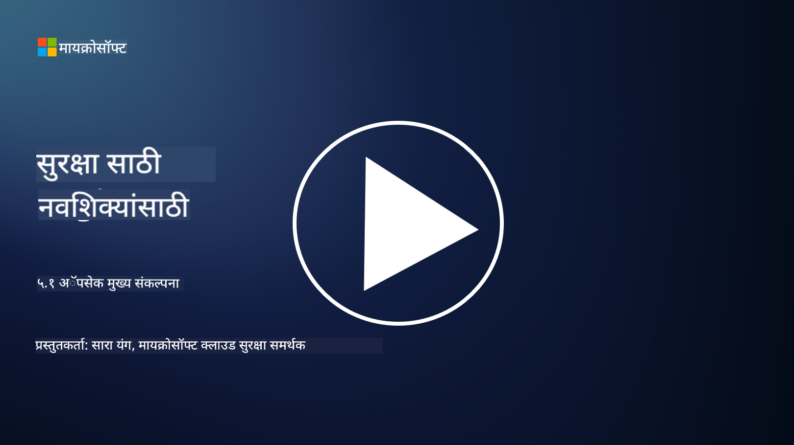

<!--
CO_OP_TRANSLATOR_METADATA:
{
  "original_hash": "e4b56bb23078d3ffb7ad407d280b0c36",
  "translation_date": "2025-09-04T00:30:48+00:00",
  "source_file": "5.1 AppSec key concepts.md",
  "language_code": "mr"
}
-->
# AppSec मुख्य संकल्पना

अॅप्लिकेशन सुरक्षा ही स्वतःची एक स्वतंत्र सुरक्षा शाखा आहे. या कोर्सच्या या भागात आपण अॅप्लिकेशन सुरक्षेबद्दल अधिक जाणून घेणार आहोत.

## परिचय

या धड्यात आपण कव्हर करू:

- अॅप्लिकेशन सुरक्षा म्हणजे काय?

- अॅप्लिकेशन सुरक्षेच्या मुख्य संकल्पना/तत्त्वे कोणती आहेत?

## अॅप्लिकेशन सुरक्षा म्हणजे काय?

अॅप्लिकेशन सुरक्षा, ज्याला "AppSec" असे संक्षेपाने म्हणतात, याचा अर्थ सॉफ्टवेअर अॅप्लिकेशन्सना सुरक्षा धोके, असुरक्षितता आणि हल्ल्यांपासून संरक्षित करण्याच्या पद्धतींशी संबंधित आहे. यात अॅप्लिकेशनच्या विकास, तैनाती आणि देखभाल जीवनचक्रादरम्यान सुरक्षा जोखीम ओळखणे, कमी करणे आणि टाळण्यासाठी वापरल्या जाणाऱ्या प्रक्रिया, तंत्र आणि साधनांचा समावेश होतो.

अॅप्लिकेशन सुरक्षा महत्त्वाची आहे कारण अॅप्लिकेशन्स हे सायबरहल्ल्यांचे सामान्य लक्ष्य असतात. दुर्भावनायुक्त हल्लेखोर सॉफ्टवेअरमधील असुरक्षितता आणि कमकुवतपणा वापरून अनधिकृत प्रवेश मिळवतात, डेटा चोरतात, सेवा विस्कळीत करतात किंवा इतर दुर्भावनायुक्त क्रियाकलाप करतात. प्रभावी अॅप्लिकेशन सुरक्षा अॅप्लिकेशन आणि त्याशी संबंधित डेटाची गोपनीयता, अखंडता आणि उपलब्धता सुनिश्चित करण्यात मदत करते.

## अॅप्लिकेशन सुरक्षेच्या मुख्य संकल्पना/तत्त्वे कोणती आहेत?

अॅप्लिकेशन सुरक्षेच्या मूलभूत संकल्पना आणि तत्त्वांमध्ये खालील गोष्टींचा समावेश होतो:

1. **डिझाइनद्वारे सुरक्षितता**:

- सुरक्षेचा समावेश अॅप्लिकेशनच्या डिझाइन आणि आर्किटेक्चरमध्ये सुरुवातीपासूनच केला पाहिजे, नंतर विचार केला जाऊ नये.

2. **इनपुट व्हॅलिडेशन**:

- सर्व वापरकर्त्याच्या इनपुट्सची पडताळणी केली पाहिजे, जेणेकरून ते अपेक्षित स्वरूपात असतील आणि त्यात कोणताही दुर्भावनायुक्त कोड किंवा डेटा नसेल.

3. **आउटपुट एन्कोडिंग**:

- क्लायंटला पाठवलेला डेटा योग्य प्रकारे एन्कोड केला पाहिजे, जेणेकरून क्रॉस-साइट स्क्रिप्टिंग (XSS) सारख्या असुरक्षितता टाळता येतील.

4. **प्रमाणीकरण आणि अधिकृतता**:

- वापरकर्त्यांचे प्रमाणीकरण करा आणि त्यांच्या भूमिकांनुसार आणि परवानग्यांनुसार संसाधनांवर प्रवेश अधिकृत करा.

5. **डेटा संरक्षण**:

- संवेदनशील डेटा साठवताना, प्रसारित करताना आणि प्रक्रिया करताना एन्क्रिप्ट केला पाहिजे, जेणेकरून अनधिकृत प्रवेश टाळता येईल.

6. **सेशन व्यवस्थापन**:

- सुरक्षित सेशन व्यवस्थापन वापरकर्त्याच्या सेशन्सना हायजॅकिंग आणि अनधिकृत प्रवेशापासून संरक्षित करते.

7. **सुरक्षित डिपेंडन्सीज**:

- सर्व सॉफ्टवेअर डिपेंडन्सीज सुरक्षा पॅचेससह अद्ययावत ठेवा, जेणेकरून असुरक्षितता टाळता येईल.

8. **त्रुटी हाताळणी आणि लॉगिंग**:

- संवेदनशील माहिती उघड होऊ नये यासाठी सुरक्षित त्रुटी हाताळणी अंमलात आणा आणि सुरक्षित लॉगिंग पद्धती सुनिश्चित करा.

9. **सुरक्षा चाचणी**:

- पेनिट्रेशन टेस्टिंग, कोड रिव्ह्यू आणि ऑटोमेटेड स्कॅनिंग टूल्ससारख्या पद्धती वापरून अॅप्लिकेशन्सची नियमितपणे असुरक्षिततेसाठी चाचणी करा.

10. **सुरक्षित सॉफ्टवेअर विकास जीवनचक्र (SDLC)**:

- सॉफ्टवेअर विकास जीवनचक्राच्या प्रत्येक टप्प्यात, आवश्यकता ते तैनाती आणि देखभालपर्यंत, सुरक्षा पद्धतींचा समावेश करा.

## अधिक वाचन

- [SheHacksPurple: What is Application Security? - YouTube](https://www.youtube.com/watch?v=eNmccQNzSSY)
- [What Is Application Security? - Cisco](https://www.cisco.com/c/en/us/solutions/security/application-first-security/what-is-application-security.html#~how-does-it-work)
- [What is application security? A process and tools for securing software | CSO Online](https://www.csoonline.com/article/566471/what-is-application-security-a-process-and-tools-for-securing-software.html)
- [OWASP Cheat Sheet Series | OWASP Foundation](https://owasp.org/www-project-cheat-sheets/)

---

**अस्वीकरण**:  
हा दस्तऐवज AI भाषांतर सेवा [Co-op Translator](https://github.com/Azure/co-op-translator) वापरून भाषांतरित करण्यात आला आहे. आम्ही अचूकतेसाठी प्रयत्नशील असलो तरी कृपया लक्षात ठेवा की स्वयंचलित भाषांतरांमध्ये त्रुटी किंवा अचूकतेचा अभाव असू शकतो. मूळ भाषेतील दस्तऐवज हा अधिकृत स्रोत मानला जावा. महत्त्वाच्या माहितीसाठी व्यावसायिक मानवी भाषांतराची शिफारस केली जाते. या भाषांतराचा वापर करून निर्माण होणाऱ्या कोणत्याही गैरसमज किंवा चुकीच्या अर्थासाठी आम्ही जबाबदार राहणार नाही.