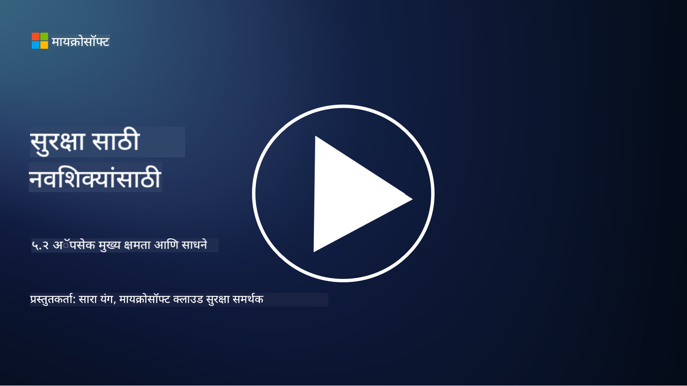

<!--
CO_OP_TRANSLATOR_METADATA:
{
  "original_hash": "790a3fa7e535ec60bb51bde13e759781",
  "translation_date": "2025-09-04T00:49:08+00:00",
  "source_file": "5.2 AppSec key capabilities.md",
  "language_code": "mr"
}
-->
## परिचय

या धड्यात, आम्ही अॅप्लिकेशन सुरक्षा क्षेत्रात वापरल्या जाणाऱ्या मुख्य क्षमता आणि साधनांबद्दल चर्चा करू.

## अॅपसेकच्या मुख्य क्षमता आणि साधने

अॅप्लिकेशन सुरक्षा क्षेत्रात वापरल्या जाणाऱ्या मुख्य क्षमता आणि साधने सॉफ्टवेअर अॅप्लिकेशन्समधील सुरक्षा त्रुटी आणि धोके ओळखण्यासाठी, कमी करण्यासाठी आणि टाळण्यासाठी अत्यावश्यक आहेत. खाली काही महत्त्वाच्या साधनांची यादी दिली आहे:

**1. स्थिर अॅप्लिकेशन सुरक्षा चाचणी (SAST)**:

- **क्षमता**: अॅप्लिकेशनच्या कोडबेसमधील सुरक्षा त्रुटी ओळखण्यासाठी स्रोत कोड, बाइटकोड किंवा बायनरी कोडचे विश्लेषण करते.

- **साधने**: उदाहरणे - Fortify, Checkmarx, आणि Veracode.

**2. डायनॅमिक अॅप्लिकेशन सुरक्षा चाचणी (DAST)**:

- **क्षमता**: चालू असलेल्या अॅप्लिकेशनवर स्कॅन करून इनपुट विनंत्या पाठवून आणि प्रतिसादांचे विश्लेषण करून त्रुटी ओळखते.

- **साधने**: उदाहरणे - ZAP, Burp Suite, आणि Qualys Web Application Scanning.

**3. इंटरॅक्टिव्ह अॅप्लिकेशन सुरक्षा चाचणी (IAST)**:

- **क्षमता**: SAST आणि DAST च्या घटकांना एकत्र करून रनटाइम दरम्यान कोडचे विश्लेषण करते, अधिक अचूक परिणाम देते आणि चुकीच्या सकारात्मक निष्कर्ष कमी करते.

- **साधने**: उदाहरणे - Contrast Security आणि HCL AppScan.

**4. रनटाइम अॅप्लिकेशन सेल्फ-प्रोटेक्शन (RASP)**:

- **क्षमता**: अॅप्लिकेशन्सचे रिअल-टाइममध्ये निरीक्षण आणि संरक्षण करते, धोके ओळखते आणि त्यावर त्वरित प्रतिसाद देते.

- **साधने**: उदाहरणे - Veracode Runtime Protection आणि F5 Advanced WAF with RASP.

**5. वेब अॅप्लिकेशन फायरवॉल्स (WAFs)**:

- **क्षमता**: अॅप्लिकेशन आणि इंटरनेट यांच्यात संरक्षणात्मक स्तर प्रदान करते, येणारी ट्रॅफिक फिल्टर करते आणि धोकादायक विनंत्या ब्लॉक करते.

- **साधने**: उदाहरणे - ModSecurity, AWS WAF, आणि Akamai Kona Site Defender.

**6. डिपेंडन्सी स्कॅनिंग**:

- **क्षमता**: अॅप्लिकेशनमध्ये वापरल्या जाणाऱ्या तृतीय-पक्षाच्या लायब्ररी आणि घटकांमधील त्रुटी ओळखते.

- **साधने**: उदाहरणे - OWASP Dependency-Check आणि Snyk.

**7. पेनेट्रेशन टेस्टिंग (Pen Testing)**:

- **क्षमता**: वास्तविक हल्ल्यांचे अनुकरण करून त्रुटी शोधते आणि अॅप्लिकेशनची सुरक्षा तपासते.

- **साधने**: प्रमाणित एथिकल हॅकर्स आणि सुरक्षा व्यावसायिक विविध साधनांचा वापर करून हे करतात, जसे Metasploit आणि Nmap.

**8. सुरक्षा स्कॅनिंग आणि विश्लेषण**:

- **क्षमता**: ज्ञात त्रुटी, कॉन्फिगरेशन चुका आणि सुरक्षा चुकीच्या सेटिंग्जसाठी स्कॅन करते.

- **साधने**: उदाहरणे - Nessus, Qualys Vulnerability Management, आणि OpenVAS.

**9. कंटेनर सुरक्षा साधने**:

- **क्षमता**: कंटेनराइज्ड अॅप्लिकेशन्स आणि त्यांच्या वातावरणाचे संरक्षण करण्यावर लक्ष केंद्रित करते.

- **साधने**: उदाहरणे - Docker Security Scanning आणि Aqua Security.

**10. सुरक्षित विकास प्रशिक्षण**:

- **क्षमता**: विकास संघांसाठी सुरक्षित कोडिंग पद्धतींचा प्रचार करण्यासाठी प्रशिक्षण आणि जागरूकता कार्यक्रम प्रदान करते.

- **साधने**: सानुकूलित प्रशिक्षण कार्यक्रम आणि प्लॅटफॉर्म.

**11. सुरक्षा चाचणी फ्रेमवर्क्स**:

- **क्षमता**: विविध अॅप्लिकेशन सुरक्षा चाचणी गरजांसाठी व्यापक चाचणी फ्रेमवर्क प्रदान करते.

- **साधने**: OWASP Amass, OWASP OWTF आणि FrAppSec.

**12. सुरक्षित कोड पुनरावलोकन साधने**:

- **क्षमता**: स्रोत कोडचे सुरक्षा त्रुटी आणि कोडिंग सर्वोत्तम पद्धतींसाठी पुनरावलोकन करते.

- **साधने**: उदाहरणे - SonarQube आणि Checkmarx.

**13. सुरक्षित API आणि मायक्रोसर्व्हिसेस साधने**:

- **क्षमता**: API आणि मायक्रोसर्व्हिसेसचे संरक्षण, प्रामाणिकपणा, अधिकृतता आणि डेटा संरक्षण यावर लक्ष केंद्रित करते.

- **साधने**: उदाहरणे - Apigee, AWS API Gateway, आणि Istio.

## पुढील वाचन

- [What Is Application Security? Concepts, Tools & Best Practices | HackerOne](https://www.hackerone.com/knowledge-center/what-application-security-concepts-tools-best-practices)
- [What is IAST? (Interactive Application Security Testing) (comparitech.com)](https://www.comparitech.com/net-admin/what-is-iast/)
- [10 Types of Application Security Testing Tools: When and How to Use Them (cmu.edu)](https://insights.sei.cmu.edu/blog/10-types-of-application-security-testing-tools-when-and-how-to-use-them/)
- [Shifting the Balance of Cybersecurity Risk: Principles and Approaches for Security-by-Design and Default | Cyber.gov.au](https://www.cyber.gov.au/about-us/view-all-content/publications/principles-and-approaches-for-security-by-design-and-default)

---

**अस्वीकरण**:  
हा दस्तऐवज AI भाषांतर सेवा [Co-op Translator](https://github.com/Azure/co-op-translator) चा वापर करून भाषांतरित करण्यात आला आहे. आम्ही अचूकतेसाठी प्रयत्नशील असलो तरी, कृपया लक्षात घ्या की स्वयंचलित भाषांतरांमध्ये त्रुटी किंवा अचूकतेचा अभाव असू शकतो. मूळ भाषेतील मूळ दस्तऐवज हा अधिकृत स्रोत मानला जावा. महत्त्वाच्या माहितीसाठी व्यावसायिक मानवी भाषांतराची शिफारस केली जाते. या भाषांतराचा वापर केल्यामुळे उद्भवणाऱ्या कोणत्याही गैरसमज किंवा चुकीच्या अर्थासाठी आम्ही जबाबदार राहणार नाही.