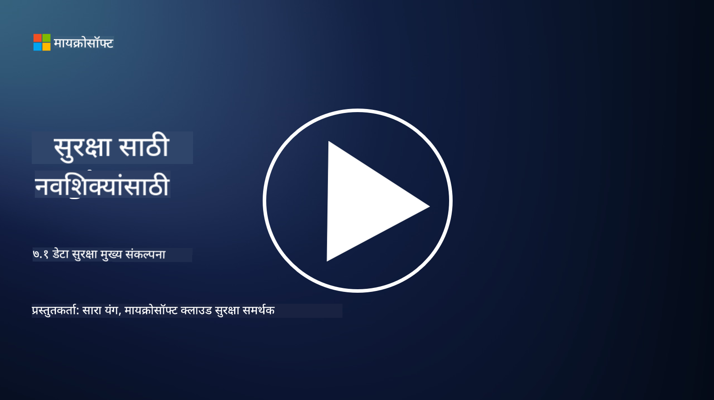

<!--
CO_OP_TRANSLATOR_METADATA:
{
  "original_hash": "9703868f41dcddd5a98dea9ea6fcd94d",
  "translation_date": "2025-09-03T23:55:05+00:00",
  "source_file": "7.1 Data security key concepts.md",
  "language_code": "mr"
}
-->
# डेटा सुरक्षा महत्त्वाचे संकल्पना

या कोर्समध्ये आपण डेटा सुरक्षा याबद्दल अनेकदा उल्लेख केला आहे आणि त्यावर थोडक्यात चर्चा केली आहे. आता, या विषयावर अधिक सविस्तरपणे चर्चा करूया. या धड्यात तुम्ही शिकाल:

- डेटा सुरक्षा म्हणजे काय?

- डेटा वर्गीकरण म्हणजे काय?

- डेटा जीवनचक्र व्यवस्थापन म्हणजे काय?

- डेटा गमावणे प्रतिबंध (DLP) म्हणजे काय?

- संस्थेसाठी डेटा सुरक्षा का महत्त्वाची आहे?

## डेटा सुरक्षा म्हणजे काय?

**डेटा सुरक्षा** म्हणजे डिजिटल डेटा, जसे की डेटाबेस, फाइल्स, आणि संवेदनशील माहिती, अनधिकृत प्रवेश, उघड करणे, बदलणे किंवा नष्ट होण्यापासून संरक्षित करण्याची पद्धत. डेटा सुरक्षेचा मुख्य उद्देश म्हणजे डेटा गोपनीयता, अखंडता, आणि उपलब्धता सुनिश्चित करणे. यामध्ये तांत्रिक, प्रशासकीय, आणि भौतिक सुरक्षा उपायांचा समावेश असतो, जे सायबर हल्ले, अंतर्गत धोके, आणि डेटा गळती यांसारख्या विविध धोक्यांपासून डेटा सुरक्षित ठेवतात. डेटा सुरक्षा उपायांमध्ये एन्क्रिप्शन, प्रवेश नियंत्रण, प्रमाणीकरण, ऑडिट ट्रेल्स, आणि सुरक्षा धोरणांचा समावेश होतो.

## डेटा वर्गीकरण म्हणजे काय?

**डेटा वर्गीकरण** म्हणजे डेटाला त्याच्या संवेदनशीलतेनुसार, मूल्यानुसार, आणि संस्थेसाठी महत्त्वानुसार श्रेणीबद्ध करण्याची प्रक्रिया. डेटा वर्गीकरणाचा उद्देश म्हणजे संस्थांना विविध प्रकारच्या डेटाचे संरक्षण आणि हाताळणी प्राधान्याने ओळखण्यात मदत करणे. सामान्य डेटा वर्गीकरण श्रेणींमध्ये "सार्वजनिक," "आंतरिक," "गोपनीय," आणि "प्रतिबंधित" किंवा "अत्यंत गोपनीय" यांचा समावेश होतो. डेटा वर्गीकृत केल्यानंतर, संस्थांना योग्य सुरक्षा नियंत्रण आणि प्रवेश निर्बंध लागू करता येतात, ज्यामुळे संवेदनशील डेटा योग्य प्रकारे संरक्षित होतो आणि नियामक आवश्यकता पूर्ण होतात.

## डेटा जीवनचक्र व्यवस्थापन म्हणजे काय?

**डेटा जीवनचक्र व्यवस्थापन** म्हणजे डेटाच्या संपूर्ण जीवनचक्रादरम्यान, म्हणजे निर्माण किंवा संपादनापासून ते संग्रहित करणे किंवा हटवणे यापर्यंत, व्यवस्थापन करण्यासाठी एक संरचित दृष्टिकोन. डेटा जीवनचक्रामध्ये सामान्यतः निर्माण, संग्रहण, प्रक्रिया, प्रसारण, संग्रहण, आणि विल्हेवाट लावणे यासारख्या टप्प्यांचा समावेश होतो. डेटा जीवनचक्र व्यवस्थापनामध्ये प्रत्येक टप्प्यासाठी धोरणे आणि प्रक्रिया परिभाषित करणे समाविष्ट असते, जसे की डेटा धारणा, प्रवेश नियंत्रण, बॅकअप, आणि डेटा स्वच्छता. प्रभावी डेटा जीवनचक्र व्यवस्थापन संस्थांना डेटा संग्रहण ऑप्टिमाइझ करण्यात, डेटा गुणवत्ता सुधारण्यात, आणि डेटा संरक्षण नियमांचे पालन सुनिश्चित करण्यात मदत करते.

## डेटा गमावणे प्रतिबंध (DLP) म्हणजे काय?

**डेटा गमावणे प्रतिबंध (DLP)** म्हणजे संवेदनशील किंवा गोपनीय डेटा अनधिकृत प्रवेश, सामायिकरण, किंवा गळतीपासून रोखण्यासाठी डिझाइन केलेल्या तंत्रज्ञान, धोरणे, आणि पद्धतींचा संच. DLP सोल्यूशन्स सामग्री तपासणी आणि संदर्भात्मक विश्लेषणाचा वापर करून डेटा हालचाल (उदा. ईमेल, वेब ट्रॅफिक), स्थिर डेटा (उदा. संग्रहित फाइल्स आणि डेटाबेस), आणि वापरातील डेटा (उदा. वापरकर्त्यांद्वारे प्रवेश किंवा हेरफेर केलेला डेटा) यावर नजर ठेवतात आणि नियंत्रित करतात. DLP चा उद्देश संवेदनशील डेटा ओळखणे आणि त्याला ब्लॉक करणे किंवा एन्क्रिप्ट करणे आहे, ज्यामुळे डेटा गळती टाळता येते, डेटा संरक्षण नियमांचे पालन होते, आणि संस्थेची प्रतिष्ठा सुरक्षित राहते.

## संस्थेसाठी डेटा सुरक्षा का महत्त्वाची आहे?

डेटा सुरक्षा संस्थांसाठी अनेक कारणांमुळे अत्यंत महत्त्वाची आहे:

- **संवेदनशील माहितीचे संरक्षण**: संस्थांमध्ये ग्राहक नोंदी, बौद्धिक संपदा, आर्थिक डेटा, आणि कर्मचारी माहिती यासारखा संवेदनशील डेटा संग्रहित असतो. डेटा सुरक्षा हा डेटा अनधिकृत प्रवेश किंवा चोरीपासून सुरक्षित ठेवते.

- **नियमांचे पालन**: अनेक उद्योग आणि क्षेत्रांमध्ये कठोर डेटा संरक्षण आणि गोपनीयता नियम आहेत. डेटा सुरक्षा संस्थांना या कायद्यांचे पालन करण्यात मदत करते, ज्यामुळे कायदेशीर दंड आणि प्रतिष्ठेचे नुकसान टाळता येते.

- **डेटा गळती प्रतिबंध**: डेटा गळतीमुळे आर्थिक नुकसान, प्रतिष्ठेचे नुकसान, आणि कायदेशीर परिणाम होऊ शकतात. प्रभावी डेटा सुरक्षा उपाय डेटा गळती टाळतात किंवा त्याचा परिणाम मर्यादित करतात.

- **विश्वास टिकवणे**: ग्राहक आणि भागीदार संस्थांवर त्यांच्या डेटाचा विश्वास ठेवतात. डेटा सुरक्षा उल्लंघनामुळे विश्वास कमी होतो. मजबूत डेटा सुरक्षा टिकवणे विश्वास आणि ग्राहकांचा आत्मविश्वास टिकवण्यास मदत करते.

- **स्पर्धात्मक फायदा**: डेटा सुरक्षा सुनिश्चित करण्याची वचनबद्धता दाखवणे हा स्पर्धात्मक फायदा ठरू शकतो. ग्राहक आणि भागीदार डेटा सुरक्षा गांभीर्याने घेणाऱ्या संस्थांसोबत काम करण्यास अधिक इच्छुक असतात.

- **संचालनात्मक सातत्य**: डेटा सुरक्षा उपाय, जसे की डेटा बॅकअप आणि आपत्ती पुनर्प्राप्ती नियोजन, डेटा उपलब्धता आणि डेटा गमावल्यास किंवा आपत्तीच्या वेळी व्यवसाय सातत्य सुनिश्चित करण्यात मदत करतात.

- **आतील धोके टाळणे**: डेटा सुरक्षा उपाय संस्थेतील अंतर्गत धोके, जसे की कर्मचाऱ्यांद्वारे चुकून डेटा उघड करणे आणि अंतर्गत व्यक्तींच्या द्वेषपूर्ण कृती, यांनाही संबोधित करतात.

सारांश, डेटा सुरक्षा संवेदनशील माहितीचे संरक्षण, नियमांचे पालन, डेटा गळती प्रतिबंध, विश्वास टिकवणे, आणि संस्थेच्या यशस्वीतेसाठी आणि प्रतिष्ठेसाठी अत्यावश्यक आहे.

## पुढील वाचन

- [What Is Data Security? | Microsoft Security](https://www.microsoft.com/en-au/security/business/security-101/what-is-data-security?WT.mc_id=academic-96948-sayoung)  
- [Automatically Classify & Protect Documents & Data | Microsoft Purview Information Protection](https://youtu.be/v8LqmzBUaOo)  
- [Example data classification policy](https://www.cmu.edu/data/guidelines/data-classification.html)  
- [What is Data Security? Data Security Definition and Overview | IBM](https://www.ibm.com/topics/data-security)  
- [Data Lifecycle Management: A 2023 Guide for Your Business (cloudwards.net)](https://www.cloudwards.net/data-lifecycle-management/)  
- [What is data loss prevention (DLP)? | Microsoft Security](https://www.microsoft.com/security/business/security-101/what-is-data-loss-prevention-dlp?WT.mc_id=academic-96948-sayoung)  
- [What is DLP? How data loss prevention software works and why you need it | CSO Online](https://www.csoonline.com/article/569559/what-is-dlp-how-data-loss-prevention-software-works-and-why-you-need-it.html)  

---

**अस्वीकरण**:  
हा दस्तऐवज AI भाषांतर सेवा [Co-op Translator](https://github.com/Azure/co-op-translator) चा वापर करून भाषांतरित करण्यात आला आहे. आम्ही अचूकतेसाठी प्रयत्नशील असलो तरी, कृपया लक्षात घ्या की स्वयंचलित भाषांतरांमध्ये त्रुटी किंवा अचूकतेचा अभाव असू शकतो. मूळ भाषेतील दस्तऐवज हा अधिकृत स्रोत मानला जावा. महत्त्वाच्या माहितीसाठी व्यावसायिक मानवी भाषांतराची शिफारस केली जाते. या भाषांतराचा वापर केल्यामुळे उद्भवणाऱ्या कोणत्याही गैरसमज किंवा चुकीच्या अर्थासाठी आम्ही जबाबदार राहणार नाही.