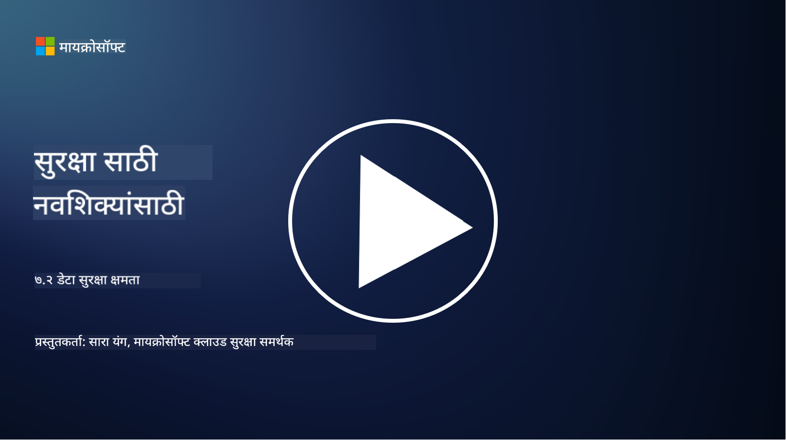

<!--
CO_OP_TRANSLATOR_METADATA:
{
  "original_hash": "50697add9758e54693442d502d2d5f8a",
  "translation_date": "2025-09-04T00:55:07+00:00",
  "source_file": "7.2 Data security capabilities.md",
  "language_code": "mr"
}
-->
# डेटा सुरक्षा क्षमता

या विभागात, डेटा सुरक्षा सुनिश्चित करण्यासाठी वापरल्या जाणाऱ्या मुख्य साधनांबद्दल आणि क्षमतांबद्दल अधिक तपशील दिले जातील:

**परिचय**

या धड्यात आपण शिकणार आहोत:

- डेटा लॉस प्रिव्हेन्शन टूलिंग म्हणजे काय?

- इनसाइडर रिस्क मॅनेजमेंट टूलिंग म्हणजे काय?

- कोणती डेटा रिटेन्शन टूलिंग उपलब्ध आहे?

## डेटा लॉस प्रिव्हेन्शन टूलिंग म्हणजे काय?

डेटा लॉस प्रिव्हेन्शन (DLP) टूलिंग म्हणजे सॉफ्टवेअर सोल्यूशन्स आणि तंत्रज्ञानाचा एक संच आहे, जो संस्थेमध्ये संवेदनशील किंवा गोपनीय डेटाचा अनधिकृत प्रवेश, शेअरिंग किंवा गळती रोखण्यासाठी डिझाइन केला जातो. ही साधने कंटेंट तपासणी, धोरण अंमलबजावणी, आणि मॉनिटरिंगचा वापर करून संवेदनशील डेटाची ओळख पटवतात आणि त्याचे संरक्षण करतात. DLP उत्पादनांचे उदाहरणे: Symantec Data Loss Prevention, McAfee Total Protection for Data Loss Prevention, Microsoft 365 DLP**: हे Microsoft 365 अॅप्लिकेशन्ससोबत एकत्रित होते, ज्यामुळे संस्थांना ईमेल्स, दस्तऐवज, आणि संदेशांमधील संवेदनशील डेटा ओळखण्यात आणि संरक्षित करण्यात मदत होते.

## इनसाइडर रिस्क मॅनेजमेंट टूलिंग म्हणजे काय?

इनसाइडर रिस्क मॅनेजमेंट टूलिंग संस्थांना कर्मचारी, कंत्राटदार, किंवा भागीदारांमुळे निर्माण होणाऱ्या जोखमी ओळखण्यात आणि कमी करण्यात मदत करते, जे डेटा सुरक्षा जाणूनबुजून किंवा नकळत धोक्यात आणू शकतात. ही साधने वापरकर्त्याच्या वर्तनाचे निरीक्षण करतात, प्रवेश पद्धती आणि डेटा वापर तपासतात, संशयास्पद क्रियाकलाप आणि संभाव्य इनसाइडर धोक्यांचा शोध घेतात. इनसाइडर रिस्क मॅनेजमेंट उत्पादनांचे उदाहरणे: Microsoft Insider Risk Management (Microsoft 365 चा भाग), Forcepoint Insider Threat Data Protection, Varonis Insider Threat Detection.

## कोणती डेटा रिटेन्शन टूलिंग उपलब्ध आहे?

डेटा रिटेन्शन टूलिंग म्हणजे सॉफ्टवेअर आणि सोल्यूशन्सचा संच आहे, जो संस्थेच्या डेटा रिटेन्शन धोरणे आणि कायदेशीर आवश्यकता यानुसार डेटा टिकवून ठेवणे आणि हटवणे व्यवस्थापित करतो. ही साधने विशिष्ट कालावधीसाठी डेटा टिकवून ठेवण्याची प्रक्रिया स्वयंचलित करतात आणि जेव्हा डेटा गरजेचा नसतो तेव्हा तो सुरक्षितपणे हटवतात. डेटा रिटेन्शन उत्पादनांचे उदाहरणे: Veritas Enterprise Vault, Commvault Complete Data Protection, Microsoft data lifecycle management. ही साधने संस्थांना डेटा रिटेन्शन आणि नष्ट करण्यावर नियंत्रण ठेवण्यास मदत करतात, डेटा संरक्षण नियमांचे पालन सुनिश्चित करतात, आणि डेटा त्याच्या जीवनचक्रादरम्यान कार्यक्षमतेने व्यवस्थापित करतात.

## पुढील वाचन

- [डेटा सुरक्षा स्थिती व्यवस्थापनासाठी मार्गदर्शक (DSPM) | CSA (cloudsecurityalliance.org)](https://cloudsecurityalliance.org/blog/2023/03/31/the-big-guide-to-data-security-posture-management-dspm/)
- [एंडपॉइंट्स, अॅप्स, आणि सेवांमध्ये डेटा लॉस प्रिव्हेन्शन | Microsoft Purview](https://youtu.be/hvqq8L_0kgI)
- [18 सर्वोत्तम डेटा लॉस प्रिव्हेन्शन सॉफ्टवेअर टूल्स 2023 (फ्री + पेड) (comparitech.com)](https://www.comparitech.com/data-privacy-management/data-loss-prevention-tools-software/)
- [डेटा लॉस प्रिव्हेन्शन (nist.gov)](https://tsapps.nist.gov/publication/get_pdf.cfm?pub_id=904672)
- [इनसाइडर रिस्क मॅनेजमेंटबद्दल जाणून घ्या | Microsoft Learn](https://learn.microsoft.com/purview/insider-risk-management?WT.mc_id=academic-96948-sayoung)
- [डेटा जीवनचक्र व्यवस्थापन | IBM](https://www.ibm.com/topics/data-lifecycle-management)
- [डेटा जीवनचक्र व्यवस्थापन (DLM) म्हणजे काय? | 2023 सर्वोत्तम पद्धती (selecthub.com)](https://www.selecthub.com/big-data-analytics/data-lifecycle-management/)

---

**अस्वीकरण**:  
हा दस्तऐवज AI भाषांतर सेवा [Co-op Translator](https://github.com/Azure/co-op-translator) चा वापर करून भाषांतरित करण्यात आला आहे. आम्ही अचूकतेसाठी प्रयत्नशील असलो तरी, कृपया लक्षात घ्या की स्वयंचलित भाषांतरांमध्ये त्रुटी किंवा अचूकतेचा अभाव असू शकतो. मूळ भाषेतील मूळ दस्तऐवज हा अधिकृत स्रोत मानला जावा. महत्त्वाच्या माहितीसाठी व्यावसायिक मानवी भाषांतराची शिफारस केली जाते. या भाषांतराचा वापर केल्यामुळे उद्भवणाऱ्या कोणत्याही गैरसमजांकरिता किंवा चुकीच्या अर्थ लावण्याकरिता आम्ही जबाबदार राहणार नाही.