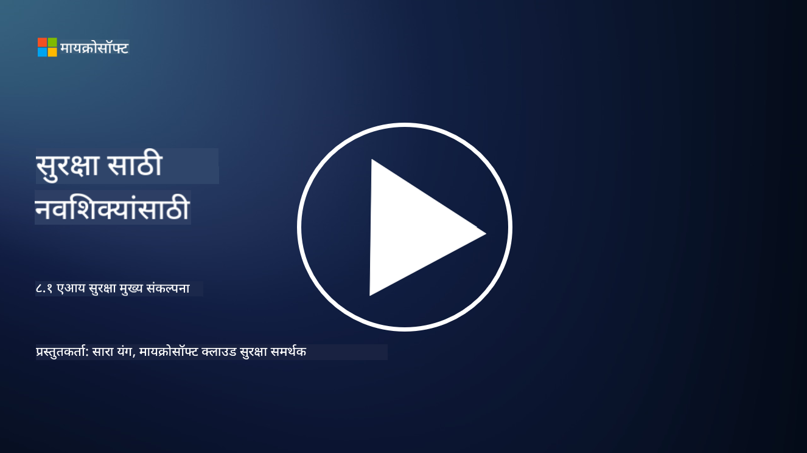

<!--
CO_OP_TRANSLATOR_METADATA:
{
  "original_hash": "66b61d96936cf25d20fcb411d4ce5227",
  "translation_date": "2025-09-03T22:46:25+00:00",
  "source_file": "8.1 AI security key concepts.md",
  "language_code": "mr"
}
-->
# एआय सुरक्षा मुख्य संकल्पना

## एआय सुरक्षा पारंपरिक सायबर सुरक्षा पेक्षा कशी वेगळी आहे?

एआय प्रणालींचे संरक्षण पारंपरिक सायबर सुरक्षेच्या तुलनेत वेगळ्या प्रकारच्या आव्हानांना सामोरे जाते, मुख्यतः एआयच्या शिकण्याच्या क्षमता आणि निर्णय प्रक्रियेच्या स्वरूपामुळे. येथे काही महत्त्वाचे फरक दिले आहेत:

-   **डेटा अखंडता**: एआय प्रणाली शिकण्यासाठी मोठ्या प्रमाणावर डेटावर अवलंबून असतात. [या डेटाची अखंडता सुनिश्चित करणे अत्यंत महत्त्वाचे आहे, कारण हल्लेखोर डेटा बदलून एआयच्या वर्तनावर परिणाम करू शकतात, ज्याला डेटा विषबाधा म्हणतात.
-   **मॉडेल सुरक्षा**: एआयचा निर्णय घेण्याचा मॉडेल स्वतःच लक्ष्य असू शकतो. [हल्लेखोर मॉडेलला उलट-सुलट करण्याचा प्रयत्न करू शकतात किंवा त्याच्या कमकुवतपणाचा फायदा घेऊन चुकीचे किंवा हानिकारक निर्णय घेऊ शकतात.
-   **विरोधात्मक हल्ले**: एआय प्रणाली विरोधात्मक हल्ल्यांना संवेदनशील असू शकतात, जिथे इनपुट डेटामध्ये सूक्ष्म, अनेकदा न दिसणारे बदल एआयला चुका किंवा चुकीचे अंदाज लावण्यास कारणीभूत ठरू शकतात.
-   **इन्फ्रास्ट्रक्चर सुरक्षा**: पारंपरिक सायबर सुरक्षा इन्फ्रास्ट्रक्चरचे संरक्षण करण्यावर लक्ष केंद्रित करते, परंतु एआय प्रणालींमध्ये क्लाउड-आधारित सेवा किंवा विशेष हार्डवेअर यासारख्या अतिरिक्त स्तर असू शकतात, ज्यासाठी विशिष्ट सुरक्षा उपायांची आवश्यकता असते.
-   **नैतिक विचार**: सुरक्षा क्षेत्रात एआयचा वापर नैतिक विचारांना समोर आणतो, जसे की गोपनीयतेची चिंता आणि निर्णय प्रक्रियेत पक्षपातीपणाची शक्यता, ज्यावर सुरक्षा धोरणात विचार करणे आवश्यक आहे.

एकूणच, एआय प्रणालींचे संरक्षण करण्यासाठी एआय तंत्रज्ञानाच्या अनोख्या पैलूंचा विचार करणारी वेगळी पद्धत आवश्यक आहे, ज्यामध्ये डेटा, मॉडेल्स आणि एआयच्या शिकण्याच्या प्रक्रियेचे संरक्षण समाविष्ट आहे, तसेच एआयच्या तैनातीच्या नैतिक परिणामांवर विचार करणे आवश्यक आहे.

  
एआय सुरक्षा आणि पारंपरिक सायबर सुरक्षा अनेक समानता सामायिक करतात, परंतु कृत्रिम बुद्धिमत्ता प्रणालींच्या अनोख्या वैशिष्ट्यांमुळे आणि क्षमतांमुळे त्यामध्ये काही वेगळेपण देखील आहे. ते कसे वेगळे आहेत ते येथे दिले आहे:

- **धोक्यांची गुंतागुंत**: एआय प्रणाली सायबर सुरक्षेला नवीन स्तरावर गुंतागुंत आणतात. पारंपरिक सायबर सुरक्षा मुख्यतः मालवेअर, फिशिंग हल्ले आणि नेटवर्क घुसखोरी यासारख्या धोक्यांशी संबंधित असते. परंतु, एआय प्रणाली विरोधात्मक हल्ले, डेटा विषबाधा आणि मॉडेल टाळणे यासारख्या हल्ल्यांसाठी असुरक्षित असू शकतात, जे मशीन लर्निंग अल्गोरिदमला लक्ष्य करतात.

- **हल्ल्याचा पृष्ठभाग**: एआय प्रणालींमध्ये पारंपरिक प्रणालींच्या तुलनेत मोठा हल्ल्याचा पृष्ठभाग असतो. कारण त्या केवळ सॉफ्टवेअरवरच नाही तर डेटा आणि मॉडेल्सवरही अवलंबून असतात. हल्लेखोर प्रशिक्षण डेटा लक्ष्य करू शकतात, मॉडेल्समध्ये फेरफार करू शकतात किंवा अल्गोरिदममधील असुरक्षिततेचा फायदा घेऊ शकतात.

 - **धोक्यांची अनुकूलता**: एआय प्रणाली त्यांच्या वातावरणातून शिकू शकतात आणि जुळवून घेऊ शकतात, ज्यामुळे त्या अनुकूल आणि विकसित होणाऱ्या धोक्यांसाठी अधिक संवेदनशील होऊ शकतात. पारंपरिक सायबर सुरक्षा उपाय एआय प्रणालीच्या वर्तनावर आधारित सतत विकसित होणाऱ्या हल्ल्यांपासून संरक्षण करण्यासाठी पुरेसे नसू शकतात.
   
 - **स्पष्टीकरण आणि समज**: एआय प्रणालीने विशिष्ट निर्णय का घेतला हे समजणे पारंपरिक सॉफ्टवेअर प्रणालींच्या तुलनेत अधिक आव्हानात्मक असते. या स्पष्टीकरण आणि समजण्याच्या अभावामुळे एआय प्रणालींवरील हल्ले प्रभावीपणे शोधणे आणि कमी करणे कठीण होऊ शकते.

   
  

 - **डेटा गोपनीयतेची चिंता**: एआय प्रणाली मोठ्या प्रमाणात डेटावर अवलंबून असतात, ज्यामुळे योग्य प्रकारे हाताळले नाही तर गोपनीयतेचा धोका निर्माण होऊ शकतो. पारंपरिक सायबर सुरक्षा उपाय एआय प्रणालींशी संबंधित डेटा गोपनीयतेच्या चिंतेला पुरेसे उत्तर देऊ शकत नाहीत.

   
   

 - **नियमांचे पालन**: एआय सुरक्षेसाठी नियामक लँडस्केप अद्याप विकसित होत आहे, विशिष्ट नियम आणि मानके एआय प्रणालींमुळे निर्माण होणाऱ्या अनोख्या आव्हानांना संबोधित करण्यासाठी उदयास येत आहेत. पारंपरिक सायबर सुरक्षा फ्रेमवर्कला या नवीन नियमांचे पालन सुनिश्चित करण्यासाठी विस्तारित किंवा अनुकूलित करणे आवश्यक असू शकते.

   
   

 - **नैतिक विचार**: एआय सुरक्षा प्रणालींना हानिकारक हल्ल्यांपासून संरक्षण करण्याबरोबरच एआय प्रणाली नैतिक आणि जबाबदारीने वापरल्या जात आहेत याची खात्री करणे देखील समाविष्ट आहे. यात न्याय, पारदर्शकता आणि जबाबदारी यासारख्या विचारांचा समावेश आहे, जे पारंपरिक सायबर सुरक्षेत इतके ठळक नसू शकतात.

## एआय पारंपरिक आयटी प्रणालींच्या सुरक्षिततेसारखे कसे आहे?

एआय प्रणालींचे संरक्षण पारंपरिक सायबर सुरक्षेशी काही मूलभूत तत्त्वे सामायिक करते:

-   **धोक्यांपासून संरक्षण**: एआय आणि पारंपरिक प्रणालींना अनधिकृत प्रवेश, डेटा बदल आणि नाश, तसेच इतर सामान्य धोक्यांपासून सुरक्षित ठेवणे आवश्यक आहे.
-   **असुरक्षितता व्यवस्थापन**: पारंपरिक प्रणालींवर परिणाम करणाऱ्या अनेक असुरक्षितता, जसे की सॉफ्टवेअर बग किंवा चुकीच्या कॉन्फिगरेशन, एआय प्रणालींवर देखील परिणाम करू शकतात.
-   **डेटा सुरक्षा**: प्रक्रिया केलेल्या डेटाचे संरक्षण दोन्ही क्षेत्रांमध्ये डेटा उल्लंघन टाळण्यासाठी आणि गोपनीयता सुनिश्चित करण्यासाठी महत्त्वाचे आहे.
-   **पुरवठा साखळी सुरक्षा**: दोन्ही प्रकारच्या प्रणाली पुरवठा साखळी हल्ल्यांसाठी असुरक्षित असतात, जिथे तडजोड केलेला घटक संपूर्ण प्रणालीच्या सुरक्षिततेला बाधित करू शकतो.

या समानता दर्शवतात की एआय प्रणाली नवीन सुरक्षा आव्हाने निर्माण करतात, परंतु त्यांना एआय तंत्रज्ञानाच्या अनोख्या पैलूंशी जुळवून घेत पारंपरिक सायबर सुरक्षा पद्धतींचा वापर करून मजबूत संरक्षण सुनिश्चित करण्याची आवश्यकता आहे.

## अधिक वाचन

 - [Not with a Bug, But with a Sticker [Book] (oreilly.com)](https://www.oreilly.com/library/view/not-with-a/9781119883982/)
   
  -  [Intro to AI Security Part 1: AI Security 101 | by HarrietHacks | Medium](https://medium.com/@harrietfarlow/intro-to-ai-security-part-1-ai-security-101-b8662a9efe5)
   
-    [Best practices for AI security risk management | Microsoft Security Blog](https://www.microsoft.com/en-us/security/blog/2021/12/09/best-practices-for-ai-security-risk-management/?WT.mc_id=academic-96948-sayoung)
   
-    [OWASP AI Security and Privacy Guide | OWASP Foundation](https://owasp.org/www-project-ai-security-and-privacy-guide/)

---

**अस्वीकरण**:  
हा दस्तऐवज AI भाषांतर सेवा [Co-op Translator](https://github.com/Azure/co-op-translator) वापरून भाषांतरित करण्यात आला आहे. आम्ही अचूकतेसाठी प्रयत्नशील असलो तरी कृपया लक्षात ठेवा की स्वयंचलित भाषांतरे त्रुटी किंवा अचूकतेच्या अभावाने युक्त असू शकतात. मूळ भाषेतील दस्तऐवज हा अधिकृत स्रोत मानला जावा. महत्त्वाच्या माहितीसाठी व्यावसायिक मानवी भाषांतराची शिफारस केली जाते. या भाषांतराचा वापर करून उद्भवलेल्या कोणत्याही गैरसमज किंवा चुकीच्या अर्थासाठी आम्ही जबाबदार राहणार नाही.