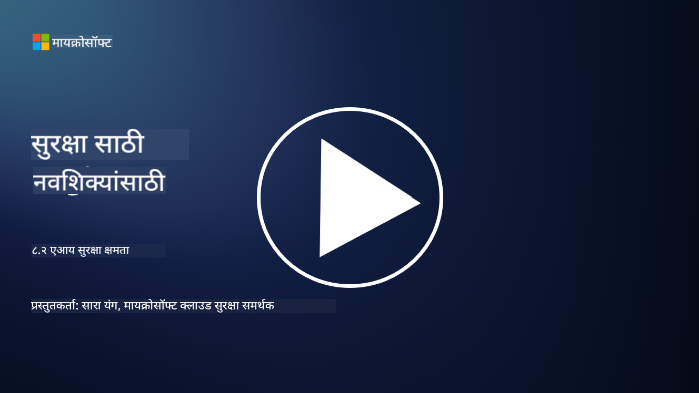

<!--
CO_OP_TRANSLATOR_METADATA:
{
  "original_hash": "b6bb7175672298d1e2f73ba7e0006f95",
  "translation_date": "2025-09-04T01:04:11+00:00",
  "source_file": "8.2 AI security capabilities.md",
  "language_code": "mr"
}
-->
# AI सुरक्षा क्षमता

## सध्या AI प्रणाली सुरक्षित करण्यासाठी कोणती साधने आणि क्षमता उपलब्ध आहेत?

सध्या, AI प्रणाली सुरक्षित करण्यासाठी अनेक साधने आणि क्षमता उपलब्ध आहेत:

-   **Counterfit**: AI प्रणालींच्या सुरक्षा चाचणीसाठी एक ओपन-सोर्स ऑटोमेशन साधन, जे संस्थांना AI सुरक्षा जोखीम मूल्यांकन करण्यास आणि त्यांच्या अल्गोरिदमची मजबुती सुनिश्चित करण्यास मदत करते.
-   **Adversarial Machine Learning Tools**: ही साधने मशीन लर्निंग मॉडेल्सची विरोधात्मक हल्ल्यांपासून मजबुती तपासतात, ज्यामुळे असुरक्षितता ओळखणे आणि कमी करणे शक्य होते.
-   **AI Security Toolkits**: ओपन-सोर्स टूलकिट्स उपलब्ध आहेत, जे AI प्रणाली सुरक्षित करण्यासाठी संसाधने प्रदान करतात, ज्यामध्ये सुरक्षा उपाय अंमलात आणण्यासाठी लायब्ररी आणि फ्रेमवर्क्स समाविष्ट आहेत.
-   **Collaborative Platforms**: कंपन्या आणि AI समुदायांमधील भागीदारी, AI पुरवठा साखळी सुरक्षित करण्यासाठी AI-विशिष्ट सुरक्षा स्कॅनर आणि इतर साधने विकसित करण्यासाठी.

ही साधने आणि क्षमता AI प्रणालींना विविध धोके टाळण्यासाठी सुरक्षा वाढवण्याच्या क्षेत्राचा एक भाग आहेत. या संशोधन, व्यावहारिक साधने आणि उद्योग सहकार्याचा समावेश असलेल्या क्षेत्राचे प्रतिनिधित्व करतात, जे AI तंत्रज्ञानामुळे निर्माण होणाऱ्या अनोख्या आव्हानांना संबोधित करण्यासाठी समर्पित आहे.

## AI रेड टीमिंग म्हणजे काय? आणि ते पारंपरिक सुरक्षा रेड टीमिंगपेक्षा कसे वेगळे आहे?

AI रेड टीमिंग पारंपरिक सुरक्षा रेड टीमिंगपेक्षा काही महत्त्वाच्या बाबतीत वेगळे आहे:

-   **AI प्रणालींवर लक्ष केंद्रित**: AI रेड टीमिंग विशेषतः AI प्रणालींच्या अनोख्या असुरक्षिततेवर लक्ष केंद्रित करते, जसे की मशीन लर्निंग मॉडेल्स आणि डेटा पाइपलाइन्स, पारंपरिक IT पायाभूत सुविधांऐवजी.
-   **AI वर्तनाची चाचणी**: हे AI प्रणालींना असामान्य किंवा अनपेक्षित इनपुट्सवर कसे प्रतिसाद देतात याची चाचणी घेते, ज्यामुळे हल्लेखोरांकडून शोषण होऊ शकणाऱ्या असुरक्षितता उघड होतात.
-   **AI अपयशांचा शोध**: AI रेड टीमिंग द्वेषपूर्ण आणि निरुपद्रवी अपयशांचा विचार करते, सुरक्षा उल्लंघनांव्यतिरिक्त संभाव्य प्रणाली अपयश आणि विविध व्यक्तिमत्त्वांचा विचार करते.
-   **प्रॉम्प्ट इंजेक्शन आणि सामग्री निर्मिती**: AI रेड टीमिंगमध्ये प्रॉम्प्ट इंजेक्शनसारख्या अपयशांचा शोध घेणे समाविष्ट आहे, जिथे हल्लेखोर AI प्रणालींना हानिकारक किंवा आधारहीन सामग्री तयार करण्यासाठी हाताळतात.
-   **नैतिक आणि जबाबदार AI**: हे जबाबदार AI डिझाइन सुनिश्चित करण्याचा एक भाग आहे, जे AI प्रणालींना अनपेक्षित पद्धतीने वागण्याचा प्रयत्न रोखण्यासाठी मजबूत बनवते.

एकूणच, AI रेड टीमिंग ही विस्तारित पद्धत आहे जी केवळ सुरक्षा असुरक्षिततेसाठी चाचणी घेण्यापुरती मर्यादित नाही, तर AI तंत्रज्ञानाशी संबंधित इतर प्रकारच्या प्रणाली अपयशांसाठी चाचणी घेण्याचा समावेश करते. AI प्रणाली अधिक सुरक्षित बनवण्यासाठी आणि AI तैनातीशी संबंधित नवीन जोखमी कमी करण्यासाठी हे महत्त्वाचे आहे.

## अधिक वाचनासाठी

 - [Microsoft AI Red Team building future of safer AI | Microsoft Security Blog](https://www.microsoft.com/en-us/security/blog/2023/08/07/microsoft-ai-red-team-building-future-of-safer-ai/?WT.mc_id=academic-96948-sayoung)
 - [Announcing Microsoft’s open automation framework to red team generative AI Systems | Microsoft Security Blog](https://www.microsoft.com/en-us/security/blog/2024/02/22/announcing-microsofts-open-automation-framework-to-red-team-generative-ai-systems/?WT.mc_id=academic-96948-sayoung)
 - [AI Security Tools: The Open-Source Toolkit | Wiz](https://www.wiz.io/academy/ai-security-tools)

---

**अस्वीकरण**:  
हा दस्तऐवज AI भाषांतर सेवा [Co-op Translator](https://github.com/Azure/co-op-translator) चा वापर करून भाषांतरित करण्यात आला आहे. आम्ही अचूकतेसाठी प्रयत्नशील असलो तरी, कृपया लक्षात घ्या की स्वयंचलित भाषांतरांमध्ये त्रुटी किंवा अचूकतेचा अभाव असू शकतो. मूळ भाषेतील मूळ दस्तऐवज हा अधिकृत स्रोत मानला जावा. महत्त्वाच्या माहितीसाठी व्यावसायिक मानवी भाषांतराची शिफारस केली जाते. या भाषांतराचा वापर केल्यामुळे उद्भवणाऱ्या कोणत्याही गैरसमज किंवा चुकीच्या अर्थासाठी आम्ही जबाबदार राहणार नाही.