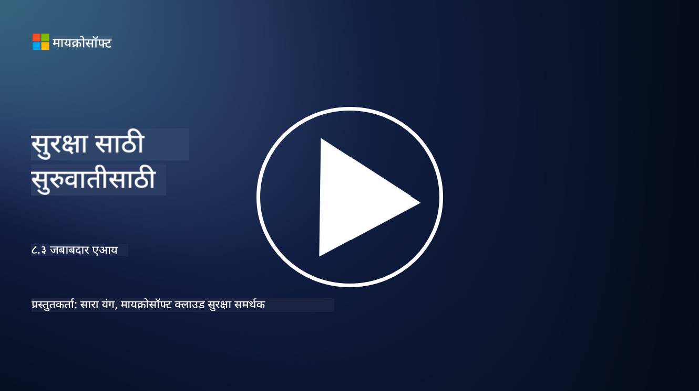

<!--
CO_OP_TRANSLATOR_METADATA:
{
  "original_hash": "5e9775ee91bde7d44577891d5f11c4c5",
  "translation_date": "2025-09-04T00:03:46+00:00",
  "source_file": "8.3 Responsible AI.md",
  "language_code": "mr"
}
-->
# जबाबदार AI

## जबाबदार AI म्हणजे काय आणि त्याचा AI सुरक्षा यासोबत काय संबंध आहे?

जबाबदार AI म्हणजे कृत्रिम बुद्धिमत्तेचा विकास आणि वापर असा असावा जो नैतिक, पारदर्शक आणि सामाजिक मूल्यांशी सुसंगत असेल. यात न्याय, जबाबदारी आणि मजबुती यासारख्या तत्त्वांचा समावेश होतो, ज्यामुळे AI प्रणाली व्यक्ती, समुदाय आणि समाजाच्या हितासाठी तयार आणि चालवली जाते.

जबाबदार AI आणि AI सुरक्षा यांच्यातील संबंध महत्त्वाचा आहे कारण:

-   **नैतिक विचार**: जबाबदार AI मध्ये नैतिक विचारांचा समावेश होतो ज्याचा सुरक्षा वर थेट परिणाम होतो, जसे की गोपनीयता आणि डेटा संरक्षण. AI प्रणाली वापरकर्त्याच्या गोपनीयतेचा आदर करते आणि वैयक्तिक डेटा सुरक्षित ठेवते याची खात्री करणे हे जबाबदार AI चे महत्त्वाचे अंग आहे.
-   **मजबुती आणि विश्वासार्हता**: AI प्रणालींना हेरफेर आणि हल्ल्यांपासून मजबूत असणे आवश्यक आहे, जे जबाबदार AI आणि AI सुरक्षा दोन्हीचे मुख्य तत्त्व आहे. यात विरोधी हल्ल्यांपासून संरक्षण करणे आणि AI निर्णय प्रक्रियेची अखंडता सुनिश्चित करणे समाविष्ट आहे.
-   **पारदर्शकता आणि स्पष्टीकरणक्षमता**: जबाबदार AI चा एक भाग म्हणजे AI प्रणाली पारदर्शक असणे आणि त्यांचे निर्णय स्पष्ट करता येणे. हे सुरक्षा दृष्टिकोनातून महत्त्वाचे आहे, कारण भागधारकांना AI प्रणाली कशी कार्य करते हे समजणे आवश्यक आहे जेणेकरून त्यांच्या सुरक्षा उपायांवर विश्वास ठेवता येईल.
-   **जबाबदारी**: AI प्रणालींनी त्यांच्या कृतींसाठी जबाबदार असले पाहिजे, म्हणजे निर्णयांचा मागोवा घेण्यासाठी आणि कोणत्याही समस्यांचे निराकरण करण्यासाठी यंत्रणा असणे आवश्यक आहे. हे सुरक्षा पद्धतींशी सुसंगत आहे ज्या प्रणाली क्रियाकलापांचे निरीक्षण आणि ऑडिट करतात जेणेकरून उल्लंघन टाळता येईल आणि त्यावर प्रतिसाद देता येईल.

थोडक्यात, जबाबदार AI आणि AI सुरक्षा एकमेकांशी जोडलेले आहेत, जबाबदार AI पद्धती AI प्रणालींच्या सुरक्षेला वाढवतात आणि उलट. जबाबदार AI तत्त्वे अंमलात आणल्याने नैतिकदृष्ट्या योग्य आणि संभाव्य धोके टाळण्यासाठी अधिक सुरक्षित AI प्रणाली तयार होतात.

## माझी AI प्रणाली सुरक्षित आणि नैतिक कशी ठेवता येईल?

तुमची AI प्रणाली सुरक्षित आणि नैतिक ठेवण्यासाठी बहुआयामी दृष्टिकोन आवश्यक आहे, ज्यामध्ये खालील चरणांचा समावेश आहे:

- **नैतिक तत्त्वांचे पालन करा**: मानवी, सामाजिक आणि पर्यावरणीय कल्याण; न्याय; गोपनीयता संरक्षण; विश्वासार्हता; पारदर्शकता; स्पर्धात्मकता; आणि जबाबदारी यावर भर देणाऱ्या स्थापित नैतिक मार्गदर्शक तत्त्वांचे अनुसरण करा.

- **मजबूत सुरक्षा उपाय अंमलात आणा**: धोके आणि असुरक्षिततेपासून संरक्षण करण्यासाठी सक्रिय सुरक्षा चाचणी आणि AI विश्वास, जोखीम, सुरक्षा व्यवस्थापन कार्यक्रम वापरा.

- **विविध भागधारकांचा सहभाग घ्या**: AI विकास प्रक्रियेत नैतिकतावादी, सामाजिक शास्त्रज्ञ आणि प्रभावित समुदायांचे प्रतिनिधी यांचा समावेश करा जेणेकरून विविध दृष्टिकोन आणि मूल्यांचा विचार केला जाईल.

- **पारदर्शकता आणि स्पष्टीकरणक्षमता सुनिश्चित करा**: AI च्या निर्णय प्रक्रियेची पारदर्शकता आणि स्पष्टीकरणक्षमता सुनिश्चित करा, ज्यामुळे अधिक विश्वास निर्माण होतो आणि संभाव्य पक्षपात किंवा त्रुटी ओळखणे सोपे होते.

- **डेटा गोपनीयता राखा**: एन्क्रिप्शन आणि इतर डेटा संरक्षण उपायांद्वारे डेटा गोपनीयता आणि प्रामाणिकता संरक्षित करा जेणेकरून वापरकर्त्यांच्या गोपनीयतेच्या अधिकारांचा आदर केला जाईल.

- **मानवी देखरेख सक्षम करा**: AI प्रणालींनी घेतलेल्या निर्णयांवर स्पर्धात्मकता ठेवण्यासाठी आणि जबाबदारी सुनिश्चित करण्यासाठी मानवी देखरेखेसाठी यंत्रणा अंमलात आणा.

- **AI सुरक्षा बद्दल माहिती ठेवा**: AI सुरक्षा आणि नैतिकतेच्या बदलत्या परिस्थितीची समजून घेण्यासाठी नवीनतम संशोधन आणि चर्चांबद्दल अद्ययावत रहा.

- **नियमांचे पालन करा**: तुमची AI प्रणाली सर्व संबंधित कायदे आणि नियमांचे पालन करते याची खात्री करा, ज्यामध्ये डेटा संरक्षण कायदे, भेदभावविरोधी कायदे आणि उद्योग-विशिष्ट मार्गदर्शक तत्त्वांचा समावेश असू शकतो.

## नैतिकतेच्या अभावामुळे AI मध्ये निर्माण होणाऱ्या सुरक्षा समस्यांचे काही उदाहरण देऊ शकता का?

AI च्या नैतिकतेच्या अभावामुळे निर्माण होणाऱ्या सुरक्षा समस्यांची काही उदाहरणे खाली दिली आहेत:

- **पक्षपाती निर्णय प्रक्रिया**: जर AI प्रणाली पक्षपाती डेटासेटवर प्रशिक्षित केली गेली असेल तर ती विद्यमान पक्षपात कायम ठेवू शकते आणि वाढवू शकते. उदाहरणार्थ, जर शोध इंजिन समाजातील रूढींचे प्रतिबिंब असलेल्या डेटावर प्रशिक्षित केले गेले असेल, तर ते पक्षपाती शोध परिणाम दर्शवू शकते, ज्यामुळे अन्यायकारक वागणूक किंवा भेदभाव होऊ शकतो.

- **न्यायालयीन प्रणालीतील AI**: न्यायालयीन निर्णय प्रक्रियेत AI चा वापर नैतिक चिंतेला कारणीभूत ठरू शकतो, विशेषतः जर AI च्या निर्णय प्रक्रियेत पारदर्शकता नसली किंवा पक्षपाती डेटाने प्रभावित झाली असेल. यामुळे अन्यायकारक कायदेशीर परिणाम होऊ शकतात आणि व्यक्तींच्या अधिकारांचे उल्लंघन होऊ शकते.

- **AI प्रणालींचा हेरफेर**: AI प्रणाली विरोधी हल्ल्यांसाठी असुरक्षित असू शकते, जिथे इनपुट डेटामध्ये थोडेसे बदल चुकीचे परिणाम देऊ शकतात. उदाहरणार्थ, स्वायत्त वाहनांना वाहतूक चिन्हांची चुकीची व्याख्या करण्यासाठी गोंधळात टाकले जाऊ शकते, ज्यामुळे सुरक्षा जोखीम निर्माण होऊ शकते.

- **AI-सक्षम देखरेख**: AI चा देखरेखीसाठी वापर गोपनीयतेचे उल्लंघन करू शकतो, विशेषतः जर योग्य संमतीशिवाय किंवा व्यक्तींच्या स्वातंत्र्यावर अतिक्रमण करणाऱ्या पद्धतीने वापरला गेला असेल. हे विशेषतः हुकूमशाही शासनांमध्ये समस्यात्मक ठरू शकते जे AI चा वापर निरीक्षण आणि विरोध दडपण्यासाठी करू शकते.

ही उदाहरणे AI प्रणालींच्या विकास आणि तैनातीमध्ये नैतिक विचारांचे महत्त्व अधोरेखित करतात जेणेकरून सुरक्षा समस्या टाळता येतील आणि व्यक्तींचे अधिकार आणि गोपनीयता संरक्षित करता येईल.

## अधिक वाचन

 - [Microsoft Responsible AI Standard v2 General Requirements](https://query.prod.cms.rt.microsoft.com/cms/api/am/binary/RE5cmFl?culture=en-us&country=us&WT.mc_id=academic-96948-sayoung)
 - [Responsible AI (mit.edu)](https://sloanreview.mit.edu/big-ideas/responsible-ai/)
 - [13 Principles for Using AI Responsibly (hbr.org)](https://hbr.org/2023/06/13-principles-for-using-ai-responsibly)

---

**अस्वीकरण**:  
हा दस्तऐवज AI भाषांतर सेवा [Co-op Translator](https://github.com/Azure/co-op-translator) चा वापर करून भाषांतरित करण्यात आला आहे. आम्ही अचूकतेसाठी प्रयत्नशील असलो तरी, कृपया लक्षात घ्या की स्वयंचलित भाषांतरांमध्ये त्रुटी किंवा अचूकतेचा अभाव असू शकतो. मूळ भाषेतील मूळ दस्तऐवज हा अधिकृत स्रोत मानला जावा. महत्त्वाच्या माहितीसाठी व्यावसायिक मानवी भाषांतराची शिफारस केली जाते. या भाषांतराचा वापर केल्यामुळे उद्भवणाऱ्या कोणत्याही गैरसमज किंवा चुकीच्या अर्थासाठी आम्ही जबाबदार राहणार नाही.