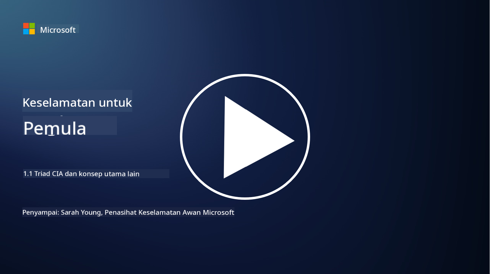
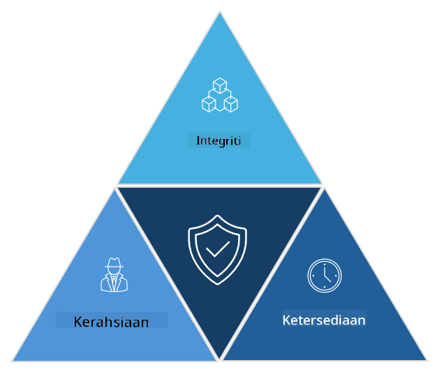

<!--
CO_OP_TRANSLATOR_METADATA:
{
  "original_hash": "16a76f9fa372fb63cffb6d76b855f023",
  "translation_date": "2025-09-04T01:11:11+00:00",
  "source_file": "1.1 The CIA triad and other key concepts.md",
  "language_code": "ms"
}
-->
# Triad CIA dan Konsep Utama Lain

## Pengenalan

Dalam pelajaran ini, kita akan membincangkan:

 - Apakah itu keselamatan siber?
   
 - Apakah triad CIA dalam keselamatan siber?

 - Apakah keaslian, penafian, dan privasi dalam konteks keselamatan siber?

## Apakah itu keselamatan siber?

Keselamatan siber, juga dikenali sebagai keselamatan maklumat, adalah amalan melindungi sistem komputer, rangkaian, peranti, dan data daripada serangan digital, akses tanpa kebenaran, kerosakan, atau kecurian. Matlamat utama keselamatan siber adalah untuk memastikan kerahsiaan, integriti, dan ketersediaan aset digital dan maklumat. Profesional keselamatan siber merancang dan melaksanakan kawalan keselamatan untuk melindungi aset, data, dan maklumat. Dengan semakin banyak aspek kehidupan kita yang menjadi digital dan dalam talian, keselamatan siber telah menjadi keutamaan utama bagi individu dan organisasi.

## Apakah triad CIA dalam keselamatan siber?

Triad keselamatan siber merujuk kepada model yang menggabungkan tiga pertimbangan utama untuk sebarang kerja keselamatan siber atau reka bentuk sistem/persekitaran:

### Kerahsiaan

Ini adalah pertimbangan yang paling biasa difahami oleh orang ramai apabila mereka memikirkan "keselamatan siber": kerahsiaan adalah proses melindungi data dan maklumat daripada cubaan akses tanpa kebenaran, iaitu hanya individu yang memerlukan maklumat tersebut yang boleh mengaksesnya. Walau bagaimanapun, tidak semua data dicipta sama, dan data biasanya dikategorikan dan dilindungi berdasarkan sejauh mana kerosakan yang mungkin berlaku jika ia diakses oleh pihak yang salah.

### Integriti

Merujuk kepada melindungi ketepatan dan kebolehpercayaan data yang terkandung dalam persekitaran dan memastikan data tersebut tidak diubah atau diubah suai oleh individu yang tidak dibenarkan. Contohnya, seorang pelajar mengubah tarikh lahir mereka pada rekod pemandu di DMV untuk menjadikan mereka lebih tua supaya mereka boleh mencetak semula lesen dengan tarikh lahir yang lebih awal untuk membeli alkohol.

### Ketersediaan

Ini adalah pertimbangan dalam operasi IT secara keseluruhan, tetapi ketersediaan juga penting untuk keselamatan siber. Terdapat jenis serangan tertentu yang menyasarkan ketersediaan yang mesti dilindungi oleh profesional keselamatan (contohnya, serangan penafian perkhidmatan teragih – DDoS).

**Triad CIA Keselamatan Siber**

## Apakah keaslian, penafian, dan privasi dalam konteks keselamatan siber?

Ini adalah konsep penting tambahan yang berkaitan dengan memastikan keselamatan dan kebolehpercayaan sistem dan data:

**Keaslian** - merujuk kepada jaminan bahawa maklumat, komunikasi, atau entiti yang anda berinteraksi dengannya adalah asli dan tidak diubah atau diusik oleh pihak yang tidak dibenarkan.

**Penafian** - adalah konsep memastikan bahawa sesebuah pihak tidak boleh menafikan penglibatan mereka atau keaslian transaksi atau komunikasi. Ia menghalang seseorang daripada mendakwa mereka tidak menghantar mesej atau melakukan tindakan tertentu apabila terdapat bukti yang menunjukkan sebaliknya.

**Privasi** - merujuk kepada perlindungan maklumat sensitif dan maklumat peribadi yang boleh dikenal pasti daripada akses, penggunaan, pendedahan, atau manipulasi tanpa kebenaran. Ia melibatkan kawalan siapa yang mempunyai akses kepada data peribadi dan bagaimana data tersebut dikumpul, disimpan, dan dikongsi.

## Bacaan tambahan

[Apakah Keselamatan Maklumat (InfoSec)? | Microsoft Security](https://www.microsoft.com/security/business/security-101/what-is-information-security-infosec#:~:text=Three%20pillars%20of%20information%20security%3A%20the%20CIA%20triad,as%20guiding%20principles%20for%20implementing%20an%20InfoSec%20plan.)

---

**Penafian**:  
Dokumen ini telah diterjemahkan menggunakan perkhidmatan terjemahan AI [Co-op Translator](https://github.com/Azure/co-op-translator). Walaupun kami berusaha untuk memastikan ketepatan, sila ambil maklum bahawa terjemahan automatik mungkin mengandungi kesilapan atau ketidaktepatan. Dokumen asal dalam bahasa asalnya harus dianggap sebagai sumber yang berwibawa. Untuk maklumat yang kritikal, terjemahan manusia profesional adalah disyorkan. Kami tidak bertanggungjawab atas sebarang salah faham atau salah tafsir yang timbul daripada penggunaan terjemahan ini.