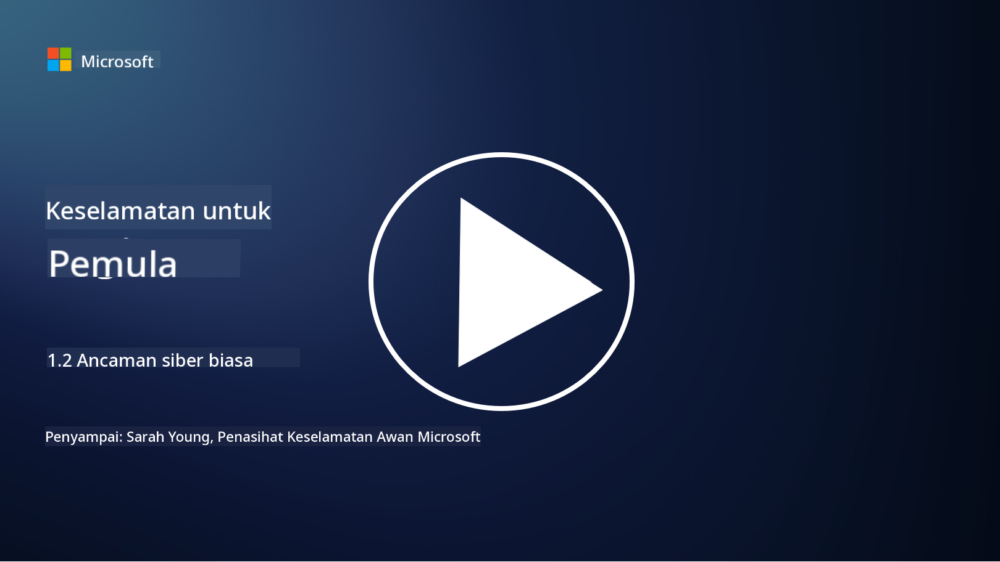

<!--
CO_OP_TRANSLATOR_METADATA:
{
  "original_hash": "6fc3030323139d7134a4ca9d03eccac9",
  "translation_date": "2025-09-03T23:26:42+00:00",
  "source_file": "1.2 Common cybersecurity threats.md",
  "language_code": "ms"
}
-->
# Ancaman Siber yang Lazim

## Pengenalan

Dalam pelajaran ini, kita akan membincangkan:

- Apakah ancaman siber?

- Mengapa pelaku berniat jahat ingin menjejaskan data dan sistem IT?

- Apakah jenis ancaman siber yang paling lazim?

- Apakah rangka kerja MITRE ATT&CK?

- Di mana saya boleh mengikuti perkembangan terkini landskap ancaman siber?

## Apakah ancaman siber?

Ancaman siber merujuk kepada sebarang bahaya atau risiko yang berpotensi menjejaskan kerahsiaan, integriti, atau ketersediaan data atau sistem IT. Ancaman ini datang daripada pelaku berniat jahat yang cuba mengeksploitasi kelemahan untuk mendapatkan akses tanpa kebenaran, mencuri maklumat sensitif, mengganggu operasi, atau menyebabkan kerosakan kepada individu, organisasi, atau bahkan negara. Ancaman siber boleh muncul dalam pelbagai bentuk dan menyasarkan aspek yang berbeza dalam sistem digital dan data.

## Mengapa pelaku berniat jahat ingin menjejaskan data dan sistem IT?

Pelaku berniat jahat menjejaskan data dan sistem IT atas pelbagai sebab, sering kali didorong oleh keuntungan peribadi, motif ideologi, atau keinginan untuk menyebabkan gangguan. Memahami motivasi ini dapat membantu organisasi dan individu mempertahankan diri dengan lebih baik daripada ancaman siber. Beberapa sebab lazim mengapa pelaku berniat jahat melancarkan serangan siber termasuk:

1. **Keuntungan Kewangan**: Banyak serangan didorong oleh keinginan untuk mendapatkan keuntungan kewangan. Pelaku berniat jahat mungkin mencuri maklumat sensitif seperti nombor kad kredit, butiran akaun bank, atau maklumat pengenalan peribadi untuk melakukan penipuan, pencurian identiti, meminta tebusan, atau menjual data yang dicuri di web gelap.

2. **Perisikan**: Negara, pesaing, atau entiti lain mungkin terlibat dalam perisikan siber untuk mencuri data sensitif kerajaan, korporat, atau penyelidikan bagi mendapatkan kelebihan politik, ekonomi, atau ketenteraan.

3. **Gangguan dan Sabotaj**: Sesetengah serangan bertujuan untuk mengganggu infrastruktur kritikal, perkhidmatan, atau operasi atas sebab politik atau ideologi. Serangan ini boleh menyebabkan kekacauan meluas, kerugian kewangan, dan kerosakan reputasi.

4. **Motivasi Ideologi**: Penggodam aktivis (hacktivists) dan kumpulan dengan motivasi ideologi atau politik mungkin menjejaskan sistem untuk meningkatkan kesedaran tentang isu tertentu, mempromosikan kepercayaan mereka, atau memprotes tindakan atau organisasi tertentu.

5. **Tindakan Tidak Sengaja**: Tidak semua tindakan berniat jahat dilakukan dengan sengaja; sesetengah individu mungkin secara tidak sedar menyumbang kepada ancaman siber dengan menjadi mangsa kejuruteraan sosial atau menjadi sebahagian daripada rangkaian yang dikompromi.

Akhirnya, motivasi untuk menjejaskan data dan sistem IT boleh berbeza-beza, dan kesan serangan ini boleh menjadi serius. Adalah penting bagi individu, organisasi, dan kerajaan untuk mengambil langkah keselamatan siber dengan serius dan melaksanakan langkah-langkah untuk melindungi daripada ancaman ini.

## Apakah jenis ancaman siber yang paling lazim?

Terdapat beberapa jenis serangan siber yang lazim digunakan oleh pelaku berniat jahat untuk menjejaskan sistem, mencuri data, dan menyebabkan gangguan. Berikut adalah beberapa jenis yang paling biasa pada masa ini:

1. **Phishing**:

Phishing melibatkan penghantaran e-mel atau mesej yang menipu, yang kelihatan seperti daripada sumber yang sah, untuk memperdaya penerima mendedahkan maklumat sensitif seperti kata laluan, nombor kad kredit, atau butiran peribadi. Phishing juga boleh membawa mangsa ke laman web berniat jahat atau memuat turun perisian hasad.

2. **Perisian Hasad (Malware)**:

Perisian hasad merangkumi pelbagai program berniat jahat yang direka untuk menjangkiti sistem, mencuri data, atau menyebabkan kerosakan. Jenis perisian hasad termasuk:

- **Ransomware**: Menyulitkan fail dan meminta tebusan untuk penyahsulitan.

- **Trojan**: Menyamar sebagai perisian sah, memberikan akses tanpa kebenaran kepada penyerang.

- **Virus**: Program yang mereplikasi diri dan melekat pada fail untuk menyebar.

- **Worm**: Program yang mereplikasi diri dan menyebar melalui rangkaian.

3. **Serangan Penafian Perkhidmatan (DoS) dan Penafian Perkhidmatan Teragih (DDoS)**:

Serangan DoS membebankan sistem sasaran, menjadikannya tidak dapat diakses oleh pengguna. Serangan DDoS melibatkan penggunaan rangkaian peranti yang dikompromi untuk membanjiri sasaran dengan trafik, menyebabkan sistem sukar berfungsi dengan baik atau berhenti berfungsi sepenuhnya.

4. **Suntikan SQL (SQL Injection)**:

Dalam serangan ini, penyerang memanipulasi medan input aplikasi web untuk menyuntik pertanyaan SQL berniat jahat, yang berpotensi memberikan akses tanpa kebenaran kepada pangkalan data dan data sensitif.

5. **Cross-Site Scripting (XSS)**:

Penyerang menyuntik skrip berniat jahat ke dalam aplikasi web, yang kemudian dilaksanakan oleh pelayar pengguna yang tidak curiga. Ini boleh menyebabkan kecurian data pengguna dan/atau penyebaran perisian hasad.

6. **Kejuruteraan Sosial (Social Engineering)**:

Kejuruteraan sosial mengeksploitasi psikologi manusia untuk memanipulasi individu agar mendedahkan maklumat sulit atau melakukan tindakan yang menjejaskan keselamatan.

7. **Eksploitasi Zero-Day (0day)**:

Serangan ini menyasarkan kelemahan dalam perisian atau perkakasan yang belum diketahui oleh vendor atau umum. Penyerang mengambil kesempatan daripada kelemahan ini sebelum tampalan dibangunkan. Banyak organisasi bimbang tentang zero-day kerana tiada tampalan untuknya, tetapi ia tidaklah seumum serangan lain dalam senarai ini. Apabila zero-day ditemui, penyelidik keselamatan akan bekerja dengan cepat untuk menghasilkan tampalan, dan oleh itu zero-day biasanya berumur pendek.

8. **Serangan Kredensial**:

Serangan ini termasuk serangan brute force, di mana penyerang meneka kata laluan berulang kali, dan serangan credential stuffing, di mana kredensial yang dicuri dari satu laman web digunakan untuk cuba mendapatkan akses di laman web lain.

## Apakah rangka kerja MITRE ATT&CK?

[Rangka kerja MITRE ATT&CK](https://attack.mitre.org/) (Adversarial Tactics, Techniques, and Common Knowledge) adalah rangka kerja yang mengkatalogkan dan mengkategorikan taktik, teknik, dan prosedur (TTP) yang digunakan oleh penyerang semasa serangan siber. Rangka kerja ini dicipta oleh MITRE Corporation, sebuah organisasi bukan untung yang mengendalikan pusat penyelidikan dan pembangunan untuk pelbagai agensi kerajaan.

Rangka kerja MITRE ATT&CK menyediakan cara standard untuk menerangkan dan menganalisis ancaman siber, membolehkan profesional keselamatan siber memahami dan mempertahankan diri dengan lebih baik daripada pelbagai teknik serangan. Ia digunakan secara meluas oleh pasukan keselamatan, pemburu ancaman, dan responden insiden untuk:

1. **Memahami Tingkah Laku Penyerang**: Rangka kerja ini mendokumentasikan tingkah laku serangan dunia nyata, menggariskan langkah-langkah yang diambil oleh penyerang dari kemasukan awal hingga mencapai objektif mereka. Ia merangkumi pelbagai teknik serangan yang digunakan oleh kumpulan ancaman yang berbeza.

2. **Merancang dan Melaksanakan Strategi Pertahanan**: Pasukan keselamatan boleh menggunakan rangka kerja ini untuk membangunkan strategi pertahanan proaktif yang selaras dengan taktik dan teknik tertentu yang mungkin digunakan oleh penyerang.

3. **Tindak Balas Insiden dan Pemburuan Ancaman**: Semasa menyiasat insiden atau menjalankan pemburuan ancaman, profesional keselamatan boleh merujuk kepada rangka kerja ini untuk mengenal pasti dan mengurangkan teknik tertentu yang digunakan oleh penyerang.

Rangka kerja MITRE ATT&CK disusun dalam matriks yang mengelompokkan teknik serangan berdasarkan platform dan persekitaran tertentu, seperti Windows, macOS, Linux, dan perkhidmatan awan. Setiap matriks dibahagikan kepada taktik (matlamat peringkat tinggi) dan teknik (kaedah khusus yang digunakan untuk mencapai matlamat tersebut). Untuk setiap teknik, rangka kerja ini menyediakan maklumat tentang cara ia berfungsi, mitigasi yang berpotensi, dan rujukan yang relevan kepada pelaku ancaman dunia nyata yang telah menggunakan teknik tersebut.

Rangka kerja ini sentiasa dikemas kini dan diperluas apabila maklumat ancaman baru dikumpulkan dan landskap keselamatan siber berkembang. Ia adalah sumber yang bernilai untuk meningkatkan postur keselamatan siber organisasi dengan membolehkan pemahaman yang lebih mendalam tentang cara penyerang beroperasi dan cara mempertahankan diri daripada taktik mereka.

## Di mana saya boleh mengikuti perkembangan terkini landskap ancaman siber?

Terdapat banyak sumber yang boleh digunakan untuk mengikuti perkembangan terkini ancaman siber, berikut adalah beberapa pilihan:

- [Open Web Application Security Project (OWASP) top 10 vulnerabilities](https://owasp.org/Top10/)
- [Common Vulnerabilities and Exposures (CVEs)](https://www.bing.com/ck/a?!&&p=53df6007f017bca2JmltdHM9MTY5MjU3NjAwMCZpZ3VpZD0zYmY4N2RiYS1jYWI1LTYwMDgtMWY1YS02ZmYyY2JjNjYxZWUmaW5zaWQ9NTc2OQ&ptn=3&hsh=3&fclid=3bf87dba-cab5-6008-1f5a-6ff2cbc661ee&psq=cve&u=a1aHR0cHM6Ly9iaW5nLmNvbS9hbGluay9saW5rP3VybD1odHRwcyUzYSUyZiUyZmN2ZS5taXRyZS5vcmclMmYmc291cmNlPXNlcnAtcnImaD1BZXN4S0VBWTNnbGhNZEFpd3daMlNSZkZQNTlrODhIUnYxRUtlSkY1RTk0JTNkJnA9a2NvZmZjaWFsd2Vic2l0ZQ&ntb=1 "Common Vulnerabilities and Exposures")
- [Microsoft Security Response Center blogs](https://msrc.microsoft.com/blog/)
- [National Institute of Standards and Technology (NIST)](https://www.dhs.gov/topics/cybersecurity): NIST menyediakan sumber, amaran, dan kemas kini terkini tentang ancaman keselamatan siber yang berpotensi.
- [Cybersecurity and Infrastructure Security Agency (CISA)](https://www.cisa.gov/resources-tools/resources/free-cybersecurity-services-and-tools): CISA menyediakan sumber keselamatan siber dan amalan terbaik untuk perniagaan, agensi kerajaan, dan organisasi lain. CISA berkongsi maklumat terkini tentang jenis aktiviti keselamatan berimpak tinggi yang mempengaruhi komuniti secara keseluruhan dan analisis mendalam tentang ancaman siber baru dan yang berkembang.
- [National Cybersecurity Center of Excellence (NCCoE)](https://www.dhs.gov/topics/cybersecurity): NCCoE adalah pusat yang menyediakan penyelesaian keselamatan siber praktikal yang boleh diterapkan dalam situasi dunia nyata.
- [US-CERT](https://www.cisa.gov/resources-tools/resources/free-cybersecurity-services-and-tools): United States Computer Emergency Readiness Team (US-CERT) menyediakan pelbagai sumber keselamatan siber, termasuk amaran, petua, dan banyak lagi.
- Pasukan Tindak Balas Kecemasan Siber (CERT) negara anda.

---

**Penafian**:  
Dokumen ini telah diterjemahkan menggunakan perkhidmatan terjemahan AI [Co-op Translator](https://github.com/Azure/co-op-translator). Walaupun kami berusaha untuk memastikan ketepatan, sila ambil perhatian bahawa terjemahan automatik mungkin mengandungi kesilapan atau ketidaktepatan. Dokumen asal dalam bahasa asalnya harus dianggap sebagai sumber yang berwibawa. Untuk maklumat yang kritikal, terjemahan manusia profesional adalah disyorkan. Kami tidak bertanggungjawab atas sebarang salah faham atau salah tafsir yang timbul daripada penggunaan terjemahan ini.