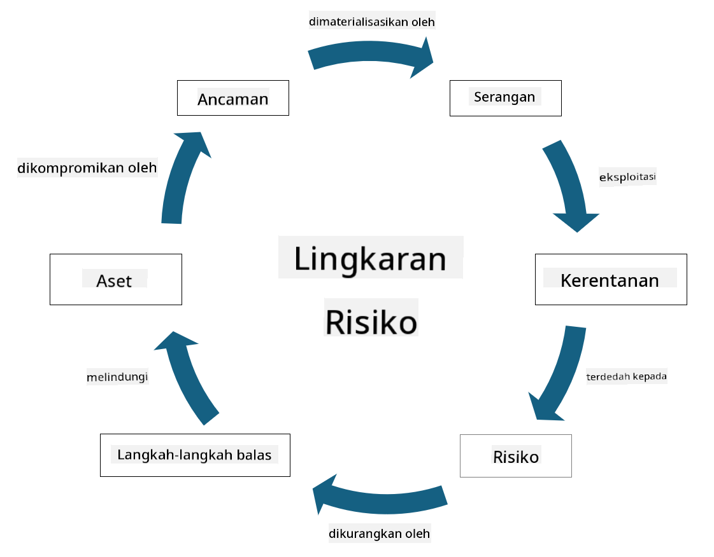

<!--
CO_OP_TRANSLATOR_METADATA:
{
  "original_hash": "fcca304f072cabf206388199e8e2e578",
  "translation_date": "2025-09-04T01:32:43+00:00",
  "source_file": "1.3 Understanding risk management.md",
  "language_code": "ms"
}
-->
# Memahami pengurusan risiko

## Pengenalan

Dalam pelajaran ini, kita akan membincangkan:

 - Definisi istilah keselamatan yang sering digunakan
   
 - Jenis kawalan keselamatan

 - Penilaian risiko keselamatan

## Definisi istilah keselamatan yang sering digunakan

Istilah-istilah ini adalah konsep asas dalam bidang keselamatan siber dan pengurusan risiko. Mari kita pecahkan setiap istilah dan bagaimana ia saling berkaitan:

1. **Ejen Ancaman**:

Ejen ancaman ialah individu, kumpulan, organisasi, atau sistem automatik yang berpotensi mengeksploitasi kelemahan dalam sistem atau rangkaian untuk menyebabkan kerosakan atau bahaya. Ejen ancaman boleh termasuk penggodam, pencipta perisian hasad, pekerja yang tidak puas hati, atau mana-mana entiti yang menimbulkan risiko kepada sistem maklumat dan teknologi.

2. **Ancaman**:

Ancaman ialah peristiwa atau tindakan berpotensi yang boleh mengeksploitasi kelemahan dalam sistem dan menyebabkan kerosakan kepada aset. Ancaman boleh merangkumi tindakan seperti penggodaman, pelanggaran data, serangan penafian perkhidmatan, dan banyak lagi. Ancaman adalah "apa" dalam konteks potensi bahaya yang boleh dikenakan kepada aset organisasi.

3. **Kelemahan**:

Kelemahan ialah kekurangan atau kecacatan dalam reka bentuk, pelaksanaan, atau konfigurasi sistem yang boleh dieksploitasi oleh ejen ancaman untuk menjejaskan keselamatan sistem. Kelemahan boleh wujud dalam perisian, perkakasan, proses, atau tingkah laku manusia. Mengenal pasti dan menangani kelemahan adalah penting untuk mengurangkan risiko serangan yang berjaya.

4. **Risiko**:

Risiko ialah potensi kerugian, bahaya, atau kerosakan yang timbul daripada interaksi antara ancaman dan kelemahan. Ia adalah kebarangkalian bahawa ejen ancaman akan mengeksploitasi kelemahan untuk menyebabkan kesan negatif. Risiko sering dinilai berdasarkan potensi impaknya dan kebarangkalian berlakunya.

5. **Aset**:

Aset ialah apa-apa yang bernilai yang ingin dilindungi oleh organisasi. Aset boleh merangkumi objek fizikal (seperti komputer dan pelayan), data (maklumat pelanggan, rekod kewangan), harta intelek (rahsia perdagangan, paten), dan juga sumber manusia (kemahiran dan pengetahuan pekerja). Melindungi aset adalah matlamat utama keselamatan siber.

6. **Pendedahan**:

Pendedahan merujuk kepada keadaan di mana terdapat kelemahan yang boleh dieksploitasi oleh ejen ancaman. Ia menunjukkan risiko yang berkaitan dengan kehadiran kelemahan dalam sistem atau rangkaian.

7. **Kawalan**:

Kawalan ialah langkah yang dilaksanakan untuk mengurangkan risiko yang berkaitan dengan kelemahan dan ancaman. Kawalan boleh bersifat teknikal, prosedural, atau pentadbiran. Ia direka untuk mencegah, mengesan, atau mengurangkan potensi ancaman dan kelemahan. Contohnya termasuk tembok api, kawalan akses, penyulitan, dasar keselamatan, dan latihan pekerja.

Untuk merumuskan hubungan antara istilah-istilah ini: Ejen ancaman mengeksploitasi kelemahan untuk melaksanakan ancaman, yang boleh membawa kepada risiko yang berpotensi menyebabkan kerosakan kepada aset yang bernilai. Pendedahan berlaku apabila kelemahan wujud, dan kawalan dilaksanakan untuk mengurangkan risiko dengan mencegah atau mengurangkan kesan ancaman terhadap aset. Kerangka ini membentuk asas pengurusan risiko keselamatan siber, membimbing organisasi dalam mengenal pasti, menilai, dan menangani risiko yang berpotensi terhadap sistem maklumat dan aset mereka.

## Jenis kawalan keselamatan

Kawalan keselamatan adalah langkah atau perlindungan yang dilaksanakan untuk melindungi sistem maklumat dan aset daripada pelbagai ancaman dan kelemahan. Ia boleh diklasifikasikan kepada beberapa kategori berdasarkan fokus dan tujuannya. Berikut adalah beberapa jenis kawalan keselamatan yang biasa:

1. **Kawalan Pentadbiran**:

Kawalan ini berkaitan dengan dasar, prosedur, dan garis panduan yang mengawal amalan keselamatan organisasi dan tingkah laku pengguna.

- Dasar dan prosedur keselamatan: Garis panduan yang didokumentasikan yang menentukan bagaimana keselamatan dikekalkan dalam organisasi.

- Kesedaran dan latihan keselamatan: Program untuk mendidik pekerja tentang amalan terbaik keselamatan dan ancaman yang berpotensi.

- Tindak balas dan pengurusan insiden: Rancangan untuk bertindak balas terhadap dan mengurangkan insiden keselamatan.

2. **Kawalan Teknikal**:

Kawalan teknikal melibatkan penggunaan teknologi untuk melaksanakan langkah keselamatan dan melindungi sistem serta data. Contoh kawalan teknikal termasuk:

- Kawalan akses: Langkah yang mengehadkan akses pengguna kepada sumber berdasarkan peranan dan kebenaran mereka.

- Penyulitan: Menukar data kepada format yang selamat untuk mencegah akses tanpa kebenaran.

- Tembok api: Peranti keselamatan rangkaian yang menapis dan mengawal trafik masuk dan keluar.

- Sistem Pengesanan dan Pencegahan Pencerobohan (IDPS): Alat yang memantau trafik rangkaian untuk aktiviti mencurigakan.

- Perisian antivirus dan anti-malware: Program yang mengesan dan menghapuskan perisian hasad.

- Mekanisme pengesahan: Kaedah untuk mengesahkan identiti pengguna, seperti kata laluan, biometrik, dan pengesahan pelbagai faktor.

- Pengurusan tampalan: Mengemas kini perisian secara berkala untuk menangani kelemahan yang diketahui.

3. **Kawalan Fizikal**:

Kawalan fizikal adalah langkah untuk melindungi aset fizikal dan kemudahan.

- Pengawal keselamatan dan kakitangan kawalan akses: Kakitangan yang memantau dan mengawal akses ke premis fizikal.

- Kamera pengawasan: Sistem pemantauan video untuk memantau dan merekodkan aktiviti.

- Kunci dan penghalang fizikal: Langkah fizikal untuk mengehadkan akses ke kawasan sensitif.

- Kawalan persekitaran: Langkah untuk mengawal suhu, kelembapan, dan faktor persekitaran lain yang mempengaruhi peralatan dan pusat data.

4. **Kawalan Operasi**:

Kawalan ini berkaitan dengan operasi harian dan aktiviti yang memastikan keselamatan sistem secara berterusan.

- Pengurusan perubahan: Proses untuk menjejaki dan meluluskan perubahan kepada sistem dan konfigurasi.

- Sandaran dan pemulihan bencana: Rancangan untuk sandaran data dan pemulihan sekiranya berlaku kegagalan sistem atau bencana.

- Log dan audit: Memantau dan merekodkan aktiviti sistem untuk tujuan keselamatan dan pematuhan.

- Amalan pengekodan selamat: Garis panduan untuk menulis perisian bagi meminimumkan kelemahan.

5. **Kawalan Undang-undang dan Peraturan**:

Kawalan ini memastikan pematuhan kepada undang-undang, peraturan, dan piawaian industri yang relevan. Piawaian yang perlu dipatuhi oleh organisasi bergantung pada bidang kuasa, industri, dan faktor lain.

- Peraturan perlindungan data: Pematuhan kepada undang-undang seperti GDPR, HIPAA, dan CCPA.

- Piawaian khusus industri: Pematuhan kepada piawaian seperti PCI DSS untuk keselamatan data kad pembayaran.

Kategori kawalan keselamatan ini bekerjasama untuk mewujudkan postur keselamatan yang komprehensif bagi organisasi, membantu melindungi sistem, data, dan aset mereka daripada pelbagai ancaman.

## Penilaian risiko keselamatan

Sesetengah profesional keselamatan berpendapat bahawa pengurusan risiko hanya dilakukan oleh profesional risiko, tetapi memahami proses pengurusan risiko keselamatan adalah penting bagi mana-mana profesional keselamatan untuk membantu menyampaikan risiko keselamatan dalam bahasa yang dapat difahami dan diambil tindakan oleh seluruh organisasi.

Organisasi mesti sentiasa menilai risiko keselamatan dan memutuskan tindakan (atau tidak) yang perlu diambil terhadap risiko kepada perniagaan. Berikut adalah gambaran keseluruhan tentang bagaimana ini biasanya dilakukan. Perlu diingat bahawa proses ini biasanya dilakukan oleh beberapa pasukan yang berbeza dalam organisasi; jarang sekali satu pasukan bertanggungjawab untuk pengurusan risiko secara menyeluruh.

1. **Kenal Pasti Aset dan Ancaman**:

Organisasi mengenal pasti aset yang ingin dilindungi. Ini boleh merangkumi data, sistem, perkakasan, perisian, harta intelek, dan banyak lagi. Seterusnya, mereka mengenal pasti ancaman yang berpotensi menyasarkan aset ini.

2. **Menilai Kelemahan**:

Organisasi kemudian mengenal pasti kelemahan atau kekurangan dalam sistem atau proses yang boleh dieksploitasi oleh ancaman. Kelemahan ini boleh berpunca daripada kecacatan perisian, salah konfigurasi, kekurangan kawalan keselamatan, dan kesilapan manusia.

3. **Penilaian Kebarangkalian**:

Organisasi kemudian menilai kebarangkalian setiap ancaman berlaku. Ini melibatkan pertimbangan data sejarah, maklumat ancaman, trend industri, dan faktor dalaman. Kebarangkalian boleh dikategorikan sebagai rendah, sederhana, atau tinggi berdasarkan kemungkinan ancaman berlaku.

4. **Penilaian Impak**:

Seterusnya, organisasi menentukan potensi impak setiap ancaman jika ia mengeksploitasi kelemahan. Impak boleh merangkumi kerugian kewangan, gangguan operasi, kerosakan reputasi, akibat undang-undang, dan banyak lagi. Impak juga boleh dikategorikan sebagai rendah, sederhana, atau tinggi berdasarkan potensi akibatnya.

5. **Pengiraan Risiko**:

Penilaian kebarangkalian dan impak digabungkan untuk mengira tahap risiko keseluruhan bagi setiap ancaman yang dikenal pasti. Ini sering dilakukan menggunakan matriks risiko yang memberikan nilai berangka atau deskriptor kualitatif kepada tahap kebarangkalian dan impak. Tahap risiko yang dihasilkan membantu memprioritaskan risiko yang memerlukan perhatian segera.

6. **Keutamaan dan Pengambilan Keputusan**:

Organisasi kemudian memprioritaskan risiko dengan memberi tumpuan kepada risiko yang mempunyai nilai kebarangkalian dan impak gabungan tertinggi. Ini membolehkan mereka memperuntukkan sumber dan melaksanakan kawalan dengan lebih berkesan. Ancaman berisiko tinggi memerlukan perhatian segera, manakala ancaman berisiko rendah mungkin ditangani dalam jangka masa yang lebih panjang.

7. **Rawatan Risiko**:

Berdasarkan penilaian risiko, organisasi menentukan cara untuk mengurangkan atau menguruskan setiap risiko. Ini boleh melibatkan pelaksanaan kawalan keselamatan, memindahkan risiko melalui insurans, atau bahkan menerima tahap risiko baki tertentu jika ia dianggap boleh diuruskan/terlalu mahal untuk diperbaiki/dll.

8. **Pemantauan dan Kajian Berterusan**:

Penilaian risiko bukanlah proses sekali sahaja. Ia harus dilakukan secara berkala atau apabila terdapat perubahan besar dalam persekitaran organisasi. Pemantauan berterusan memastikan ancaman baru, kelemahan, atau perubahan dalam landskap perniagaan diambil kira.

Dengan menilai risiko keselamatan secara terstruktur, organisasi dapat membuat keputusan yang tepat tentang peruntukan sumber, kawalan keselamatan, dan strategi pengurusan risiko secara keseluruhan. Matlamatnya adalah untuk mengurangkan pendedahan risiko keseluruhan organisasi sambil menyelaraskan usaha keselamatan dengan matlamat dan objektif perniagaan organisasi.

---

**Penafian**:  
Dokumen ini telah diterjemahkan menggunakan perkhidmatan terjemahan AI [Co-op Translator](https://github.com/Azure/co-op-translator). Walaupun kami berusaha untuk memastikan ketepatan, sila ambil perhatian bahawa terjemahan automatik mungkin mengandungi kesilapan atau ketidaktepatan. Dokumen asal dalam bahasa asalnya harus dianggap sebagai sumber yang berwibawa. Untuk maklumat yang kritikal, terjemahan manusia profesional adalah disyorkan. Kami tidak bertanggungjawab atas sebarang salah faham atau salah tafsir yang timbul daripada penggunaan terjemahan ini.