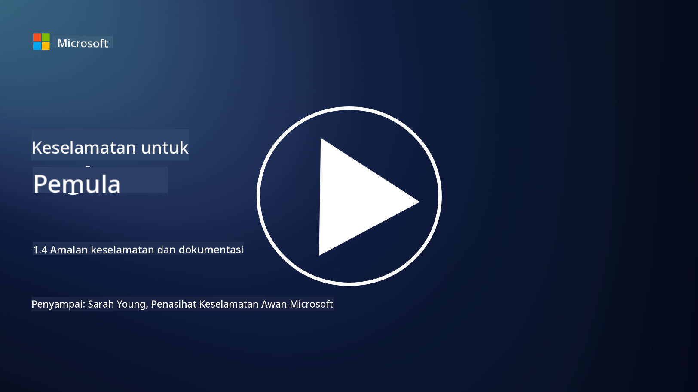

<!--
CO_OP_TRANSLATOR_METADATA:
{
  "original_hash": "d33500902124e52870935bdce4546fcc",
  "translation_date": "2025-09-04T00:21:10+00:00",
  "source_file": "1.4 Security practices and documentation.md",
  "language_code": "ms"
}
-->
# Amalan dan Dokumentasi Keselamatan

Anda mungkin pernah mendengar frasa seperti “dasar keselamatan”, “standard keselamatan”, dan sebagainya digunakan sebelum ini, tetapi hakikatnya ramai profesional keselamatan siber tidak menggunakannya dengan betul. Oleh itu, dalam bahagian ini, kami akan menerangkan maksud setiap frasa ini dan mengapa sesebuah organisasi menggunakannya.

## Pengenalan

Dalam pelajaran ini, kita akan membincangkan:

 - Apa itu dasar keselamatan?
   
 - Apa itu standard keselamatan?

   

 - Apa itu garis asas keselamatan?

   

 - Apa itu panduan keselamatan?
 - Apa itu prosedur keselamatan?

   

 - Apa itu undang-undang dan peraturan dalam konteks keselamatan siber?

Istilah-istilah ini sering digunakan dalam konteks keselamatan siber untuk mendefinisikan pelbagai tahap dokumentasi dan amalan keselamatan dalam sesebuah organisasi. Mari kita jelaskan setiap istilah:

## Apa itu dasar keselamatan?

Dasar keselamatan ialah dokumen peringkat tinggi yang menggariskan matlamat, prinsip, dan panduan keselamatan keseluruhan sesebuah organisasi. Ia menyediakan rangka kerja untuk membuat keputusan berkaitan keselamatan dan menetapkan nada untuk kedudukan keselamatan organisasi. Dasar keselamatan biasanya merangkumi topik seperti penggunaan sumber yang boleh diterima, perlindungan data, kawalan akses, tindak balas insiden, dan banyak lagi. Dasar adalah bebas daripada penyelesaian dan teknologi. Contoh dasar keselamatan yang biasa ialah dasar penggunaan yang boleh diterima sesebuah organisasi.

## Apa itu standard keselamatan?

Standard keselamatan ialah dokumen yang lebih terperinci dan spesifik yang menyediakan panduan dan keperluan untuk melaksanakan kawalan dan langkah keselamatan dalam sesebuah organisasi. Standard adalah lebih konkrit dan teknikal berbanding dasar, menawarkan arahan dan cadangan spesifik untuk mengkonfigurasi dan mengekalkan sistem, rangkaian, dan proses bagi mencapai matlamat keselamatan. Contoh standard keselamatan ialah _“Semua data dalaman mesti disulitkan semasa disimpan dan semasa dihantar.”_

## Apa itu garis asas keselamatan?

Garis asas keselamatan ialah satu set konfigurasi keselamatan minimum yang dianggap penting untuk sistem, aplikasi, atau persekitaran tertentu pada satu masa. Ia mendefinisikan titik permulaan untuk keselamatan yang harus dilaksanakan di semua contoh yang relevan. Garis asas keselamatan membantu memastikan konsistensi dan tahap keselamatan tertentu di seluruh infrastruktur IT sesebuah organisasi. Contoh garis asas keselamatan ialah _“VM Azure tidak boleh mempunyai akses langsung ke Internet.”_

## Apa itu panduan keselamatan?

Panduan keselamatan ialah dokumen yang menawarkan cadangan dan panduan apabila standard keselamatan tertentu tidak terpakai. Panduan cuba menangani “kawasan kelabu” yang timbul apabila standard tidak meliputi, atau hanya sebahagiannya meliputi sesuatu perkara.

## Apa itu prosedur keselamatan?

Prosedur keselamatan ialah panduan langkah demi langkah yang terperinci yang menggariskan tindakan dan tugas spesifik yang perlu dilakukan untuk melaksanakan proses atau tugas berkaitan keselamatan. Prosedur adalah dokumen praktikal dan boleh dilaksanakan yang menyediakan urutan tindakan yang jelas untuk diikuti semasa tindak balas insiden, penyelenggaraan sistem, onboarding pengguna, dan aktiviti berkaitan keselamatan lain. Contoh prosedur keselamatan ialah _“Apabila insiden keselamatan P1 dijana oleh Microsoft Sentinel, pusat operasi keselamatan (SOC) mesti segera memaklumkan pengurus keselamatan yang bertugas dan menghantar butiran insiden kepada mereka.”_

Secara ringkasnya, istilah-istilah ini mewakili pelbagai tahap dokumentasi dan panduan dalam rangka kerja keselamatan siber sesebuah organisasi. Dasar keselamatan menetapkan matlamat peringkat tinggi, standard menyediakan keperluan terperinci, garis asas menetapkan konfigurasi keselamatan minimum, panduan menawarkan amalan terbaik, dan prosedur menyediakan langkah-langkah yang boleh dilaksanakan untuk proses keselamatan.

## Apa itu undang-undang/peraturan dalam konteks keselamatan siber?

Undang-undang dan peraturan merujuk kepada rangka kerja undang-undang yang ditetapkan oleh kerajaan dan badan pengawalseliaan untuk mendefinisikan dan menguatkuasakan peraturan, standard, dan keperluan bagi melindungi sistem digital, data, dan maklumat. Undang-undang dan peraturan ini berbeza mengikut bidang kuasa dan memberi tumpuan kepada aspek keselamatan siber yang berbeza, termasuk perlindungan data, privasi, pelaporan insiden, dan keselamatan infrastruktur kritikal. Berikut adalah beberapa contoh undang-undang dan peraturan berkaitan keselamatan siber: contohnya General Data Protection Regulation (GDPR), Health Insurance Portability and Accountability Act (HIPAA), California Consumer Privacy Act (CCPA), Payment Card Industry Data Security Standard (PCI DSS).

## Bacaan lanjut

[Templat Dasar Keselamatan Maklumat | SANS Institute](https://www.sans.org/information-security-policy/)

[Pematuhan dengan Undang-undang dan Peraturan Keselamatan Siber dan Privasi | NIST](https://www.nist.gov/mep/cybersecurity-resources-manufacturers/compliance-cybersecurity-and-privacy-laws-and-regulations)

---

**Penafian**:  
Dokumen ini telah diterjemahkan menggunakan perkhidmatan terjemahan AI [Co-op Translator](https://github.com/Azure/co-op-translator). Walaupun kami berusaha untuk memastikan ketepatan, sila ambil perhatian bahawa terjemahan automatik mungkin mengandungi kesilapan atau ketidaktepatan. Dokumen asal dalam bahasa asalnya harus dianggap sebagai sumber yang berwibawa. Untuk maklumat yang kritikal, terjemahan manusia profesional adalah disyorkan. Kami tidak bertanggungjawab atas sebarang salah faham atau salah tafsir yang timbul daripada penggunaan terjemahan ini.