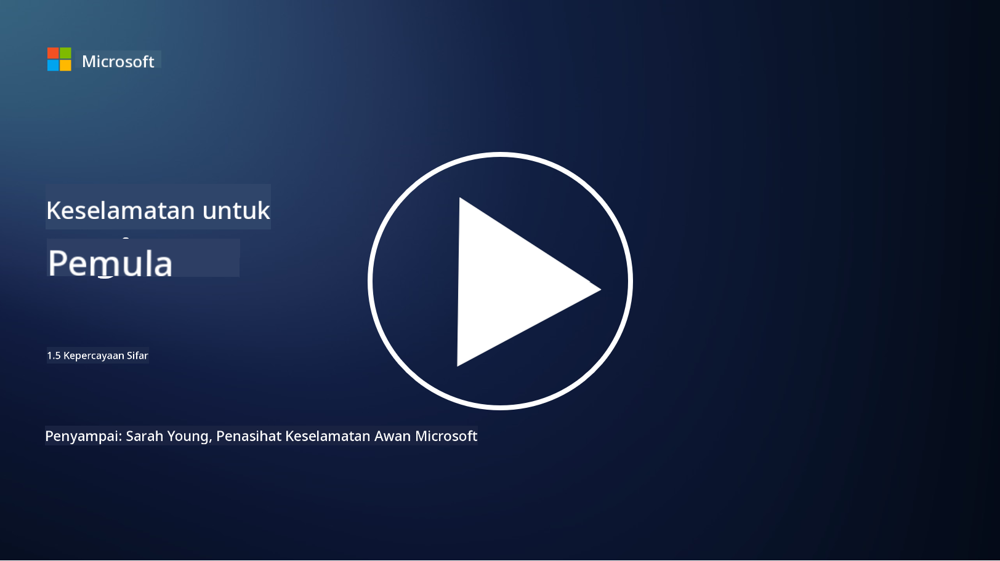

<!--
CO_OP_TRANSLATOR_METADATA:
{
  "original_hash": "75f77f972d2233c584f87c1eb96c983b",
  "translation_date": "2025-09-03T23:48:48+00:00",
  "source_file": "1.5 Zero trust.md",
  "language_code": "ms"
}
-->
# Zero Trust

“Zero trust” adalah frasa yang sering digunakan dalam dunia keselamatan siber masa kini. Tetapi apa maksudnya, adakah ia sekadar kata kunci? Dalam pelajaran ini, kita akan mendalami apa sebenarnya zero trust.

## Pengenalan

 - Dalam pelajaran ini, kita akan membincangkan:
   
   
 - Apa itu zero trust?

   
  

 - Bagaimana zero trust berbeza daripada seni bina keselamatan tradisional?

   
   

 - Apa itu pertahanan mendalam?

## Zero Trust

Zero Trust adalah pendekatan keselamatan siber yang mencabar konsep tradisional "percaya tetapi sahkan" dengan menganggap bahawa tiada entiti, sama ada di dalam atau di luar rangkaian organisasi, harus dipercayai secara semula jadi. Sebaliknya, Zero Trust menggalakkan pengesahan setiap pengguna, peranti, dan aplikasi yang cuba mengakses sumber, tanpa mengira lokasi mereka. Prinsip utama Zero Trust adalah untuk meminimumkan "permukaan serangan" dan mengurangkan kesan potensi pelanggaran keselamatan.

Dalam model Zero Trust, prinsip berikut ditekankan:

1. **Sahkan Identiti**: Pengesahan dan kebenaran diterapkan dengan ketat kepada semua pengguna dan peranti, tanpa mengira lokasi mereka. Ingat bahawa identiti tidak semestinya manusia: ia boleh menjadi peranti, aplikasi, dan sebagainya.

2. **Keistimewaan Minimum**: Pengguna dan peranti diberikan tahap akses minimum yang diperlukan untuk melaksanakan tugas mereka, mengurangkan potensi kerosakan jika dikompromi.

3. **Mikro-Segmentasi**: Sumber rangkaian dibahagikan kepada segmen kecil untuk mengehadkan pergerakan lateral dalam rangkaian sekiranya berlaku pelanggaran.

4. **Pemantauan Berterusan**: Pemantauan dan analisis berterusan terhadap tingkah laku pengguna dan peranti dilakukan untuk mengesan anomali dan ancaman yang berpotensi. Teknik pemantauan moden juga menggunakan pembelajaran mesin, AI, dan kecerdasan ancaman untuk memberikan butiran dan konteks tambahan kepada pemantauan.

5. **Penyulitan Data**: Data disulitkan semasa transit dan semasa disimpan untuk mencegah akses tanpa kebenaran.

6. **Kawalan Akses Ketat**: Kawalan akses dikuatkuasakan berdasarkan konteks, seperti peranan pengguna, kesihatan peranti, dan lokasi rangkaian.

Microsoft memisahkan zero trust kepada lima tiang, yang akan kita bincangkan dalam pelajaran seterusnya.

## Perbezaan daripada Seni Bina Keselamatan Tradisional

Zero Trust berbeza daripada seni bina keselamatan tradisional, seperti model berasaskan perimeter, dalam beberapa cara:

1. **Perimeter vs. Berpusatkan Identiti**: Model tradisional memberi tumpuan kepada melindungi perimeter rangkaian dan menganggap bahawa pengguna dan peranti dalaman boleh dipercayai setelah berada di dalam. Zero Trust, sebaliknya, menganggap ancaman boleh berasal dari dalam dan luar rangkaian dan menguatkuasakan kawalan berasaskan identiti yang ketat.

2. **Kepercayaan Tersirat vs. Kepercayaan Eksplisit**: Model tradisional mempercayai peranti dan pengguna dalam rangkaian secara tersirat sehingga terbukti sebaliknya. Zero Trust secara eksplisit mengesahkan identiti dan sentiasa memantau untuk anomali.

3. **Rangkaian Rata vs. Rangkaian Bersegmen**: Seni bina tradisional sering melibatkan rangkaian rata di mana pengguna dalaman mempunyai akses yang luas. Zero Trust menggalakkan pembahagian rangkaian kepada zon kecil dan terasing untuk menahan pelanggaran yang berpotensi.

4. **Reaktif vs. Proaktif**: Keselamatan tradisional sering bergantung pada langkah reaktif seperti firewall perimeter dan pengesanan pencerobohan. Zero Trust mengambil pendekatan proaktif dengan menganggap pelanggaran mungkin berlaku dan meminimumkan kesannya.

## Pertahanan Mendalam

Pertahanan mendalam, juga dikenali sebagai keselamatan berlapis, adalah strategi keselamatan siber yang melibatkan penggunaan pelbagai lapisan kawalan dan langkah keselamatan untuk melindungi aset organisasi. Tujuannya adalah untuk mencipta lapisan pertahanan yang bertindih supaya jika satu lapisan dilanggar, lapisan lain masih dapat memberikan perlindungan. Setiap lapisan memberi tumpuan kepada aspek keselamatan yang berbeza dan meningkatkan postur keselamatan keseluruhan organisasi.

Pertahanan mendalam melibatkan gabungan langkah keselamatan teknikal, prosedur, dan fizikal. Ini boleh merangkumi firewall, sistem pengesanan pencerobohan, kawalan akses, penyulitan, latihan pengguna, dasar keselamatan, dan banyak lagi. Idea ini adalah untuk mencipta pelbagai halangan yang secara kolektif menyukarkan penyerang untuk menembusi sistem dan rangkaian organisasi. Ini juga kadang-kadang dikenali sebagai model "keju Swiss" yang juga digunakan dalam pencegahan kemalangan dalam industri lain (contohnya, pengangkutan).

## Bacaan Lanjut

[What is Zero Trust?](https://learn.microsoft.com/security/zero-trust/zero-trust-overview?WT.mc_id=academic-96948-sayoung)

[Evolving Zero Trust – Microsoft Position Paper](https://query.prod.cms.rt.microsoft.com/cms/api/am/binary/RWJJdT?WT.mc_id=academic-96948-sayoung)

[Zero Trust and BeyondCorp Google Cloud | Google Cloud Blog](https://cloud.google.com/blog/topics/developers-practitioners/zero-trust-and-beyondcorp-google-cloud)

---

**Penafian**:  
Dokumen ini telah diterjemahkan menggunakan perkhidmatan terjemahan AI [Co-op Translator](https://github.com/Azure/co-op-translator). Walaupun kami berusaha untuk memastikan ketepatan, sila ambil maklum bahawa terjemahan automatik mungkin mengandungi kesilapan atau ketidaktepatan. Dokumen asal dalam bahasa asalnya harus dianggap sebagai sumber yang berwibawa. Untuk maklumat penting, terjemahan manusia profesional adalah disyorkan. Kami tidak bertanggungjawab atas sebarang salah faham atau salah tafsir yang timbul daripada penggunaan terjemahan ini.