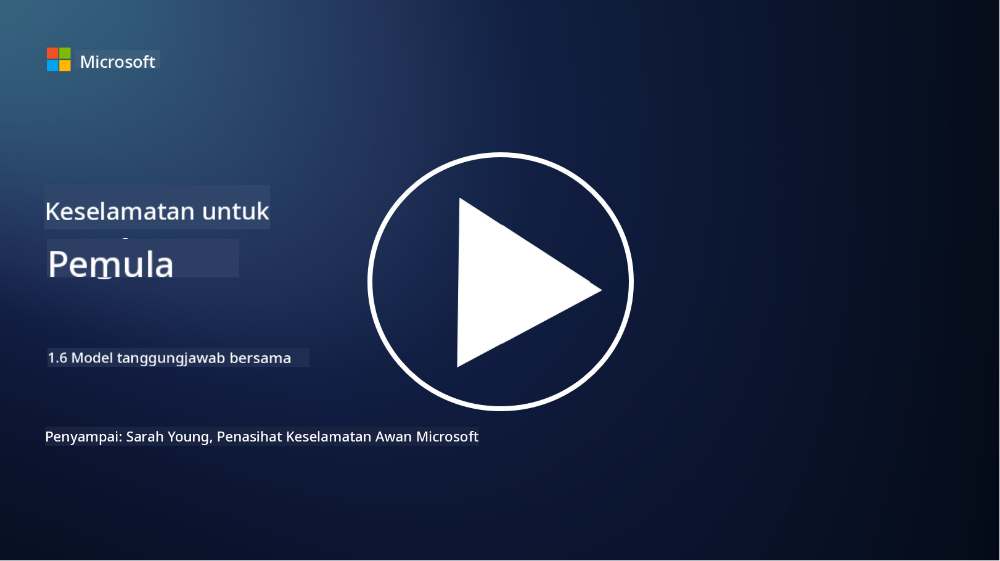

<!--
CO_OP_TRANSLATOR_METADATA:
{
  "original_hash": "a48db640d80c786b928ca178c414f084",
  "translation_date": "2025-09-04T00:27:31+00:00",
  "source_file": "1.6 Shared responsibility model.md",
  "language_code": "ms"
}
-->
# Model tanggungjawab bersama

Tanggungjawab bersama adalah konsep baru dalam IT yang muncul dengan kehadiran pengkomputeran awan. Dari perspektif keselamatan siber, adalah penting untuk memahami siapa yang menyediakan kawalan keselamatan tertentu supaya tiada jurang dalam pertahanan.

## Pengenalan

Dalam pelajaran ini, kita akan membincangkan:

 - Apakah tanggungjawab bersama dalam konteks keselamatan siber?
   
 - Apakah perbezaan tanggungjawab bersama untuk kawalan keselamatan
   antara IaaS, PaaS dan SaaS?

   

 - Di mana anda boleh mengetahui kawalan keselamatan yang disediakan oleh platform awan anda?

   
 

 - Apakah maksud “percaya tetapi sahkan”?

## Apakah tanggungjawab bersama dalam konteks keselamatan siber?

Tanggungjawab bersama dalam keselamatan siber merujuk kepada pembahagian tanggungjawab keselamatan antara penyedia perkhidmatan awan (CSP) dan pelanggannya. Dalam persekitaran pengkomputeran awan, seperti Infrastruktur sebagai Perkhidmatan (IaaS), Platform sebagai Perkhidmatan (PaaS), dan Perisian sebagai Perkhidmatan (SaaS), kedua-dua CSP dan pelanggan mempunyai peranan dalam memastikan keselamatan data, aplikasi, dan sistem.

## Apakah perbezaan tanggungjawab bersama untuk kawalan keselamatan antara IaaS, PaaS dan SaaS?

Pembahagian tanggungjawab biasanya bergantung pada jenis perkhidmatan awan yang digunakan:

 - **IaaS (Infrastruktur sebagai Perkhidmatan)**: CSP menyediakan infrastruktur asas (pelayan, rangkaian, storan), manakala pelanggan bertanggungjawab mengurus sistem operasi, aplikasi, dan konfigurasi keselamatan pada infrastruktur tersebut.
   
   
 - **PaaS (Platform sebagai Perkhidmatan):** CSP menawarkan platform di mana pelanggan boleh membina dan melancarkan aplikasi. CSP menguruskan infrastruktur asas, dan pelanggan memberi tumpuan kepada pembangunan aplikasi dan keselamatan data.

   

 - **SaaS (Perisian sebagai Perkhidmatan)**: CSP menyediakan aplikasi yang berfungsi sepenuhnya dan boleh diakses melalui internet. Dalam kes ini, CSP bertanggungjawab terhadap keselamatan aplikasi dan infrastrukturnya, manakala pelanggan menguruskan akses pengguna dan penggunaan data.

Memahami tanggungjawab bersama adalah penting kerana ia menjelaskan aspek keselamatan yang dilindungi oleh CSP dan yang perlu ditangani oleh pelanggan. Ini membantu mengelakkan salah faham dan memastikan langkah keselamatan dilaksanakan secara menyeluruh.

## Di mana anda boleh mengetahui kawalan keselamatan yang disediakan oleh platform awan anda?

Untuk mengetahui kawalan keselamatan yang disediakan oleh platform awan anda, anda perlu merujuk kepada dokumentasi dan sumber penyedia perkhidmatan awan. Ini termasuk:

 - **Laman web dan dokumentasi CSP**: laman web CSP akan mempunyai maklumat tentang ciri keselamatan dan kawalan yang ditawarkan sebagai sebahagian daripada perkhidmatan mereka. CSP biasanya menyediakan dokumentasi terperinci yang menerangkan amalan keselamatan, kawalan, dan cadangan mereka. Ini mungkin termasuk kertas putih, panduan keselamatan, dan dokumentasi teknikal.
   
 - **Penilaian dan Audit Keselamatan**: kebanyakan CSP mendapatkan kawalan keselamatan mereka dinilai oleh pakar keselamatan bebas dan organisasi. Kajian ini boleh memberikan pandangan tentang kualiti langkah keselamatan CSP. Kadangkala ini membawa kepada CSP mendapatkan sijil pematuhan keselamatan (lihat poin seterusnya).
 - **Sijil pematuhan keselamatan**: kebanyakan CSP memperoleh sijil seperti ISO:27001, SOC 2, dan FedRAMP, dll. Sijil ini menunjukkan bahawa penyedia memenuhi piawaian keselamatan dan pematuhan tertentu.

Ingat bahawa tahap perincian dan ketersediaan maklumat mungkin berbeza antara penyedia awan. Sentiasa pastikan anda merujuk kepada sumber rasmi dan terkini yang disediakan oleh penyedia perkhidmatan awan untuk membuat keputusan yang tepat tentang keselamatan aset berasaskan awan anda.

## Apakah maksud “percaya tetapi sahkan”?

Dalam konteks menggunakan CSP, perisian pihak ketiga atau perkhidmatan keselamatan IT lain, sesebuah organisasi mungkin pada awalnya mempercayai tuntutan penyedia tentang langkah keselamatan. Walau bagaimanapun, untuk benar-benar memastikan keselamatan data dan sistem mereka, mereka perlu mengesahkan tuntutan ini melalui penilaian keselamatan, ujian penembusan dan semakan kawalan keselamatan pihak luar sebelum sepenuhnya mengintegrasikan perisian atau perkhidmatan tersebut ke dalam operasi mereka. Semua individu dan organisasi harus berusaha untuk mempercayai tetapi mengesahkan kawalan keselamatan yang bukan tanggungjawab mereka.

## Tanggungjawab bersama dalam organisasi
Ingat, tanggungjawab bersama untuk keselamatan dalam organisasi untuk pasukan yang berbeza juga perlu diambil kira. Pasukan keselamatan jarang melaksanakan semua kawalan sendiri dan perlu bekerjasama dengan pasukan operasi, pembangun dan bahagian lain dalam perniagaan untuk melaksanakan semua kawalan keselamatan yang diperlukan untuk memastikan organisasi selamat.

## Bacaan lanjut
- [Shared responsibility in the cloud - Microsoft Azure | Microsoft Learn](https://learn.microsoft.com/azure/security/fundamentals/shared-responsibility?WT.mc_id=academic-96948-sayoung)
- [What is shared responsibility model? – Definition from TechTarget.com](https://www.techtarget.com/searchcloudcomputing/definition/shared-responsibility-model)
- [The shared responsibility model explained and what it means for cloud security | CSO Online](https://www.csoonline.com/article/570779/the-shared-responsibility-model-explained-and-what-it-means-for-cloud-security.html)
- [Shared Responsibility for Cloud Security: What You Need to Know (cisecurity.org)](https://www.cisecurity.org/insights/blog/shared-responsibility-cloud-security-what-you-need-to-know)

---

**Penafian**:  
Dokumen ini telah diterjemahkan menggunakan perkhidmatan terjemahan AI [Co-op Translator](https://github.com/Azure/co-op-translator). Walaupun kami berusaha untuk memastikan ketepatan, sila ambil perhatian bahawa terjemahan automatik mungkin mengandungi kesilapan atau ketidaktepatan. Dokumen asal dalam bahasa asalnya harus dianggap sebagai sumber yang berwibawa. Untuk maklumat yang kritikal, terjemahan manusia profesional adalah disyorkan. Kami tidak bertanggungjawab atas sebarang salah faham atau salah tafsir yang timbul daripada penggunaan terjemahan ini.