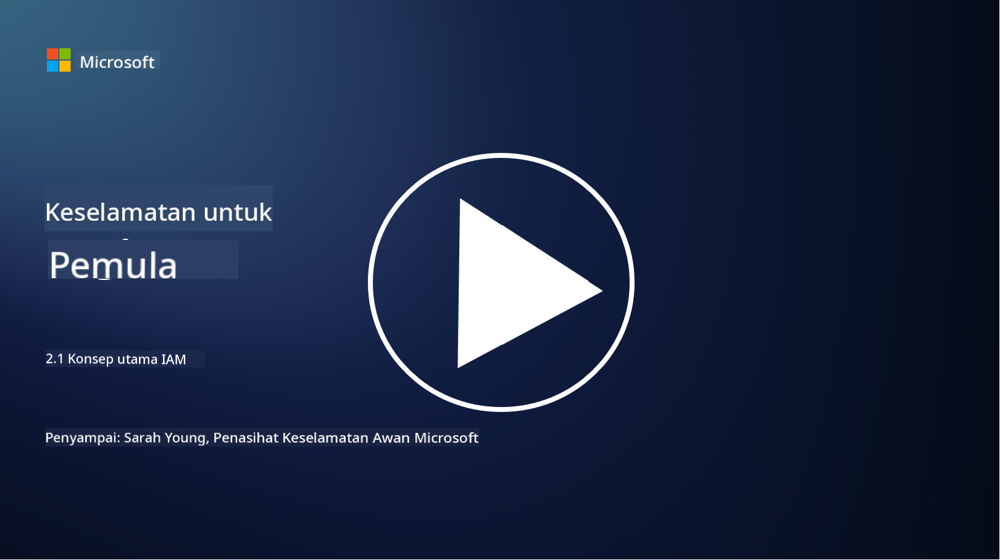

<!--
CO_OP_TRANSLATOR_METADATA:
{
  "original_hash": "2e3864e3d579f0dbb4ac2ec8c5f82acf",
  "translation_date": "2025-09-03T22:41:43+00:00",
  "source_file": "2.1 IAM key concepts.md",
  "language_code": "ms"
}
-->
# Konsep Utama IAM

Pernahkah anda log masuk ke komputer atau laman web? Sudah tentu pernah! Ini bermakna anda telah menggunakan kawalan identiti dalam kehidupan harian anda. Pengurusan identiti dan akses (IAM) adalah salah satu tonggak utama keselamatan, dan kita akan mempelajarinya dengan lebih lanjut dalam pelajaran seterusnya.

**Pengenalan**

Dalam pelajaran ini, kita akan membincangkan:

- Apakah yang dimaksudkan dengan pengurusan identiti dan akses (IAM) dalam konteks keselamatan siber?  
- Apakah prinsip keistimewaan minimum?  
- Apakah pemisahan tugas?  
- Apakah pengesahan dan kebenaran?

## Apakah yang dimaksudkan dengan pengurusan identiti dan akses (IAM) dalam konteks keselamatan siber?

Pengurusan Identiti dan Akses (IAM) merujuk kepada satu set proses, teknologi, dan dasar yang dilaksanakan untuk memastikan individu yang betul mempunyai akses yang sesuai kepada sumber dalam persekitaran digital sesebuah organisasi. IAM melibatkan pengurusan identiti digital (pengguna, pekerja, rakan kongsi) dan akses mereka kepada sistem, aplikasi, data, dan rangkaian. Matlamat utama IAM adalah untuk meningkatkan keselamatan, mempermudah akses pengguna, dan memastikan pematuhan terhadap dasar dan peraturan organisasi. Penyelesaian IAM biasanya merangkumi pengesahan pengguna, kebenaran, penyediaan identiti, kawalan akses, dan pengurusan kitaran hayat pengguna (memastikan akaun dipadamkan apabila tidak lagi digunakan).

## Apakah prinsip keistimewaan minimum?

Prinsip keistimewaan minimum adalah konsep asas yang menyarankan pemberian keistimewaan minimum kepada pengguna dan sistem yang diperlukan untuk melaksanakan tugas atau peranan yang dimaksudkan. Prinsip ini membantu mengehadkan potensi kerosakan yang boleh berlaku sekiranya berlaku pelanggaran keselamatan atau ancaman dalaman. Dengan mematuhi prinsip keistimewaan minimum, organisasi dapat mengurangkan permukaan serangan dan meminimumkan risiko akses tanpa kebenaran, pelanggaran data, dan penyalahgunaan keistimewaan secara tidak sengaja. Dalam praktiknya, ini bermakna pengguna hanya diberikan akses kepada sumber dan fungsi tertentu yang diperlukan untuk peranan kerja mereka, dan tidak lebih. Sebagai contoh, jika anda hanya perlu membaca dokumen, adalah berlebihan untuk anda diberikan keistimewaan pentadbir penuh terhadap dokumen tersebut.

## Apakah pemisahan tugas?

Pemisahan tugas adalah prinsip yang bertujuan untuk mencegah konflik kepentingan dan mengurangkan risiko penipuan dan kesilapan dengan mengagihkan tugas dan tanggungjawab kritikal kepada individu yang berbeza dalam organisasi. Dalam konteks keselamatan siber, pemisahan tugas melibatkan memastikan bahawa tiada individu tunggal mempunyai kawalan ke atas semua aspek proses atau sistem yang kritikal. Matlamatnya adalah untuk mewujudkan sistem semak dan imbang yang mencegah mana-mana individu daripada mempunyai keupayaan untuk melaksanakan kedua-dua peringkat penyediaan dan kelulusan sesuatu proses. Sebagai contoh, dalam sistem kewangan, ini mungkin bermaksud bahawa individu yang memasukkan transaksi ke dalam sistem tidak boleh menjadi individu yang sama yang meluluskan transaksi tersebut. Ini mengurangkan risiko tindakan tanpa kebenaran atau penipuan yang tidak dikesan.

## Apakah pengesahan dan kebenaran?

Pengesahan dan kebenaran adalah dua konsep asas dalam keselamatan siber yang memainkan peranan penting dalam memastikan keselamatan dan integriti sistem komputer dan data. Kedua-duanya sering digunakan bersama untuk mengawal akses kepada sumber dan melindungi maklumat sensitif.

**1. Pengesahan**:  
Pengesahan adalah proses mengesahkan identiti pengguna, sistem, atau entiti yang cuba mengakses sistem komputer atau sumber tertentu. Ia memastikan bahawa identiti yang didakwa adalah sah dan tepat. Kaedah pengesahan biasanya melibatkan penggunaan satu atau lebih faktor berikut:  

   a. Sesuatu yang anda tahu: Ini termasuk kata laluan, PIN, atau pengetahuan rahsia lain yang hanya diketahui oleh pengguna yang sah.  
   
   b. Sesuatu yang anda miliki: Ini melibatkan token fizikal atau peranti seperti kad pintar, token keselamatan, atau telefon bimbit yang digunakan untuk mengesahkan identiti pengguna.  
   
   c. Sesuatu yang anda adalah: Ini merujuk kepada faktor biometrik seperti cap jari, pengecaman wajah, atau imbasan retina yang unik kepada individu.  

Mekanisme pengesahan digunakan untuk mengesahkan bahawa pengguna adalah seperti yang mereka dakwa sebelum membenarkan akses kepada sistem atau sumber. Ia membantu mencegah akses tanpa kebenaran dan memastikan hanya pengguna yang sah boleh melakukan tindakan dalam sistem.

**2. Kebenaran**:  
Kebenaran adalah proses memberikan atau menolak kebenaran dan keistimewaan tertentu kepada pengguna atau entiti yang telah disahkan setelah identiti mereka disahkan. Ia menentukan tindakan atau operasi yang dibenarkan untuk dilakukan oleh pengguna dalam sistem atau pada sumber tertentu. Kebenaran biasanya berdasarkan dasar yang telah ditetapkan, peraturan kawalan akses, dan peranan yang diberikan kepada pengguna.

Kebenaran boleh dianggap sebagai menjawab soalan, "Apa yang boleh dilakukan oleh pengguna yang telah disahkan?" Ia melibatkan penentuan dan penguatkuasaan dasar kawalan akses untuk melindungi data dan sumber sensitif daripada akses atau pengubahsuaian tanpa kebenaran.

**Ringkasnya:**

- Pengesahan menentukan identiti pengguna atau entiti.  
- Kebenaran menentukan tindakan dan sumber yang boleh diakses atau dimanipulasi oleh pengguna yang telah disahkan.

## Bacaan lanjut

- [Describe identity concepts - Training | Microsoft Learn](https://learn.microsoft.com/training/modules/describe-identity-principles-concepts/?WT.mc_id=academic-96948-sayoung)  
- [Introduction to identity - Microsoft Entra | Microsoft Learn](https://learn.microsoft.com/azure/active-directory/fundamentals/identity-fundamental-concepts?WT.mc_id=academic-96948-sayoung)  
- [What is Identity Access Management (IAM)? | Microsoft Security](https://www.microsoft.com/security/business/security-101/what-is-identity-access-management-iam?WT.mc_id=academic-96948-sayoung)  
- [What is IAM? Identity and access management explained | CSO Online](https://www.csoonline.com/article/518296/what-is-iam-identity-and-access-management-explained.html)  
- [What is IAM? (auth0.com)](https://auth0.com/blog/what-is-iam/)  
- [Security+: implementing Identity and Access Management (IAM) controls [updated 2021] | Infosec (infosecinstitute.com)](https://resources.infosecinstitute.com/certifications/securityplus/security-implementing-identity-and-access-management-iam-controls/)  
- [least privilege - Glossary | CSRC (nist.gov)](https://csrc.nist.gov/glossary/term/least_privilege)  
- [Security: The Principle of Least Privilege (POLP) - Microsoft Community Hub](https://techcommunity.microsoft.com/t5/azure-sql-blog/security-the-principle-of-least-privilege-polp/ba-p/2067390?WT.mc_id=academic-96948-sayoung)  
- [Principle of least privilege | CERT NZ](https://www.cert.govt.nz/it-specialists/critical-controls/principle-of-least-privilege/)  
- [Why is separation of duties required by NIST 800-171 and CMMC? - (totem.tech)](https://www.totem.tech/cmmc-separation-of-duties/)  

---

**Penafian**:  
Dokumen ini telah diterjemahkan menggunakan perkhidmatan terjemahan AI [Co-op Translator](https://github.com/Azure/co-op-translator). Walaupun kami berusaha untuk memastikan ketepatan, sila ambil perhatian bahawa terjemahan automatik mungkin mengandungi kesilapan atau ketidaktepatan. Dokumen asal dalam bahasa asalnya harus dianggap sebagai sumber yang berwibawa. Untuk maklumat yang kritikal, terjemahan manusia profesional adalah disyorkan. Kami tidak bertanggungjawab atas sebarang salah faham atau salah tafsir yang timbul daripada penggunaan terjemahan ini.