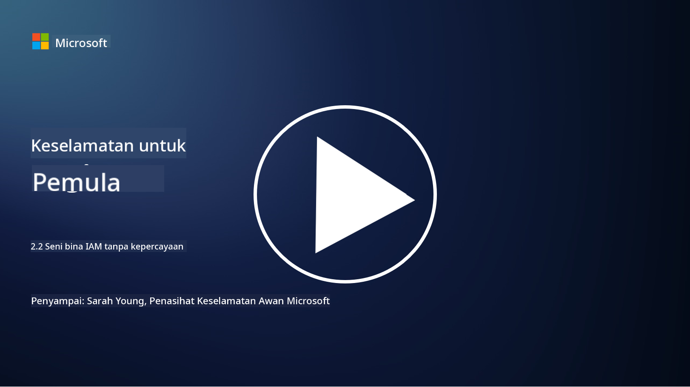

<!--
CO_OP_TRANSLATOR_METADATA:
{
  "original_hash": "4774a978af123f72ebb872199c4c4d4f",
  "translation_date": "2025-09-03T23:42:19+00:00",
  "source_file": "2.2 IAM zero trust architecture.md",
  "language_code": "ms"
}
-->
# Seni bina IAM Zero Trust

Identiti adalah elemen penting dalam melaksanakan seni bina Zero Trust dan membina perimeter untuk mana-mana persekitaran IT. Dalam bahagian ini, kita akan meneroka mengapa penting untuk menggunakan kawalan identiti bagi melaksanakan Zero Trust.

## Pengenalan

Dalam pelajaran ini, kita akan membincangkan:

 - Mengapa kita perlu menggunakan identiti sebagai perimeter dalam persekitaran IT moden?
   
 - Bagaimana ini berbeza daripada seni bina IT tradisional?

 - Bagaimana identiti digunakan untuk melaksanakan seni bina Zero Trust?

## Mengapa kita perlu menggunakan identiti sebagai perimeter dalam persekitaran IT moden?

Dalam persekitaran IT moden, konsep tradisional perimeter fizikal (menggunakan alat seperti firewall dan sempadan rangkaian) sebagai garis pertahanan utama terhadap ancaman siber menjadi kurang berkesan disebabkan oleh peningkatan kerumitan teknologi, kebangkitan kerja jarak jauh, dan penggunaan perkhidmatan awan. Sebaliknya, organisasi beralih kepada penggunaan identiti sebagai perimeter baharu. Ini bermaksud keselamatan berpusat kepada pengesahan dan pengurusan identiti pengguna, peranti, dan aplikasi yang cuba mengakses sumber, tanpa mengira lokasi fizikal mereka.

Berikut adalah sebab mengapa penggunaan identiti sebagai perimeter adalah penting dalam persekitaran IT moden:

**Tenaga Kerja Jarak Jauh**: Dengan kerja jarak jauh dan peranti mudah alih menjadi kebiasaan, pengguna boleh mengakses sumber dari pelbagai lokasi dan peranti. Pendekatan perimeter tradisional tidak berfungsi apabila pengguna tidak lagi terhad kepada pejabat fizikal.

**Persekitaran Awan dan Hibrid**: Organisasi semakin banyak menggunakan perkhidmatan awan dan persekitaran hibrid. Data dan aplikasi tidak lagi hanya terletak dalam premis organisasi, menjadikan pertahanan perimeter tradisional kurang relevan.

**Keselamatan Zero Trust**: Konsep keselamatan Zero Trust mengandaikan bahawa tiada entiti, sama ada di dalam atau di luar rangkaian, harus dipercayai secara automatik. Identiti menjadi asas untuk mengesahkan permintaan akses, tanpa mengira dari mana ia berasal.

**Landskap Ancaman**: Ancaman siber semakin berkembang, dan penyerang mencari cara untuk memintas pertahanan perimeter tradisional. Phishing, kejuruteraan sosial, dan ancaman dalaman sering mengeksploitasi kelemahan manusia daripada cuba menembusi perimeter rangkaian.

**Pendekatan Berpusatkan Data**: Melindungi data sensitif adalah sangat penting. Dengan memberi tumpuan kepada identiti, organisasi dapat mengawal siapa yang mengakses data tertentu, mengurangkan risiko pelanggaran data.

## Bagaimana ini berbeza daripada seni bina IT tradisional?

Seni bina IT tradisional sangat bergantung kepada model keselamatan berasaskan perimeter, di mana firewall dan sempadan rangkaian memainkan peranan penting dalam menghalang ancaman. Perbezaan utama antara pendekatan tradisional dan berpusatkan identiti adalah:

|      Aspek                 |      Seni Bina IT Tradisional                                                                  |      Pendekatan Berpusatkan Identiti                                                                             |
|-----------------------------|----------------------------------------------------------------------------------------------------|------------------------------------------------------------------------------------------------------------|
|     Fokus                   |     Fokus Perimeter: Bergantung kepada pertahanan perimeter seperti firewall dan kawalan akses.             |     Fokus kepada Pengesahan Identiti: Beralih daripada sempadan rangkaian kepada pengesahan identiti pengguna/peranti.     |
|     Lokasi                |     Kebergantungan Lokasi: Keselamatan terikat kepada lokasi pejabat fizikal dan sempadan rangkaian.    |     Kebebasan Lokasi: Keselamatan tidak terikat kepada lokasi tertentu; akses dari mana-mana sahaja.                |
|     Andaian Kepercayaan        |     Kepercayaan Diandaikan: Kepercayaan diandaikan dalam perimeter rangkaian untuk pengguna/peranti.                 |     Pendekatan Zero Trust: Kepercayaan tidak pernah diandaikan; akses disahkan berdasarkan identiti dan konteks.       |
|     Pertimbangan Peranti    |     Kepelbagaian Peranti: Mengandaikan peranti dalam perimeter rangkaian adalah selamat.                  |     Kesedaran Peranti: Mempertimbangkan kesihatan dan postur keselamatan peranti, tanpa mengira lokasi.               |
|     Perlindungan Data         |     Perlindungan Data: Memberi tumpuan kepada keselamatan perimeter rangkaian untuk perlindungan data.                 |     Perlindungan Berpusatkan Data: Memberi tumpuan kepada kawalan akses data berdasarkan identiti dan sensitiviti data.    |
|                             |                                                                                                    |                                                                                                            |

## Bagaimana identiti digunakan untuk melaksanakan seni bina Zero Trust?

Dalam seni bina Zero Trust, prinsip asasnya adalah untuk tidak mempercayai mana-mana entiti secara automatik, tanpa mengira sama ada ia berada di dalam atau di luar perimeter rangkaian. Identiti memainkan peranan utama dalam melaksanakan pendekatan Zero Trust dengan membolehkan pengesahan berterusan terhadap entiti yang cuba mengakses sumber. Kawalan keselamatan identiti moden membolehkan setiap pengguna, peranti, aplikasi, dan perkhidmatan yang ingin mengakses sumber mesti dikenal pasti dan disahkan sepenuhnya sebelum akses diberikan. Ini melibatkan pengesahan identiti digital mereka melalui kaedah seperti gabungan nama pengguna/kata laluan, pengesahan pelbagai faktor (MFA), biometrik, dan mekanisme pengesahan yang kukuh.

## Bacaan lanjut

- [Securing identity with Zero Trust | Microsoft Learn](https://learn.microsoft.com/security/zero-trust/deploy/identity?WT.mc_id=academic-96948-sayoung)
- [Zero Trust Principles and Guidance for Identity and Access | CSA (cloudsecurityalliance.org)](https://cloudsecurityalliance.org/artifacts/zero-trust-principles-and-guidance-for-iam/)
- [Zero Trust Identity Controls - Essentials Series - Episode 2 - YouTube](https://www.youtube.com/watch?v=fQZQznIKcGM&list=PLXtHYVsvn_b_gtX1-NB62wNervQx1Fhp4&index=13)

---

**Penafian**:  
Dokumen ini telah diterjemahkan menggunakan perkhidmatan terjemahan AI [Co-op Translator](https://github.com/Azure/co-op-translator). Walaupun kami berusaha untuk memastikan ketepatan, sila ambil maklum bahawa terjemahan automatik mungkin mengandungi kesilapan atau ketidaktepatan. Dokumen asal dalam bahasa asalnya harus dianggap sebagai sumber yang berwibawa. Untuk maklumat yang kritikal, terjemahan manusia profesional adalah disyorkan. Kami tidak bertanggungjawab atas sebarang salah faham atau salah tafsir yang timbul daripada penggunaan terjemahan ini.