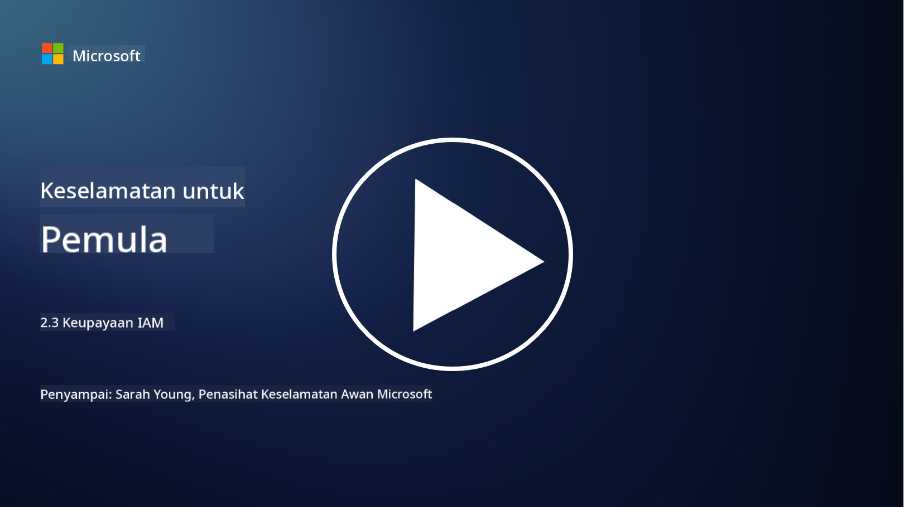

<!--
CO_OP_TRANSLATOR_METADATA:
{
  "original_hash": "bf0b8a54f2c69951744df5a94bc923f7",
  "translation_date": "2025-09-04T01:57:12+00:00",
  "source_file": "2.3 IAM capabilities.md",
  "language_code": "ms"
}
-->
# Keupayaan IAM

Dalam bahagian ini, kita akan membincangkan dengan lebih terperinci tentang alat dan keupayaan teras yang digunakan dalam keselamatan identiti.

## Pengenalan

Dalam pelajaran ini, kita akan membincangkan:

 - Apakah itu perkhidmatan direktori?
      
     
    
 - Apakah jenis keupayaan yang boleh digunakan untuk melindungi identiti?
>
>        Pengesahan Pelbagai Faktor (MFA)
> 
>        Log Masuk Tunggal (SSO)
> 
>        Kawalan Akses Berasaskan Peranan (RBAC)
> 
>        Pengesahan Adaptif
> 
>        Pengesahan Biometrik
> 
>        Pengurusan Akses Istimewa (PAM)
> 
>        Tadbir Urus dan Pentadbiran Identiti (IGA)
> 
>        Analitik Tingkah Laku

## Apakah itu perkhidmatan direktori?

Perkhidmatan direktori ialah pangkalan data khusus yang menyimpan dan mengurus maklumat tentang sumber rangkaian, termasuk pengguna, kumpulan, peranti, aplikasi, dan objek lain. Ia berfungsi sebagai repositori pusat untuk data berkaitan identiti dan akses, membolehkan organisasi mengurus dan mengawal pengesahan pengguna, kebenaran, dan tugas berkaitan keselamatan lain dengan cekap.

Perkhidmatan direktori memainkan peranan penting dalam persekitaran IT moden dengan menyediakan asas untuk penyelesaian pengurusan identiti dan akses (IAM). Ia memudahkan akses selamat kepada sumber, menguatkuasakan dasar akses, dan menyederhanakan tugas pentadbiran. Salah satu perkhidmatan direktori yang paling terkenal ialah Microsoft Active Directory, tetapi terdapat penyelesaian lain seperti direktori LDAP (Lightweight Directory Access Protocol) yang berfungsi untuk tujuan yang sama.

Fungsi dan ciri utama perkhidmatan direktori dalam konteks keselamatan siber termasuk:

 - **Pengesahan Pengguna**: Perkhidmatan direktori mengesahkan kelayakan pengguna (seperti nama pengguna dan kata laluan) untuk memastikan hanya pengguna yang dibenarkan boleh mengakses rangkaian dan sumbernya.
 - **Kebenaran Pengguna**: Ia menentukan tahap akses setiap pengguna berdasarkan peranan mereka, keahlian kumpulan, dan atribut lain. Ini memastikan pengguna hanya boleh mengakses sumber yang mereka layak.
 - **Pengurusan Kumpulan**: Perkhidmatan direktori membolehkan pentadbir mengatur pengguna ke dalam kumpulan logik, menyederhanakan pengurusan kawalan akses. Kebenaran boleh diberikan kepada kumpulan dan bukannya kepada pengguna individu.
 - **Dasar Kata Laluan**: Ia menguatkuasakan peraturan kerumitan dan tamat tempoh kata laluan, meningkatkan keselamatan akaun pengguna.
 - **Log Masuk Tunggal (SSO)**: Sesetengah perkhidmatan direktori menyokong SSO, membolehkan pengguna mengakses pelbagai aplikasi dan perkhidmatan dengan satu set kelayakan.
 - **Pengurusan Pengguna Berpusat**: Perkhidmatan direktori memusatkan maklumat pengguna, menjadikannya lebih mudah untuk mengurus akaun pengguna, profil, dan atribut dari satu lokasi.
 - **Audit dan Log**: Ia boleh merekodkan aktiviti pengesahan dan akses pengguna, membantu dalam audit keselamatan dan usaha pematuhan.

## Apakah jenis keupayaan yang boleh digunakan untuk melindungi identiti?

**Pengesahan Pelbagai Faktor (MFA)**

MFA memerlukan pengguna memberikan pelbagai bentuk pengesahan sebelum diberikan akses. Ini biasanya termasuk sesuatu yang pengguna tahu (kata laluan), sesuatu yang pengguna miliki (telefon pintar atau token keselamatan), dan sesuatu yang pengguna adalah (data biometrik seperti cap jari atau pengecaman wajah).

**Log Masuk Tunggal (SSO)**

SSO membolehkan pengguna mengakses pelbagai aplikasi dan sistem dengan satu set kelayakan. Ini meningkatkan pengalaman pengguna dan mengurangkan risiko yang berkaitan dengan pengurusan pelbagai kata laluan.

**Kawalan Akses Berasaskan Peranan (RBAC)**

RBAC memberikan kebenaran berdasarkan peranan yang telah ditetapkan. Pengguna diberikan akses berdasarkan peranan mereka dalam organisasi.

**Pengesahan Adaptif**

Pengesahan adaptif menilai faktor risiko seperti lokasi, peranti, masa akses, dan tingkah laku pengguna untuk menyesuaikan tahap pengesahan yang diperlukan secara dinamik. Jika permintaan kelihatan mencurigakan, langkah pengesahan tambahan mungkin dicetuskan.

**Pengesahan Biometrik**

Pengesahan biometrik menggunakan ciri biologi unik seperti cap jari, ciri wajah, corak suara, dan juga sifat tingkah laku seperti kelajuan menaip untuk pengesahan identiti.

**Pengurusan Akses Istimewa (PAM)**

PAM memberi tumpuan kepada melindungi akses kepada sistem dan data kritikal dengan menguatkuasakan kawalan ketat ke atas akaun istimewa. Ia termasuk ciri seperti akses tepat pada masanya dan pemantauan sesi.

**Tadbir Urus dan Pentadbiran Identiti (IGA)**

Penyelesaian IGA mengurus identiti pengguna dan akses mereka kepada sumber sepanjang kitaran hayat mereka. Ini termasuk pengambilan pekerja, penyediaan, kawalan akses berasaskan peranan, dan penamatan akses.

**Analitik Tingkah Laku**

Analitik tingkah laku memantau tingkah laku pengguna dan menetapkan corak asas. Penyimpangan daripada norma boleh mencetuskan amaran untuk siasatan lanjut.

# Bacaan lanjut
- [Dokumentasi asas Azure Active Directory - Microsoft Entra | Microsoft Learn](https://learn.microsoft.com/azure/active-directory/fundamentals/?WT.mc_id=academic-96948-sayoung)
- [Apakah itu Azure Active Directory? - Microsoft Entra | Microsoft Learn](https://learn.microsoft.com/azure/active-directory/fundamentals/whatis?WT.mc_id=academic-96948-sayoung)
- [Urus infrastruktur identiti multi-awan anda dengan Microsoft Entra - YouTube](https://www.youtube.com/watch?v=9qQiq3wTS2Y&list=PLXtHYVsvn_b_gtX1-NB62wNervQx1Fhp4&index=18)

---

**Penafian**:  
Dokumen ini telah diterjemahkan menggunakan perkhidmatan terjemahan AI [Co-op Translator](https://github.com/Azure/co-op-translator). Walaupun kami berusaha untuk memastikan ketepatan, sila ambil perhatian bahawa terjemahan automatik mungkin mengandungi kesilapan atau ketidaktepatan. Dokumen asal dalam bahasa asalnya harus dianggap sebagai sumber yang berwibawa. Untuk maklumat yang kritikal, terjemahan manusia profesional adalah disyorkan. Kami tidak bertanggungjawab atas sebarang salah faham atau salah tafsir yang timbul daripada penggunaan terjemahan ini.