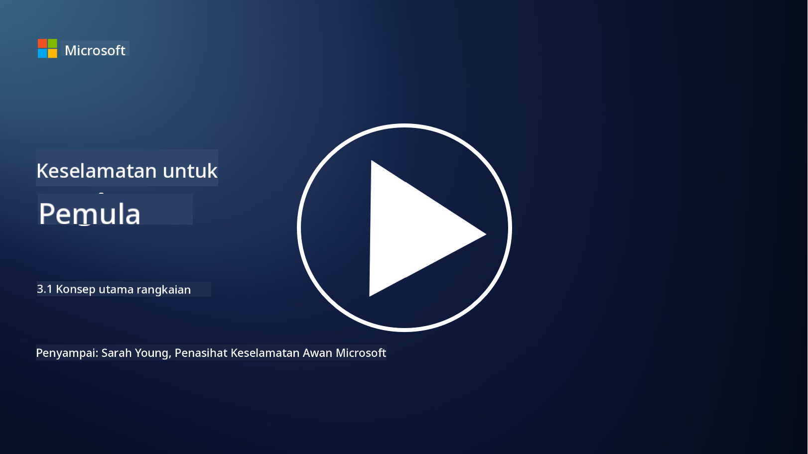
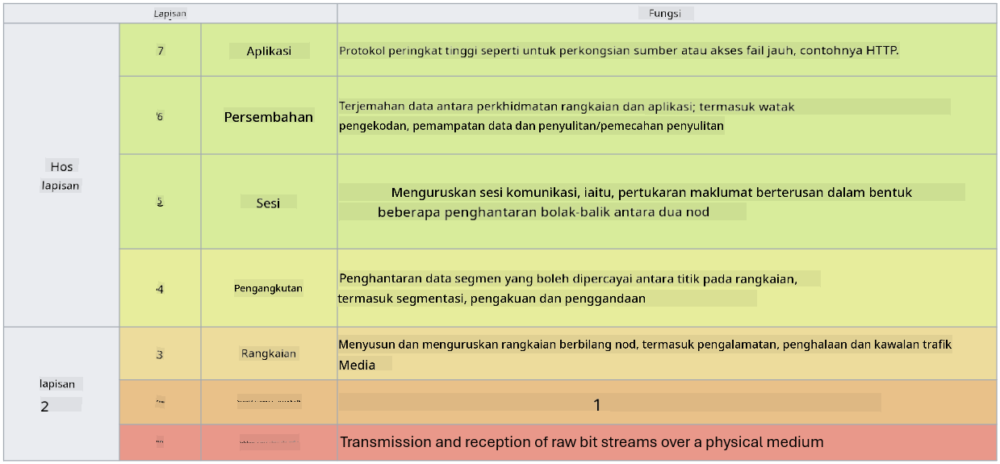

<!--
CO_OP_TRANSLATOR_METADATA:
{
  "original_hash": "252724eceeb183fb9018f88c5e1a3f0c",
  "translation_date": "2025-09-04T01:48:16+00:00",
  "source_file": "3.1 Networking key concepts.md",
  "language_code": "ms"
}
-->
# Konsep Utama Rangkaian

Jika anda pernah bekerja dalam bidang IT, kemungkinan besar anda telah terdedah kepada konsep rangkaian. Walaupun identiti digunakan sebagai kawalan perimeter utama dalam persekitaran moden, ini tidak bermakna kawalan rangkaian tidak lagi relevan. Walaupun topik ini sangat luas, dalam pelajaran ini kita akan membincangkan beberapa konsep utama rangkaian.

Dalam pelajaran ini, kita akan membincangkan:

 - Apakah itu pengalamatan IP?
   
 - Apakah itu model OSI?

 

 - Apakah itu TCP/UDP?

   
 

 - Apakah itu nombor port?

   
  

 - Apakah itu penyulitan semasa disimpan dan semasa dihantar?

## Apakah itu pengalamatan IP?

Pengalamatan IP, atau pengalamatan Protokol Internet, adalah label berangka yang diberikan kepada setiap peranti yang disambungkan ke rangkaian komputer yang menggunakan Protokol Internet untuk komunikasi. Ia berfungsi sebagai pengenal unik untuk peranti dalam rangkaian, membolehkan mereka menghantar dan menerima data melalui internet atau rangkaian lain yang saling bersambung. Terdapat dua versi utama pengalamatan IP: IPv4 (Protokol Internet versi 4) dan IPv6 (Protokol Internet versi 6). Alamat IP biasanya diwakili dalam format IPv4 (contohnya, 192.168.1.1) atau format IPv6 (contohnya, 2001:0db8:85a3:0000:0000:8a2e:0370:7334).

## Apakah itu Model OSI?

Model OSI (Open Systems Interconnection) adalah kerangka konsep yang menyeragamkan fungsi sistem komunikasi kepada tujuh lapisan yang berbeza. Setiap lapisan melaksanakan tugas tertentu dan berkomunikasi dengan lapisan bersebelahan untuk memastikan komunikasi data yang cekap dan boleh dipercayai antara peranti dalam rangkaian. Lapisan-lapisan tersebut, dari bawah ke atas, adalah seperti berikut:

 1. Lapisan Fizikal
    
 
 2. Lapisan Pautan Data

    
    

 1. Lapisan Rangkaian

    
   

 1. Lapisan Pengangkutan

    

 1. Lapisan Sesi

    
   

 1. Lapisan Persembahan

    
    

 1. Lapisan Aplikasi

Model OSI menyediakan rujukan umum untuk memahami bagaimana protokol dan teknologi rangkaian berinteraksi, tanpa mengira perkakasan atau perisian tertentu yang digunakan.

_ref: https://en.wikipedia.org/wiki/OSI_model_

## Apakah itu TCP/UDP?

TCP (Transmission Control Protocol) dan UDP (User Datagram Protocol) adalah dua protokol lapisan pengangkutan asas yang digunakan dalam rangkaian komputer untuk memudahkan komunikasi antara peranti melalui internet atau dalam rangkaian tempatan. Mereka bertanggungjawab untuk memecahkan data kepada paket untuk penghantaran dan kemudian menyusun semula paket tersebut kepada data asal di pihak penerima. Walau bagaimanapun, mereka berbeza dalam ciri dan kes penggunaan mereka.

**TCP (Transmission Control Protocol)**:

TCP adalah protokol berorientasikan sambungan yang menyediakan penghantaran data yang boleh dipercayai dan teratur antara peranti. Ia mewujudkan sambungan antara penghantar dan penerima sebelum pertukaran data bermula. TCP memastikan bahawa paket data tiba dalam urutan yang betul dan boleh mengendalikan penghantaran semula paket yang hilang untuk menjamin integriti dan kelengkapan data. Ini menjadikan TCP sesuai untuk aplikasi yang memerlukan penghantaran data yang boleh dipercayai, seperti pelayaran web, e-mel, pemindahan fail (FTP), dan komunikasi pangkalan data.

**UDP (User Datagram Protocol)**:

UDP adalah protokol tanpa sambungan yang menawarkan penghantaran data yang lebih pantas tetapi tidak menyediakan tahap kebolehpercayaan yang sama seperti TCP. Ia tidak mewujudkan sambungan formal sebelum menghantar data dan tidak termasuk mekanisme untuk mengakui atau menghantar semula paket yang hilang. UDP sesuai untuk aplikasi di mana kelajuan dan kecekapan lebih penting daripada penghantaran yang dijamin, seperti komunikasi masa nyata, penstriman media, permainan dalam talian, dan pertanyaan DNS.

Secara ringkas, TCP mengutamakan kebolehpercayaan dan penghantaran teratur, menjadikannya sesuai untuk aplikasi yang memerlukan ketepatan data, manakala UDP menekankan kelajuan dan kecekapan, menjadikannya sesuai untuk aplikasi di mana kehilangan data kecil atau penyusunan semula urutan boleh diterima sebagai pertukaran untuk pengurangan kependaman. Pemilihan antara TCP dan UDP bergantung pada keperluan khusus aplikasi atau perkhidmatan yang digunakan.

## Apakah itu Nombor Port?

Dalam rangkaian, nombor port adalah pengenal berangka yang digunakan untuk membezakan antara perkhidmatan atau aplikasi yang berbeza yang berjalan pada satu peranti dalam rangkaian. Port membantu mengarahkan data masuk kepada aplikasi yang sesuai. Nombor port adalah integer tanpa tanda 16-bit, yang bermaksud ia berkisar dari 0 hingga 65535. Ia dibahagikan kepada tiga julat:

- Port Terkenal (0-1023): Dikhaskan untuk perkhidmatan standard seperti HTTP (port 80) dan FTP (port 21).

- Port Berdaftar (1024-49151): Digunakan untuk aplikasi dan perkhidmatan yang tidak termasuk dalam julat terkenal tetapi didaftarkan secara rasmi.

- Port Dinamik/Peribadi (49152-65535): Tersedia untuk kegunaan sementara atau peribadi oleh aplikasi.

## Apakah itu Penyulitan Semasa Disimpan dan Semasa Dihantar?

Penyulitan adalah proses menukar data kepada format yang selamat untuk melindunginya daripada akses tanpa kebenaran atau pengubahan. Penyulitan boleh digunakan pada data sama ada "semasa disimpan" (apabila disimpan pada peranti atau pelayan) atau "semasa dihantar" (apabila dihantar antara peranti atau melalui rangkaian).

Penyulitan Semasa Disimpan: Ini melibatkan penyulitan data yang disimpan pada peranti, pelayan, atau sistem storan. Walaupun penyerang mendapat akses fizikal kepada media storan, mereka tidak dapat mengakses data tanpa kunci penyulitan. Ini penting untuk melindungi data sensitif sekiranya berlaku kecurian peranti, pelanggaran data, atau akses tanpa kebenaran.

Penyulitan Semasa Dihantar: Ini melibatkan penyulitan data semasa ia bergerak antara peranti atau melalui rangkaian. Ini menghalang pengintipan dan pemintasan data tanpa kebenaran semasa penghantaran. Protokol biasa untuk penyulitan semasa dihantar termasuk HTTPS untuk komunikasi web dan TLS/SSL untuk melindungi pelbagai jenis trafik rangkaian.

## Bacaan Lanjut
- [How Do IP Addresses Work? (howtogeek.com)](https://www.howtogeek.com/341307/how-do-ip-addresses-work/)
- [Understanding IP Address: An Introductory Guide (geekflare.com)](https://geekflare.com/understanding-ip-address/)
- [What is the OSI model? The 7 layers of OSI explained (techtarget.com)](https://www.techtarget.com/searchnetworking/definition/OSI)
- [The OSI Model – The 7 Layers of Networking Explained in Plain English (freecodecamp.org)](https://www.freecodecamp.org/news/osi-model-networking-layers-explained-in-plain-english/)
- [TCP/IP protocols - IBM Documentation](https://www.ibm.com/docs/en/aix/7.3?topic=protocol-tcpip-protocols)
- [Common Ports Cheat Sheet: The Ultimate Ports & Protocols List (stationx.net)](https://www.stationx.net/common-ports-cheat-sheet/)
- [Azure Data Encryption-at-Rest - Azure Security | Microsoft Learn](https://learn.microsoft.com/azure/security/fundamentals/encryption-atrest?WT.mc_id=academic-96948-sayoung)

---

**Penafian**:  
Dokumen ini telah diterjemahkan menggunakan perkhidmatan terjemahan AI [Co-op Translator](https://github.com/Azure/co-op-translator). Walaupun kami berusaha untuk memastikan ketepatan, sila ambil maklum bahawa terjemahan automatik mungkin mengandungi kesilapan atau ketidaktepatan. Dokumen asal dalam bahasa asalnya harus dianggap sebagai sumber yang berwibawa. Untuk maklumat yang kritikal, terjemahan manusia profesional adalah disyorkan. Kami tidak bertanggungjawab atas sebarang salah faham atau salah tafsir yang timbul daripada penggunaan terjemahan ini.