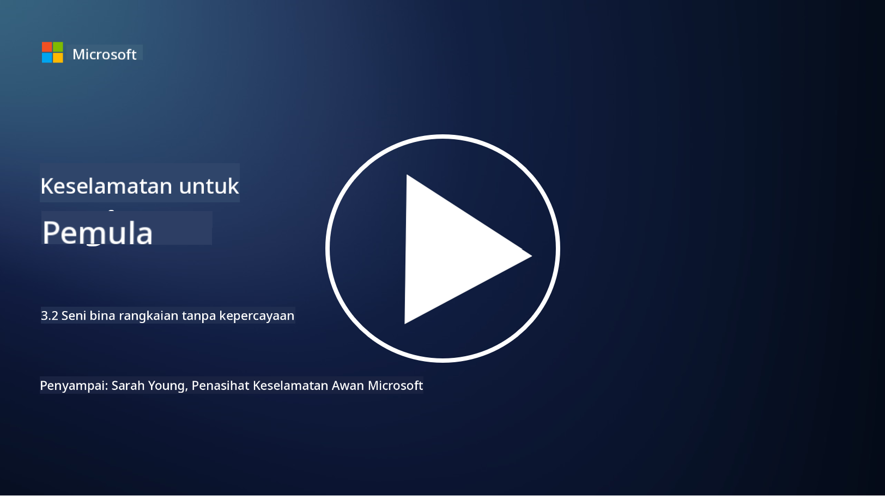

<!--
CO_OP_TRANSLATOR_METADATA:
{
  "original_hash": "680d6e14d9d33fc471c22f44679713f8",
  "translation_date": "2025-09-04T00:39:49+00:00",
  "source_file": "3.2 Networking zero trust architecture.md",
  "language_code": "ms"
}
-->
# Seni bina rangkaian zero trust

Rangkaian menyediakan lapisan penting dalam kawalan zero trust, dalam pelajaran ini kita akan belajar lebih lanjut tentang:

- Apakah itu segmentasi rangkaian?  
- Bagaimana segmentasi rangkaian membantu melaksanakan zero trust?  
- Apakah itu penyulitan hujung ke hujung?

## Apakah itu segmentasi rangkaian?

Segmentasi rangkaian adalah amalan membahagikan rangkaian kepada segmen atau subrangkaian yang lebih kecil dan terasing. Setiap segmen diasingkan daripada yang lain, dan akses antara segmen dikawal dan dihadkan berdasarkan polisi keselamatan tertentu. Segmentasi rangkaian digunakan untuk meningkatkan keselamatan dengan mengehadkan kesan pelanggaran yang berpotensi dan menghadkan pergerakan lateral penyerang dalam rangkaian.

Dengan melaksanakan segmentasi rangkaian, organisasi boleh mencipta "zon" yang memisahkan jenis pengguna, aplikasi, dan data yang berbeza. Ini mengurangkan permukaan serangan dan meminimumkan kerosakan yang berpotensi akibat insiden keselamatan. Segmentasi rangkaian boleh dicapai melalui teknologi seperti virtual LANs (VLANs), firewall, dan kawalan akses.

## Bagaimana segmentasi rangkaian membantu melaksanakan zero trust?

Segmentasi rangkaian selaras dengan prinsip model Zero Trust. Dalam seni bina Zero Trust, segmentasi rangkaian membantu menguatkuasakan prinsip "keistimewaan minimum" dengan memastikan bahawa pengguna dan peranti hanya mempunyai akses kepada sumber dan perkhidmatan tertentu yang mereka perlukan untuk melaksanakan tugas mereka. Dengan membahagikan rangkaian kepada zon yang lebih kecil, organisasi boleh melaksanakan kawalan akses yang ketat, mengasingkan aset kritikal, dan mencegah pergerakan lateral penyerang.

Segmentasi rangkaian juga membantu menguatkuasakan kawalan akses berasaskan identiti, di mana pengguna dan peranti disahkan dan diberi kuasa sepenuhnya sebelum mengakses segmen tertentu. Ini menghalang akses tanpa kebenaran kepada sumber sensitif dan mengurangkan kesan berpotensi daripada kelayakan yang dikompromi.

## Apakah itu penyulitan hujung ke hujung?

Penyulitan hujung ke hujung (E2E) adalah langkah keselamatan yang memastikan data kekal disulitkan sepanjang perjalanan dari penghantar kepada penerima. Dalam proses ini, data disulitkan di penghantar, dan hanya penerima yang memiliki kunci penyahsulitan untuk membuka dan membaca data tersebut. Proses penyulitan dan penyahsulitan berlaku di titik hujung, menjadikannya sangat sukar bagi pihak yang tidak dibenarkan, termasuk penyedia perkhidmatan dan perantara, untuk mengakses data dalam bentuk asalnya.

Penyulitan hujung ke hujung menyediakan tahap kerahsiaan dan keselamatan yang tinggi untuk penghantaran data, walaupun data melalui pelbagai sistem atau rangkaian perantara. Ia sering digunakan dalam aplikasi pemesejan selamat, perkhidmatan e-mel, dan platform komunikasi lain untuk melindungi maklumat sensitif daripada pemintasan dan akses tanpa kebenaran.

Kaedah penyulitan ini memastikan bahawa walaupun penyerang berjaya mendapatkan akses kepada data semasa penghantaran, mereka hanya akan melihat kandungan yang disulitkan yang tidak bermakna tanpa kunci penyahsulitan. Penyulitan hujung ke hujung memainkan peranan penting dalam melindungi privasi pengguna dan melindungi maklumat sensitif daripada didedahkan kepada pihak yang tidak dibenarkan.

## Apakah itu SASE?

SASE adalah singkatan kepada "Secure Access Service Edge," iaitu rangka kerja dan seni bina keselamatan siber yang menggabungkan keselamatan rangkaian dan keupayaan rangkaian kawasan luas (WAN) ke dalam satu perkhidmatan berasaskan awan. SASE direka untuk menyediakan akses yang selamat dan boleh diskalakan kepada sumber rangkaian, aplikasi, dan data untuk pengguna jauh dan mudah alih sambil mempermudah pengurusan rangkaian dan mengurangkan kerumitan seni bina rangkaian dan keselamatan tradisional.

Ciri-ciri utama dan komponen SASE termasuk:

1. **Berasaskan Awan:** SASE disampaikan sebagai perkhidmatan awan, yang bermaksud fungsi keselamatan dan rangkaian disediakan dari awan dan bukan bergantung kepada perkakasan dan peranti di premis.
   
2. **Integrasi Keselamatan dan Rangkaian:** SASE mengintegrasikan pelbagai perkhidmatan keselamatan seperti secure web gateways (SWG), firewall as a service (FWaaS), data loss prevention (DLP), zero-trust network access (ZTNA), dan pengoptimuman WAN dengan keupayaan rangkaian kawasan luas. Integrasi ini membantu menyelaraskan operasi keselamatan dan rangkaian.
   
3. **Zero Trust:** SASE beroperasi berdasarkan prinsip zero trust, yang bermaksud ia menguatkuasakan kawalan akses yang ketat dan polisi akses keistimewaan minimum. Pengguna dan peranti tidak dipercayai secara lalai, dan mereka mesti disahkan dan diberi kuasa sebelum mengakses sumber.
   
4. **Berpusatkan Identiti:** SASE memberi tumpuan kepada identiti pengguna dan peranti sebagai asas untuk kawalan akses. Polisi berasaskan identiti dan konteks digunakan untuk menentukan kebenaran akses, dan polisi ini menyesuaikan diri secara dinamik berdasarkan tingkah laku dan konteks pengguna.
   
5. **Kebolehskalaan dan Fleksibiliti:** SASE boleh diskalakan dengan mudah untuk menampung sejumlah besar pengguna dan peranti, menjadikannya sesuai untuk organisasi dengan keperluan rangkaian dan keselamatan yang pelbagai dan berkembang.

SASE sangat relevan dalam era moden kerja jauh dan penggunaan awan, kerana ia menyediakan pendekatan yang komprehensif dan tangkas untuk mengamankan dan mengurus akses rangkaian. Ia membantu organisasi menyesuaikan diri dengan keperluan keselamatan dan rangkaian yang berubah sambil mengekalkan fokus yang kuat pada model keselamatan berpusatkan pengguna dan zero trust.

## Bacaan lanjut

- [What Is Network Segmentation? - Cisco](https://www.cisco.com/c/en/us/products/security/what-is-network-segmentation.html#~benefits)  
- [What Is Micro-Segmentation? - Cisco](https://www.cisco.com/c/en/us/products/security/what-is-microsegmentation.html)  
- [Implementing Network Segmentation and Segregation | Cyber.gov.au](https://www.cyber.gov.au/resources-business-and-government/maintaining-devices-and-systems/system-hardening-and-administration/network-hardening/implementing-network-segmentation-and-segregation)  
- [What Is Network Segmentation and Why It Matters | CompTIA](https://www.comptia.org/blog/security-awareness-training-network-segmentation)  
- [Network Segmentation: Concepts and Practices (cmu.edu)](https://insights.sei.cmu.edu/blog/network-segmentation-concepts-and-practices/)  
- [Secure networks with Zero Trust | Microsoft Learn](https://learn.microsoft.com/security/zero-trust/deploy/networks?WT.mc_id=academic-96948-sayoung)  
- [What is end-to-end encryption? | IBM](https://www.ibm.com/topics/end-to-end-encryption)  
- [What Is End-to-End Encryption, and Why Does It Matter? (howtogeek.com)](https://www.howtogeek.com/711656/what-is-end-to-end-encryption-and-why-does-it-matter/)  
- [Definition of Secure Access Service Edge (SASE) - Gartner Information Technology Glossary](https://www.gartner.com/en/information-technology/glossary/secure-access-service-edge-sase)  
- [What Is Secure Access Service Edge (SASE)? | Microsoft Security](https://www.microsoft.com/security/business/security-101/what-is-sase?WT.mc_id=academic-96948-sayoung)  

---

**Penafian**:  
Dokumen ini telah diterjemahkan menggunakan perkhidmatan terjemahan AI [Co-op Translator](https://github.com/Azure/co-op-translator). Walaupun kami berusaha untuk memastikan ketepatan, sila ambil maklum bahawa terjemahan automatik mungkin mengandungi kesilapan atau ketidaktepatan. Dokumen asal dalam bahasa asalnya harus dianggap sebagai sumber yang berwibawa. Untuk maklumat penting, terjemahan manusia profesional adalah disyorkan. Kami tidak bertanggungjawab atas sebarang salah faham atau salah tafsir yang timbul daripada penggunaan terjemahan ini.