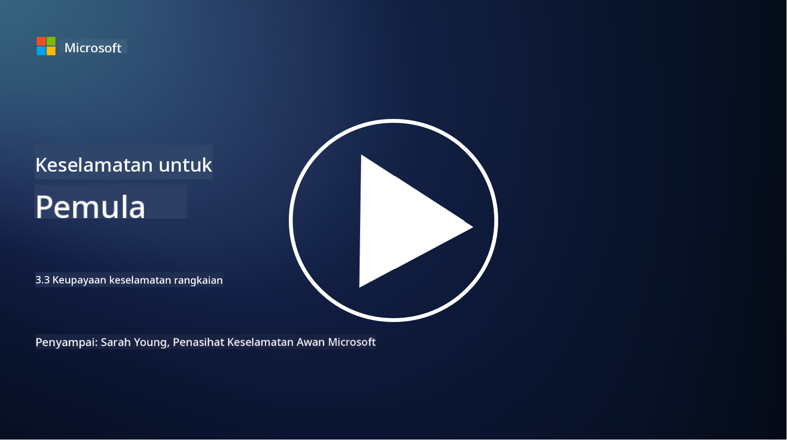

<!--
CO_OP_TRANSLATOR_METADATA:
{
  "original_hash": "c3aba077bb98eebc925dd58d870229ab",
  "translation_date": "2025-09-03T23:34:53+00:00",
  "source_file": "3.3 Network security capabilities.md",
  "language_code": "ms"
}
-->
# Keupayaan keselamatan rangkaian

Dalam pelajaran ini, kita akan mempelajari keupayaan berikut yang boleh digunakan untuk melindungi rangkaian:

 - Firewall tradisional
 - Firewall aplikasi web
 - Kumpulan keselamatan awan
 - CDN
 - Penyeimbang beban
 - Hos bastion
 - VPN
 - Alat perlindungan DDoS

## Firewall Tradisional

Firewall tradisional ialah peranti keselamatan yang mengawal dan memantau trafik rangkaian masuk dan keluar berdasarkan peraturan keselamatan yang telah ditetapkan. Ia bertindak sebagai penghalang antara rangkaian dalaman yang dipercayai dan rangkaian luaran yang tidak dipercayai, menapis trafik untuk mencegah akses tanpa kebenaran dan ancaman yang berpotensi.

## Firewall Aplikasi Web

Firewall Aplikasi Web (WAF) ialah firewall khusus yang direka untuk melindungi aplikasi web daripada pelbagai serangan, seperti suntikan SQL, skrip lintas tapak, dan kelemahan lain. Ia menganalisis permintaan dan respons HTTP untuk mengenal pasti dan menyekat trafik berniat jahat yang menyasarkan aplikasi web.

## Kumpulan Keselamatan Awan

Kumpulan keselamatan ialah ciri keselamatan rangkaian asas yang disediakan oleh penyedia perkhidmatan awan. Ia bertindak sebagai firewall maya yang mengawal trafik masuk dan keluar ke dan dari sumber awan, seperti mesin maya (VM) dan instans. Kumpulan keselamatan membolehkan organisasi menentukan peraturan yang menentukan jenis trafik yang dibenarkan dan ditolak, menambah lapisan pertahanan tambahan kepada penggelaran awan.

## Rangkaian Penghantaran Kandungan (CDN)

Rangkaian Penghantaran Kandungan ialah rangkaian pelayan yang diedarkan di pelbagai lokasi geografi. CDN membantu meningkatkan prestasi dan ketersediaan laman web dengan menyimpan kandungan dan menyampaikannya dari pelayan yang lebih dekat dengan pengguna. Ia juga menyediakan tahap perlindungan terhadap serangan DDoS dengan mengagihkan trafik ke pelbagai lokasi pelayan.

## Penyeimbang Beban

Penyeimbang beban mengagihkan trafik rangkaian masuk ke pelbagai pelayan untuk mengoptimumkan penggunaan sumber, memastikan ketersediaan tinggi, dan meningkatkan prestasi aplikasi. Ia membantu mencegah beban berlebihan pada pelayan dan mengekalkan masa tindak balas yang efisien, meningkatkan daya tahan rangkaian.

## Hos Bastion

Hos bastion ialah pelayan yang sangat selamat dan terasing yang menyediakan akses terkawal ke rangkaian dari rangkaian luaran yang tidak dipercayai (seperti internet). Ia berfungsi sebagai titik masuk untuk pentadbir mengakses sistem dalaman dengan selamat. Hos bastion biasanya dikonfigurasikan dengan langkah keselamatan yang kukuh untuk meminimumkan permukaan serangan.

## Rangkaian Peribadi Maya (VPN)

VPN mencipta terowong yang disulitkan antara peranti pengguna dan pelayan jauh, memastikan komunikasi yang selamat dan peribadi melalui rangkaian yang berpotensi tidak selamat seperti internet. VPN biasanya digunakan untuk menyediakan akses jauh ke rangkaian dalaman, membolehkan pengguna mengakses sumber seolah-olah mereka berada dalam rangkaian yang sama secara fizikal.

## Alat Perlindungan DDoS

Alat dan perkhidmatan perlindungan DDoS (Distributed Denial of Service) direka untuk mengurangkan kesan serangan DDoS, di mana pelbagai peranti yang dikompromi membanjiri rangkaian atau perkhidmatan untuk membebankannya. Penyelesaian perlindungan DDoS mengenal pasti dan menapis trafik berniat jahat, memastikan trafik yang sah masih boleh sampai ke destinasi yang dimaksudkan.

## Bacaan lanjut

- [What Is a Firewall? - Cisco](https://www.cisco.com/c/en/us/products/security/firewalls/what-is-a-firewall.html#~types-of-firewalls)
- [What Does a Firewall Actually Do? (howtogeek.com)](https://www.howtogeek.com/144269/htg-explains-what-firewalls-actually-do/)
- [What is a Firewall? How Firewalls Work & Types of Firewalls (kaspersky.com)](https://www.kaspersky.com/resource-center/definitions/firewall)
- [Network security group - how it works | Microsoft Learn](https://learn.microsoft.com/azure/virtual-network/network-security-group-how-it-works)
- [Introduction to Azure Content Delivery Network (CDN) - Training | Microsoft Learn](https://learn.microsoft.com/training/modules/intro-to-azure-content-delivery-network/?WT.mc_id=academic-96948-sayoung)
- [What is a content delivery network (CDN)? - Azure | Microsoft Learn](https://learn.microsoft.com/azure/cdn/cdn-overview?WT.mc_id=academic-96948-sayoung)
- [What Is Load Balancing? How Load Balancers Work (nginx.com)](https://www.nginx.com/resources/glossary/load-balancing/)
- [Bastion hosts vs. VPNs · Tailscale](https://tailscale.com/learn/bastion-hosts-vs-vpns/)
- [What is VPN? How It Works, Types of VPN (kaspersky.com)](https://www.kaspersky.com/resource-center/definitions/what-is-a-vpn)
- [Introduction to Azure DDoS Protection - Training | Microsoft Learn](https://learn.microsoft.com/training/modules/introduction-azure-ddos-protection/?WT.mc_id=academic-96948-sayoung)
- [What Is a DDoS Attack? | Microsoft Security](https://www.microsoft.com/security/business/security-101/what-is-a-ddos-attack?WT.mc_id=academic-96948-sayoung)

---

**Penafian**:  
Dokumen ini telah diterjemahkan menggunakan perkhidmatan terjemahan AI [Co-op Translator](https://github.com/Azure/co-op-translator). Walaupun kami berusaha untuk memastikan ketepatan, sila ambil perhatian bahawa terjemahan automatik mungkin mengandungi kesilapan atau ketidaktepatan. Dokumen asal dalam bahasa asalnya harus dianggap sebagai sumber yang berwibawa. Untuk maklumat yang kritikal, terjemahan manusia profesional adalah disyorkan. Kami tidak bertanggungjawab atas sebarang salah faham atau salah tafsir yang timbul daripada penggunaan terjemahan ini.