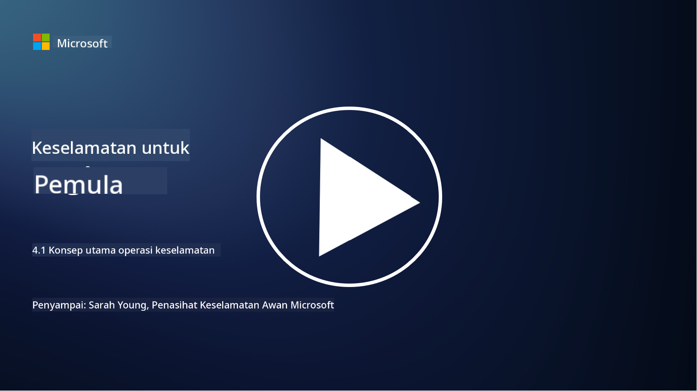

<!--
CO_OP_TRANSLATOR_METADATA:
{
  "original_hash": "6a55b31df9eebf550d040cef0ef7dff3",
  "translation_date": "2025-09-04T02:04:16+00:00",
  "source_file": "4.1 SecOps key concepts.md",
  "language_code": "ms"
}
-->
# Konsep Utama Operasi Keselamatan

Operasi keselamatan adalah komponen penting dalam fungsi keselamatan keseluruhan sesebuah organisasi. Dalam pelajaran ini, kita akan mempelajari lebih lanjut tentang ini:

 - Apakah fungsi operasi keselamatan dalam perniagaan?
   
 - Bentuk apa yang boleh diambil oleh operasi keselamatan?
   
   - Bagaimana operasi keselamatan berbeza daripada operasi IT tradisional?

## Apakah fungsi operasi keselamatan dalam perniagaan?

Fungsi operasi keselamatan dalam perniagaan merujuk kepada pasukan atau jabatan khusus yang bertanggungjawab untuk memantau, mengesan, menyiasat, dan bertindak balas terhadap ancaman dan insiden keselamatan siber. Matlamat utama fungsi operasi keselamatan adalah untuk memastikan kerahsiaan, integriti, dan ketersediaan aset digital organisasi dengan secara proaktif mengenal pasti dan mengurangkan risiko keselamatan serta bertindak balas dengan berkesan terhadap insiden keselamatan.

## Bentuk apa yang boleh diambil oleh operasi keselamatan?

Operasi keselamatan boleh mengambil pelbagai bentuk bergantung kepada saiz dan kerumitan organisasi. Beberapa bentuk biasa termasuk:

**Pusat Operasi Keselamatan (SOC):** Pasukan berpusat yang bertanggungjawab untuk pemantauan, analisis, dan tindak balas terhadap acara keselamatan secara 24/7. SOC sering menggunakan alat dan teknologi canggih untuk mengenal pasti dan bertindak balas terhadap ancaman secara masa nyata.

**Pasukan Tindak Balas Insiden:** Pasukan khusus yang memberi tumpuan kepada tindak balas terhadap insiden dan pelanggaran keselamatan. Mereka menjalankan siasatan, menyelaraskan usaha tindak balas, dan memudahkan pemulihan.

**Pasukan Pemburu Ancaman:** Pasukan yang secara proaktif mencari tanda-tanda ancaman maju dan kelemahan tersembunyi yang mungkin tidak dikesan oleh alat keselamatan tradisional.

**Pasukan Merah/Pasukan Biru:** Pasukan merah mensimulasikan serangan untuk mengenal pasti kelemahan, manakala pasukan biru mempertahankan daripada serangan tersebut. Kedua-dua pasukan bekerjasama untuk meningkatkan langkah keselamatan.

**Penyedia Perkhidmatan Keselamatan Terurus (MSSP):** Sesetengah organisasi menyerahkan operasi keselamatan mereka kepada penyedia pihak ketiga yang pakar dalam pemantauan keselamatan dan tindak balas insiden.

## Bagaimana operasi keselamatan berbeza daripada operasi IT tradisional?

Operasi keselamatan dan operasi IT tradisional adalah fungsi yang berkaitan tetapi berbeza:

**Fokus:** Operasi IT memberi tumpuan kepada pengurusan dan penyelenggaraan infrastruktur IT organisasi, memastikan fungsinya dan ketersediaannya. Operasi keselamatan, sebaliknya, mengutamakan mengenal pasti dan mengurangkan risiko keselamatan serta bertindak balas terhadap insiden.

**Tanggungjawab:** Operasi IT mengendalikan tugas seperti penyelenggaraan sistem, kemas kini perisian, dan sokongan pengguna. Operasi keselamatan mengendalikan pengesanan ancaman, tindak balas insiden, pengurusan kelemahan, dan pemantauan keselamatan.

**Ketepatan Masa:** Operasi IT menekankan ketersediaan dan prestasi sistem segera. Operasi keselamatan memberi tumpuan kepada mengenal pasti dan menyelesaikan ancaman, yang mungkin tidak selalu selaras dengan ketersediaan segera.

**Set Kemahiran:** Operasi keselamatan memerlukan kemahiran khusus dalam analisis ancaman, tindak balas insiden, dan alat keselamatan siber. Operasi IT memerlukan kepakaran dalam pentadbiran sistem, pengurusan rangkaian, dan sokongan aplikasi.

## Aliran kerja tindak balas insiden

Fungsi Teras Rangka Kerja Keselamatan Siber NIST menyenaraikan lima fungsi utama yang harus dilakukan secara berterusan sebagai sebahagian daripada persekitaran operasi organisasi untuk mengurangkan risiko keselamatan siber.

Adalah penting untuk menghargai bahawa aktiviti ini harus wujud sebagai sebahagian daripada lingkaran yang lebih besar yang menyambung dan sejajar dengan proses keselamatan siber yang lebih luas dalam organisasi.

**Nota:** Anda boleh membaca lebih lanjut tentang Rangka Kerja Keselamatan Siber NIST di [https://www.nist.gov/cybersecurity](https://www.nist.gov/cybersecurity)

## Bacaan lanjut

- [Operasi keselamatan | Microsoft Learn](https://learn.microsoft.com/security/operations/overview?WT.mc_id=academic-96948-sayoung)
- [Melaksanakan proses operasi keselamatan | Microsoft Learn](https://learn.microsoft.com/security/operations/?WT.mc_id=academic-96948-sayoung)
- [Apakah pusat operasi keselamatan (SOC)? | Microsoft Security](https://www.microsoft.com/security/business/security-101/what-is-a-security-operations-center-soc?WT.mc_id=academic-96948-sayoung)
- [Apakah Pusat Operasi Keselamatan | Keselamatan Siber | CompTIA](https://www.comptia.org/content/articles/what-is-a-security-operations-center)

---

**Penafian**:  
Dokumen ini telah diterjemahkan menggunakan perkhidmatan terjemahan AI [Co-op Translator](https://github.com/Azure/co-op-translator). Walaupun kami berusaha untuk memastikan ketepatan, sila ambil maklum bahawa terjemahan automatik mungkin mengandungi kesilapan atau ketidaktepatan. Dokumen asal dalam bahasa asalnya harus dianggap sebagai sumber yang berwibawa. Untuk maklumat penting, terjemahan manusia profesional adalah disyorkan. Kami tidak bertanggungjawab atas sebarang salah faham atau salah tafsir yang timbul daripada penggunaan terjemahan ini.