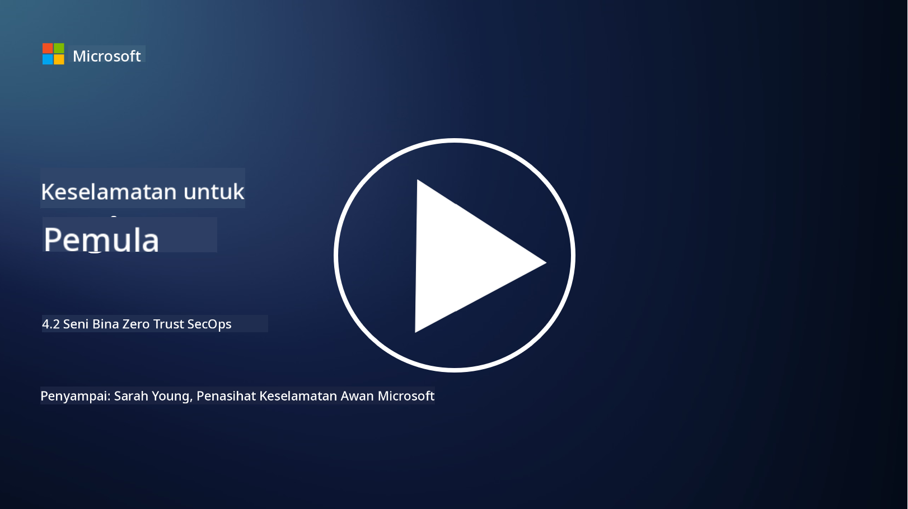

<!--
CO_OP_TRANSLATOR_METADATA:
{
  "original_hash": "45bbdc114e70936816b0b3e7c40189cf",
  "translation_date": "2025-09-04T00:46:08+00:00",
  "source_file": "4.2 SecOps zero trust architecture.md",
  "language_code": "ms"
}
-->
# Seni Bina Zero Trust untuk Operasi Keselamatan

Operasi keselamatan membentuk dua bahagian seni bina zero trust, dan dalam pelajaran ini kita akan mempelajari kedua-duanya:

- Bagaimana seni bina IT harus dibangunkan untuk membolehkan pengumpulan log secara berpusat?

- Apakah amalan terbaik untuk operasi keselamatan dalam persekitaran IT moden?

## Bagaimana seni bina IT harus dibangunkan untuk membolehkan pengumpulan log secara berpusat?

Pengumpulan log secara berpusat adalah komponen penting dalam operasi keselamatan moden. Ia membolehkan organisasi mengumpulkan log dan data daripada pelbagai sumber, seperti pelayan, aplikasi, peranti rangkaian, dan alat keselamatan, ke dalam repositori pusat untuk analisis, pemantauan, dan tindak balas insiden. Berikut adalah beberapa amalan terbaik untuk membangunkan seni bina IT yang menyokong pengumpulan log secara berpusat:

1. **Integrasi Sumber Log**:

- Pastikan semua peranti dan sistem yang relevan dikonfigurasikan untuk menjana log. Ini termasuk pelayan, firewall, router, switch, aplikasi, dan peralatan keselamatan.

- Konfigurasikan sumber log untuk menghantar log ke pengumpul log atau sistem pengurusan log secara berpusat.

2. **Pilih alat SIEM (Security Information and Event Management) yang sesuai**:

- Pilih penyelesaian SIEM (Security Information and Event Management) yang sejajar dengan keperluan dan skala organisasi anda.

- Pastikan penyelesaian yang dipilih menyokong pengumpulan, pengagregatan, analisis, dan pelaporan log.

3. **Kebolehskalaan dan Redundansi**:

- Reka bentuk seni bina untuk kebolehskalaan bagi menampung peningkatan jumlah sumber log dan volum log.

- Laksanakan redundansi untuk ketersediaan tinggi bagi mengelakkan gangguan akibat kegagalan perkakasan atau rangkaian.

4. **Pengangkutan log secara selamat**:

- Gunakan protokol selamat seperti TLS/SSL atau IPsec untuk mengangkut log dari sumber ke repositori pusat.

- Laksanakan pengesahan dan kawalan akses untuk memastikan hanya peranti yang dibenarkan boleh menghantar log.

5. **Normalisasi**:

- Standardkan format log dan normalkan data untuk memastikan konsistensi dan kemudahan analisis.

6. **Penyimpanan dan Pengekalan**:

- Tentukan tempoh pengekalan log yang sesuai berdasarkan keperluan pematuhan dan keselamatan.

- Simpan log dengan selamat, melindunginya daripada akses tanpa kebenaran dan pengubahan.

## Apakah amalan terbaik untuk operasi keselamatan dalam persekitaran IT moden?

Selain pengumpulan log secara berpusat, berikut adalah beberapa amalan terbaik untuk operasi keselamatan dalam persekitaran IT moden:

1. **Pemantauan Berterusan**: Laksanakan pemantauan berterusan terhadap aktiviti rangkaian dan sistem untuk mengesan dan bertindak balas terhadap ancaman secara masa nyata.

2. **Perisikan Ancaman**: Kekal dimaklumkan tentang ancaman dan kelemahan yang muncul dengan memanfaatkan suapan dan perkhidmatan perisikan ancaman.

3. **Latihan Pengguna**: Adakan latihan kesedaran keselamatan secara berkala untuk pekerja bagi mengurangkan risiko yang berkaitan dengan kejuruteraan sosial dan serangan phishing.

4. **Pelan Tindak Balas Insiden**: Bangunkan dan uji pelan tindak balas insiden untuk memastikan tindak balas yang pantas dan berkesan terhadap insiden keselamatan.

5. **Automasi Keselamatan**: Manfaatkan alat automasi dan orkestrasi keselamatan untuk menyelaraskan tindak balas insiden dan tugas berulang.

6. **Sandaran dan Pemulihan**: Laksanakan penyelesaian sandaran dan pemulihan bencana yang kukuh untuk memastikan ketersediaan data sekiranya berlaku kehilangan data atau serangan ransomware.

## Bacaan lanjut

- [Microsoft Security Best Practices module: Security operations | Microsoft Learn](https://learn.microsoft.com/security/operations/security-operations-videos-and-decks?WT.mc_id=academic-96948-sayoung)
- [Security operations - Cloud Adoption Framework | Microsoft Learn](https://learn.microsoft.com/azure/cloud-adoption-framework/secure/security-operations?WT.mc_id=academic-96948-sayoung)
- [What is Security Operations and Analytics Platform Architecture? A Definition of SOAPA, How It Works, Benefits, and More (digitalguardian.com)](https://www.digitalguardian.com/blog/what-security-operations-and-analytics-platform-architecture-definition-soapa-how-it-works#:~:text=All%20in%20all%2C%20security%20operations%20and%20analytics%20platform,become%20more%20efficient%20and%20operative%20with%20your%20security.)

---

**Penafian**:  
Dokumen ini telah diterjemahkan menggunakan perkhidmatan terjemahan AI [Co-op Translator](https://github.com/Azure/co-op-translator). Walaupun kami berusaha untuk memastikan ketepatan, sila ambil maklum bahawa terjemahan automatik mungkin mengandungi kesilapan atau ketidaktepatan. Dokumen asal dalam bahasa asalnya harus dianggap sebagai sumber yang berwibawa. Untuk maklumat penting, terjemahan manusia profesional adalah disyorkan. Kami tidak bertanggungjawab atas sebarang salah faham atau salah tafsir yang timbul daripada penggunaan terjemahan ini.