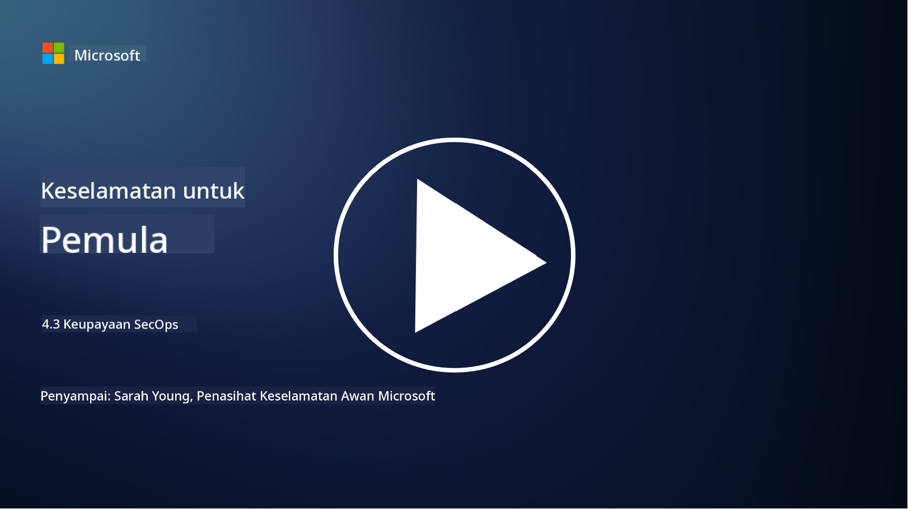

<!--
CO_OP_TRANSLATOR_METADATA:
{
  "original_hash": "553eb694c89f1caca0694e8d8ab89e0e",
  "translation_date": "2025-09-04T01:21:00+00:00",
  "source_file": "4.3 SecOps capabilities.md",
  "language_code": "ms"
}
-->
# Keupayaan SecOps

Dalam bahagian ini, kita akan membincangkan dengan lebih terperinci tentang alat dan keupayaan teras yang boleh digunakan dalam operasi keselamatan.

Dalam pelajaran ini, kita akan membincangkan:

- Apakah alat pengurusan maklumat keselamatan dan acara (SIEM)?

- Apakah XDR?

- Apakah jenis keupayaan yang boleh digunakan untuk meningkatkan operasi keselamatan?

## Apakah alat pengurusan maklumat keselamatan dan acara (SIEM)?

Alat Pengurusan Maklumat Keselamatan dan Acara (SIEM) digunakan untuk menyediakan analisis terhadap amaran keselamatan yang dihasilkan di seluruh persekitaran IT organisasi. Ia mengumpul, mengagregat, menghubungkan, dan menganalisis data log dan acara keselamatan daripada pelbagai sumber, seperti peranti rangkaian, pelayan, aplikasi, dan sistem keselamatan.

Fungsi utama dan keupayaan alat SIEM termasuk:

1. **Pengumpulan Log**: Alat SIEM mengumpul log dan data acara keselamatan daripada pelbagai peranti, sistem, dan aplikasi, termasuk firewall, sistem pengesanan pencerobohan, perisian antivirus, dan banyak lagi.

2. **Normalisasi Data**: Ia menormalkan data log ke dalam format yang sama untuk memudahkan analisis dan korelasi.

3. **Korelasi Acara**: Alat SIEM menghubungkan acara untuk mengenal pasti corak dan anomali yang mungkin menunjukkan insiden atau ancaman keselamatan.

4. **Amaran dan Pemberitahuan**: Alat SIEM menjana amaran dan pemberitahuan secara masa nyata apabila aktiviti mencurigakan atau pelanggaran keselamatan dikesan, membolehkan tindak balas segera.

5. **Pengesanan Insiden**: Ia memudahkan pengesanan insiden keselamatan, termasuk akses tanpa kebenaran, pelanggaran data, jangkitan malware, dan ancaman dalaman.

6. **Analitik Tingkah Laku Pengguna dan Entiti (UEBA)**: Sesetengah alat SIEM menggabungkan keupayaan UEBA untuk mengenal pasti tingkah laku pengguna dan entiti yang tidak normal yang mungkin menunjukkan akaun yang dikompromi atau ancaman dalaman.

7. **Integrasi Perisikan Ancaman**: Alat SIEM boleh diintegrasikan dengan suapan perisikan ancaman untuk meningkatkan pengesanan ancaman dengan membandingkan petunjuk kompromi (IOC) yang diketahui dengan aktiviti rangkaian.

8. **Automasi dan Orkestrasi**: Ciri automasi membolehkan SIEM mengautomasikan tindak balas kepada insiden keselamatan biasa, mengurangkan masa tindak balas dan usaha manual.

9. **Papan Pemuka dan Visualisasi**: Ia menawarkan papan pemuka dan alat visualisasi untuk memantau data keselamatan dan mencipta laporan tersuai.

10. **Integrasi dengan Alat Keselamatan Lain**: Alat SIEM sering diintegrasikan dengan alat dan teknologi keselamatan lain, seperti penyelesaian pengesanan dan tindak balas titik akhir (EDR), untuk memberikan pandangan menyeluruh tentang postur keselamatan organisasi.

## Apakah XDR?

XDR (Extended Detection and Response) ialah teknologi yang memperluaskan keupayaan Pengesanan dan Tindak Balas Titik Akhir (EDR) tradisional dan menggabungkannya dengan telemetri keselamatan yang lebih luas daripada pelbagai sumber untuk memberikan pandangan yang lebih komprehensif tentang postur keselamatan organisasi. XDR bertujuan untuk meningkatkan pengesanan ancaman, tindak balas insiden, dan keselamatan keseluruhan dengan menangani batasan bergantung semata-mata pada EDR, SIEM, atau alat keselamatan individu lain.

Ciri utama dan komponen XDR termasuk:

1. **Integrasi Data**: XDR mengintegrasikan data daripada pelbagai sumber, termasuk titik akhir, trafik rangkaian, perkhidmatan awan, e-mel, dan banyak lagi. Pengagregatan data yang komprehensif ini memberikan konteks yang lebih luas untuk pengesanan dan analisis ancaman.

2. **Analitik Lanjutan**: XDR menggunakan analitik lanjutan, pembelajaran mesin, dan analisis tingkah laku untuk mengenal pasti dan memprioritaskan ancaman keselamatan. Ia mencari corak dan anomali dalam data yang diintegrasikan untuk mengesan ancaman yang diketahui dan tidak diketahui.

3. **Pengesanan Ancaman Automatik**: XDR mengautomasikan pengesanan ancaman keselamatan dan anomali dengan menghubungkan maklumat daripada pelbagai sumber. Ia boleh mengenal pasti rantaian serangan kompleks yang mungkin merangkumi pelbagai vektor.

4. **Penyiasatan dan Tindak Balas Insiden**: XDR menyediakan alat untuk penyiasatan dan tindak balas insiden, membantu pasukan keselamatan menilai skop dan kesan insiden dengan cepat dan mengambil tindakan pembetulan yang sesuai.

5. **Integrasi Perisikan Ancaman**: Ia mengintegrasikan suapan dan data perisikan ancaman untuk meningkatkan pengesanan ancaman dengan membandingkan petunjuk kompromi (IOC) yang diketahui dengan aktiviti rangkaian dan titik akhir organisasi.

6. **Konsol Bersepadu**: XDR biasanya menawarkan konsol atau papan pemuka bersepadu di mana pasukan keselamatan boleh melihat dan mengurus amaran dan insiden keselamatan daripada pelbagai sumber secara terpusat.

7. **Liputan Merentas Platform**: Penyelesaian XDR merangkumi pelbagai platform, termasuk titik akhir, pelayan, persekitaran awan, dan peranti mudah alih, menjadikannya sesuai untuk persekitaran IT moden yang berbilang platform.

## Apakah jenis keupayaan yang boleh digunakan untuk meningkatkan operasi keselamatan?

Untuk meningkatkan operasi keselamatan, organisasi boleh memanfaatkan beberapa keupayaan selain alat SIEM:

1. **Pembelajaran Mesin dan Kecerdasan Buatan**: Melaksanakan analitik lanjutan, pembelajaran mesin, dan AI untuk mengesan ancaman yang berkembang dan mengautomasikan pemburuan ancaman.

2. **Analitik Tingkah Laku Pengguna dan Entiti (UEBA)**: Menganalisis tingkah laku pengguna dan entiti untuk mengesan anomali dan ancaman dalaman.

3. **Suapan Perisikan Ancaman**: Mengintegrasikan suapan perisikan ancaman untuk kekal terkini dengan ancaman terkini dan petunjuk kompromi.

4. **Orkestrasi, Automasi, dan Tindak Balas Keselamatan (SOAR)**: Melaksanakan platform SOAR untuk mengautomasikan tindak balas insiden dan menyelaraskan aliran kerja operasi keselamatan.

5. **Teknologi Penipuan**: Menggunakan teknologi penipuan untuk mengelirukan dan mengesan penyerang dalam rangkaian.

## Bacaan lanjut

- [What is SIEM? | Microsoft Security](https://www.microsoft.com/security/business/security-101/what-is-siem?WT.mc_id=academic-96948-sayoung)
- [What Is SIEM? - Security Information and Event Management - Cisco](https://www.cisco.com/c/en/us/products/security/what-is-siem.html)
- [Security information and event management - Wikipedia](https://en.wikipedia.org/wiki/Security_information_and_event_management)
- [What Is XDR? | Microsoft Security](https://www.microsoft.com/security/business/security-101/what-is-xdr?WT.mc_id=academic-96948-sayoung)
- [XDR & XDR Security (kaspersky.com.au)](https://www.kaspersky.com.au/resource-center/definitions/what-is-xdr)
- [The Power of SecOps: Redefining Core Security Capabilities - The New Stack](https://thenewstack.io/the-power-of-secops-redefining-core-security-capabilities/)
- [Seven Steps to Improve Your Security Operations and Response (securityintelligence.com)](https://securityintelligence.com/seven-steps-to-improve-your-security-operations-and-response/)

---

**Penafian**:  
Dokumen ini telah diterjemahkan menggunakan perkhidmatan terjemahan AI [Co-op Translator](https://github.com/Azure/co-op-translator). Walaupun kami berusaha untuk memastikan ketepatan, sila ambil perhatian bahawa terjemahan automatik mungkin mengandungi kesilapan atau ketidaktepatan. Dokumen asal dalam bahasa asalnya harus dianggap sebagai sumber yang berwibawa. Untuk maklumat penting, terjemahan manusia profesional adalah disyorkan. Kami tidak bertanggungjawab atas sebarang salah faham atau salah tafsir yang timbul daripada penggunaan terjemahan ini.