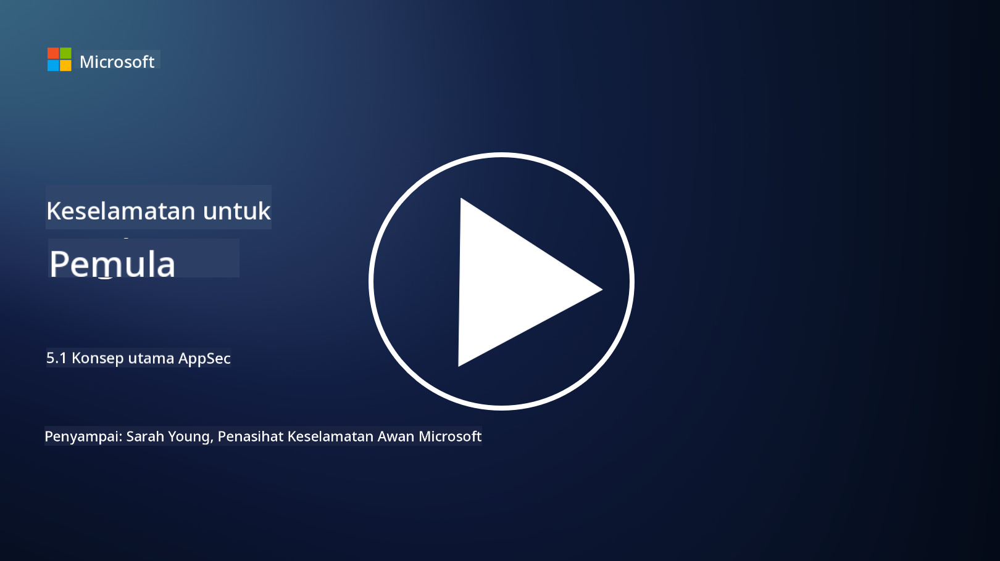

<!--
CO_OP_TRANSLATOR_METADATA:
{
  "original_hash": "e4b56bb23078d3ffb7ad407d280b0c36",
  "translation_date": "2025-09-04T00:33:14+00:00",
  "source_file": "5.1 AppSec key concepts.md",
  "language_code": "ms"
}
-->
# Konsep Utama AppSec

Keselamatan aplikasi adalah satu bidang pengkhususan keselamatan yang tersendiri. Dalam bahagian kursus ini, kita akan mendalami keselamatan aplikasi.

## Pengenalan

Dalam pelajaran ini, kita akan membincangkan:

- Apa itu keselamatan aplikasi?

- Apakah konsep/prinsip utama keselamatan aplikasi?

## Apa itu keselamatan aplikasi?

Keselamatan aplikasi, sering disingkatkan sebagai "AppSec," merujuk kepada amalan melindungi aplikasi perisian daripada ancaman keselamatan, kelemahan, dan serangan. Ia merangkumi proses, teknik, dan alat yang digunakan untuk mengenal pasti, mengurangkan, dan mencegah risiko keselamatan sepanjang kitaran pembangunan, penyebaran, dan penyelenggaraan aplikasi.

Keselamatan aplikasi adalah penting kerana aplikasi sering menjadi sasaran serangan siber. Pelaku jahat mengeksploitasi kelemahan dan kekurangan dalam perisian untuk mendapatkan akses tanpa kebenaran, mencuri data, mengganggu perkhidmatan, atau melaksanakan aktiviti jahat lain. Keselamatan aplikasi yang berkesan membantu memastikan kerahsiaan, integriti, dan ketersediaan aplikasi serta data yang berkaitan.

## Apakah konsep/prinsip utama keselamatan aplikasi?

Konsep dan prinsip utama yang mendasari keselamatan aplikasi termasuk:

1. **Reka Bentuk Selamat**:

- Keselamatan harus diintegrasikan ke dalam reka bentuk dan seni bina aplikasi dari awal, bukan ditambah kemudian.

2. **Pengesahan Input**:

- Semua input pengguna harus disahkan untuk memastikan ia mematuhi format yang dijangka dan bebas daripada kod atau data berbahaya.

3. **Pengekodan Output**:

- Data yang dihantar kepada klien harus dikodkan dengan betul untuk mencegah kelemahan seperti cross-site scripting (XSS).

4. **Pengesahan dan Kebenaran**:

- Sahkan pengguna dan benarkan akses mereka kepada sumber berdasarkan peranan dan kebenaran mereka.

5. **Perlindungan Data**:

- Data sensitif harus dienkripsi semasa disimpan, dihantar, dan diproses untuk mencegah akses tanpa kebenaran.

6. **Pengurusan Sesi**:

- Pengurusan sesi yang selamat memastikan sesi pengguna dilindungi daripada pengambilalihan dan akses tanpa kebenaran.

7. **Kebergantungan Selamat**:

- Pastikan semua kebergantungan perisian dikemas kini dengan tampalan keselamatan untuk mencegah kelemahan.

8. **Pengendalian Ralat dan Log**:

- Laksanakan pengendalian ralat yang selamat untuk mengelakkan pendedahan maklumat sensitif dan pastikan amalan log yang selamat.

9. **Ujian Keselamatan**:

- Uji aplikasi secara berkala untuk kelemahan menggunakan kaedah seperti ujian penembusan, semakan kod, dan alat pengimbasan automatik.

10. **Kitaran Hayat Pembangunan Perisian Selamat (SDLC)**:

- Integrasikan amalan keselamatan ke dalam setiap fasa kitaran hayat pembangunan perisian, dari keperluan hingga penyebaran dan penyelenggaraan.

## Bacaan lanjut

- [SheHacksPurple: Apa itu Keselamatan Aplikasi? - YouTube](https://www.youtube.com/watch?v=eNmccQNzSSY)
- [Apa Itu Keselamatan Aplikasi? - Cisco](https://www.cisco.com/c/en/us/solutions/security/application-first-security/what-is-application-security.html#~how-does-it-work)
- [Apa itu keselamatan aplikasi? Proses dan alat untuk melindungi perisian | CSO Online](https://www.csoonline.com/article/566471/what-is-application-security-a-process-and-tools-for-securing-software.html)
- [OWASP Cheat Sheet Series | OWASP Foundation](https://owasp.org/www-project-cheat-sheets/)

---

**Penafian**:  
Dokumen ini telah diterjemahkan menggunakan perkhidmatan terjemahan AI [Co-op Translator](https://github.com/Azure/co-op-translator). Walaupun kami berusaha untuk memastikan ketepatan, sila ambil perhatian bahawa terjemahan automatik mungkin mengandungi kesilapan atau ketidaktepatan. Dokumen asal dalam bahasa asalnya harus dianggap sebagai sumber yang berwibawa. Untuk maklumat yang kritikal, terjemahan manusia profesional adalah disyorkan. Kami tidak bertanggungjawab atas sebarang salah faham atau salah tafsir yang timbul daripada penggunaan terjemahan ini.