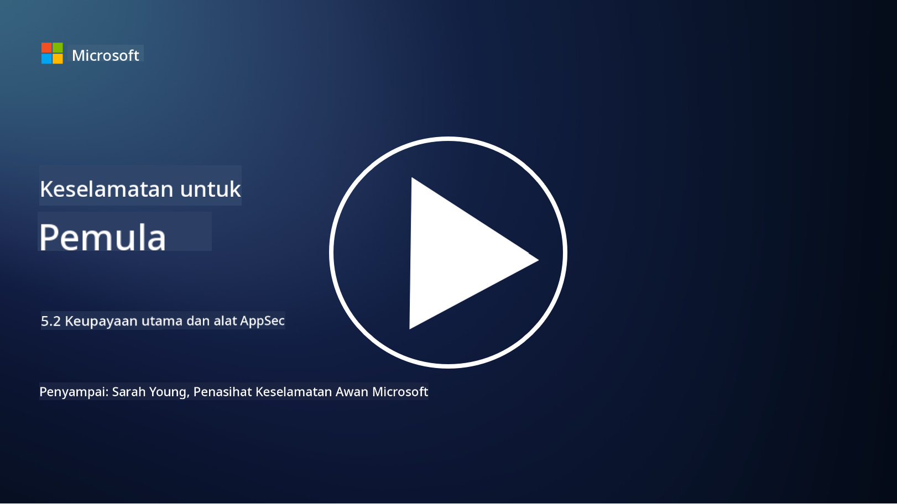

<!--
CO_OP_TRANSLATOR_METADATA:
{
  "original_hash": "790a3fa7e535ec60bb51bde13e759781",
  "translation_date": "2025-09-04T00:51:36+00:00",
  "source_file": "5.2 AppSec key capabilities.md",
  "language_code": "ms"
}
-->
## Pengenalan

Dalam bahagian ini, kita akan membincangkan lebih lanjut mengenai alat dan keupayaan utama yang digunakan dalam keselamatan aplikasi.

## Keupayaan dan alat utama AppSec

Keupayaan dan alat utama yang digunakan dalam keselamatan aplikasi adalah penting untuk mengenal pasti, mengurangkan, dan mencegah kelemahan keselamatan serta ancaman dalam aplikasi perisian. Berikut adalah beberapa yang paling penting:

**1. Static Application Security Testing (SAST)**:

- **Keupayaan**: Menganalisis kod sumber, bytecode, atau kod binari untuk mengenal pasti kelemahan keselamatan dalam kod asas aplikasi.

- **Alat**: Contohnya termasuk Fortify, Checkmarx, dan Veracode.

**2. Dynamic Application Security Testing (DAST)**:

- **Keupayaan**: Mengimbas aplikasi yang sedang berjalan untuk mengenal pasti kelemahan dengan menghantar permintaan input dan menganalisis respons.

- **Alat**: Contohnya termasuk ZAP, Burp Suite, dan Qualys Web Application Scanning.

**3. Interactive Application Security Testing (IAST)**:

- **Keupayaan**: Menggabungkan elemen SAST dan DAST untuk menganalisis kod semasa runtime, memberikan hasil yang lebih tepat dan mengurangkan positif palsu.

- **Alat**: Contohnya termasuk Contrast Security dan HCL AppScan.

**4. Runtime Application Self-Protection (RASP)**:

- **Keupayaan**: Memantau dan melindungi aplikasi secara masa nyata, mengesan dan bertindak balas terhadap ancaman keselamatan semasa ia berlaku.

- **Alat**: Contohnya termasuk Veracode Runtime Protection dan F5 Advanced WAF dengan RASP.

**5. Web Application Firewalls (WAFs)**:

- **Keupayaan**: Memberikan lapisan perlindungan antara aplikasi dan internet, menapis trafik masuk dan menyekat permintaan berniat jahat.

- **Alat**: Contohnya termasuk ModSecurity, AWS WAF, dan Akamai Kona Site Defender.

**6. Dependency Scanning**:

- **Keupayaan**: Mengenal pasti kelemahan dalam perpustakaan pihak ketiga dan komponen yang digunakan dalam aplikasi.

- **Alat**: Contohnya termasuk OWASP Dependency-Check dan Snyk.

**7. Penetration Testing (Pen Testing)**:

- **Keupayaan**: Mensimulasikan serangan dunia nyata untuk mencari kelemahan dan menilai keselamatan aplikasi.

- **Alat**: Dilakukan oleh penggodam etika bertauliah dan profesional keselamatan menggunakan pelbagai alat seperti Metasploit dan Nmap.

**8. Security Scanning and Analysis**:

- **Keupayaan**: Mengimbas kelemahan yang diketahui, kesilapan konfigurasi, dan salah konfigurasi keselamatan.

- **Alat**: Contohnya termasuk Nessus, Qualys Vulnerability Management, dan OpenVAS.

**9. Container Security Tools**:

- **Keupayaan**: Memberi tumpuan kepada keselamatan aplikasi yang dikontena dan persekitarannya.

- **Alat**: Contohnya termasuk Docker Security Scanning dan Aqua Security.

**10. Secure Development Training**:

- **Keupayaan**: Menyediakan program latihan dan kesedaran untuk pasukan pembangunan bagi memupuk amalan pengkodan yang selamat.

- **Alat**: Program latihan dan platform yang disesuaikan.

**11. Security Testing Frameworks**:

- **Keupayaan**: Menyediakan rangka kerja ujian yang komprehensif untuk pelbagai keperluan ujian keselamatan aplikasi.

- **Alat**: OWASP Amass, OWASP OWTF dan FrAppSec.

**12. Secure Code Review Tools**:

- **Keupayaan**: Menyemak kod sumber untuk kelemahan keselamatan dan amalan pengkodan terbaik.

- **Alat**: Contohnya termasuk SonarQube dan Checkmarx.

**13. Secure APIs and Microservices Tools**:

- **Keupayaan**: Memberi tumpuan kepada keselamatan API dan mikroservis, termasuk pengesahan, kebenaran, dan perlindungan data.

- **Alat**: Contohnya termasuk Apigee, AWS API Gateway, dan Istio.

## Bacaan lanjut

- [What Is Application Security? Concepts, Tools & Best Practices | HackerOne](https://www.hackerone.com/knowledge-center/what-application-security-concepts-tools-best-practices)
- [What is IAST? (Interactive Application Security Testing) (comparitech.com)](https://www.comparitech.com/net-admin/what-is-iast/)
- [10 Types of Application Security Testing Tools: When and How to Use Them (cmu.edu)](https://insights.sei.cmu.edu/blog/10-types-of-application-security-testing-tools-when-and-how-to-use-them/)
- [Shifting the Balance of Cybersecurity Risk: Principles and Approaches for Security-by-Design and Default | Cyber.gov.au](https://www.cyber.gov.au/about-us/view-all-content/publications/principles-and-approaches-for-security-by-design-and-default)

---

**Penafian**:  
Dokumen ini telah diterjemahkan menggunakan perkhidmatan terjemahan AI [Co-op Translator](https://github.com/Azure/co-op-translator). Walaupun kami berusaha untuk memastikan ketepatan, sila ambil maklum bahawa terjemahan automatik mungkin mengandungi kesilapan atau ketidaktepatan. Dokumen asal dalam bahasa asalnya harus dianggap sebagai sumber yang berwibawa. Untuk maklumat yang kritikal, terjemahan manusia profesional adalah disyorkan. Kami tidak bertanggungjawab atas sebarang salah faham atau salah tafsir yang timbul daripada penggunaan terjemahan ini.