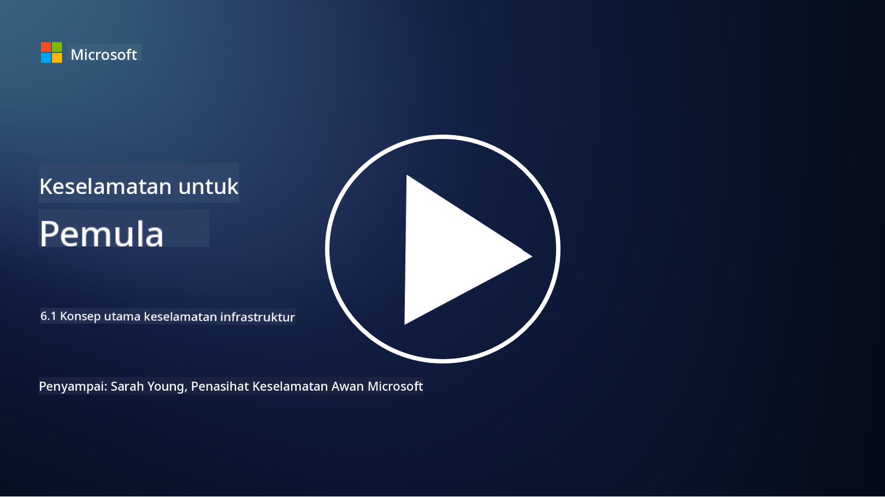

<!--
CO_OP_TRANSLATOR_METADATA:
{
  "original_hash": "882ebf66a648f419bcbf680ed6aefa00",
  "translation_date": "2025-09-03T23:15:38+00:00",
  "source_file": "6.1 Infrastructure security key concepts.md",
  "language_code": "ms"
}
-->
# Konsep utama keselamatan infrastruktur

“Infrastruktur” merujuk kepada asas bagi mana-mana persekitaran IT yang merangkumi pelayan, perkhidmatan awan, dan kontena – pelbagai teknologi yang luas. Aplikasi yang dibincangkan dalam bahagian sebelumnya berjalan di atas infrastruktur, jadi ia juga boleh menjadi sasaran serangan.

Dalam pelajaran ini, kita akan membincangkan:

- Apa itu kebersihan keselamatan dan mengapa ia penting?

- Apa itu pengurusan postur keselamatan?

- Apa itu patching dan mengapa ia penting?

- Apa itu kontena dan apa yang berbeza tentang keselamatannya?

## Apa itu kebersihan keselamatan dan mengapa ia penting?

**Kebersihan keselamatan** merujuk kepada amalan dan tingkah laku yang diikuti oleh individu dan organisasi untuk mengekalkan tabiat keselamatan siber yang baik. Ia melibatkan langkah-langkah untuk melindungi sistem, data, dan rangkaian daripada ancaman dan kelemahan. Kebersihan keselamatan yang baik adalah penting atas beberapa sebab:

- **Mencegah Serangan**: Mengikuti amalan terbaik boleh mencegah serangan siber biasa seperti phishing, jangkitan malware, dan akses tanpa kebenaran.

- **Melindungi Data**: Kebersihan keselamatan yang betul melindungi data sensitif dan sulit daripada kecurian atau pendedahan.

- **Menjaga Kepercayaan**: Organisasi yang menunjukkan kebersihan keselamatan yang baik membina kepercayaan dengan pelanggan dan rakan kongsi.

- **Pematuhan**: Banyak peraturan dan piawaian memerlukan organisasi untuk mengikuti amalan kebersihan keselamatan.

- **Mengurangkan Risiko**: Kebersihan keselamatan yang konsisten mengurangkan risiko keseluruhan insiden dan pelanggaran keselamatan.

Kebersihan keselamatan merangkumi amalan seperti memastikan perisian sentiasa dikemas kini, menggunakan kata laluan yang kuat dan pengesahan pelbagai faktor, membuat sandaran secara berkala, melatih pekerja, dan memantau aktiviti mencurigakan. Ia adalah asas kepada postur keselamatan siber yang kukuh.

## Apa itu pengurusan postur keselamatan?

Pengurusan Postur Keselamatan merujuk kepada amalan menilai, memantau, dan menguruskan postur keselamatan siber keseluruhan sesebuah organisasi. Postur keselamatan siber merujuk kepada pendekatan dan kesediaan keseluruhan organisasi untuk melindungi sistem teknologi maklumat (IT), rangkaian, data, dan asetnya daripada ancaman dan serangan siber. Ia merangkumi strategi, polisi, amalan, dan teknologi yang digunakan oleh organisasi untuk melindungi aset digitalnya serta mengekalkan kerahsiaan, integriti, dan ketersediaan maklumatnya. Ia melibatkan penilaian dan penyelenggaraan keselamatan sistem, rangkaian, aplikasi, dan data untuk memastikan ia selaras dengan polisi keselamatan, amalan terbaik, dan keperluan pematuhan. SPM bertujuan memberikan pandangan menyeluruh tentang status keselamatan organisasi, mengenal pasti kelemahan dan kekurangan, serta memprioritaskan usaha pemulihan.

## Apa itu patching dan mengapa ia penting?

**Patching** merujuk kepada proses menerapkan kemas kini perisian, yang juga dikenali sebagai patch atau pembaikan, kepada perisian, sistem operasi, dan aplikasi. Kemas kini ini biasanya menangani kelemahan keselamatan, bug, dan isu lain yang boleh dieksploitasi oleh penyerang. Peranti perkakasan juga memerlukan patching: ia boleh melibatkan firmware atau sistem operasi terbina dalam. Patching perkakasan boleh menjadi lebih sukar berbanding patching perisian.

Patching penting atas beberapa sebab:

- **Keselamatan**: Patch membetulkan kelemahan yang diketahui yang boleh dieksploitasi oleh penyerang untuk mengkompromikan sistem dan mencuri data.

- **Kestabilan**: Patch sering merangkumi peningkatan kestabilan dan prestasi, mengurangkan risiko kerosakan atau kegagalan sistem.

- **Pematuhan**: Banyak peraturan dan piawaian pematuhan memerlukan organisasi untuk menerapkan patch keselamatan dengan segera.

- **Menjaga Kepercayaan**: Patching secara berkala membantu mengekalkan kepercayaan pelanggan dan pihak berkepentingan dengan menunjukkan komitmen terhadap keselamatan.

- **Pengurangan Risiko**: Patching mengurangkan permukaan serangan dan kemungkinan serangan siber yang berjaya.

Kegagalan untuk menerapkan patch tepat pada masanya boleh meninggalkan sistem terdedah kepada eksploitasi yang diketahui, meningkatkan risiko pelanggaran keselamatan dan kehilangan data.

## Apa itu kontena dan apa yang berbeza tentang keselamatannya?

Kontena adalah bentuk pakej perisian yang ringan, berdiri sendiri, dan boleh dilaksanakan yang mengandungi segala yang diperlukan untuk menjalankan sepotong perisian, termasuk kod, runtime, perpustakaan, dan alat sistem. Kontena menyediakan persekitaran yang konsisten dan terasing untuk aplikasi, menjadikannya lebih mudah untuk membangun, membungkus, dan menyebarkan perisian di pelbagai persekitaran dan platform. Teknologi kontena yang popular termasuk Docker dan Kubernetes.

Keselamatan Kontena merujuk kepada amalan dan teknologi yang digunakan untuk melindungi kontena dan aplikasi yang dihoskan daripada pelbagai ancaman keselamatan dan kelemahan. Keselamatan kontena adalah penting kerana, walaupun kontena menawarkan banyak manfaat dari segi kebolehangkutan dan skalabiliti, ia juga memperkenalkan cabaran keselamatan yang berpotensi:

1. **Keselamatan Imej:** Imej kontena boleh mengandungi kelemahan, dan jika imej ini tidak dikemas kini dan dipatch secara berkala, ia boleh dieksploitasi oleh penyerang. Keselamatan kontena melibatkan pengimbasan imej untuk kelemahan yang diketahui dan memastikan hanya imej yang dipercayai digunakan.

2. **Keselamatan Runtime:** Kontena yang berjalan mesti diasingkan antara satu sama lain dan sistem hos untuk mencegah akses tanpa kebenaran dan serangan yang berpotensi. Mekanisme keselamatan runtime termasuk teknologi pengasingan kontena seperti namespaces dan cgroups, serta alat untuk memantau dan mengaudit tingkah laku kontena.

3. **Keselamatan Rangkaian:** Kontena berkomunikasi antara satu sama lain dan sistem luaran melalui rangkaian. Segmentasi rangkaian yang betul dan peraturan firewall adalah penting untuk mengawal trafik antara kontena dan mencegah akses tanpa kebenaran.

4. **Kawalan Akses:** Memastikan hanya pengguna dan proses yang diberi kuasa boleh mengakses dan mengubah kontena adalah kritikal. Kawalan akses berasaskan peranan (RBAC) dan alat pengurusan identiti sering digunakan untuk kawalan akses.

5. **Logging dan Pemantauan:** Keselamatan kontena melibatkan pengumpulan dan analisis log serta data pemantauan untuk mengesan dan bertindak balas terhadap insiden keselamatan dan anomali secara masa nyata.

6. **Keselamatan Orkestrasi:** Apabila menggunakan platform orkestrasi kontena seperti Kubernetes, keselamatan lapisan orkestrasi adalah sama penting. Ini termasuk melindungi pelayan API Kubernetes, memastikan polisi RBAC yang betul, dan mengaudit aktiviti kluster.

7. **Pengurusan Rahsia:** Mengendalikan maklumat sensitif, seperti kunci API dan kata laluan, dalam kontena memerlukan penyelesaian penyimpanan dan pengurusan yang selamat untuk mencegah pendedahan.

Penyelesaian keselamatan kontena sering melibatkan gabungan amalan keselamatan terbaik, alat pengimbasan kelemahan, mekanisme perlindungan runtime, konfigurasi keselamatan rangkaian, dan ciri keselamatan orkestrasi kontena. Pemantauan berterusan dan automasi adalah komponen penting dalam keselamatan kontena untuk mengesan dan bertindak balas terhadap ancaman dengan cepat apabila aplikasi kontena berkembang dan berskala.

## Bacaan lanjut

- [The importance of security hygiene | Security Magazine](https://www.securitymagazine.com/articles/99510-the-importance-of-security-hygiene)
- [What is CSPM? | Microsoft Security](https://www.microsoft.com/security/business/security-101/what-is-cspm?WT.mc_id=academic-96948-sayoung)
- [What is Cloud Security Posture Management (CSPM)? | HackerOne](https://www.hackerone.com/knowledge-center/what-cloud-security-posture-management)
- [Function of cloud security posture management - Cloud Adoption Framework | Microsoft Learn](https://learn.microsoft.com/azure/cloud-adoption-framework/organize/cloud-security-posture-management?WT.mc_id=academic-96948-sayoung)
- [What Is a CNAPP? | Microsoft Security](https://www.microsoft.com/security/business/security-101/what-is-cnapp)
- [Why Everyone Is Talking About CNAPP (forbes.com)](https://www.forbes.com/sites/forbestechcouncil/2021/12/10/why-everyone-is-talking-about-cnapp/?sh=567275ca1549)
- [Why is patching important to cybersecurity? - CyberSmart](https://cybersmart.co.uk/blog/why-is-patching-important-to-cybersecurity/)
- [What Is Container Security? Complete Guide [2023] (aquasec.com)](https://www.aquasec.com/cloud-native-academy/container-security/container-security/)

---

**Penafian**:  
Dokumen ini telah diterjemahkan menggunakan perkhidmatan terjemahan AI [Co-op Translator](https://github.com/Azure/co-op-translator). Walaupun kami berusaha untuk memastikan ketepatan, sila ambil maklum bahawa terjemahan automatik mungkin mengandungi kesilapan atau ketidaktepatan. Dokumen asal dalam bahasa asalnya harus dianggap sebagai sumber yang berwibawa. Untuk maklumat penting, terjemahan manusia profesional adalah disyorkan. Kami tidak bertanggungjawab atas sebarang salah faham atau salah tafsir yang timbul daripada penggunaan terjemahan ini.