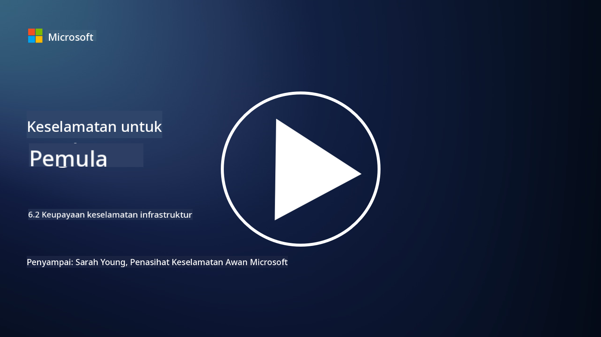

<!--
CO_OP_TRANSLATOR_METADATA:
{
  "original_hash": "7d79ba0e7668b3bdae1fba7aa047f6c0",
  "translation_date": "2025-09-04T00:14:33+00:00",
  "source_file": "6.2 Infrastructure security capabilities.md",
  "language_code": "ms"
}
-->
# Keupayaan keselamatan infrastruktur

Dalam bahagian ini, kita akan membincangkan dengan lebih terperinci tentang alat dan keupayaan teras yang digunakan dalam keselamatan infrastruktur.

**Pengenalan**

Dalam pelajaran ini, kita akan membincangkan:

- Apa itu pengurusan kerentanan?

- Apa itu CSPM?

- Apa itu CNAPP?

## Apa itu pengurusan kerentanan?

Pengurusan kerentanan adalah proses sistematik untuk mengenal pasti, menilai, memprioritaskan, mengurangkan, dan memantau kerentanan dalam sistem komputer, perisian, rangkaian, dan infrastruktur. Matlamat utama pengurusan kerentanan adalah untuk mengurangkan pendedahan organisasi kepada risiko keselamatan dengan secara proaktif menangani kerentanan yang diketahui sebelum ia dieksploitasi oleh pihak berniat jahat. Berikut adalah gambaran keseluruhan langkah-langkah utama yang terlibat:

Pengenalpastian: Mengimbas dan menemui kerentanan dalam aset organisasi, termasuk pelayan, aplikasi, peranti rangkaian, dan titik akhir.

Penilaian: Menilai tahap keparahan dan potensi impak setiap kerentanan berdasarkan faktor seperti skor Common Vulnerability Scoring System (CVSS) dan konteks perniagaan.

Pemprioritaskan: Menyusun kerentanan berdasarkan tahap risiko dan potensi impaknya terhadap operasi dan data organisasi.

Pengurangan: Membangunkan dan melaksanakan strategi untuk membaiki atau mengurangkan kerentanan, termasuk memasang patch, mengkonfigurasi tetapan keselamatan, atau menggunakan kawalan pampasan.

Pengesahan: Mengesahkan bahawa langkah pengurangan berkesan dalam menangani kerentanan.

Pemantauan Berterusan: Penjejakan berterusan terhadap kerentanan dan ancaman yang berpotensi, dengan imbasan dan penilaian kerentanan secara berkala.

Pengurusan kerentanan adalah komponen penting dalam keselamatan siber, membantu organisasi mengekalkan postur keselamatan yang kukuh dan mengurangkan kemungkinan pelanggaran keselamatan. Contoh alat pengurusan kerentanan termasuk Defender for Cloud, Nessus, dan Qualys.

## Apa itu CSPM?

Cloud Security Posture Management (CSPM) adalah satu set alat, proses, dan amalan yang direka untuk menilai, memantau, dan menguatkuasakan konfigurasi keselamatan serta amalan terbaik dalam persekitaran awan. Penyelesaian CSPM membantu organisasi mengenal pasti dan membaiki salah konfigurasi, jurang keselamatan, dan pelanggaran pematuhan dalam infrastruktur awan mereka, seperti di Amazon Web Services (AWS), Microsoft Azure, Google Cloud Platform (GCP), dan penyedia awan lain.

Aspek utama CSPM termasuk:

- Penilaian Konfigurasi: Mengimbas sumber dan perkhidmatan awan untuk mengenal pasti salah konfigurasi, tetapan tidak selamat, dan penyimpangan daripada amalan keselamatan terbaik.

- Penguatkuasaan Polisi Keselamatan: Menguatkuasakan polisi keselamatan dan piawaian pematuhan di seluruh persekitaran awan dengan secara automatik membaiki salah konfigurasi atau menghasilkan amaran.

- Pemantauan Berterusan: Memberikan keterlihatan berterusan terhadap postur keselamatan aset dan sumber awan, dengan amaran masa nyata untuk insiden keselamatan.

- Laporan Pematuhan: Menjana laporan dan papan pemuka untuk menunjukkan pematuhan terhadap keperluan peraturan dan piawaian industri.

CSPM membantu organisasi memastikan bahawa infrastruktur awan mereka selamat, mematuhi peraturan, dan selaras dengan amalan terbaik, mengurangkan risiko insiden keselamatan berkaitan awan. Contoh alat CSPM termasuk Defender for Cloud dan Snyk.

## Apa itu CNAPP?

CNAPP adalah singkatan untuk Cloud-Native Application Protection Platform. Ia adalah platform perisian awan asli serba lengkap yang mempermudah pemantauan, pengesanan, dan tindakan terhadap ancaman keselamatan awan serta kerentanan yang berpotensi. Ia menggabungkan pelbagai alat dan keupayaan ke dalam satu penyelesaian perisian untuk mengurangkan kerumitan dan memudahkan operasi pasukan DevOps dan DevSecOps. CNAPP menawarkan keselamatan awan dan aplikasi hujung ke hujung sepanjang kitaran hayat aplikasi CI/CD, dari pembangunan hingga pengeluaran. Ia memenuhi keperluan industri untuk pemantauan keselamatan awan moden, pengurusan postur, pencegahan pelanggaran, dan alat kawalan. Penyelesaian CNAPP memberikan pasukan keselamatan keupayaan untuk mengukur dan bertindak balas terhadap risiko dalam persekitaran awan. Beberapa ciri CNAPP termasuk keterlihatan yang dipertingkatkan, pengukuran risiko, pembangunan perisian yang selamat, dan penyelesaian keselamatan awan yang digabungkan. CNAPP mengintegrasikan pelbagai penyelesaian keselamatan awan yang secara tradisional terpisah ke dalam satu antara muka pengguna, menjadikannya lebih mudah bagi organisasi untuk melindungi keseluruhan jejak aplikasi awan mereka. CNAPP menggabungkan pelbagai alat keselamatan awan asli dan sumber data, termasuk pengimbasan kontena, pengurusan postur keselamatan awan, pengimbasan infrastruktur sebagai kod, pengurusan hak infrastruktur awan, dan platform perlindungan beban kerja awan semasa runtime.

## Bacaan lanjut
- [What is CSPM? | Microsoft Security](https://www.microsoft.com/security/business/security-101/what-is-cspm?WT.mc_id=academic-96948-sayoung)
- [What is Cloud Security Posture Management (CSPM)? | HackerOne](https://www.hackerone.com/knowledge-center/what-cloud-security-posture-management)
- [Function of cloud security posture management - Cloud Adoption Framework | Microsoft Learn](https://learn.microsoft.com/azure/cloud-adoption-framework/organize/cloud-security-posture-management?WT.mc_id=academic-96948-sayoung)
- [What Is a CNAPP? | Microsoft Security](https://www.microsoft.com/security/business/security-101/what-is-cnapp?WT.mc_id=academic-96948-sayoung)
- [Why Everyone Is Talking About CNAPP (forbes.com)](https://www.forbes.com/sites/forbestechcouncil/2021/12/10/why-everyone-is-talking-about-cnapp/?sh=567275ca1549)
- [Improving Your Multi-Cloud Security with a Cloud-Native Application Protection Platform (CNAPP)](https://www.youtube.com/watch?v=5w42kQ_QjZg&t=212s)

---

**Penafian**:  
Dokumen ini telah diterjemahkan menggunakan perkhidmatan terjemahan AI [Co-op Translator](https://github.com/Azure/co-op-translator). Walaupun kami berusaha untuk memastikan ketepatan, sila ambil perhatian bahawa terjemahan automatik mungkin mengandungi kesilapan atau ketidaktepatan. Dokumen asal dalam bahasa asalnya harus dianggap sebagai sumber yang berwibawa. Untuk maklumat yang kritikal, terjemahan manusia profesional adalah disyorkan. Kami tidak bertanggungjawab atas sebarang salah faham atau salah tafsir yang timbul daripada penggunaan terjemahan ini.