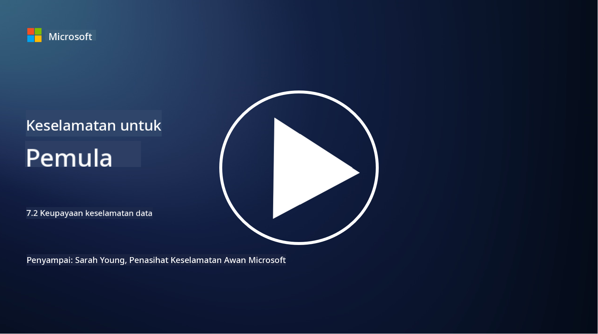

<!--
CO_OP_TRANSLATOR_METADATA:
{
  "original_hash": "50697add9758e54693442d502d2d5f8a",
  "translation_date": "2025-09-04T00:57:09+00:00",
  "source_file": "7.2 Data security capabilities.md",
  "language_code": "ms"
}
-->
# Keupayaan keselamatan data

Dalam bahagian ini, kita akan membincangkan dengan lebih terperinci tentang alat dan keupayaan utama yang digunakan dalam keselamatan data:

**Pengenalan**

Dalam pelajaran ini, kita akan membincangkan:

- Apakah alat pencegahan kehilangan data?

- Apakah alat pengurusan risiko dalaman?

- Apakah alat pengekalan data yang tersedia?

## Apakah alat pencegahan kehilangan data?

Alat Pencegahan Kehilangan Data (DLP) merujuk kepada satu set penyelesaian perisian dan teknologi yang direka untuk mencegah akses, perkongsian, atau kebocoran data sensitif atau sulit tanpa kebenaran dalam organisasi. Alat ini menggunakan pemeriksaan kandungan, penguatkuasaan dasar, dan pemantauan untuk mengenal pasti dan melindungi data sensitif daripada terdedah atau disalahgunakan. Contoh produk DLP termasuk: Symantec Data Loss Prevention, McAfee Total Protection for Data Loss Prevention, Microsoft 365 DLP**: Berintegrasi dengan aplikasi Microsoft 365 untuk membantu organisasi mengenal pasti dan melindungi data sensitif dalam e-mel, dokumen, dan mesej.

## Apakah alat pengurusan risiko dalaman?

Alat Pengurusan Risiko Dalaman membantu organisasi mengenal pasti dan mengurangkan risiko yang ditimbulkan oleh pekerja, kontraktor, atau rakan kongsi yang mungkin secara sengaja atau tidak sengaja menjejaskan keselamatan data. Alat ini memantau tingkah laku pengguna, corak akses, dan penggunaan data untuk mengesan aktiviti mencurigakan dan ancaman dalaman yang berpotensi. Contoh produk pengurusan risiko dalaman termasuk: Microsoft Insider Risk Management (sebahagian daripada Microsoft 365), Forcepoint Insider Threat Data Protection, Varonis Insider Threat Detection.

## Apakah alat pengekalan data yang tersedia?

Alat pengekalan data termasuk perisian dan penyelesaian yang direka untuk menguruskan pengekalan dan penghapusan data mengikut dasar pengekalan data dan keperluan undang-undang organisasi. Alat ini membantu mengautomasi proses pengekalan data untuk tempoh tertentu dan menghapuskan data dengan selamat apabila ia tidak lagi diperlukan. Contoh produk pengekalan data termasuk: Veritas Enterprise Vault, Commvault Complete Data Protection, Microsoft data lifecycle management. Penyelesaian alat ini membantu organisasi mengekalkan kawalan ke atas pengekalan dan pelupusan data, memastikan pematuhan terhadap peraturan perlindungan data sambil menguruskan data dengan cekap sepanjang kitaran hayatnya.

## Bacaan lanjut

- [Panduan kepada Pengurusan Postur Keselamatan Data (DSPM) | CSA (cloudsecurityalliance.org)](https://cloudsecurityalliance.org/blog/2023/03/31/the-big-guide-to-data-security-posture-management-dspm/)
- [Pencegahan Kehilangan Data di seluruh peranti, aplikasi, & perkhidmatan | Microsoft Purview](https://youtu.be/hvqq8L_0kgI)
- [18 Alat Perisian Pencegahan Kehilangan Data Terbaik 2023 (Percuma + Berbayar) (comparitech.com)](https://www.comparitech.com/data-privacy-management/data-loss-prevention-tools-software/)
- [Pencegahan Kehilangan Data (nist.gov)](https://tsapps.nist.gov/publication/get_pdf.cfm?pub_id=904672)
- [Ketahui tentang pengurusan risiko dalaman | Microsoft Learn](https://learn.microsoft.com/purview/insider-risk-management?WT.mc_id=academic-96948-sayoung)
- [Pengurusan Kitaran Hayat Data | IBM](https://www.ibm.com/topics/data-lifecycle-management)
- [Apakah Pengurusan Kitaran Hayat Data (DLM)? | Amalan Terbaik 2023 (selecthub.com)](https://www.selecthub.com/big-data-analytics/data-lifecycle-management/)

---

**Penafian**:  
Dokumen ini telah diterjemahkan menggunakan perkhidmatan terjemahan AI [Co-op Translator](https://github.com/Azure/co-op-translator). Walaupun kami berusaha untuk memastikan ketepatan, sila ambil perhatian bahawa terjemahan automatik mungkin mengandungi kesilapan atau ketidaktepatan. Dokumen asal dalam bahasa asalnya harus dianggap sebagai sumber yang berwibawa. Untuk maklumat yang kritikal, terjemahan manusia profesional adalah disyorkan. Kami tidak bertanggungjawab atas sebarang salah faham atau salah tafsir yang timbul daripada penggunaan terjemahan ini.