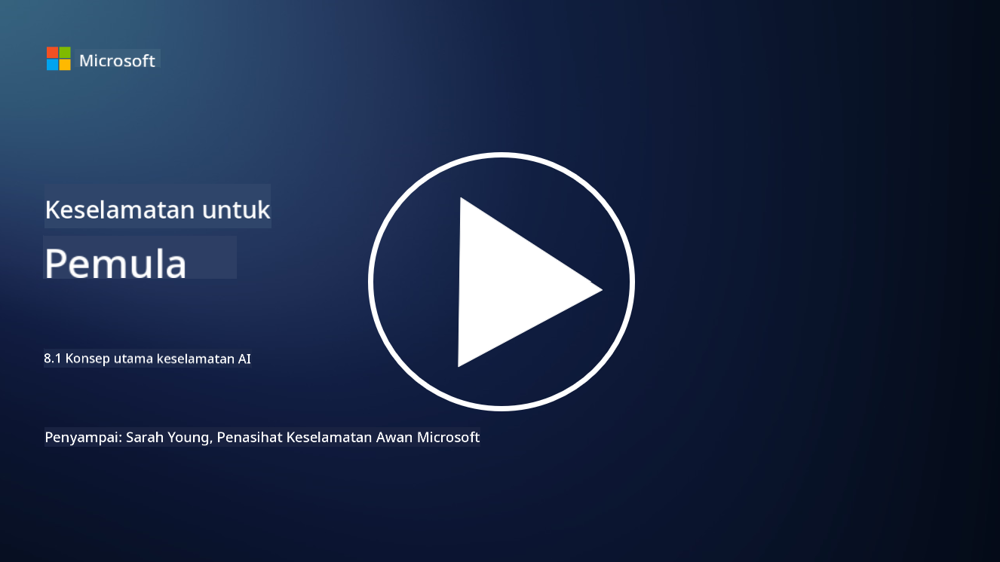

<!--
CO_OP_TRANSLATOR_METADATA:
{
  "original_hash": "66b61d96936cf25d20fcb411d4ce5227",
  "translation_date": "2025-09-03T22:49:44+00:00",
  "source_file": "8.1 AI security key concepts.md",
  "language_code": "ms"
}
-->
# Konsep Utama Keselamatan AI

## Bagaimana keselamatan AI berbeza daripada keselamatan siber tradisional?

Melindungi sistem AI menghadirkan cabaran unik berbanding keselamatan siber tradisional, terutamanya disebabkan oleh sifat pembelajaran dan proses membuat keputusan AI. Berikut adalah beberapa perbezaan utama:

-   **Integriti Data**: Sistem AI sangat bergantung pada data untuk pembelajaran. [Memastikan integriti data ini adalah penting, kerana penyerang boleh memanipulasi data untuk mempengaruhi tingkah laku AI, satu taktik yang dikenali sebagai pencemaran data.
-   **Keselamatan Model**: Model membuat keputusan AI itu sendiri boleh menjadi sasaran. [Penyerang mungkin cuba membalikkan kejuruteraan model atau mengeksploitasi kelemahannya untuk membuat keputusan yang salah atau berbahaya.
-   **Serangan Adversarial**: Sistem AI boleh terdedah kepada serangan adversarial, di mana perubahan kecil, sering tidak dapat dilihat pada data input, boleh menyebabkan AI membuat kesilapan atau ramalan yang salah.
-   **Keselamatan Infrastruktur**: Walaupun keselamatan siber tradisional juga memberi tumpuan kepada melindungi infrastruktur, sistem AI mungkin mempunyai lapisan kerumitan tambahan, seperti perkhidmatan berasaskan awan atau perkakasan khusus, yang memerlukan langkah keselamatan tertentu.
-   **Pertimbangan Etika**: Penggunaan AI dalam keselamatan membawa pertimbangan etika, seperti kebimbangan privasi dan potensi bias dalam membuat keputusan, yang mesti ditangani dalam strategi keselamatan.

Secara keseluruhan, melindungi sistem AI memerlukan pendekatan yang berbeza yang mempertimbangkan aspek unik teknologi AI, termasuk perlindungan data, model, dan proses pembelajaran AI, sambil juga menangani implikasi etika penggunaan AI.

Keselamatan AI dan keselamatan siber tradisional berkongsi banyak persamaan, tetapi mereka juga mempunyai beberapa perbezaan yang ketara disebabkan oleh ciri dan keupayaan unik sistem kecerdasan buatan. Berikut adalah bagaimana mereka berbeza:

- **Kerumitan Ancaman**: Sistem AI memperkenalkan lapisan kerumitan baru kepada keselamatan siber. Keselamatan siber tradisional terutamanya menangani ancaman seperti perisian hasad, serangan phishing, dan pencerobohan rangkaian. Walau bagaimanapun, sistem AI boleh terdedah kepada serangan seperti serangan adversarial, pencemaran data, dan pengelakan model, yang secara khusus menyasarkan algoritma pembelajaran mesin itu sendiri.

- **Permukaan Serangan**: Sistem AI sering mempunyai permukaan serangan yang lebih besar berbanding sistem tradisional. Ini kerana mereka bukan sahaja bergantung pada perisian tetapi juga pada data dan model. Penyerang boleh menyasarkan data latihan, memanipulasi model, atau mengeksploitasi kelemahan dalam algoritma itu sendiri.

- **Kebolehsuaian Ancaman**: Sistem AI boleh menyesuaikan diri dan belajar daripada persekitarannya, yang boleh menjadikannya lebih terdedah kepada ancaman yang adaptif dan berkembang. Langkah keselamatan siber tradisional mungkin tidak mencukupi untuk mempertahankan daripada serangan yang sentiasa berkembang berdasarkan tingkah laku sistem AI.

- **Kebolehjelasan dan Kebolehterangan**: Memahami mengapa sistem AI membuat keputusan tertentu sering kali lebih mencabar berbanding sistem perisian tradisional. Kekurangan kebolehjelasan dan kebolehterangan ini boleh menyukarkan pengesanan dan pengurangan serangan terhadap sistem AI dengan berkesan.

- **Kebimbangan Privasi Data**: Sistem AI sering bergantung pada sejumlah besar data, yang boleh memperkenalkan risiko privasi jika tidak dikendalikan dengan betul. Langkah keselamatan siber tradisional mungkin tidak cukup untuk menangani kebimbangan privasi data yang khusus kepada sistem AI.

- **Pematuhan Peraturan**: Landskap peraturan untuk keselamatan AI masih berkembang, dengan peraturan dan piawaian khusus muncul untuk menangani cabaran unik yang ditimbulkan oleh sistem AI. Kerangka keselamatan siber tradisional mungkin perlu diperluas atau disesuaikan untuk memastikan pematuhan kepada peraturan baru ini.

- **Pertimbangan Etika**: Keselamatan AI melibatkan bukan sahaja melindungi sistem daripada serangan jahat tetapi juga memastikan bahawa sistem AI digunakan dengan cara yang beretika dan bertanggungjawab. Ini termasuk pertimbangan seperti keadilan, ketelusan, dan akauntabiliti, yang mungkin tidak begitu menonjol dalam keselamatan siber tradisional.

## Bagaimana AI sama dengan melindungi sistem IT tradisional?

Melindungi sistem AI berkongsi beberapa prinsip asas dengan keselamatan siber tradisional:

-   **Perlindungan Ancaman**: Kedua-dua sistem AI dan tradisional perlu dilindungi daripada akses tanpa kebenaran, pengubahsuaian data, dan pemusnahan, serta ancaman biasa yang lain.
-   **Pengurusan Kerentanan**: Banyak kerentanan yang mempengaruhi sistem tradisional, seperti pepijat perisian atau salah konfigurasi, juga boleh memberi kesan kepada sistem AI.
-   **Keselamatan Data**: Perlindungan data yang diproses adalah penting dalam kedua-dua domain untuk mencegah pelanggaran data dan memastikan kerahsiaan.
-   **Keselamatan Rantaian Bekalan**: Kedua-dua jenis sistem terdedah kepada serangan rantaian bekalan, di mana komponen yang dikompromi boleh melemahkan keselamatan keseluruhan sistem.

Persamaan ini menunjukkan bahawa walaupun sistem AI memperkenalkan cabaran keselamatan baru, mereka juga memerlukan penerapan amalan keselamatan siber yang telah ditetapkan untuk memastikan perlindungan yang kukuh. Ia adalah gabungan menggunakan kebijaksanaan keselamatan tradisional sambil menyesuaikan diri dengan aspek unik teknologi AI.

## Bacaan lanjut

- [Not with a Bug, But with a Sticker [Book] (oreilly.com)](https://www.oreilly.com/library/view/not-with-a/9781119883982/)
   
- [Intro to AI Security Part 1: AI Security 101 | by HarrietHacks | Medium](https://medium.com/@harrietfarlow/intro-to-ai-security-part-1-ai-security-101-b8662a9efe5)
   
- [Best practices for AI security risk management | Microsoft Security Blog](https://www.microsoft.com/en-us/security/blog/2021/12/09/best-practices-for-ai-security-risk-management/?WT.mc_id=academic-96948-sayoung)
   
- [OWASP AI Security and Privacy Guide | OWASP Foundation](https://owasp.org/www-project-ai-security-and-privacy-guide/)

---

**Penafian**:  
Dokumen ini telah diterjemahkan menggunakan perkhidmatan terjemahan AI [Co-op Translator](https://github.com/Azure/co-op-translator). Walaupun kami berusaha untuk memastikan ketepatan, sila ambil perhatian bahawa terjemahan automatik mungkin mengandungi kesilapan atau ketidaktepatan. Dokumen asal dalam bahasa asalnya harus dianggap sebagai sumber yang berwibawa. Untuk maklumat yang kritikal, terjemahan manusia profesional adalah disyorkan. Kami tidak bertanggungjawab atas sebarang salah faham atau salah tafsir yang timbul daripada penggunaan terjemahan ini.