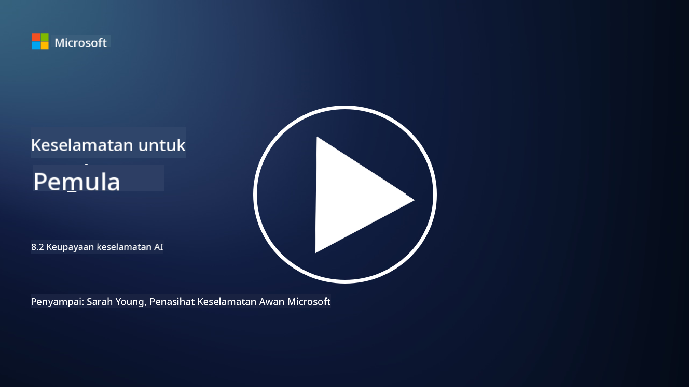

<!--
CO_OP_TRANSLATOR_METADATA:
{
  "original_hash": "b6bb7175672298d1e2f73ba7e0006f95",
  "translation_date": "2025-09-04T01:06:16+00:00",
  "source_file": "8.2 AI security capabilities.md",
  "language_code": "ms"
}
-->
# Keupayaan keselamatan AI

## Apakah alat dan keupayaan yang kita ada untuk melindungi sistem AI pada masa ini?

Pada masa ini, terdapat beberapa alat dan keupayaan yang tersedia untuk melindungi sistem AI:

-   **Counterfit**: Alat automasi sumber terbuka untuk ujian keselamatan sistem AI, direka untuk membantu organisasi menjalankan penilaian risiko keselamatan AI dan memastikan ketahanan algoritma mereka.
-   **Alat Pembelajaran Mesin Adversarial**: Alat ini menilai ketahanan model pembelajaran mesin terhadap serangan adversarial, membantu mengenal pasti dan mengurangkan kelemahan.
-   **Kit Alat Keselamatan AI**: Terdapat kit alat sumber terbuka yang menyediakan sumber untuk melindungi sistem AI, termasuk perpustakaan dan rangka kerja untuk melaksanakan langkah keselamatan.
-   **Platform Kolaboratif**: Kerjasama antara syarikat dan komuniti AI untuk membangunkan pengimbas keselamatan khusus AI dan alat lain untuk melindungi rantaian bekalan AI.

Alat dan keupayaan ini adalah sebahagian daripada bidang yang semakin berkembang yang didedikasikan untuk meningkatkan keselamatan sistem AI terhadap pelbagai ancaman. Ia mewakili gabungan penyelidikan, alat praktikal, dan kerjasama industri yang bertujuan menangani cabaran unik yang ditimbulkan oleh teknologi AI.

## Bagaimana pula dengan red teaming AI? Bagaimana ia berbeza daripada red teaming keselamatan tradisional?

Red teaming AI berbeza daripada red teaming keselamatan tradisional dalam beberapa aspek utama:

-   **Fokus pada Sistem AI**: Red teaming AI secara khusus menyasarkan kelemahan unik sistem AI, seperti model pembelajaran mesin dan saluran data, dan bukannya infrastruktur IT tradisional.
-   **Ujian Tingkah Laku AI**: Ia melibatkan ujian bagaimana sistem AI bertindak balas terhadap input yang luar biasa atau tidak dijangka, yang boleh mendedahkan kelemahan yang boleh dieksploitasi oleh penyerang.
-   **Meneroka Kegagalan AI**: Red teaming AI melihat kedua-dua kegagalan berniat jahat dan tidak berniat jahat, mempertimbangkan set persona dan potensi kegagalan sistem yang lebih luas daripada sekadar pelanggaran keselamatan.
-   **Suntikan Prompt dan Penjanaan Kandungan**: Red teaming AI juga termasuk menyiasat kegagalan seperti suntikan prompt, di mana penyerang memanipulasi sistem AI untuk menghasilkan kandungan yang berbahaya atau tidak berasas.
-   **AI Beretika dan Bertanggungjawab**: Ia adalah sebahagian daripada memastikan AI yang bertanggungjawab melalui reka bentuk, memastikan sistem AI tahan terhadap percubaan untuk membuatnya berfungsi dengan cara yang tidak diingini.

Secara keseluruhan, red teaming AI adalah amalan yang diperluaskan yang bukan sahaja meliputi penyiasatan kelemahan keselamatan tetapi juga termasuk ujian untuk jenis kegagalan sistem lain yang khusus untuk teknologi AI. Ia adalah bahagian penting dalam membangunkan sistem AI yang lebih selamat dengan memahami dan mengurangkan risiko baharu yang berkaitan dengan penggunaan AI.

## Bacaan lanjut

 - [Microsoft AI Red Team building future of safer AI | Microsoft Security Blog](https://www.microsoft.com/en-us/security/blog/2023/08/07/microsoft-ai-red-team-building-future-of-safer-ai/?WT.mc_id=academic-96948-sayoung)
 - [Announcing Microsoft’s open automation framework to red team generative AI Systems | Microsoft Security Blog](https://www.microsoft.com/en-us/security/blog/2024/02/22/announcing-microsofts-open-automation-framework-to-red-team-generative-ai-systems/?WT.mc_id=academic-96948-sayoung)
 - [AI Security Tools: The Open-Source Toolkit | Wiz](https://www.wiz.io/academy/ai-security-tools)

---

**Penafian**:  
Dokumen ini telah diterjemahkan menggunakan perkhidmatan terjemahan AI [Co-op Translator](https://github.com/Azure/co-op-translator). Walaupun kami berusaha untuk memastikan ketepatan, sila ambil maklum bahawa terjemahan automatik mungkin mengandungi kesilapan atau ketidaktepatan. Dokumen asal dalam bahasa asalnya harus dianggap sebagai sumber yang berwibawa. Untuk maklumat penting, terjemahan manusia profesional adalah disyorkan. Kami tidak bertanggungjawab atas sebarang salah faham atau salah tafsir yang timbul daripada penggunaan terjemahan ini.