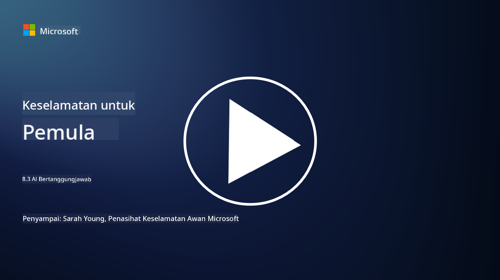

<!--
CO_OP_TRANSLATOR_METADATA:
{
  "original_hash": "5e9775ee91bde7d44577891d5f11c4c5",
  "translation_date": "2025-09-04T00:06:55+00:00",
  "source_file": "8.3 Responsible AI.md",
  "language_code": "ms"
}
-->
# AI Bertanggungjawab

## Apakah AI bertanggungjawab dan bagaimana ia berkaitan dengan keselamatan AI?

AI bertanggungjawab merujuk kepada pembangunan dan penggunaan kecerdasan buatan dengan cara yang beretika, telus, dan selaras dengan nilai-nilai masyarakat. Ia merangkumi prinsip seperti keadilan, akauntabiliti, dan ketahanan, memastikan sistem AI direka dan dikendalikan untuk memberi manfaat kepada individu, komuniti, dan masyarakat secara keseluruhan.

Hubungan antara AI bertanggungjawab dan keselamatan AI adalah penting kerana:

-   **Pertimbangan Etika**: AI bertanggungjawab melibatkan pertimbangan etika yang secara langsung mempengaruhi keselamatan, seperti privasi dan perlindungan data. Memastikan sistem AI menghormati privasi pengguna dan melindungi data peribadi adalah aspek utama AI bertanggungjawab.
-   **Ketahanan dan Kebolehpercayaan**: Sistem AI mesti tahan terhadap manipulasi dan serangan, yang merupakan prinsip utama AI bertanggungjawab dan keselamatan AI. Ini termasuk melindungi daripada serangan musuh dan memastikan integriti proses membuat keputusan AI.
-   **Ketelusan dan Kebolehjelasan**: Sebahagian daripada AI bertanggungjawab adalah memastikan sistem AI telus dan keputusan mereka boleh dijelaskan. Ini penting untuk keselamatan, kerana pihak berkepentingan perlu memahami bagaimana sistem AI beroperasi untuk mempercayai langkah-langkah keselamatannya.
-   **Akauntabiliti**: Sistem AI harus bertanggungjawab atas tindakan mereka, yang bermaksud mesti ada mekanisme untuk menjejaki keputusan dan membetulkan sebarang isu. Ini selaras dengan amalan keselamatan yang memantau dan mengaudit aktiviti sistem untuk mencegah dan bertindak balas terhadap pelanggaran.

Secara asasnya, AI bertanggungjawab dan keselamatan AI saling berkait, dengan amalan AI bertanggungjawab meningkatkan keselamatan sistem AI dan sebaliknya. Melaksanakan prinsip AI bertanggungjawab membantu mencipta sistem AI yang bukan sahaja beretika tetapi juga lebih selamat daripada ancaman yang berpotensi.

## Bagaimana saya boleh memastikan sistem AI saya selamat dan beretika?

Memastikan sistem AI anda selamat dan beretika memerlukan pendekatan pelbagai aspek yang merangkumi langkah-langkah berikut:

- **Patuhi Prinsip Etika**: Ikuti garis panduan etika yang telah ditetapkan yang menekankan kesejahteraan manusia, masyarakat, dan alam sekitar; keadilan; perlindungan privasi; kebolehpercayaan; ketelusan; kebolehpertikaian; dan akauntabiliti.

- **Laksanakan Langkah Keselamatan yang Kukuh**: Gunakan ujian keselamatan proaktif dan program pengurusan kepercayaan, risiko, dan keselamatan AI untuk melindungi daripada ancaman dan kelemahan.

- **Libatkan Pelbagai Pihak Berkepentingan**: Libatkan pelbagai peserta dalam proses pembangunan AI, termasuk ahli etika, ahli sains sosial, dan wakil daripada komuniti yang terjejas untuk memastikan perspektif dan nilai yang pelbagai dipertimbangkan.

- **Pastikan Ketelusan dan Kebolehjelasan**: Pastikan proses membuat keputusan AI adalah telus dan boleh dijelaskan, membolehkan kepercayaan yang lebih besar dan pengenalpastian potensi bias atau kesilapan dengan lebih mudah.

- **Kekalkan Privasi Data**: Lindungi privasi dan keaslian data melalui penyulitan dan langkah perlindungan data lain untuk menghormati hak privasi pengguna.

- **Benarkan Pengawasan Manusia**: Laksanakan mekanisme untuk pengawasan manusia bagi membolehkan keputusan yang dibuat oleh sistem AI dipertikaikan dan memastikan akauntabiliti.

- **Sentiasa Maklum Tentang Keselamatan AI**: Kekal terkini dengan penyelidikan dan perbincangan terkini mengenai keselamatan AI untuk memahami landskap keselamatan dan etika AI yang sentiasa berkembang.

- **Patuhi Peraturan**: Pastikan sistem AI anda mematuhi semua undang-undang dan peraturan yang berkaitan, termasuk undang-undang perlindungan data, undang-undang anti-diskriminasi, dan garis panduan khusus industri.

## Bolehkah anda berikan beberapa contoh isu keselamatan yang disebabkan oleh penggunaan AI yang tidak beretika?

Berikut adalah beberapa contoh isu keselamatan yang boleh timbul daripada penggunaan AI yang tidak beretika:

- **Keputusan yang Bias**: Sistem AI boleh meneruskan dan memperbesar bias sedia ada jika dilatih menggunakan set data yang berat sebelah. Sebagai contoh, jika enjin carian dilatih menggunakan data yang mencerminkan stereotaip masyarakat, ia mungkin memaparkan hasil carian yang berat sebelah, yang boleh membawa kepada layanan tidak adil atau diskriminasi.

- **AI dalam Sistem Kehakiman**: Penggunaan AI dalam membuat keputusan undang-undang boleh menimbulkan kebimbangan etika, terutamanya jika proses membuat keputusan AI tidak telus atau dipengaruhi oleh data yang berat sebelah. Ini boleh mengakibatkan keputusan undang-undang yang tidak adil dan melanggar hak individu.

- **Manipulasi Sistem AI**: Sistem AI boleh terdedah kepada serangan musuh, di mana sedikit pengubahsuaian pada data input boleh menyebabkan hasil yang salah. Sebagai contoh, kenderaan autonomi boleh disalah tafsirkan tanda lalu lintas, yang membawa kepada risiko keselamatan.

- **Pengawasan Berkuasa AI**: Penggunaan AI untuk tujuan pengawasan boleh menyebabkan pelanggaran privasi, terutamanya jika digunakan tanpa persetujuan yang sewajarnya atau dengan cara yang melanggar kebebasan individu. Ini boleh menjadi sangat bermasalah dalam rejim autoritarian yang mungkin menggunakan AI untuk memantau dan menindas perbezaan pendapat.

Contoh-contoh ini menekankan kepentingan pertimbangan etika dalam pembangunan dan penggunaan sistem AI untuk mencegah isu keselamatan dan melindungi hak serta privasi individu.

## Bacaan lanjut

 - [Microsoft Responsible AI Standard v2 General Requirements](https://query.prod.cms.rt.microsoft.com/cms/api/am/binary/RE5cmFl?culture=en-us&country=us&WT.mc_id=academic-96948-sayoung)
 - [Responsible AI (mit.edu)](https://sloanreview.mit.edu/big-ideas/responsible-ai/)
 - [13 Principles for Using AI Responsibly (hbr.org)](https://hbr.org/2023/06/13-principles-for-using-ai-responsibly)

---

**Penafian**:  
Dokumen ini telah diterjemahkan menggunakan perkhidmatan terjemahan AI [Co-op Translator](https://github.com/Azure/co-op-translator). Walaupun kami berusaha untuk memastikan ketepatan, sila ambil maklum bahawa terjemahan automatik mungkin mengandungi kesilapan atau ketidaktepatan. Dokumen asal dalam bahasa asalnya harus dianggap sebagai sumber yang berwibawa. Untuk maklumat penting, terjemahan manusia profesional adalah disyorkan. Kami tidak bertanggungjawab atas sebarang salah faham atau salah tafsir yang timbul daripada penggunaan terjemahan ini.