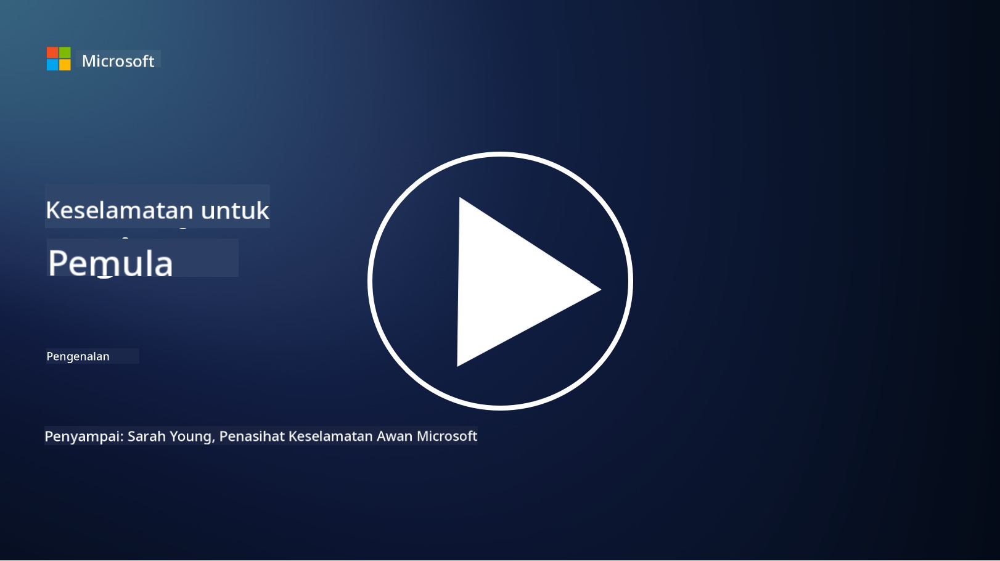

<!--
CO_OP_TRANSLATOR_METADATA:
{
  "original_hash": "ec0b921727399a8a980305086a6d3832",
  "translation_date": "2025-09-04T06:46:20+00:00",
  "source_file": "README.md",
  "language_code": "ms"
}
-->

### 🌐 Sokongan Pelbagai Bahasa

#### Disokong melalui GitHub Action (Automatik & Sentiasa Terkini)

[French](../fr/README.md) | [Spanish](../es/README.md) | [German](../de/README.md) | [Russian](../ru/README.md) | [Arabic](../ar/README.md) | [Persian (Farsi)](../fa/README.md) | [Urdu](../ur/README.md) | [Chinese (Simplified)](../zh/README.md) | [Chinese (Traditional, Macau)](../mo/README.md) | [Chinese (Traditional, Hong Kong)](../hk/README.md) | [Chinese (Traditional, Taiwan)](../tw/README.md) | [Japanese](../ja/README.md) | [Korean](../ko/README.md) | [Hindi](../hi/README.md) | [Bengali](../bn/README.md) | [Marathi](../mr/README.md) | [Nepali](../ne/README.md) | [Punjabi (Gurmukhi)](../pa/README.md) | [Portuguese (Portugal)](../pt/README.md) | [Portuguese (Brazil)](../br/README.md) | [Italian](../it/README.md) | [Polish](../pl/README.md) | [Turkish](../tr/README.md) | [Greek](../el/README.md) | [Thai](../th/README.md) | [Swedish](../sv/README.md) | [Danish](../da/README.md) | [Norwegian](../no/README.md) | [Finnish](../fi/README.md) | [Dutch](../nl/README.md) | [Hebrew](../he/README.md) | [Vietnamese](../vi/README.md) | [Indonesian](../id/README.md) | [Malay](./README.md) | [Tagalog (Filipino)](../tl/README.md) | [Swahili](../sw/README.md) | [Hungarian](../hu/README.md) | [Czech](../cs/README.md) | [Slovak](../sk/README.md) | [Romanian](../ro/README.md) | [Bulgarian](../bg/README.md) | [Serbian (Cyrillic)](../sr/README.md) | [Croatian](../hr/README.md) | [Slovenian](../sl/README.md) | [Ukrainian](../uk/README.md) | [Burmese (Myanmar)](../my/README.md)

**Jika anda ingin menambah sokongan bahasa terjemahan tambahan, senarai bahasa yang disokong boleh didapati [di sini](https://github.com/Azure/co-op-translator/blob/main/getting_started/supported-languages.md)**

#### Sertai Komuniti Kami 

# 🚀 Keselamatan Siber untuk Pemula – kurikulum

Dalam era perubahan pantas dengan penerapan teknologi AI, adalah lebih penting untuk memahami cara melindungi sistem IT. Kursus ini direka untuk mengajar anda konsep asas keselamatan siber bagi memulakan pembelajaran keselamatan anda. Ia bebas vendor dan dibahagikan kepada pelajaran kecil yang mengambil masa sekitar 30-60 minit untuk diselesaikan. Setiap pelajaran mempunyai kuiz kecil dan pautan untuk bacaan lanjut jika anda ingin mendalami topik tersebut.

Apa yang diliputi dalam kursus ini 📚

- 🔐 Konsep asas keselamatan siber seperti triad CIA, perbezaan antara risiko, ancaman, dan lain-lain.
- 🛡️ Memahami apa itu kawalan keselamatan dan bentuknya.
- 🌐 Memahami apa itu zero trust dan mengapa ia penting dalam keselamatan siber moden.
- 🔑 Memahami konsep dan tema utama dalam identiti, rangkaian, operasi keselamatan, infrastruktur dan keselamatan data.
- 🔧 Memberikan beberapa contoh alat yang digunakan untuk melaksanakan kawalan keselamatan.

Apa yang tidak diliputi dalam kursus ini 🙅‍♂️

- 🚫 Cara menggunakan alat keselamatan tertentu.
- 🚫 Cara "menggodam" atau melakukan red teaming/offensive security.
- 🚫 Pembelajaran tentang piawaian pematuhan tertentu.

Apabila anda telah menyelesaikan kursus ini, anda boleh meneruskan beberapa modul Microsoft Learn kami. Kami mengesyorkan anda meneruskan pembelajaran dengan [Microsoft Security, Compliance, and Identity Fundamentals.](https://learn.microsoft.com/training/paths/describe-concepts-of-security-compliance-identity/?WT.mc_id=academic-96948-sayoung) 

Akhirnya, anda boleh mempertimbangkan untuk mengambil [Exam SC-900: Microsoft Security, Compliance, and Identity Fundamentals exam.](https://learn.microsoft.com/credentials/certifications/exams/sc-900/?WT.mc_id=academic-96948-sayoung)

> 💁 Jika anda mempunyai sebarang maklum balas atau cadangan mengenai kursus ini dan kandungan yang mungkin kami terlepas, kami ingin mendengar daripada anda!

## Gambaran Keseluruhan Modul 📝 
| **Nombor Modul** | **Nama Modul**                           | **Konsep yang diajar**                  | **Objektif Pembelajaran**                                                                                          |
|-------------------|-------------------------------------------|--------------------------------------|-----------------------------------------------------------------------------------------------------------------|
| **1.1**           | Konsep keselamatan asas                   | [The CIA triad](https://github.com/microsoft/Security-101/blob/main/1.1%20The%20CIA%20triad%20and%20other%20key%20concepts.md)                        | Belajar tentang kerahsiaan, ketersediaan dan integriti. Juga keaslian, penafian dan privasi. |
| **1.2**           | Konsep keselamatan asas                   | [Ancaman keselamatan siber biasa](https://github.com/microsoft/Security-101/blob/main/1.2%20Common%20cybersecurity%20threats.md)        | Belajar tentang ancaman keselamatan siber biasa yang dihadapi individu dan organisasi.                             |
| **1.3**           | Konsep keselamatan asas                   | [Memahami pengurusan risiko](https://github.com/microsoft/Security-101/blob/main/1.3%20Understanding%20risk%20management.md)       | Belajar tentang menilai dan memahami risiko – impak/kebarangkalian dan melaksanakan kawalan.                                                                                                               | |
| **1.4**           | Konsep keselamatan asas                   | [Amalan keselamatan dan dokumentasi](https://github.com/microsoft/Security-101/blob/main/1.4%20Security%20practices%20and%20documentation.md) | Belajar tentang perbezaan antara polisi, prosedur, piawaian dan peraturan/undang-undang.                         |
| **1.5**           | Konsep keselamatan asas                   | [Zero trust](https://github.com/microsoft/Security-101/blob/main/1.5%20Zero%20trust.md)                           | Belajar tentang apa itu zero trust dan bagaimana ia mempengaruhi seni bina? Apa itu pertahanan mendalam?                   |
| **1.6**           | Konsep keselamatan asas                   | [Model tanggungjawab bersama](https://github.com/microsoft/Security-101/blob/main/1.6%20Shared%20responsibility%20model.md)                           | Apa itu model tanggungjawab bersama dan bagaimana ia mempengaruhi keselamatan siber?                  |
| **1.7**           | [Kuiz akhir modul](https://github.com/microsoft/Security-101/blob/main/1.7%20End%20of%20module%20quiz.md)                        |                                      |                                                                                                                 |
| **2.1**           | Asas pengurusan identiti & akses | [Konsep utama IAM](https://github.com/microsoft/Security-101/blob/main/2.1%20IAM%20key%20concepts.md)                     | Belajar tentang prinsip keistimewaan minimum, pemisahan tugas, bagaimana IAM menyokong zero trust.               |
| **2.2**           | Asas pengurusan identiti & akses | [Seni bina zero trust IAM](https://github.com/microsoft/Security-101/blob/main/2.2%20IAM%20zero%20trust%20architecture.md)          | Belajar tentang bagaimana identiti menjadi perimeter baru untuk persekitaran IT moden dan ancaman yang ditangani.          |
| **2.3**           | Asas pengurusan identiti & akses | [Keupayaan IAM](https://github.com/microsoft/Security-101/blob/main/2.3%20IAM%20capabilities.md)                     | Belajar tentang keupayaan dan kawalan IAM untuk melindungi identiti                                                  |
| **2.4**           | [Kuiz akhir modul](https://github.com/microsoft/Security-101/blob/main/2.4%20End%20of%20module%20quiz.md)                        |                                      |                                                                                                                 |
| **3.1**           | Asas keselamatan rangkaian             | [Konsep utama rangkaian](https://github.com/microsoft/Security-101/blob/main/3.1%20Networking%20key%20concepts.md)              | Belajar tentang konsep rangkaian (alamat IP, nombor port, penyulitan, dll.)                                 |
| **3.2**           | Asas keselamatan rangkaian             | [Seni bina zero trust rangkaian](https://github.com/microsoft/Security-101/blob/main/3.2%20Networking%20zero%20trust%20architecture.md)   | Belajar tentang bagaimana rangkaian menyumbang kepada seni bina ZT hujung ke hujung dan ancaman yang ditangani.                  |
| **3.3**           | Asas keselamatan rangkaian             | [Keupayaan keselamatan rangkaian](https://github.com/microsoft/Security-101/blob/main/3.3%20Network%20security%20capabilities.md)        | Belajar tentang alat keselamatan rangkaian – firewall, WAF, perlindungan DDoS, dll.                                    |
| **3.4**           | [Kuiz akhir modul](https://github.com/microsoft/Security-101/blob/main/3.4%20End%20of%20module%20quiz.md)                        |                                      |                                                                                                                 |
| **4.1**           | Asas operasi keselamatan          | [Konsep utama SecOps](https://github.com/microsoft/Security-101/blob/main/4.1%20SecOps%20key%20concepts.md)                  | Belajar tentang mengapa operasi keselamatan penting dan bagaimana ia berbeza daripada pasukan operasi IT biasa.                  |
| **4.2**           | Asas operasi keselamatan          | [Seni bina zero trust SecOps](https://github.com/microsoft/Security-101/blob/main/4.2%20SecOps%20zero%20trust%20architecture.md)       | Belajar tentang bagaimana SecOps menyumbang kepada seni bina ZT hujung ke hujung dan ancaman yang ditangani.                      |
| **4.3**           | Asas operasi keselamatan          | [Keupayaan SecOps](https://github.com/microsoft/Security-101/blob/main/4.3%20SecOps%20capabilities.md)                  | Belajar tentang alat SecOps – SIEM, XDR, dll.                                                                    |
| **4.4**           | [Kuiz akhir modul](https://github.com/microsoft/Security-101/blob/main/4.4%20End%20of%20module%20quiz.md)                        |                                      |                                                                                                                 |
| **5.1**           | Asas keselamatan aplikasi         | [Konsep utama AppSec](https://github.com/microsoft/Security-101/blob/main/5.1%20AppSec%20key%20concepts.md)                  | Belajar tentang konsep AppSec seperti reka bentuk selamat, pengesahan input, dll.                                    |
| **5.2**           | Asas keselamatan aplikasi         | [Keupayaan AppSec](https://github.com/microsoft/Security-101/blob/main/5.2%20AppSec%20key%20capabilities.md)                  | Belajar tentang alat AppSec: alat keselamatan pipeline, pengimbasan kod, pengimbasan rahsia, dll.                       |
| **5.3**           | [Kuiz akhir modul](https://github.com/microsoft/Security-101/blob/main/5.3%20End%20of%20module%20quiz.md)                        |                                      |                                                                                                                 |
| **6.1**           | Asas keselamatan infrastruktur            | [Konsep utama keselamatan infrastruktur](https://github.com/microsoft/Security-101/blob/main/6.1%20Infrastructure%20security%20key%20concepts.md) | Ketahui tentang pengukuhan sistem, pemadanan, kebersihan keselamatan, keselamatan kontena.                       |
| **6.2**           | Asas keselamatan infrastruktur            | [Keupayaan keselamatan infrastruktur](https://github.com/microsoft/Security-101/blob/main/6.2%20Infrastructure%20security%20capabilities.md) | Ketahui tentang alat yang boleh membantu keselamatan infrastruktur seperti CSPM, keselamatan kontena, dan lain-lain. |
| **6.3**           | [Kuiz akhir modul](https://github.com/microsoft/Security-101/blob/main/6.3%20End%20of%20module%20quiz.md)                        |                                      |                                                                                                                 |
| **7.1**           | Asas keselamatan data                     | [Konsep utama keselamatan data](https://github.com/microsoft/Security-101/blob/main/7.1%20Data%20security%20key%20concepts.md)           | Ketahui tentang pengelasan dan pengekalan data serta mengapa ini penting untuk organisasi.                       |
| **7.2**           | Asas keselamatan data                     | [Keupayaan keselamatan data](https://github.com/microsoft/Security-101/blob/main/7.2%20Data%20security%20capabilities.md)           | Ketahui tentang alat keselamatan data – DLP, pengurusan risiko dalaman, tadbir urus data, dan lain-lain.         |
| **7.3**           | [Kuiz akhir modul](https://github.com/microsoft/Security-101/blob/main/7.3%20End%20of%20module%20quiz.md)                        |
| **8.1**           | Asas keselamatan AI                       | [Konsep utama keselamatan AI](https://github.com/microsoft/Security-101/blob/main/8.1%20AI%20security%20key%20concepts.md)          | Ketahui tentang perbezaan dan persamaan antara keselamatan tradisional dan keselamatan AI.                       |
| **8.2**           | Asas keselamatan AI                       | [Keupayaan keselamatan AI](https://github.com/microsoft/Security-101/blob/main/8.2%20AI%20security%20capabilities.md)           | Ketahui tentang alat keselamatan AI dan kawalan yang boleh digunakan untuk melindungi AI.                        |
| **8.3**           | Asas keselamatan AI                       | [AI yang bertanggungjawab](https://github.com/microsoft/Security-101/blob/main/8.3%20Responsible%20AI.md)          | Ketahui tentang apa itu AI yang bertanggungjawab dan bahaya khusus AI yang perlu diketahui oleh profesional keselamatan. |
| **8.4**           | [Kuiz akhir modul](https://github.com/microsoft/Security-101/blob/main/8.4%20End%20of%20module%20quiz.md)     

## 🎒 Kursus Lain 

Pasukan kami menghasilkan kursus lain! Lihat:

- [Generative AI untuk Pemula](https://aka.ms/genai-beginners)
- [Generative AI untuk Pemula .NET](https://github.com/microsoft/Generative-AI-for-beginners-dotnet)
- [Generative AI dengan JavaScript](https://github.com/microsoft/generative-ai-with-javascript)
- [Generative AI dengan Java](https://github.com/microsoft/Generative-AI-for-beginners-java)
- [AI untuk Pemula](https://aka.ms/ai-beginners)
- [Sains Data untuk Pemula](https://aka.ms/datascience-beginners)
- [ML untuk Pemula](https://aka.ms/ml-beginners)
- [Keselamatan Siber untuk Pemula](https://github.com/microsoft/Security-101) 
- [Pembangunan Web untuk Pemula](https://aka.ms/webdev-beginners)
- [IoT untuk Pemula](https://aka.ms/iot-beginners)
- [Pembangunan XR untuk Pemula](https://github.com/microsoft/xr-development-for-beginners)
- [Menguasai GitHub Copilot untuk Pengaturcaraan Berpasangan](https://github.com/microsoft/Mastering-GitHub-Copilot-for-Paired-Programming)
- [Menguasai GitHub Copilot untuk Pembangun C#/.NET](https://github.com/microsoft/mastering-github-copilot-for-dotnet-csharp-developers)
- [Pilih Pengembaraan Copilot Anda Sendiri](https://github.com/microsoft/CopilotAdventures)

---

**Penafian**:  
Dokumen ini telah diterjemahkan menggunakan perkhidmatan terjemahan AI [Co-op Translator](https://github.com/Azure/co-op-translator). Walaupun kami berusaha untuk memastikan ketepatan, sila ambil perhatian bahawa terjemahan automatik mungkin mengandungi kesilapan atau ketidaktepatan. Dokumen asal dalam bahasa asalnya harus dianggap sebagai sumber yang berwibawa. Untuk maklumat yang kritikal, terjemahan manusia profesional adalah disyorkan. Kami tidak bertanggungjawab atas sebarang salah faham atau salah tafsir yang timbul daripada penggunaan terjemahan ini.