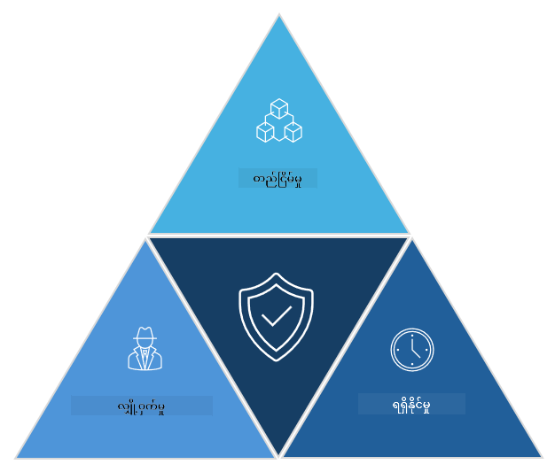

<!--
CO_OP_TRANSLATOR_METADATA:
{
  "original_hash": "16a76f9fa372fb63cffb6d76b855f023",
  "translation_date": "2025-09-04T01:13:20+00:00",
  "source_file": "1.1 The CIA triad and other key concepts.md",
  "language_code": "my"
}
-->
# CIA Triad နှင့် အခြေခံအကြောင်းအရာများ

## နိဒါန်း

ဒီသင်ခန်းစာမှာ ကျွန်တော်တို့ လေ့လာမယ့်အကြောင်းအရာတွေကတော့ -

 - Cybersecurity ဆိုတာဘာလဲ?

 - Cybersecurity CIA Triad ဆိုတာဘာလဲ?

 - Cybersecurity အနက်မှာ Authenticity, Nonrepudiation, Privacy ဆိုတာတွေက ဘာကိုဆိုလိုတာလဲ?

## Cybersecurity ဆိုတာဘာလဲ?

Cybersecurity (သို့မဟုတ် Information Security) ဆိုတာက ကွန်ပျူတာစနစ်တွေ၊ ကွန်ယက်တွေ၊ စက်ပစ္စည်းတွေ၊ ဒေတာတွေကို ဒစ်ဂျစ်တယ်တိုက်ခိုက်မှုတွေ၊ ခွင့်မပြုထားတဲ့ ဝင်ရောက်မှုတွေ၊ ပျက်စီးမှုတွေ၊ သို့မဟုတ် ခိုးယူမှုတွေမှ ကာကွယ်ပေးတဲ့ လုပ်ငန်းစဉ်တစ်ခုဖြစ်ပါတယ်။ Cybersecurity ရဲ့ အဓိကရည်ရွယ်ချက်က ဒစ်ဂျစ်တယ်ပိုင်ဆိုင်မှုတွေ၊ အချက်အလက်တွေကို လုံခြုံမှု (Confidentiality), တိကျမှန်ကန်မှု (Integrity), ရရှိနိုင်မှု (Availability) အတိုင်း ထိန်းသိမ်းပေးဖို့ ဖြစ်ပါတယ်။ Cybersecurity ပညာရှင်တွေက လုံခြုံရေးထိန်းချုပ်မှုတွေကို ဒီဇိုင်းဆွဲပြီး အကောင်အထည်ဖော်ကာ ပိုင်ဆိုင်မှုတွေ၊ ဒေတာတွေ၊ အချက်အလက်တွေကို ကာကွယ်ပေးကြပါတယ်။ လူနေမှုဘဝတွေ အွန်လိုင်းနဲ့ ပိုမိုပတ်သက်လာတာကြောင့် Cybersecurity က ပုဂ္ဂလိကလူတွေ၊ အဖွဲ့အစည်းတွေ အတွက် အရေးကြီးဆုံးအချက်တစ်ခုဖြစ်လာပါတယ်။

## Cybersecurity CIA Triad ဆိုတာဘာလဲ?

Cybersecurity Triad ဆိုတာက Cybersecurity လုပ်ငန်းတွေ သို့မဟုတ် စနစ်/ပတ်ဝန်းကျင်တစ်ခုကို ဒီဇိုင်းဆွဲရာမှာ အဓိကအာရုံစိုက်ရမယ့် အချက်သုံးချက်ကို ဖော်ပြထားတဲ့ မော်ဒယ်တစ်ခုဖြစ်ပါတယ်။

### Confidentiality (လျှို့ဝှက်မှု)

ဒီအချက်က Cybersecurity လို့ပြောလိုက်တာနဲ့ လူအများစု သိထားတဲ့ အဓိပ္ပာယ်နဲ့ ဆက်စပ်ပါတယ်။ Confidentiality ဆိုတာက ဒေတာနဲ့ အချက်အလက်တွေကို ခွင့်မပြုထားတဲ့ ဝင်ရောက်မှုတွေမှ ကာကွယ်ပေးတဲ့ လုပ်ငန်းစဉ်ဖြစ်ပါတယ်။ အဓိကအားဖြင့် လိုအပ်သူတွေသာ အချက်အလက်တွေကို ကြည့်ရှုနိုင်ဖို့ ဖြစ်ပါတယ်။ ဒေတာအားလုံးဟာ တန်ဖိုးတူမဟုတ်သလို၊ ဒေတာတွေကို အခြားသူတွေ မမှန်ကန်စွာ ဝင်ရောက်ကြည့်ရှုမိခဲ့ရင် ဖြစ်နိုင်တဲ့ နစ်နာမှုအပေါ် မူတည်ပြီး ကာကွယ်မှုအဆင့်တွေ ခွဲခြားထားပါတယ်။

### Integrity (တိကျမှန်ကန်မှု)

Integrity ဆိုတာက ပတ်ဝန်းကျင်အတွင်းရှိ ဒေတာရဲ့ တိကျမှန်ကန်မှုနဲ့ ယုံကြည်စိတ်ချရမှုကို ကာကွယ်ပေးတာဖြစ်ပြီး ခွင့်မပြုထားတဲ့ လူတွေက ဒေတာကို ပြင်ဆင်ခြင်း သို့မဟုတ် ပြောင်းလဲခြင်း မလုပ်နိုင်အောင် သေချာစေပါတယ်။ ဥပမာ - ကျောင်းသားတစ်ယောက်က DMV မှာ သူ့ရဲ့ မွေးသက္ကရာဇ်ကို ပြင်ဆင်ပြီး အသက်ကြီးသလို ပြောင်းလဲကာ အရက်ဝယ်ဖို့ လိုင်စင်အသစ် ထုတ်ယူတာမျိုး။

### Availability (ရရှိနိုင်မှု)

Availability ဆိုတာ IT လုပ်ငန်းစဉ်တစ်ခုလုံးအတွက် အရေးကြီးတဲ့အချက်တစ်ခုဖြစ်သလို Cybersecurity အတွက်လည်း အရေးကြီးပါတယ်။ Availability ကို ပစ်မှတ်ထားပြီး တိုက်ခိုက်တဲ့ အမျိုးအစားတစ်ခုဖြစ်တဲ့ Distributed Denial of Service (DDoS) တိုက်ခိုက်မှုတွေကို ကာကွယ်ဖို့ လုံခြုံရေးပညာရှင်တွေက အထူးဂရုစိုက်ရပါတယ်။

**Cybersecurity CIA Triad**

## Cybersecurity အနက်မှာ Authenticity, Nonrepudiation, Privacy ဆိုတာဘာလဲ?

ဒီအချက်တွေက စနစ်နဲ့ ဒေတာရဲ့ လုံခြုံမှုနဲ့ ယုံကြည်စိတ်ချရမှုကို သေချာစေဖို့ ဆက်စပ်နေတဲ့ အရေးကြီးအကြောင်းအရာတွေဖြစ်ပါတယ် -

**Authenticity** - သင်တွေ့ဆုံနေတဲ့ အချက်အလက်၊ ဆက်သွယ်မှု သို့မဟုတ် အဖွဲ့အစည်းဟာ တကယ့်မှန်ကန်မှုရှိပြီး ခွင့်မပြုထားတဲ့ လူတွေက ပြင်ဆင်ခြင်း သို့မဟုတ် ပြောင်းလဲခြင်း မရှိဘူးဆိုတာ သက်သေပြနိုင်မှုကို ဆိုလိုပါတယ်။

**Nonrepudiation** - တစ်ဖက်သားတစ်ယောက်ဟာ သူ့ရဲ့ လုပ်ဆောင်မှု သို့မဟုတ် ဆက်သွယ်မှုရဲ့ တကယ့်မှန်ကန်မှုကို ငြင်းဆိုလို့ မရအောင် သက်သေပြနိုင်မှုကို ဆိုလိုပါတယ်။ ဥပမာ - တစ်ယောက်ယောက်က သူမေးစရာမရှိဘူး၊ သို့မဟုတ် တစ်ခုခု မလုပ်ဘူးလို့ ပြောမရအောင် သက်သေရှိနေတဲ့ အခြေအနေ။

**Privacy** - ကိုယ်ရေးကိုယ်တာ အချက်အလက်တွေကို ခွင့်မပြုထားတဲ့ ဝင်ရောက်မှု၊ အသုံးပြုမှု၊ ဖော်ပြမှု သို့မဟုတ် ပြောင်းလဲမှုတွေမှ ကာကွယ်ပေးတာကို ဆိုလိုပါတယ်။ ဒေတာကို ဘယ်သူတွေ ကြည့်ရှုခွင့်ရှိမလဲ၊ ဘယ်လို စုဆောင်းမလဲ၊ သိမ်းဆည်းမလဲ၊ မျှဝေမလဲဆိုတာကို ထိန်းချုပ်ပေးရပါတယ်။

## ထပ်မံဖတ်ရှုရန်

[What Is Information Security (InfoSec)? | Microsoft Security](https://www.microsoft.com/security/business/security-101/what-is-information-security-infosec#:~:text=Three%20pillars%20of%20information%20security%3A%20the%20CIA%20triad,as%20guiding%20principles%20for%20implementing%20an%20InfoSec%20plan.)

---

**ဝက်ဘ်ဆိုက်မှတ်ချက်**:  
ဤစာရွက်စာတမ်းကို AI ဘာသာပြန်ဝန်ဆောင်မှု [Co-op Translator](https://github.com/Azure/co-op-translator) ကို အသုံးပြု၍ ဘာသာပြန်ထားပါသည်။ ကျွန်ုပ်တို့သည် တိကျမှန်ကန်မှုအတွက် ကြိုးစားနေပါသော်လည်း၊ အလိုအလျောက်ဘာသာပြန်မှုများတွင် အမှားများ သို့မဟုတ် မတိကျမှုများ ပါဝင်နိုင်သည်ကို ကျေးဇူးပြု၍ သတိပြုပါ။ မူရင်းစာရွက်စာတမ်းကို ၎င်း၏ မူလဘာသာစကားဖြင့် အာဏာတည်သောရင်းမြစ်အဖြစ် သတ်မှတ်သင့်ပါသည်။ အရေးကြီးသော အချက်အလက်များအတွက် ပရော်ဖက်ရှင်နယ် လူသားဘာသာပြန်မှုကို အကြံပြုပါသည်။ ဤဘာသာပြန်မှုကို အသုံးပြုခြင်းမှ ဖြစ်ပေါ်လာသော နားလည်မှုမှားမှုများ သို့မဟုတ် အဓိပ္ပါယ်မှားမှုများအတွက် ကျွန်ုပ်တို့သည် တာဝန်မယူပါ။