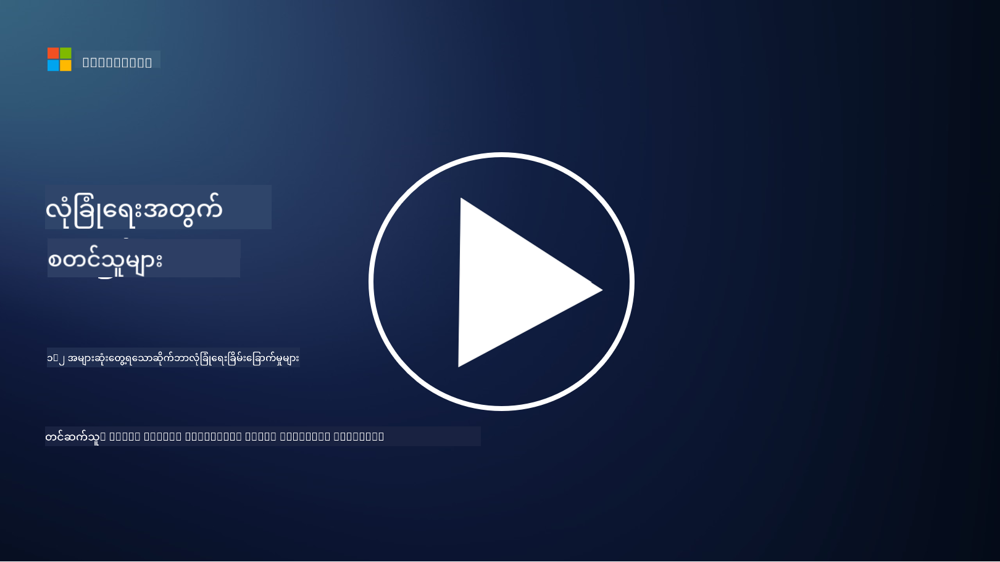

<!--
CO_OP_TRANSLATOR_METADATA:
{
  "original_hash": "6fc3030323139d7134a4ca9d03eccac9",
  "translation_date": "2025-09-03T23:30:50+00:00",
  "source_file": "1.2 Common cybersecurity threats.md",
  "language_code": "my"
}
-->
# အများဆုံးတွေ့ရသော ဆိုင်ဘာလုံခြုံရေး အန္တရာယ်များ

## မိတ်ဆက်

ဒီသင်ခန်းစာမှာ ကျွန်တော်တို့ လေ့လာမယ့်အရာတွေက:

- ဆိုင်ဘာလုံခြုံရေး အန္တရာယ်ဆိုတာ ဘာလဲ?

- မကောင်းတဲ့လူတွေက အချက်အလက်နဲ့ IT စနစ်တွေကို ဘာကြောင့် ဖောက်ဖျက်ချင်ကြလဲ?

- အများဆုံးတွေ့ရတဲ့ ဆိုင်ဘာလုံခြုံရေး အန္တရာယ်အမျိုးအစားတွေက ဘာတွေလဲ?

- MITRE ATT&CK framework ဆိုတာ ဘာလဲ?

- ဆိုင်ဘာလုံခြုံရေး အန္တရာယ်အခြေအနေနဲ့ ပတ်သက်ပြီး ဘယ်မှာ အမြဲသတင်းအချက်အလက်ရနိုင်မလဲ?

## ဆိုင်ဘာလုံခြုံရေး အန္တရာယ်ဆိုတာ ဘာလဲ?

ဆိုင်ဘာလုံခြုံရေး အန္တရာယ်ဆိုတာ အချက်အလက်နဲ့ IT စနစ်တွေရဲ့ လျှို့ဝှက်မှု (confidentiality), တိကျမှု (integrity), သုံးနိုင်မှု (availability) ကို ဖောက်ဖျက်နိုင်တဲ့ အန္တရာယ်တစ်ခုကို ဆိုလိုပါတယ်။ ဒီအန္တရာယ်တွေကို မကောင်းတဲ့လူတွေက အခွင့်အရေးမရှိဘဲ ဝင်ရောက်ဖို့, အရေးကြီးတဲ့ အချက်အလက်တွေကို ခိုးယူဖို့, လုပ်ငန်းစဉ်တွေကို ဖျက်ဆီးဖို့, ဒါမှမဟုတ် လူတွေ၊ အဖွဲ့အစည်းတွေ၊ နိုင်ငံတစ်နိုင်ငံလုံးကို ထိခိုက်စေဖို့ ကြိုးစားကြပါတယ်။ ဆိုင်ဘာလုံခြုံရေး အန္တရာယ်တွေက အမျိုးမျိုးသောပုံစံနဲ့ အချက်အလက်နဲ့ ဒစ်ဂျစ်တယ်စနစ်တွေကို ပစ်မှတ်ထားပါတယ်။

## မကောင်းတဲ့လူတွေက အချက်အလက်နဲ့ IT စနစ်တွေကို ဘာကြောင့် ဖောက်ဖျက်ချင်ကြလဲ?

မကောင်းတဲ့လူတွေက အချက်အလက်နဲ့ IT စနစ်တွေကို ဖောက်ဖျက်ဖို့ အကြောင်းအမျိုးမျိုးကြောင့် ကြိုးစားကြပါတယ်။ အများအားဖြင့် ကိုယ်ကျိုးအတွက်, အယူဝါဒဆိုင်ရာ အကြောင်းရင်းတွေကြောင့်, ဒါမှမဟုတ် ဖျက်ဆီးမှုလုပ်ဖို့ ဆန္ဒရှိလို့ ဖြစ်ပါတယ်။ ဒီအကြောင်းရင်းတွေကို နားလည်ခြင်းက အဖွဲ့အစည်းတွေ၊ လူတွေကို ဆိုင်ဘာလုံခြုံရေး အန္တရာယ်တွေကို ကာကွယ်နိုင်ဖို့ ကူညီနိုင်ပါတယ်။ မကောင်းတဲ့လူတွေ ဆိုင်ဘာတိုက်ခိုက်မှုတွေကို လုပ်ဆောင်တဲ့ အကြောင်းရင်းတွေထဲမှာ:

1. **ငွေကြေးအကျိုးအမြတ်**: အများဆုံးတိုက်ခိုက်မှုတွေက ငွေကြေးအကျိုးအမြတ်ရဖို့ ကြိုးစားမှုတွေဖြစ်ပါတယ်။ မကောင်းတဲ့လူတွေက အရေးကြီးတဲ့ အချက်အလက်တွေ (ကတ်နံပါတ်, ဘဏ်အကောင့်နံပါတ်, ကိုယ်ရေးအချက်အလက်) ကို ခိုးယူပြီး လိမ်လည်မှု, ကိုယ်ရေးလုံခြုံမှုဖောက်ဖျက်မှု, ဒါမှမဟုတ် အချက်အလက်တွေကို dark web မှာ ရောင်းချဖို့ ကြိုးစားကြပါတယ်။

2. **စုံစမ်းရေး**: နိုင်ငံတစ်နိုင်ငံ, ပြိုင်ဘက်တွေ, ဒါမှမဟုတ် အခြားအဖွဲ့အစည်းတွေက နိုင်ငံရေး, စီးပွားရေး, စစ်ရေးအကျိုးအမြတ်ရဖို့ အရေးကြီးတဲ့ အချက်အလက်တွေကို ခိုးယူဖို့ ဆိုင်ဘာစုံစမ်းရေးလုပ်ဆောင်ကြပါတယ်။

3. **ဖျက်ဆီးမှုနဲ့ Sabotage**: တချို့တိုက်ခိုက်မှုတွေက အရေးကြီးတဲ့ အဆောက်အအုံတွေ, ဝန်ဆောင်မှုတွေ, လုပ်ငန်းစဉ်တွေကို ဖျက်ဆီးဖို့ ရည်ရွယ်ပါတယ်။ ဒီတိုက်ခိုက်မှုတွေက chaos, ငွေကြေးဆုံးရှုံးမှု, အကျိုးသက်ရောက်မှုကို ဖြစ်စေပါတယ်။

4. **အယူဝါဒဆိုင်ရာ အကြောင်းရင်း**: Hacktivists နဲ့ အယူဝါဒဆိုင်ရာ, နိုင်ငံရေးဆိုင်ရာ အဖွဲ့အစည်းတွေက သူတို့ရဲ့ ယုံကြည်ချက်တွေကို ပံ့ပိုးဖို့, ဒါမှမဟုတ် တစ်ခုခုကို ဆန္ဒပြဖို့ စနစ်တွေကို ဖောက်ဖျက်ကြပါတယ်။

5. **မတော်တဆလုပ်ရပ်များ**: မကောင်းတဲ့လုပ်ရပ်တွေ အားလုံးဟာ ရည်ရွယ်ချက်ရှိတဲ့အရာမဟုတ်ပါဘူး။ တချို့လူတွေက social engineering ကို သVictimဖြစ်ပြီး မသိတတ်ဘဲ အန္တရာယ်ကို ဖြစ်စေတတ်ပါတယ်။

## အများဆုံးတွေ့ရတဲ့ ဆိုင်ဘာလုံခြုံရေး အန္တရာယ်အမျိုးအစားတွေက ဘာတွေလဲ?

မကောင်းတဲ့လူတွေက စနစ်တွေကို ဖောက်ဖျက်ဖို့, အချက်အလက်တွေကို ခိုးယူဖို့, ဖျက်ဆီးမှုလုပ်ဖို့ အမျိုးမျိုးသော နည်းလမ်းတွေကို အသုံးပြုကြပါတယ်။ အများဆုံးတွေ့ရတဲ့ အန္တရာယ်အမျိုးအစားတွေက:

1. **Phishing**:

Phishing ဆိုတာ မမှန်တဲ့ အီးမေးလ်တွေ, သတင်းပို့စနစ်တွေကို သုံးပြီး လူတွေကို လိမ်လည်ဖို့ ရည်ရွယ်ပါတယ်။ ဒါဟာ password, credit card နံပါတ်, ကိုယ်ရေးအချက်အလက်တွေကို ခိုးယူဖို့ ဖြစ်ပါတယ်။

2. **Malware**:

Malware (မကောင်းတဲ့ software) ဆိုတာ စနစ်တွေကို ဖောက်ဖျက်ဖို့, အချက်အလက်တွေကို ခိုးယူဖို့, ဒါမှမဟုတ် ဖျက်ဆီးဖို့ ရည်ရွယ်တဲ့ malicious program တွေကို ဆိုလိုပါတယ်။ Malware အမျိုးအစားတွေက:

- **Ransomware**: ဖိုင်တွေကို encrypt လုပ်ပြီး decryption အတွက် ransom တောင်းပါတယ်။

- **Trojans**: Legitimate software လိုပုံစံနဲ့ မကောင်းတဲ့လူတွေကို unauthorized access ပေးပါတယ်။

- **Viruses**: File တွေကို attach လုပ်ပြီး ပျံ့နှံ့တတ်တဲ့ program တွေ။

- **Worms**: Network တွေမှာ ပျံ့နှံ့တတ်တဲ့ program တွေ။

3. **Denial of Service (DoS) နဲ့ Distributed Denial of Service (DDoS)**:

DoS တိုက်ခိုက်မှုတွေက စနစ်ကို overload လုပ်ပြီး အသုံးမပြုနိုင်အောင် လုပ်ပါတယ်။ DDoS တိုက်ခိုက်မှုတွေက compromised device network ကို အသုံးပြုပြီး traffic တွေကို flood လုပ်ပါတယ်။

4. **SQL Injection**:

Web application input field တွေကို manipulate လုပ်ပြီး malicious SQL query တွေကို inject လုပ်ပါတယ်။

5. **Cross-Site Scripting (XSS)**:

Web application တွေမှာ malicious script တွေကို inject လုပ်ပြီး victim တွေ browser မှာ run လုပ်ပါတယ်။

6. **Social Engineering**:

လူတွေရဲ့ စိတ်ပညာကို အသုံးချပြီး confidential information တွေကို ရယူဖို့, ဒါမှမဟုတ် security ကို ဖောက်ဖျက်ဖို့ လုပ်ဆောင်ပါတယ်။

7. **Zero-Day (0day) Exploits**:

Vendor နဲ့ public မသိသေးတဲ့ vulnerability တွေကို target လုပ်တဲ့ တိုက်ခိုက်မှုတွေဖြစ်ပါတယ်။

8. **Credential Attacks**:

Brute force attacks နဲ့ stolen credentials တွေကို အသုံးပြုတဲ့ credential stuffing attacks တွေပါဝင်ပါတယ်။

## MITRE ATT&CK framework ဆိုတာ ဘာလဲ?

[MITRE ATT&CK framework](https://attack.mitre.org/) (Adversarial Tactics, Techniques, and Common Knowledge) ဆိုတာ adversaries တွေ တိုက်ခိုက်မှုအတွင်း အသုံးပြုတဲ့ TTPs (tactics, techniques, and procedures) တွေကို catalog နဲ့ categorize လုပ်ထားတဲ့ framework တစ်ခုဖြစ်ပါတယ်။

MITRE ATT&CK framework က cyber threats တွေကို နားလည်ဖို့, ကာကွယ်ရေး strategy တွေကို တိုးတက်အောင်လုပ်ဖို့ security teams တွေကို ကူညီပါတယ်။

## ဆိုင်ဘာလုံခြုံရေး အန္တရာယ်အခြေအနေနဲ့ ပတ်သက်ပြီး ဘယ်မှာ အမြဲသတင်းအချက်အလက်ရနိုင်မလဲ?

အောက်ပါ resource တွေက ဆိုင်ဘာလုံခြုံရေး အန္တရာယ်အခြေအနေနဲ့ ပတ်သက်ပြီး သတင်းအချက်အလက်ရနိုင်တဲ့နေရာတွေဖြစ်ပါတယ်:

- [Open Web Application Security Project (OWASP) top 10 vulnerabilities](https://owasp.org/Top10/)
- [Common Vulnerabilities and Exposures (CVEs)](https://www.bing.com/ck/a?!&&p=53df6007f017bca2JmltdHM9MTY5MjU3NjAwMCZpZ3VpZD0zYmY4N2RiYS1jYWI1LTYwMDgtMWY1YS02ZmYyY2JjNjYxZWUmaW5zaWQ9NTc2OQ&ptn=3&hsh=3&fclid=3bf87dba-cab5-6008-1f5a-6ff2cbc661ee&psq=cve&u=a1aHR0cHM6Ly9iaW5nLmNvbS9hbGluay9saW5rP3VybD1odHRwcyUzYSUyZiUyZmN2ZS5taXRyZS5vcmclMmYmc291cmNlPXNlcnAtcnImaD1BZXN4S0VBWTNnbGhNZEFpd3daMlNSZkZQNTlrODhIUnYxRUtlSkY1RTk0JTNkJnA9a2NvZmZjaWFsd2Vic2l0ZQ&ntb=1 "Common Vulnerabilities and Exposures")
- [Microsoft Security Response Center blogs](https://msrc.microsoft.com/blog/)
- [National Institute of Standards and Technology (NIST)](https://www.dhs.gov/topics/cybersecurity)
- [Cybersecurity and Infrastructure Security Agency (CISA)](https://www.cisa.gov/resources-tools/resources/free-cybersecurity-services-and-tools)
- [National Cybersecurity Center of Excellence (NCCoE)](https://www.dhs.gov/topics/cybersecurity)
- [US-CERT](https://www.cisa.gov/resources-tools/resources/free-cybersecurity-services-and-tools)
- သင့်နိုင်ငံရဲ့ Cyber Emergency Response Team (CERT)

---

**အကြောင်းကြားချက်**:  
ဤစာရွက်စာတမ်းကို AI ဘာသာပြန်ဝန်ဆောင်မှု [Co-op Translator](https://github.com/Azure/co-op-translator) ကို အသုံးပြု၍ ဘာသာပြန်ထားပါသည်။ ကျွန်ုပ်တို့သည် တိကျမှုအတွက် ကြိုးစားနေသော်လည်း၊ အလိုအလျောက် ဘာသာပြန်မှုများတွင် အမှားများ သို့မဟုတ် မတိကျမှုများ ပါဝင်နိုင်သည်ကို သတိပြုပါ။ မူရင်းဘာသာစကားဖြင့် ရေးသားထားသော စာရွက်စာတမ်းကို အာဏာတရ အရင်းအမြစ်အဖြစ် သတ်မှတ်သင့်ပါသည်။ အရေးကြီးသော အချက်အလက်များအတွက် လူ့ဘာသာပြန်ပညာရှင်များမှ ပရော်ဖက်ရှင်နယ် ဘာသာပြန်မှုကို အကြံပြုပါသည်။ ဤဘာသာပြန်မှုကို အသုံးပြုခြင်းမှ ဖြစ်ပေါ်လာသော အလွဲအလွတ်များ သို့မဟုတ် အနားယူမှားမှုများအတွက် ကျွန်ုပ်တို့သည် တာဝန်မယူပါ။